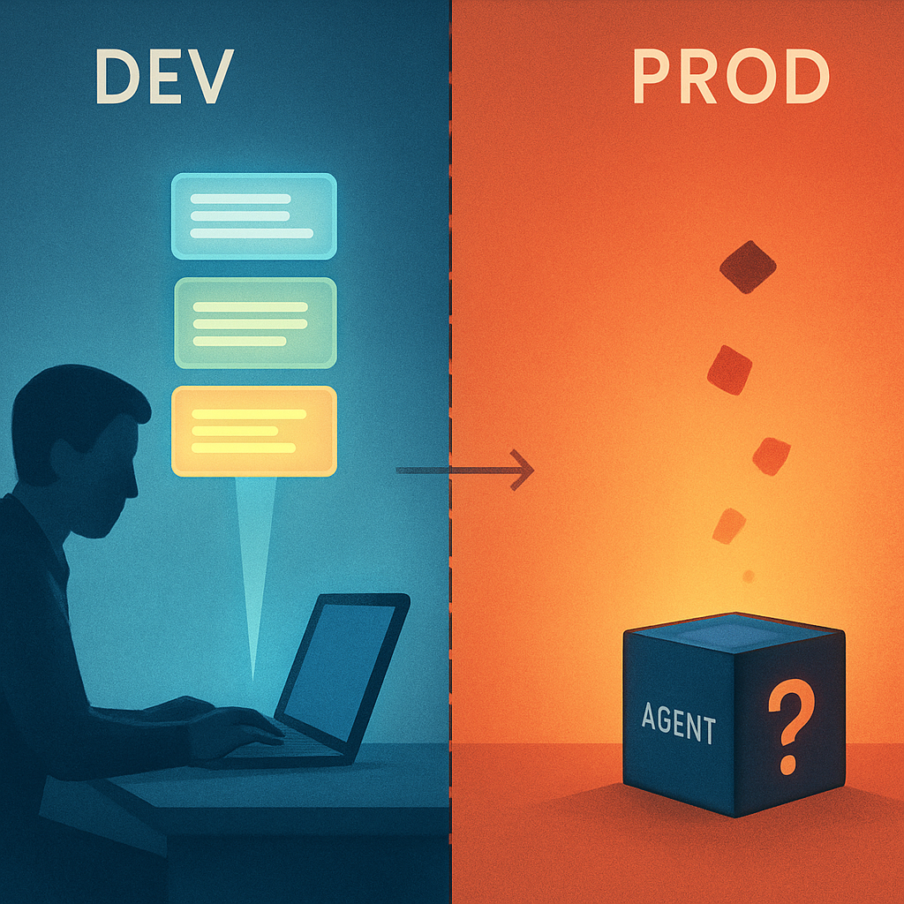
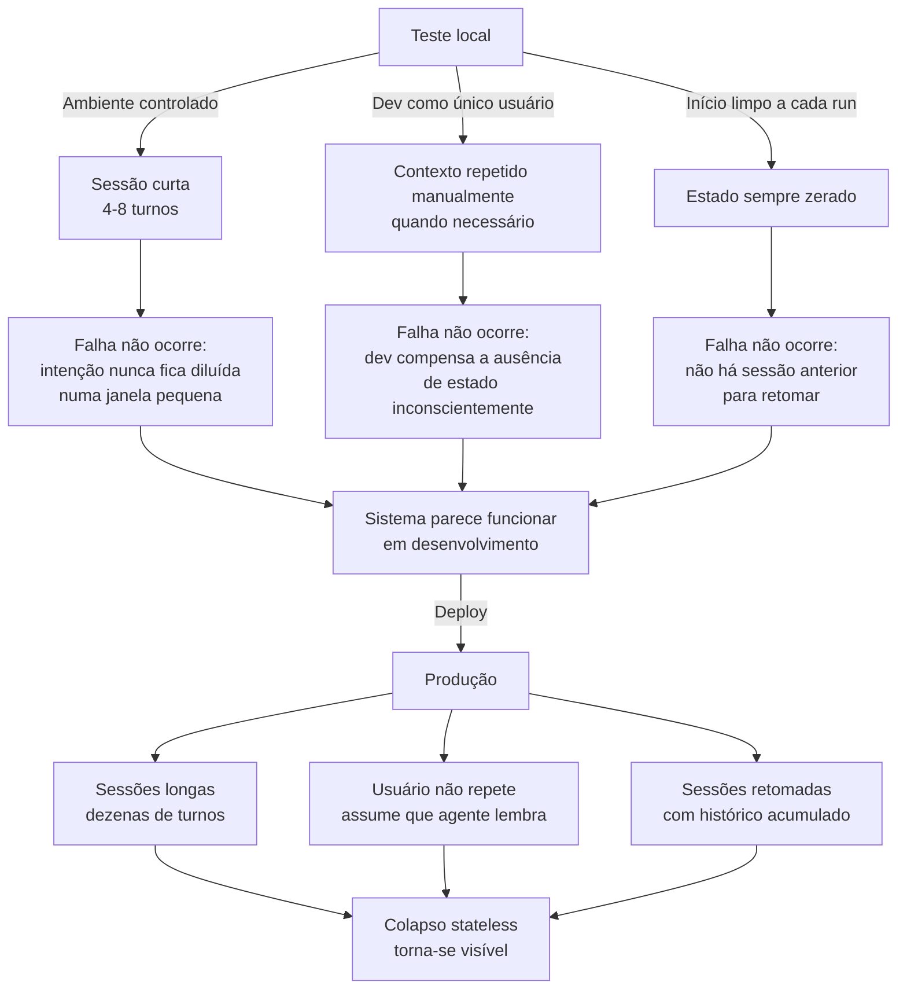

# Por que a Falha Não É Óbvia em Desenvolvimento



O colapso stateless descrito no conceito anterior — onde um agente perde intenções ativas, toma decisões contraditórias e regride a chatbot glorificado — deveria ser fácil de detectar. O mecanismo é claro, a sequência de falha é previsível e o resultado é uma lacuna óbvia no comportamento. Então por que desenvolvedores lançam sistemas agênticos em produção sem jamais terem observado essa falha em desenvolvimento? A resposta revela um viés estrutural do ambiente de teste que mascara sistematicamente o problema — não por acidente, mas por uma assimetria fundamental entre como o código é testado e como ele é usado.

Quando um engenheiro desenvolve e testa um agente localmente, ele é, invariavelmente, o único usuário, o único fornecedor de contexto e o único observador da conversa. Cada vez que inicia um teste de múltiplos turnos, ele sabe exatamente o que o agente deveria lembrar porque foi ele mesmo quem forneceu aquela informação há dois minutos. Se o agente perde contexto, o developer percebe imediatamente — e reage de forma natural: repete a instrução, reformula a pergunta, adiciona mais contexto na mensagem seguinte. Esse comportamento compensatório é quase reflexo, e é invisível: o developer não registra que está "consertando" a falta de estado do agente; ele apenas continua o fluxo de trabalho.

```
Teste local típico (desenvolvedor como único usuário):

Turn 1: "monitore o ticket CK-1042, notifique quando mudar para Em revisão"
Turn 2: "e sobre as tasks do sprint 14?" 
Turn 3: "quanto ao CK-1042 — você ainda está monitorando, certo?"
         ↑ o developer adicionou esse lembrete porque intuitivamente
           sabia que o agente poderia ter perdido o contexto
Turn 4: resposta coerente ← percebe como prova de que o agente funciona
```

Em produção, o usuário real não faz isso. Ele assume que o agente lembra. Ele volta horas ou dias depois e pergunta diretamente sobre o resultado — sem repetir, sem reformular, sem lembrar o agente do compromisso. A experiência dele com o sistema colide diretamente com o colapso stateless documentado no conceito anterior: a intenção que o agente "entendeu" no turno 1 nunca foi persistida como objeto estruturado, então quando o usuário pergunta sobre ela no turno 5 de uma conversa retomada no dia seguinte, o agente não tem como honrar o compromisso.

Mas há um segundo mecanismo de mascaramento igualmente poderoso, e esse é puramente estrutural: a duração das sessões de teste. Um desenvolvedor testando um fluxo específico raramente conduz mais de 4 a 8 turnos numa única sessão. A conversa é curta, focada, dentro da janela de contexto de uma única invocação — ou, no máximo, com um histórico pequeno o suficiente para que tudo caiba na janela sem pressão. O colapso stateless, como descrito no conceito anterior, tem três fases: criação sem ancoragem, deriva de especificação e decisões contraditórias. A fase 1 pode completar-se em 1 turno. A fase 2 — onde a intenção fica progressivamente diluída por texto mais recente na janela — leva mais tempo para se manifestar. A fase 3 — onde o gatilho da intenção dispara sem a ação correspondente — só ocorre quando o contexto do turno 1 já foi enterrado por conversas intermediárias ou quando a sessão foi interrompida e retomada.

| Sessão de desenvolvimento | Sessão de produção real |
|---|---|
| 4-8 turnos, contexto completo presente | Dezenas de turnos ao longo de horas ou dias |
| Histórico cabe inteiramente na janela | Histórico cresce além da janela de contexto |
| Intenção criada e testada no mesmo burst | Intenção criada agora, testada horas depois |
| Desenvolvedor sabe o que o agente "deveria" lembrar | Usuário assume que o agente lembra — sem saber o que foi persistido |
| Sessão começa do zero a cada teste | Sessão retomada após interrupção |
| Um único usuário fornece contexto cumulativamente | Usuário diferente, sem acúmulo compensatório |

Além das sessões curtas, há um terceiro fator que isola o ambiente de desenvolvimento da realidade: o estado inicial de cada teste é limpo por design. Quando um developer roda um teste, ele começa com histórico zerado no MongoDB, sem intenções pendentes de sessões anteriores, sem estado de agente parcialmente aplicado. Esse estado limpo é confortável para testar fluxos isolados — mas é exatamente o oposto do que acontece em produção, onde um usuário retoma uma sessão com histórico acumulado, possivelmente com ações já executadas parcialmente, e com a expectativa de que o agente sabe onde parou.

O fenômeno foi identificado na literatura de avaliação de agentes como o **happy path problem**: testes de desenvolvimento exercitam o caminho feliz — fluxo completo, contexto completo, sem interrupções — enquanto produção expõe edge cases estruturais que só emergem com sessões longas, interrompidas, retomadas e com usuários que não repetem informações. A pesquisa empírica sobre multi-agent systems documenta que 40% dos pilotos falham em seis meses de produção, em parte porque pilotos testam 50 a 500 queries com padrões previsíveis, enquanto produção lida com volumes ordens de magnitude maiores, com padrões de uso reais que nenhum teste antecipou.

Para o sistema Lambda + Haystack do leitor, essa dinâmica tem uma expressão concreta. Durante o desenvolvimento, o engenheiro escreve um handler Lambda, testa localmente com Haystack invocando o Gemini, verifica que o tool call foi executado corretamente, confirma que a resposta está no MongoDB — e o teste passa. O que ele nunca testou é: o que acontece quando o Lambda é invocado 24 horas depois, em uma nova invocação fria, sem nenhuma intenção pendente persistida, com um usuário que pergunta sobre algo prometido na sessão anterior? Esse cenário é praticamente impossível de emergir num ciclo de teste local típico porque o developer nunca espera 24 horas entre dois turnos de teste — e porque ele tem o contexto em mente, então compensa automaticamente qualquer lacuna do agente.

Há ainda um quarto mecanismo de mascaramento que vale nomear explicitamente: a observabilidade local é diferente da observabilidade em produção. Em desenvolvimento, o developer vê o traceback completo, os logs do Haystack, a sequência de tool calls, o conteúdo da janela de contexto montada. Se algo falhar, ele tem acesso imediato à causa. Em produção com Lambda, o contexto de cada falha é uma invocação fria isolada, e o log que aparece no CloudWatch não inclui "o agente perdeu a intenção porque não há session object" — inclui apenas a resposta incorreta que o Gemini produziu com a janela que foi montada. A falha stateless aparece como comportamento inesperado do modelo, não como ausência de estado da sessão. Isso leva a diagnósticos incorretos: o desenvolvedor testa o prompt, ajusta o system prompt, muda o modelo — e o problema persiste porque nunca foi um problema de prompt.



O diagrama deixa claro que os três vetores de mascaramento em desenvolvimento convergem para a mesma ausência de evidência: o sistema nunca é exercitado nas condições em que o colapso stateless se manifesta. Isso não é um problema de testes insuficientes no sentido convencional — não é falta de coverage de edge cases ou falta de testes de carga. É um problema de que o modo de interação do desenvolvedor com o sistema é estruturalmente diferente do modo de interação do usuário real.

Reconhecer esse viés tem uma consequência direta para o design: não adianta adicionar mais casos de teste ao conjunto atual se todos eles repetem a estrutura de sessão curta com contexto completo. O sistema só vai expor suas lacunas stateless quando testado com sessões de duração realista, com interrupções deliberadas, com retomadas após horas, com usuários que não repetem informações e com intenções que cruzam fronteiras de invocação. E, mais importante, o diagnóstico correto quando a falha aparecer em produção não é "o modelo está se comportando de forma estranha" — é "o sistema não tem substrato para persistir intenções entre invocações e precisa de uma sessão estruturada". Esse vocabulário preciso é o que os três conceitos anteriores construíram e que o próximo conceito vai usar para definir o que a sessão precisa ser para fechar esse gap.

## Fontes utilizadas

- [Why Your AI Agent Works in Demo But Fails in Production — DEV Community](https://dev.to/dingomanhammer/why-your-ai-agent-works-in-demo-but-fails-in-production-4e51)
- [Context Engineering: The Real Reason AI Agents Fail in Production — Inkeep](https://inkeep.com/blog/context-engineering-why-agents-fail)
- [Context Rot: Why AI Gets Worse the Longer You Chat — Product Talk](https://www.producttalk.org/context-rot/)
- [Why Traditional Testing Fails for AI Agents (and What Actually Works) — Coralogix](https://coralogix.com/ai-blog/why-traditional-testing-fails-for-ai-agents-and-what-actually-works/)
- [The Multi-Agent Reality Check: 7 Failure Modes When Pilots Hit Production — TechAhead](https://www.techaheadcorp.com/blog/ways-multi-agent-ai-fails-in-production/)
- [Effective context engineering for AI agents — Anthropic Engineering](https://www.anthropic.com/engineering/effective-context-engineering-for-ai-agents)
- [What Is Workflow State vs Session State in AI Agents? — MindStudio](https://www.mindstudio.ai/blog/workflow-state-vs-session-state-ai-agents)

---

**Próximo conceito** → [A Sessão como Substrato de Continuidade](../05-a-sessao-como-substrato-de-continuidade/CONTENT.md)
