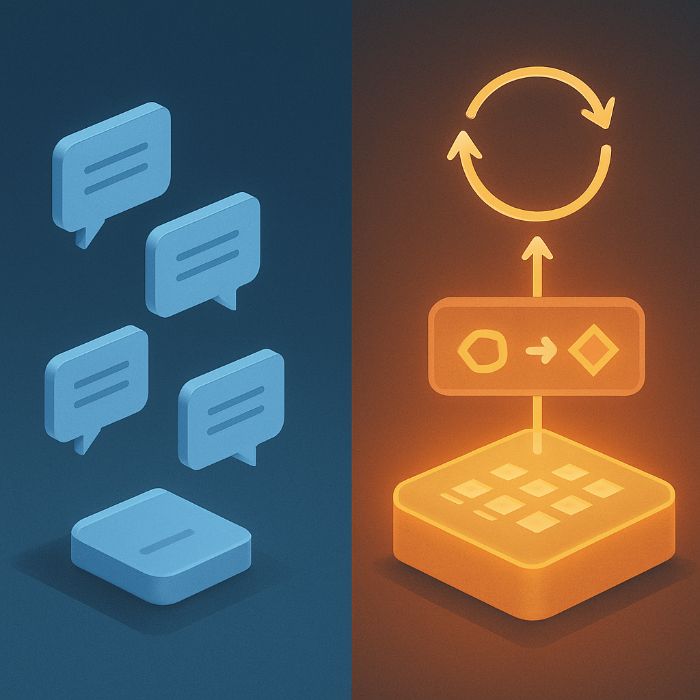
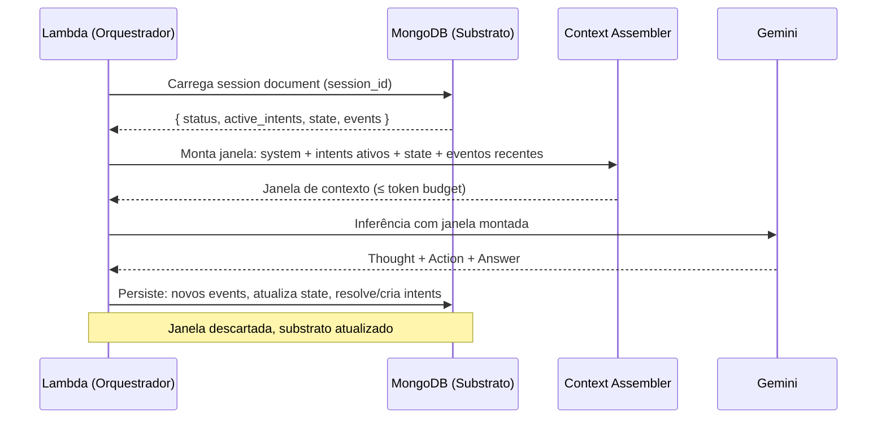

# A Sessão como Substrato de Continuidade



Os quatro conceitos anteriores construíram o vocabulário preciso para chegar aqui. Primeiro: o LLM é uma função pura — `f(entrada) = saída` — sem memória entre chamadas; cada invocação parte do zero, e a janela de contexto é descartada ao fim. Segundo: um agente operacional exige três propriedades que o modelo por si só não pode fornecer — persistência de intenções, observação contínua e coerência de decisão entre turnos. Terceiro: o colapso stateless é o mecanismo concreto pelo qual a ausência dessas propriedades transforma um sistema com tool calling num chatbot glorificado — intenções ficam sem ancoragem, derivam por inferência frágil e colapsam quando o gatilho finalmente ocorre. Quarto: esse colapso permanece invisível em desenvolvimento porque o desenvolvedor compensa a ausência de estado inconscientemente, e só emerge em produção com sessões longas, interrompidas e retomadas. O que faltava nomear com precisão era o remédio — não um remédio qualquer, mas o que exatamente precisa existir para que o problema seja resolvido em sua raiz. Esse é o conceito de sessão como substrato de continuidade.

A confusão mais comum é tratar sessão como sinônimo de histórico de conversa. Essa equivalência é o erro que perpetua o colapso stateless mesmo em sistemas que "têm sessão": guardar mensagens no MongoDB, carregar o histórico a cada invocação Lambda e passá-lo como contexto é uma forma de histórico de chat persistido — mas não é uma sessão com substrato de continuidade. A distinção não é semântica; é estrutural e tem consequências diretas no comportamento do agente. Para entender a diferença, é preciso separar dois planos que frequentemente são confundidos: o **substrato persistente** e a **janela de contexto como projeção efêmera**.

O substrato persistente é tudo que existe entre chamadas de inferência — o estado durável do agente que sobrevive ao fim de cada invocação Lambda, que persiste entre turnos, que pode ser retomado horas ou dias depois. A janela de contexto é o oposto: uma projeção temporária, construída sob demanda para cada chamada de inferência específica, descartada ao fim da chamada. A arquitetura que produz agentes funcionais em produção é a separação limpa entre esses dois planos. Como a pesquisa de padrões de context assembly descreve: "A janela de contexto não é armazenamento; é uma projeção — uma visão temporária e construída sob demanda a partir do substrato." O substrato existe; a janela de contexto é montada a partir dele para cada inferência.

Dizer que a sessão é o substrato significa que ela é a estrutura que ocupa esse plano persistente. Não é um log de mensagens — é um objeto de estado estruturado que contém campos operacionalmente distintos. O que esses campos são, na prática, é o núcleo deste conceito.

```json
{
  "session_id": "sess_abc123",
  "user_id": "user_xyz",
  "created_at": "2026-04-20T14:30:00Z",
  "last_updated_at": "2026-04-23T09:15:42Z",
  "status": "active",
  "active_intents": [
    {
      "id": "intent_01",
      "description": "Monitorar ticket CK-1042 e notificar quando mudar para Em revisão",
      "trigger_condition": { "field": "status", "value": "Em revisão" },
      "pending_actions": ["notify_slack_engenharia", "create_calendar_event"],
      "created_at_turn": 1,
      "last_checked_at": "2026-04-23T09:15:42Z"
    }
  ],
  "executed_actions": [
    {
      "turn": 1,
      "tool": "get_ticket",
      "args": { "id": "CK-1042" },
      "result": { "status": "Em andamento" },
      "timestamp": "2026-04-20T14:30:05Z"
    }
  ],
  "state": {
    "current_task": null,
    "user_preferences": { "notify_channel": "#engenharia" }
  },
  "events": [
    { "turn": 1, "role": "user", "content": "Monitore CK-1042, notifique quando Em revisão" },
    { "turn": 1, "role": "assistant", "content": "Entendido. Vou monitorar e notificar." }
  ],
  "context_summary": null
}
```

Este documento é o que o sistema do colapso stateless nunca teve. Veja o campo `active_intents`: ele não é derivado do texto da conversa — é um objeto estruturado com condição de disparo explícita e ações pendentes associadas. Quando o Lambda é invocado no turno 3 e o usuário pergunta "o CK-1042 mudou?", o agente não precisa inferir do histórico que havia uma intenção — ele carrega o documento de sessão, lê `active_intents`, encontra o intent com `trigger_condition.value == "Em revisão"`, executa `get_ticket`, e quando o status retorna "Em revisão", ele sabe exatamente o que deve acontecer: `notify_slack_engenharia` e `create_calendar_event`. A lógica não está no histórico de texto; está no estado estruturado.

A separação entre `events` e `state` dentro da sessão é fundamental e frequentemente confundida. `events` é o log cronológico completo — tudo que aconteceu, na ordem em que aconteceu, imutável. `state` é o snapshot mutable do momento atual — o que é relevante agora para o raciocínio do agente. O Google ADK, que formaliza esse padrão, descreve o `state` como "scratchpad do agente durante a interação": um dicionário de chave-valor que pode ser atualizado a cada turno e que o agente usa para tomar decisões sem precisar processar o log completo. O histórico de chat que o sistema do leitor guarda no MongoDB está mais próximo de `events` do que de um substrato completo — é o log, sem o estado operacional estruturado.

| Componente | O que é | Persistência | Quem escreve | Quem lê |
|---|---|---|---|---|
| `events` | Log cronológico de turns (mensagens, tool calls, obs.) | Permanente, append-only | Orquestrador após cada turn | Context assembler |
| `state` | Snapshot mutable do agente (task progress, preferências) | Persistente, atualizável | Agente + orquestrador | Agente no início de cada turn |
| `active_intents` | Intenções multi-turn pendentes com gatilhos | Persistente, atualizável | Agente ao registrar intenção | Orquestrador ao checar gatilhos |
| `executed_actions` | Histórico rastreado de tool calls entre turns | Permanente, append-only | Orquestrador após cada tool call | Agente para evitar duplicações |
| `context_window` | Projeção efêmera para uma inferência | Descartada após inferência | Context assembler | LLM (somente leitura) |

A última linha da tabela é o ponto crítico. A janela de contexto não está no substrato — é montada a partir dele. Para cada invocação de inferência, o orquestrador executa um **context assembly**: seleciona o que incluir na janela com base em critérios como relevância semântica, recência, prioridade de instruções fixas (system prompt) e limite de tokens. O substrato é fonte completa; a janela é uma fatia curada. Essa separação é o que permite ao agente operar sobre sessões longas sem explodir o token budget: ele não precisa passar o histórico completo de 500 turnos para o modelo — passa apenas a projeção relevante para o turno atual.

Para o sistema Lambda + Haystack do leitor, o impacto arquitetural é claro: o MongoDB atualmente armazena `events` (mensagens da conversa), mas não `state` (snapshot mutable do agente), não `active_intents` (intenções estruturadas pendentes) e não `executed_actions` (rastreamento de tool calls entre turns). O Lambda lê o MongoDB, constrói uma janela de contexto que é o histórico completo de mensagens, e chama o Gemini. Isso significa que a janela é construída diretamente dos eventos sem uma camada de substrato estruturado — o model vê o texto bruto e precisa inferir o estado operacional a partir dele. O resultado é exatamente o colapso descrito no conceito 03: sem um campo `active_intents`, o agente no turno 3 não tem como saber que prometeu monitorar o CK-1042.



O diagrama mostra o ciclo completo que o sistema atual não tem. O substrato é carregado antes da inferência, a janela é montada a partir dele (não diretamente do banco de mensagens), e o substrato é atualizado após a inferência — incluindo a resolução de intenções que foram satisfeitas e o rastreamento das ações executadas. O LLM vê apenas a janela; nunca vê diretamente o substrato. Isso é a separação que torna o agente capaz de operar em sessões longas: o substrato cresce com o tempo, mas a janela permanece dentro do token budget porque o context assembler seleciona o que é relevante para o turno atual.

Há uma consequência importante que vale tornar explícita: o substrato de sessão não elimina a natureza stateless do LLM — ele convive com ela. O modelo continua sendo a função pura `f(entrada) = saída`. O que muda é que agora `entrada` não é apenas "histórico de mensagens" mas uma projeção cuidadosamente montada a partir de um estado estruturado que inclui intenções ativas, ações rastreadas e estado corrente do agente. O LLM não sabe que há um substrato por trás — ele recebe uma janela de tokens e produz tokens. A inteligência de continuidade está na camada de orquestração que mantém o substrato, monta a projeção correta para cada inferência e atualiza o estado estruturado após cada turno.

A distinção entre "sessão como substrato" e "histórico de chat" pode ser capturada numa pergunta operacional: se o sistema for interrompido agora e retomado em 24 horas por um usuário diferente que pergunta "qual o status das tasks do sprint 14 que ficaram pendentes?", o agente consegue responder com precisão sem que o usuário repita nenhum contexto? Com histórico de chat, a resposta depende de o texto relevante estar na janela e de o modelo inferir corretamente o estado atual. Com substrato de sessão, a resposta vem de campos estruturados — `state.current_sprint`, `executed_actions` com os resultados dos tool calls passados, `active_intents` com tarefas pendentes — que o agente consulta diretamente, independente de quanto histórico foi compactado ou truncado.

Essa é a propriedade que o conceito de substrato de continuidade formaliza: a sessão não é memória do que foi dito — é estado operacional do que está sendo feito. A diferença é a mesma que existe entre um diário pessoal e um sistema de gestão de tarefas: o diário registra eventos em ordem cronológica; o sistema de tarefas mantém o que está ativo, o que foi concluído, o que está bloqueado e o que tem gatilho pendente. Um agente real precisa dos dois — o log de eventos para contexto histórico e o estado operacional estruturado para tomar decisões coerentes. O que o sistema do leitor tem hoje é apenas o diário.

A sessão como substrato é o que os próximos subcapítulos vão detalhar: como ela falha em cenários concretos de produção (subcapítulo 02 — Anatomia de uma Falha Stateless), como os conceitos session/turn/run/thread se encaixam nessa estrutura com precisão (subcapítulo 03), onde o sistema atual se posiciona no espectro stateless→stateful em relação a esse substrato (subcapítulo 04), e qual é o diagnóstico preciso do projeto Lambda + MongoDB do leitor com base nesses critérios (subcapítulo 05). O vocabulário construído neste subcapítulo é a fundação — a sessão como substrato de continuidade é a abstração que unifica tudo que vem depois.

## Fontes utilizadas

- [Building an Agent Architecture: How Sessions, State, Events, Context, and Runner Work Together — Medium](https://medium.com/@aktooall/building-an-agent-architecture-how-sessions-state-events-context-and-runner-work-together-d8dbdb64d52b)
- [Dynamic Context Assembly and Projection Patterns for LLM Agent Runtimes — Zylos Research](https://zylos.ai/research/2026-03-17-dynamic-context-assembly-projection-llm-agent-runtimes)
- [Session: Tracking Individual Conversations — Google ADK](https://adk.dev/sessions/session/)
- [State — Google ADK](https://adk.dev/sessions/state/)
- [Agent State Management: Why AI Systems Need Persistent Context Across Sessions — Hendricks](https://hendricks.ai/insights/agent-state-management-persistent-context-ai-systems)
- [Stateful vs. Stateless Agents: Why Stateful Architecture Is Essential for Agentic AI — ZBrain](https://zbrain.ai/stateful-architecture-for-agentic-ai-systems/)
- [AI Agent Memory: Types, Architecture & Implementation — Redis](https://redis.io/blog/ai-agent-memory-stateful-systems/)
- [Introduction to Conversational Context: Session, State, and Memory — Google ADK](https://adk.dev/sessions/)

---

**Próximo subcapítulo** → [Anatomia de uma Falha Stateless](../../02-anatomia-de-uma-falha-stateless/CONTENT.md)
