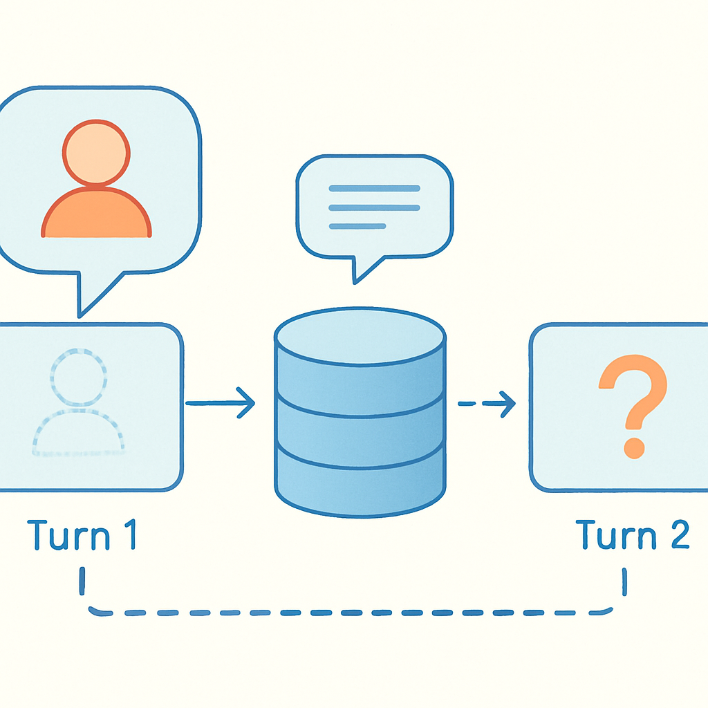

# O mecanismo da pergunta repetida



Se a perda de contexto entre tool calls é uma falha que ocorre dentro do harness — na fronteira entre iterações do loop ReAct — a pergunta repetida é uma falha que ocorre na fronteira oposta: na interface entre o usuário e o agente, visível e imediata, capaz de destruir a percepção de inteligência do sistema num único turno. É o sintoma mais recognoscível de um agente sem sessão, e paradoxalmente o mais fácil de subestimar durante o desenvolvimento.

O mecanismo começa com uma decisão de design que parece razoável: o harness armazena o histórico de chat no MongoDB como uma sequência de pares `(user_message, assistant_message)`. Quando o usuário envia uma nova mensagem, o harness recupera essa sequência, a injeta no contexto e invoca o modelo. No nível de cada turno individual, isso funciona perfeitamente — o modelo vê o histórico e pode responder de forma coerente. O problema está no que essa sequência não captura.

Considere um workflow concreto. O usuário inicia uma sessão de triagem de bugs e, no turno 1, fornece o contexto operacional: "sou o João, tech lead do time backend, estamos usando Node 18 e o ambiente é staging". O agente confirma, faz algumas perguntas sobre o stack, o usuário responde. No turno 3, o agente invoca um tool para listar tasks no ClickUp e devolve um relatório. No turno 5, o usuário pede uma análise diferente. O agente responde — mas desta vez, a invocação do Lambda expirou e uma nova instância foi criada. O harness recarrega o histórico do MongoDB e injeta os pares de mensagens. E então o modelo pergunta: "Pode me dizer qual ambiente você está usando e quem é o responsável técnico?"

A informação estava no histórico. Estava, textualmente, na mensagem do turno 1. Por que o modelo perguntou de novo?

Há três causas distintas que produzem esse sintoma, e entendê-las separadamente é crucial porque têm correções diferentes.

A primeira é a **diluição por volume**. À medida que o histórico cresce, a mensagem do turno 1 fica cada vez mais distante do início da janela de contexto. LLMs exibem um fenômeno documentado de atenção posicional: informações no meio de contextos longos são tratadas de forma menos confiável do que informações no início (o system prompt) ou no final (a mensagem mais recente). Com histórico suficientemente longo, o modelo pode simplesmente não "prestar atenção" a algo que está a 40 turnos de distância — mesmo que os tokens estejam tecnicamente presentes na janela. Pesquisa recente mede uma queda média de 39% no desempenho de modelos em conversas multi-turn comparado a single-turn, com tempo médio de falha em torno de 9 turnos.

A segunda causa é a **ausência de estado estruturado**. Existe uma diferença fundamental entre a informação estar presente como texto numa mensagem e a informação estar disponível como campo em um objeto de sessão. Quando o usuário diz "sou o João, tech lead do time backend", essa informação entra no histórico como prosa livre em linguagem natural. Para o modelo recuperar e usar essa informação de forma confiável, ele precisa: localizar a mensagem, parsear o conteúdo, resolver referências pronominais e temporais, e decidir se a informação ainda é válida. Isso é raciocínio textual sobre história — algo que o modelo faz com probabilidades, não com garantias. Se o mesmo dado existisse como `session.user.role = "tech_lead"` e `session.context.environment = "staging"` em um documento de sessão injetado no system prompt, o modelo teria acesso estruturado e determinístico.

A terceira causa é a **fragmentação por turno**. Em muitos sistemas, o harness não armazena o histórico como uma thread linear completa, mas como snapshots. Se o usuário forneceu informações ao longo de múltiplos turnos curtos — "eu uso Node 18" em um turno, "staging" em outro, "time backend" num terceiro — essas informações ficam dispersas ao longo de mensagens diferentes, cada uma fragmentada em contexto conversacional. O modelo precisa sintetizar essas peças distribuídas toda vez. Sem um objeto de sessão que tenha consolidado esses fatos em campos explícitos, o risco de o modelo não realizar essa síntese cresce a cada turno adicional.

```
Turno 1 — Usuário: "Sou o João, tech lead. Ambiente: staging, Node 18."
Turno 2 — Agente: [análise técnica usando os dados fornecidos]
Turno 3 — Usuário: "Agora me dê o status das tasks do ClickUp"
Turno 3 — Agente: [tool call, resultado, resposta]
...
Turno 8 — Usuário: "Analise os erros críticos desta semana"
Turno 8 — Agente: "Qual ambiente você gostaria que eu analisasse?"
              ↑ dados do turno 1 ainda presentes como texto,
                mas diluídos, não estruturados, não consolidados
```

O impacto em UX é assimétrico em relação ao impacto técnico. Do ponto de vista arquitetural, a pergunta repetida é um sintoma de segundo grau — consequência da ausência de estado estruturado, não uma falha de processamento. Do ponto de vista do usuário, é imediatamente catastrófico: sinaliza que o agente não está prestando atenção, destrói a confiança acumulada nos turnos anteriores, e — em workflows de produção onde o usuário forneceu informações sensíveis ou complexas — cria atrito operacional real. O usuário que está triando um incidente de produção e precisa re-explicar o contexto toda vez não vai continuar usando o sistema.

O ponto preciso onde o design falha é a confusão entre "histórico de chat" e "estado da sessão". São estruturas com propósitos distintos:

| Estrutura | Propósito | Formato | Localização |
|---|---|---|---|
| Histórico de chat | Registro narrativo da conversa | Sequência de mensagens em linguagem natural | Contexto do modelo (injeta como turns) |
| Estado da sessão | Fatos estruturados extraídos e consolidados | Campos tipados, chave-valor, listas | System prompt ou memória explícita |

O histórico serve para o modelo entender o fluxo da conversa — o que foi dito, em que ordem, como a conversa evoluiu. O estado da sessão serve para o modelo ter acesso confiável a fatos operacionais sem precisar fazer arqueologia textual. Um agente com apenas histórico de chat precisa re-inferir os fatos toda vez. Um agente com estado de sessão explícito tem os fatos como dados de primeira classe, sempre disponíveis, independente do tamanho do histórico.

A forma como o Haystack gerencia isso por padrão ilustra o problema diretamente. O `InMemoryChatMessageStore` armazena `ChatMessage` objects em memória e os injeta de volta via `ChatMessageRetriever`. O mecanismo funciona corretamente para manter coerência dentro de uma sessão, mas não diferencia fatos estruturados de prosa conversacional — tudo é `ChatMessage`. Quando o histórico é persistido no MongoDB e recarregado entre invocações do Lambda, o que persiste é exatamente essa sequência plana de mensagens, sem nenhuma extração de fatos para um objeto de sessão separado. O agente sempre começa o turno com a sequência narrativa; nunca começa com um mapa de fatos operacionais verificados.

A correção não é técnica imediata — é arquitetural. O padrão que resolve a pergunta repetida é a separação entre o substrato persistente (o objeto de sessão com campos estruturados) e o histórico de chat (a thread de mensagens). Quando o usuário fornece o ambiente, o harness extrai `session.context.environment = "staging"` e persiste esse campo no documento de sessão. Quando o usuário se identifica, `session.user.id` e `session.user.role` ficam disponíveis de forma imediata. A cada turno, esses campos são injetados no system prompt como contexto estruturado — não misturados ao histórico narrativo. O resultado é que o agente nunca precisa re-inferir o que já sabe; ele simplesmente consulta o estado.

Esse padrão de separação é exatamente o que o capítulo 2 vai modelar em detalhe — a distinção entre substrato persistente e janela de contexto como projeção. O que importa aqui é reconhecer que a pergunta repetida não é um problema de memória do modelo, não é uma limitação do LLM, e não é algo que se resolve aumentando o contexto. É uma consequência direta de tratar o histórico de chat como substituto do estado de sessão, e a solução exige um objeto de sessão de primeira classe.

## Fontes utilizadas

- [Why LLMs Get Lost in Multi-Turn Conversation — Medium/Kunal Verma](https://hereiskunalverma.medium.com/why-llms-get-lost-in-multi-turn-conversation-e458a0a34a9a)
- [From Turn 1 to Turn 10: How LLMs Get Lost In Multi-Turn Conversations — Maxim](https://www.getmaxim.ai/blog/from-turn-1-to-turn-10-how-llms-get-lost-in-multi-turn-conversations/)
- [Why AI Agents Keep Asking the Same Questions — Augment Code](https://www.augmentcode.com/guides/why-ai-agents-repeat-questions)
- [Agent Memory: Why Your AI Has Amnesia and How to Fix It — Oracle Developers](https://blogs.oracle.com/developers/agent-memory-why-your-ai-has-amnesia-and-how-to-fix-it)
- [Good Listener: How Memory Enables Conversational Agents — Haystack](https://haystack.deepset.ai/blog/memory-conversational-agents)
- [Context Engineering for Agentic Systems — Haystack](https://haystack.deepset.ai/blog/context-engineering)
- [How to Ensure Consistency in Multi-Turn AI Conversations — Maxim](https://www.getmaxim.ai/articles/how-to-ensure-consistency-in-multi-turn-ai-conversations/)
- [Intent Mismatch Causes LLMs to Get Lost in Multi-Turn Conversation — arXiv](https://arxiv.org/html/2602.07338v1)

---

**Próximo conceito** → [Decisões contraditórias em turnos consecutivos](../03-decisoes-contraditorias-em-turnos-consecutivos/CONTENT.md)
