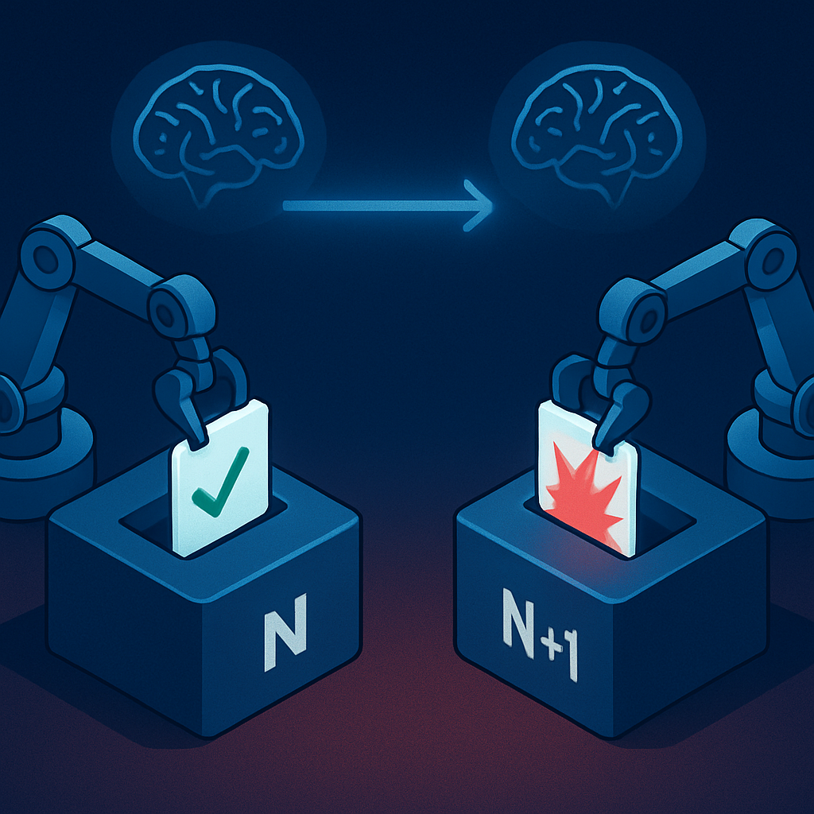
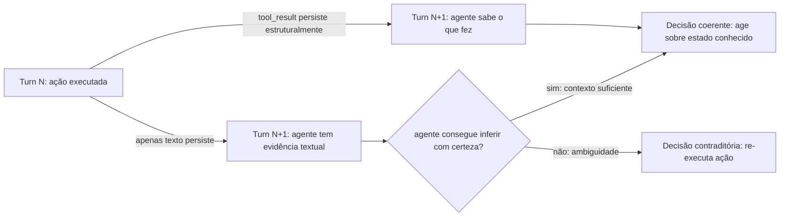

# Decisões contraditórias em turnos consecutivos



Se a perda de contexto entre tool calls é uma falha interna ao harness — invisível para o usuário — e a pergunta repetida é um sintoma de interface que destrói a percepção de inteligência do agente, as decisões contraditórias em turnos consecutivos são a terceira manifestação, e a mais danosa operacionalmente. Aqui, o problema não é o agente perguntar algo que já sabe: é o agente *agir* de forma incompatível com uma ação que já executou. A contradição não está na conversa — está nos efeitos no mundo externo.

O mecanismo é uma extensão direta do que foi estabelecido nos dois conceitos anteriores. O harness persiste o histórico de chat como sequência de pares `(user_message, assistant_message)`. Quando os `tool_use` e `tool_result` blocks não são preservados com fidelidade estrutural, o modelo no turn N+1 vê a resposta do assistente no turn N — um texto em linguagem natural mencionando uma ação — mas não tem acesso ao evento estruturado que comprova que aquela ação ocorreu, qual foi seu resultado exato e qual estado ela deixou no sistema externo. Sem esse registro, o agente não consegue distinguir entre "eu afirmei que faria isso" e "eu fiz isso e o sistema confirmou".

Considere o cenário mais direto: o usuário pede ao agente que crie uma tarefa no ClickUp para um bug crítico. No turn N, o agente chama `create_task("Bug: autenticação falha em produção", priority="urgent")`, a API retorna `{task_id: "CU-9841", status: "open"}`, e o agente responde ao usuário confirmando a criação. O harness persiste o par de mensagens. No turn N+1, o usuário envia uma mensagem relacionada — digamos, "pode adicionar o João como responsável por esse bug?" — e a invocação anterior do Lambda já expirou. Uma nova instância carrega o histórico do MongoDB.

O modelo vê, na mensagem do assistente do turn N, algo como "Criei a tarefa para o bug de autenticação". Mas sem o `tool_result` estruturado com o `task_id`, o que ele tem é um texto afirmando que uma tarefa foi criada. Se o workflow for ambíguo — se o usuário não tiver mencionado "CU-9841" explicitamente na conversa — o modelo não tem o identificador concreto para chamar `assign_user(task_id="CU-9841", user="João")`. O que ele pode fazer, dependendo de como foi instruído, é: perguntar o ID da tarefa (pergunta repetida), chamar `search_tasks` para encontrá-la, ou, em cenários de instrução mais agressiva, criar uma nova tarefa. A terceira opção — a que materializa a contradição — ocorre quando o agente, sem encontrar evidência estrutural de que a tarefa existe, decide que a ação de criação ainda não foi executada e a executa novamente.

```
Turn N:
  User:      "crie uma tarefa para o bug de autenticação"
  tool_use:  create_task("Bug: autenticação falha", priority="urgent")
  tool_result: {task_id: "CU-9841", status: "open"}
  Assistant: "Criei a tarefa para o bug de autenticação."

Persiste como:
  user:      "crie uma tarefa para o bug de autenticação"
  assistant: "Criei a tarefa para o bug de autenticação."
            ↑ sem tool_use / tool_result

Turn N+1 — nova instância Lambda:
  [user: "crie uma tarefa..."]
  [assistant: "Criei a tarefa..."]   ← evidência textual, sem prova estrutural
  [user: "adicione o João como responsável pelo bug"]

  Modelo não encontra task_id nos dados estruturados.
  Raciocina: "A tarefa pode não ter sido criada de fato."
  Executa:   create_task("Bug: autenticação falha", priority="urgent")
  Resultado: tarefa CU-9847 criada — duplicata de CU-9841.
```

O resultado prático é uma tarefa duplicada no ClickUp, dois tickets abertos para o mesmo bug, possivelmente com prioridades divergentes se o agente tomou decisões ligeiramente diferentes na segunda execução. Em sistemas de produção com múltiplos agentes ou múltiplos usuários, esse padrão de duplicação em cascata pode contaminar rapidamente o estado de um sistema externo — e o problema não é imediatamente óbvio, porque cada ação individual parece correta quando examinada isoladamente.

O que torna esse padrão qualitativamente diferente dos dois anteriores é a reversibilidade. A pergunta repetida é irritante, mas o usuário pode simplesmente refornecer a informação. A perda de contexto em tool calls é recuperável se o harness for corrigido. A decisão contraditória que criou um recurso duplicado, enviou uma mensagem duas vezes, ou executou uma transferência financeira de novo não é recuperável pelo agente — exige intervenção humana, rollback manual, ou depende de idempotência no sistema externo que pode ou não estar implementada.

A análise de falhas em 14 mil sessões de agentes em sandbox mostra que cerca de 12% das sessões com estados de erro produziram uma mensagem final que não refletia o que de fato havia acontecido — o que pesquisadores chamam de "phantom success problem": o agente reporta sucesso de uma ação que não foi executada, ou executa a ação de novo porque não tem certeza de que a primeira tentativa teve sucesso. A combinação de ausência de `tool_result` estruturado com a ausência de um log de ações executadas no objeto de sessão cria exatamente esse fenômeno.

Há uma nuance importante sobre *quando* esse padrão ocorre. Em workflows curtos e de turno único, ele raramente emerge — o agente não tem oportunidade de contradizer uma ação anterior porque não há turno anterior relevante na janela de contexto. O problema cresce quadraticamente com o número de turnos: quanto mais longa for a sessão, mais ações executadas se acumulam como evidência apenas textual no histórico, e maior a probabilidade de que o modelo, ao raciocinar sobre o estado atual do sistema, não consiga reconstruir com certeza o que já foi feito. A probabilidade de contradição é diretamente proporcional à distância temporal entre a ação original e a decisão dependente, e inversamente proporcional à qualidade do registro estruturado dessa ação.



O ponto de falha arquitetural é preciso: o harness não rastreia ações executadas como eventos de primeira classe no objeto de sessão. A correção não é apenas persisti`tool_result` blocks no histórico de chat — isso ajuda, mas não é suficiente. A solução estrutural é manter um log de ações executadas como parte do estado da sessão: um campo `session.actions_executed` que registra `{action_type, parameters, result, timestamp}` para cada tool call concluído com sucesso. Esse log é injetado no contexto como dado estruturado verificável — não misturado ao histórico narrativo — e o agente pode consultá-lo antes de decidir executar qualquer ação write.

| Estratégia | O que resolve | O que não resolve |
|---|---|---|
| Persistir `tool_use`/`tool_result` no histórico | Evidência textual mais rica; modelo tem mais contexto | Histórico longo ainda dilui; sem campo estruturado para consulta direta |
| Log de ações no objeto de sessão | Acesso estruturado e determinístico a ações passadas | Não previne duplicação em sistemas externos sem idempotência |
| Idempotência no sistema externo (`task_id` baseado em hash) | Duplicação no sistema externo é neutra | Não corrige raciocínio do agente; ele ainda não sabe o que fez |
| Combinação: log de ações + injeção no system prompt | Agente consulta estado verificado antes de agir | Custo de tokens aumenta com sessões longas; exige compactação |

A conexão com o que foi estabelecido sobre o estado da sessão no conceito anterior é direta: assim como a pergunta repetida emerge de confundir histórico de chat com estado de sessão, as decisões contraditórias emergem de confundir o registro narrativo de uma ação com o registro estrutural de seu resultado. Um agente que diz "eu fiz X" num turno, e não encontra prova estrutural de que X ocorreu no turno seguinte, está em exatamente a mesma posição arquitetural que alguém que lê o título de um ticket aberto sem ter acesso ao sistema de rastreamento: pode inferir que a tarefa foi criada, mas não pode garantir.

A idempotência no sistema externo — APIs de ClickUp, Slack, ou qualquer integração — mitiga as consequências mas não o problema de raciocínio. Um `create_task` que é idempotente por `idempotency_key` garante que a segunda chamada não cria um segundo recurso, mas o agente ainda chegou à segunda chamada por falta de estado — ele ainda não sabia o que havia feito. E em sistemas onde a idempotência não está implementada (o que inclui a maioria das APIs de terceiros fora do contexto financeiro), a consequência material da contradição se concretiza integralmente. Por isso, a solução tem que estar na camada de sessão, não na esperança de que os sistemas externos sejam idempotentes.

## Fontes utilizadas

- [Designing Idempotent Write Operations for Business Agents — Airbyte](https://airbyte.com/blog/designing-idempotent-write-operations)
- [Why Do Multi-Agent LLM Systems Fail? — arXiv](https://arxiv.org/pdf/2503.13657)
- [The Forgetting Agent: Why Multi-Turn Conversations Collapse — Blake Crosley](https://blakecrosley.com/blog/agent-memory-degradation)
- [Stateful Agents: The Missing Link in LLM Intelligence — Letta](https://www.letta.com/blog/stateful-agents)
- [How to Ensure Consistency in Multi-Turn AI Conversations — Maxim](https://www.getmaxim.ai/articles/how-to-ensure-consistency-in-multi-turn-ai-conversations/)
- [Why Multi-Agent Systems Fail — Galileo](https://galileo.ai/blog/why-multi-agent-systems-fail)
- [Multi-Agent System Reliability: Failure Patterns — Maxim](https://www.getmaxim.ai/articles/multi-agent-system-reliability-failure-patterns-root-causes-and-production-validation-strategies/)
- [Stateful vs Stateless AI Agents: Architecture Guide — Tacnode](https://tacnode.io/post/stateful-vs-stateless-ai-agents-practical-architecture-guide-for-developers)

---

**Próximo conceito** → [A falha silenciosa do Lambda stateless](../04-a-falha-silenciosa-do-lambda-stateless/CONTENT.md)
