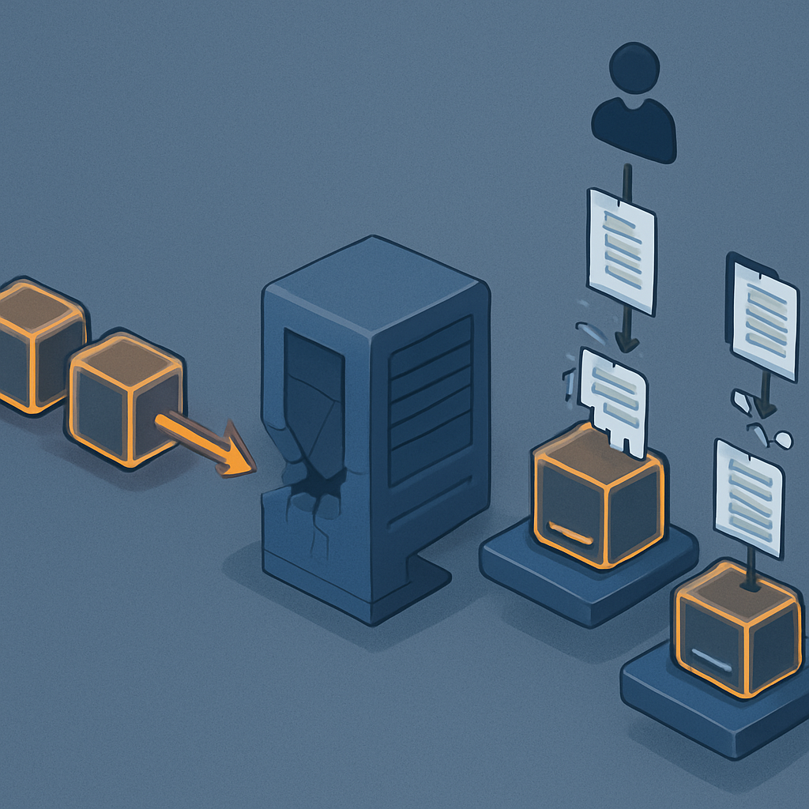
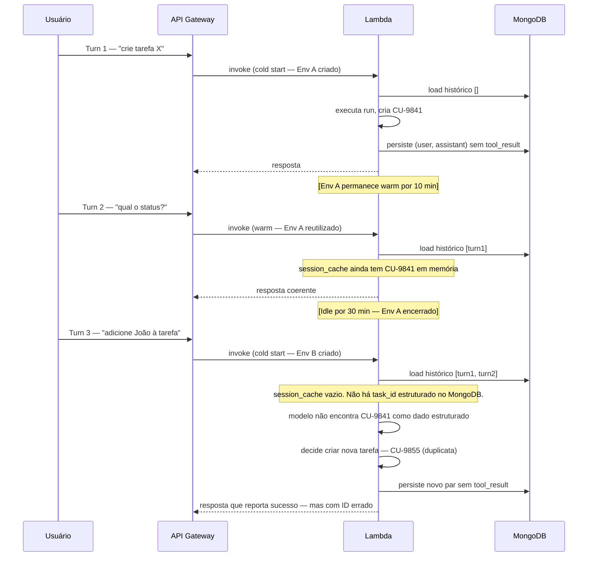

# A falha silenciosa do Lambda stateless



Os três padrões explorados até aqui — a perda de contexto entre tool calls, o mecanismo da pergunta repetida e as decisões contraditórias em turnos consecutivos — têm uma raiz arquitetural comum: o harness não persiste o estado estrutural necessário para que a próxima invocação reconstrua o contexto com fidelidade. Mas há uma camada abaixo dessas falhas que agrava todos eles de uma forma específica e que não é óbvia quando o sistema está sendo desenvolvido: a natureza stateless do próprio Lambda. Entender como o Lambda amplifica esses três padrões é o que fecha a anatomia da falha — e é o que torna o sintoma silencioso, porque o desenvolvedor frequentemente acredita ter resolvido o problema ao injetar o histórico.

O Lambda foi projetado para ser stateless por razões legítimas de escalabilidade. Cada invocação recebe um evento, executa o handler, e retorna uma resposta. O runtime pode ou não reutilizar o mesmo execution environment para a próxima invocação — isso é uma decisão interna do Lambda, fora do controle do desenvolvedor. Quando reutiliza (warm start), objetos declarados fora do handler persistem na memória entre chamadas. Quando não reutiliza (cold start), tudo começa do zero. A documentação oficial é explícita: "Lambda terminates execution environments every few hours to allow for runtime updates and maintenance — even for functions that are invoked continuously. You should not assume that the execution environment will persist indefinitely." O ponto crítico é que essa decisão — reutilizar ou não — é tomada pelo Lambda unilateralmente, a qualquer momento, sem notificação.

Para um agente construído sobre Lambda, isso cria um contrato de execução radicalmente diferente do que um processo de servidor contínuo ofereceria. Um servidor Flask rodando em EC2 tem um loop de eventos que persiste por horas ou dias — objetos em memória sobrevivem entre requisições, sessões abertas permanecem abertas, qualquer estado acumulado em variáveis globais está disponível. O Lambda não faz nenhuma dessas garantias. Cada invocação é, funcionalmente, um novo processo — com a caveat de que, às vezes, um processo "antigo" ainda está disponível e pode ser reutilizado. Mas o desenvolvedor não sabe quando isso acontece.

```
Execution Environment A (criado às 10:00)
  Handler invocado às 10:00 — processa turn 1
  Handler invocado às 10:02 — processa turn 2 (warm, mesmo ambiente)
  Handler invocado às 10:05 — processa turn 3 (warm, mesmo ambiente)
  [Lambda decide terminar o ambiente às 10:20 por idle timeout]

Execution Environment B (criado às 10:22)
  Handler invocado às 10:22 — processa turn 4 (cold start, novo ambiente)
  Qualquer variável global inicializada no ambiente A: inexistente
  Qualquer objeto em memória do ambiente A: inexistente
```

O que isso significa concretamente para o harness de um agente Haystack rodando nesse Lambda? Significa que qualquer estado acumulado em memória durante os turns 1, 2 e 3 — qualquer cache de resultados de tool calls, qualquer acumulação de contexto em objetos Python, qualquer estado interno do pipeline Haystack — está potencialmente ausente no turn 4. O harness precisa reconstruir tudo a partir do que está persistido externamente, que é exatamente o MongoDB com o histórico de chat.

E aqui é onde a falha se torna silenciosa. O desenvolvedor, ciente do problema de persistência, implementa a injeção de histórico: a cada invocação, o harness busca os últimos N turnos do MongoDB e os injeta no contexto antes de invocar o modelo. Isso parece correto. Parece suficiente. O sistema funciona em desenvolvimento, onde os turnos são poucos, os contextos são curtos e o desenvolvedor frequentemente testa com contextos que cabem completamente na janela. O problema é que a injeção de histórico resolve apenas uma parte do problema de estado — e o Lambda stateless amplifica exatamente as partes que não foram resolvidas.

A perda de contexto entre tool calls é amplificada da seguinte forma. Dentro de um warm start, o harness pode ter acumulado em memória o estado do loop ReAct da invocação anterior — os `tool_use` e `tool_result` blocks do run mais recente ainda estão acessíveis como objetos Python. Em desenvolvimento ou em testes de curta duração, o warm start é a norma, e o desenvolvedor pode nunca observar a perda porque o ambiente A ainda está vivo quando o próximo turn chega. Em produção, com volumes reais e tempos de inatividade entre turnos do usuário, o cold start acontece com frequência — e aí o estado do loop ReAct que estava "funcionando" em memória simplesmente não existe. O harness precisa reconstruí-lo exclusivamente do que foi persistido, que, como estabelecido no primeiro conceito deste subcapítulo, frequentemente não inclui os `tool_result` blocks com fidelidade estrutural.

O mecanismo da pergunta repetida é amplificado de forma análoga. Durante um warm start, objetos Python declarados fora do handler podem conter dados da sessão que foram calculados ou extraídos em invocações anteriores — campos como o nome do usuário, o ambiente, as preferências. Numa sessão curta de desenvolvimento onde o ambiente quase nunca reinicia, esses dados "sobrevivem" na memória mesmo sem terem sido explicitamente persistidos. O desenvolvedor testa, o agente funciona, nunca pergunta duas vezes. Em produção, num cold start, esses objetos não existem. O harness tem apenas o histórico textual — e o modelo vai precisar re-inferir os fatos, falhando exatamente do modo descrito no segundo conceito.

```python
# Padrão que parece funcionar mas é uma armadilha Lambda

# Declarado fora do handler — persiste entre warm invocations
session_cache = {}

def handler(event, context):
    session_id = event["session_id"]
    
    if session_id not in session_cache:
        # Cold start ou primeiro acesso: vai ao MongoDB
        session_cache[session_id] = load_session_from_mongo(session_id)
    
    # Usa session_cache[session_id] como "estado da sessão"
    # Funciona em warm starts. Falha silenciosamente em cold starts.
    run_agent(session_cache[session_id], event["message"])
```

O problema desse padrão é documentado pela AWS como "unexpected data persisted across invocations" — e seu inverso. O desenvolvedor pode descobrir que o `session_cache` acumulou dados de invocações anteriores (vazamento de estado entre sessões diferentes num mesmo ambiente), ou pode descobrir que o `session_cache` está vazio quando esperava estar populado (cold start após idle). Nos dois casos, a causa é a mesma: assumir comportamento determinístico de um recurso que o Lambda torna não-determinístico.

As decisões contraditórias em turnos consecutivos são o padrão mais agravado pelo Lambda stateless, por uma razão específica: elas dependem do log de ações executadas, que é o campo mais frequentemente ausente do estado persistido. Se o harness mantinha em memória um set de `task_ids` já criados para evitar duplicações — mesmo que como uma mitigação improvisada — esse set desaparece em cada cold start. O modelo no turn N+1 não sabe o que foi criado no turn N se o registro estrutural dessa ação não foi persistido no MongoDB. E cold starts acontecem exatamente em momentos de baixa frequência de uso — à noite, no intervalo entre sessões — que são precisamente os momentos em que um usuário retoma uma tarefa que começou antes.

O aspecto "silencioso" da falha tem uma causa técnica precisa: o comportamento do ambiente varia de forma não-determinística. Em alguns turnos, o warm start mascara completamente a ausência de persistência adequada. Em outros, o cold start expõe a falha. O desenvolvedor que testa em desenvolvimento observa principalmente o caso warm — e quando a falha ocorre em produção, ela não é facilmente reproduzível porque depende do timing de idle do ambiente Lambda, que não é configurável nem previsível.



O diagrama acima é o comportamento exato que um sistema com a arquitetura Lambda + MongoDB + Haystack vai exibir num workflow de três turnos com idle entre o segundo e o terceiro. O turn 2 funciona porque o ambiente está warm — a falha do turn 1 (não persistir o `tool_result` estruturado) é mascarada pelo estado em memória. O turn 3 expõe a falha porque o ambiente reiniciou — e aí todos os três padrões se materializam simultaneamente: o contexto do tool call não está no MongoDB de forma estruturada, o task_id não está disponível como dado verificável, e o agente toma uma decisão contraditória que cria um recurso duplicado.

A consequência direta para o design da camada de sessão é que ela não pode assumir nenhuma garantia de estado em memória. Cada invocação do Lambda deve ser tratada como se fosse um cold start, independente de ser ou não warm na prática. O objeto de sessão completo — incluindo os campos estruturados, o log de ações executadas, os `tool_result` blocks dos runs recentes — precisa ser carregado integralmente do armazenamento externo a cada handler call. A possível eficiência de um cache em memória (como o `session_cache` no exemplo acima) pode ser implementada como otimização, mas nunca como fonte de verdade. A fonte de verdade é sempre o estado persistido.

Isso também define o tipo de dado que o MongoDB precisa armazenar. Não uma coleção de pares `(user_message, assistant_message)` — mas um documento de sessão com campos explícitos: histórico de mensagens incluindo `tool_use` e `tool_result` blocks, log de ações executadas com timestamps e resultados, metadados da sessão (usuário, ambiente, preferências extraídas), e estado do agente no momento em que o último turn terminou. Esse documento precisa ser suficiente para que qualquer invocação — warm ou cold — reconstrua o contexto completo da sessão sem depender de nada além do que está armazenado. O capítulo 2 modela exatamente esse documento; o que importa reconhecer aqui é que a necessidade dele não é uma escolha de design elegante — é uma consequência obrigatória do contrato de execução do Lambda stateless.

## Fontes utilizadas

- [Understanding the Lambda execution environment lifecycle — AWS Lambda](https://docs.aws.amazon.com/lambda/latest/dg/lambda-runtime-environment.html)
- [Operating Lambda: Performance optimization – Part 1 — AWS Compute Blog](https://aws.amazon.com/blogs/compute/operating-lambda-performance-optimization-part-1/)
- [AWS Lambda: "Unexpected Data Persisted Across Invocations" — When Reused Containers Keep Old State — tech-reader.blog](https://www.tech-reader.blog/2025/10/aws-lambda-unexpected-data-persisted_22.html)
- [Circuit Breakers on AWS Lambda: Why In-Memory State Silently Fails — DEV Community](https://dev.to/gunnargrosch/circuit-breakers-on-aws-lambda-why-in-memory-state-silently-fails-edh)
- [The Stateless Lie: How AWS Lambda Finally Learned to Remember — Mayank Raj](https://mayankraj.com/blog/lambda-durable-functions-stateless-lie/)
- [Serverless AI Agents at Scale: Solving AWS Lambda's 15-Minute Timeout Limit — Markaicode](https://markaicode.com/aws-lambda-timeout-solutions-ai-agents-2025/)
- [Session Management in AWS Lambda: Guide — awsforengineers.com](https://awsforengineers.com/blog/session-management-in-aws-lambda-guide/)
- [Build a serverless agent with persistent context using Strands Agents SDK — DEV Community / AWS](https://dev.to/aws-builders/build-a-serverless-agent-with-persistent-context-using-strands-agents-sdk-4phh)

---

**Próximo conceito** → [Reconhecimento de padrão vs. diagnóstico vago](../05-reconhecimento-de-padrao-vs-diagnostico-vago/CONTENT.md)
