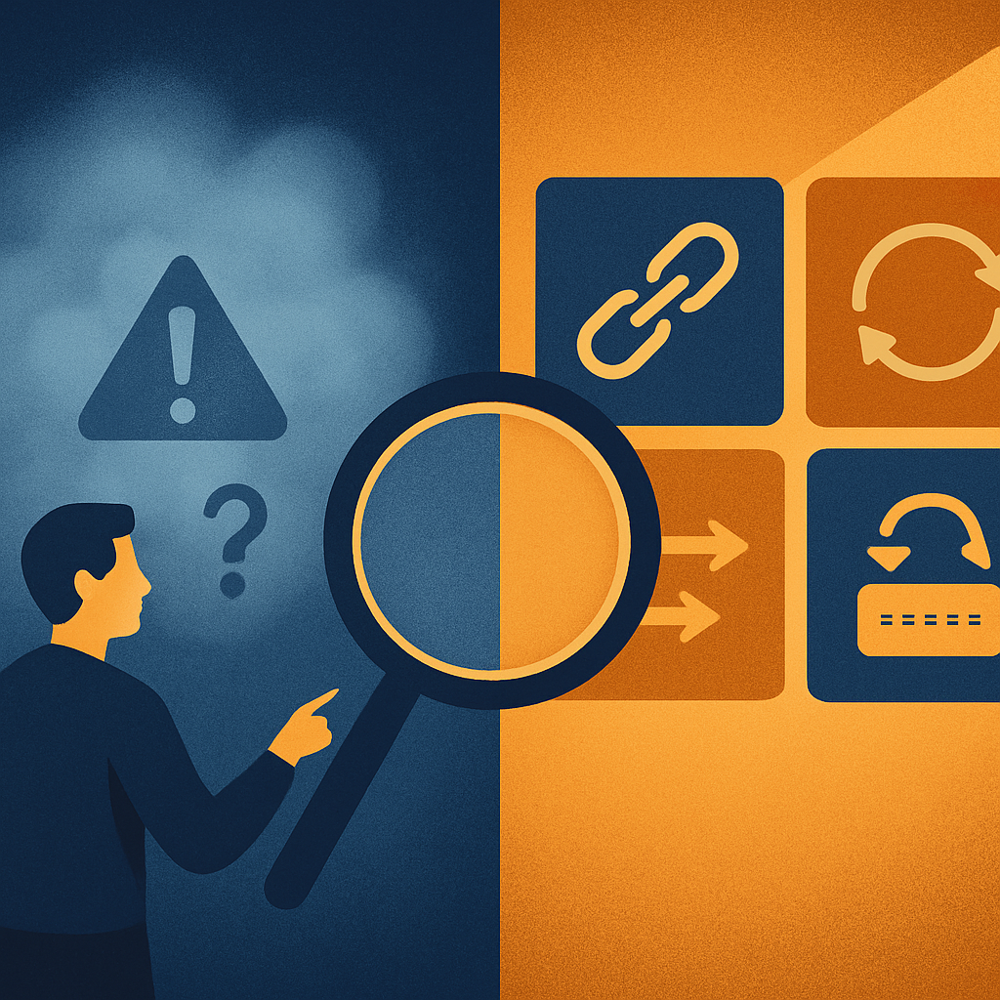
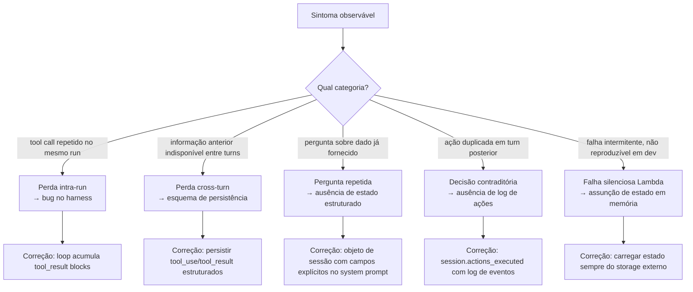

# Reconhecimento de padrão vs. diagnóstico vago

Os quatro conceitos anteriores deste subcapítulo construíram uma anatomia detalhada: a perda de contexto entre tool calls, o mecanismo da pergunta repetida, as decisões contraditórias em turnos consecutivos e a falha silenciosa do Lambda stateless. Cada um foi examinado como um mecanismo distinto — com causa raiz precisa, ponto de falha arquitetural identificado e correção específica. O que este conceito fecha é a transição que esses quatro juntos tornam possível: sair do diagnóstico vago e entrar no reconhecimento de padrão.

"O agente está se comportando de forma estranha" é um diagnóstico vago. É o ponto de partida de quem observou o sintoma mas não tem vocabulário para nomeá-lo. É também o ponto de chegada de qualquer debug que termina sem correção estrutural — porque sem nomear o problema com precisão, qualquer correção é um chute. A diferença entre um engenheiro que diz "o agente está se comportando de forma estranha" e um que diz "estamos observando perda de contexto cross-turn causada por ausência de `tool_result` blocks no esquema de persistência" não é de profundidade de investigação — é de vocabulário disponível. E vocabulário disponível é o que permite agir de forma cirúrgica em vez de tentar variações aleatórias de prompt.

A Microsoft formalizou esse problema num whitepaper de taxonomia de falhas em sistemas agênticos que identifica cinco dimensões arquiteturais de falha, 13 classes de sintomas e 12 categorias de causa raiz. A motivação declarada para esse trabalho é exatamente a que este conceito trata: a dificuldade de classificar falhas em sistemas agênticos faz com que problemas recorrentes continuem ocorrendo porque não são reconhecidos como a mesma classe de problema quando surgem com sintomas ligeiramente diferentes. Pesquisadores da arXiv documentaram o mesmo ponto numa taxonomia paralela — faults frequently traverse architectural boundaries, o que significa que o sintoma visível (por exemplo, o agente fazer uma pergunta repetida) pode ter causas raiz em camadas completamente diferentes (diluição por volume, ausência de estado estruturado, fragmentação por turno) que exigem correções distintas. Sem o mapeamento preciso de sintoma → causa → classe de falha, um engenheiro que resolve a diluição por volume aumentando a janela de contexto não resolve a ausência de estado estruturado — e o sintoma volta de forma ligeiramente diferente, parecendo um novo problema.

O que o reconhecimento de padrão entrega em termos práticos é a capacidade de triage. Num sistema de produção com múltiplos usuários e múltiplas sessões ativas, falhas não chegam uma de cada vez com um label claro. Elas chegam como anomalias nos logs, como reclamações de usuários de qualidade variável, como spans de observabilidade que mostram tool calls repetidos ou sessões com latência anômala. A habilidade de olhar para um span e dizer "esse tool call sendo executado duas vezes em turnos distintos com os mesmos parâmetros é o padrão de decisão contraditória — causa raiz: ausência de log de ações no objeto de sessão" é o que separa a investigação rápida da análise interminável.

A tabela abaixo mapeia os quatro padrões explorados neste subcapítulo — do sintoma observável à causa raiz e à classe de falha:

| Sintoma observável | Nome técnico do padrão | Causa raiz primária | Classe de falha |
|---|---|---|---|
| Agente não usa resultado de tool call da iteração anterior | Perda de contexto intra-run | Harness não acumula `tool_result` blocks entre iterações do loop | Bug de implementação do harness |
| Agente não usa resultado de tool call de turn anterior | Perda de contexto cross-turn | Esquema de persistência não inclui `tool_use`/`tool_result` estruturados | Deficiência de design da camada de sessão |
| Agente pergunta informação já fornecida em turno anterior | Pergunta repetida | Ausência de estado de sessão estruturado; dados como prosa diluída no histórico | Confusão entre histórico de chat e estado de sessão |
| Agente executa ação já executada em turno anterior | Decisão contraditória | Ausência de log de ações executadas com resultado verificável | Ausência de rastreamento de efeitos no objeto de sessão |
| Falha ocorre intermitentemente, não reproduzível em dev | Falha silenciosa do Lambda | Estado em memória mascara ausência de persistência adequada em warm starts | Assunção incorreta de determinismo do execution environment |

Esse mapeamento tem uma implicação direta para o processo de debug: o sintoma nunca é suficiente para determinar a correção. Dois sistemas podem exibir o mesmo sintoma de "pergunta repetida" por causas raiz completamente diferentes — diluição de volume e ausência de estado estruturado — e as correções são distintas. O primeiro pode ser mitigado com compactação do histórico ou expansão da janela de contexto; o segundo exige a criação de um objeto de sessão com campos explícitos injetados no system prompt. Aplicar a correção do primeiro quando a causa é o segundo resulta num sistema que melhora temporariamente, mas degrada conforme o histórico cresce de novo.

O mesmo vale para a dimensão de observabilidade. Frameworks como Latitude e Galileo documentam que a abordagem mais eficaz para sistemas agênticos em produção não é ler logs linha por linha — é fazer clustering automático de falhas em traces de execução para identificar padrões recorrentes. A premissa desse clustering é que falhas do mesmo tipo terão assinaturas similares nos spans: tool calls com os mesmos parâmetros sendo emitidos em intervalos suspeitos, spans com alto número de iterações do loop ReAct sem convergência, sessões onde o primeiro turno contém informações que reaparecem como perguntas em turnos subsequentes. Esse clustering só é possível se as falhas forem categorizadas com vocabulário consistente — senão, o que é o mesmo problema numa sessão e numa outra é registrado com descrições diferentes e tratado como dois problemas distintos.

Vale examinar mais de perto o que diferencia os cinco padrões em termos de *quando* o diagnóstico fica disponível. A perda de contexto intra-run é detectável imediatamente nos spans de observabilidade — o mesmo tool call aparecendo duas vezes dentro do mesmo run com os mesmos parâmetros é uma assinatura clara. A perda cross-turn aparece quando se compara spans de turnos consecutivos: o run do turn N+1 não tem acesso ao `task_id` que o run do turn N registrou como `tool_result`. A pergunta repetida é detectável na análise de conteúdo: uma mensagem do agente contendo uma pergunta cujo conteúdo está presente textualmente no histórico de turnos anteriores. A decisão contraditória é detectável comparando o log de tool calls entre turns: o mesmo `create_task` com parâmetros equivalentes aparecendo em dois runs distintos dentro da mesma sessão. A falha silenciosa do Lambda é detectável correlacionando timing de invocações com o ciclo de vida dos execution environments — mas isso requer instrumentação específica, porque a distinção warm/cold não é exposta automaticamente nos spans da aplicação.

Há uma consequência adicional do diagnóstico vago que vale nomear explicitamente: ele induz correções no lugar errado da stack. O engenheiro que descreve o problema como "o agente está esquecendo coisas" vai instintivamente tentar melhorar o prompt — tornando as instruções mais explícitas, repetindo contextos importantes, adicionando exemplos. Em alguns casos, isso melhora marginalmente o comportamento porque o prompt mais denso compensa parcialmente a ausência de estado estruturado. Mas a causa raiz não foi tocada, e sob carga ou com sessões mais longas, o comportamento vai degradar novamente. Pior: a melhoria parcial pode mascarar o problema por semanas em produção, até que um usuário com uma sessão longa ou um workflow multi-step mais complexo encontre o limite da compensação via prompt. O diagnóstico vago não apenas atrasa a correção — ele cria correções que interferem com a correção real quando ela finalmente chega, porque o prompt foi enriquecido com compensações que precisam ser removidas quando o estado estruturado for implementado.

O objetivo deste subcapítulo inteiro não era apresentar quatro falhas para memorizar — era criar o reconhecimento que torna o diagnóstico possível. O leitor que chegou até aqui com o próprio sistema em mente já tem o suficiente para abrir os logs da sua instância Lambda, examinar o histórico de conversas no MongoDB, e identificar qual dos quatro padrões está presente. E — igualmente importante — tem o vocabulário para comunicar o problema com precisão: para a equipe, para abrir um issue, para descrever o comportamento num runbook. O próximo subcapítulo vai transformar esse diagnóstico em vocabulário formal — a definição precisa de session, turn, run e thread — que é exatamente o que se precisa para projetar a camada que resolve cada uma dessas falhas pela raiz.

## Fontes utilizadas

- [Taxonomy of Failure Mode in Agentic AI Systems — Microsoft](https://cdn-dynmedia-1.microsoft.com/is/content/microsoftcorp/microsoft/final/en-us/microsoft-brand/documents/Taxonomy-of-Failure-Mode-in-Agentic-AI-Systems-Whitepaper.pdf)
- [Characterizing Faults in Agentic AI: A Taxonomy of Types, Symptoms, and Root Causes — arXiv](https://arxiv.org/html/2603.06847v1)
- [Detecting AI Agent Failure Modes in Production: A Framework for Observability-Driven Diagnosis — Latitude](https://latitude.so/blog/ai-agent-failure-detection-guide)
- [AI Agent Failure Pattern Recognition: The 6 Ways Agents Fail — MindStudio](https://www.mindstudio.ai/blog/ai-agent-failure-pattern-recognition)
- [Why AI Agents Break: A Field Analysis of Production Failures — Arize](https://arize.com/blog/common-ai-agent-failures/)
- [Diagnosing and Measuring AI Agent Failures: A Complete Guide — Maxim](https://www.getmaxim.ai/articles/diagnosing-and-measuring-ai-agent-failures-a-complete-guide/)
- [New whitepaper outlines the taxonomy of failure modes in AI agents — Microsoft Security Blog](https://www.microsoft.com/en-us/security/blog/2025/04/24/new-whitepaper-outlines-the-taxonomy-of-failure-modes-in-ai-agents/)
- [AI Agent Observability: Evolving Standards and Best Practices — OpenTelemetry](https://opentelemetry.io/blog/2025/ai-agent-observability/)

---

**Próximo subcapítulo** → [Vocabulário Fundamental: Session, Turn, Run e Thread](../../03-vocabulario-fundamental-session-turn-run-e-thread/CONTENT.md)
