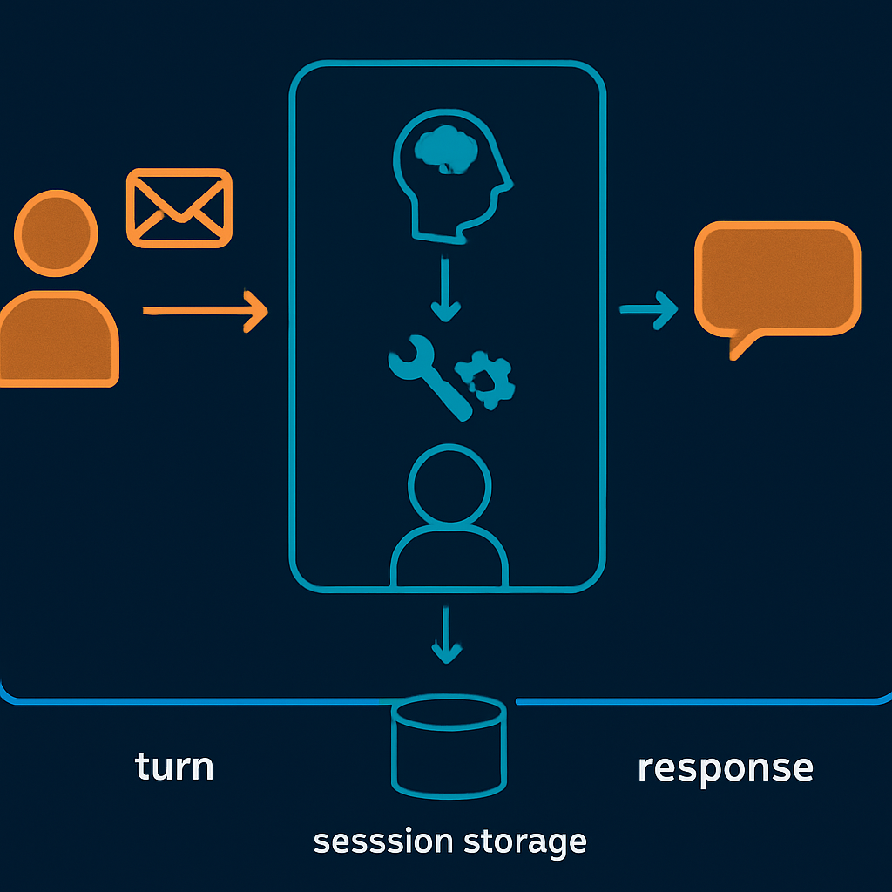

# Turn: o ciclo usuário→agente



A session, como o conceito anterior estabeleceu, é o container de longa duração — o objeto persistente que carrega histórico, metadados e estado do agente entre invocações. Mas a session não opera diretamente; ela é acessada e atualizada através de unidades de interação discretas. Essas unidades têm um nome: **turn**. Se a session é o substrato que persiste, o turn é o mecanismo pelo qual a sessão avança — e entender sua delimitação exata é o que permite raciocinar com precisão sobre onde o estado é carregado, onde é processado e onde é salvo.

O turn é a unidade de interação vista do lado de fora do sistema. Sua definição operacional: **um turn começa quando o usuário envia uma mensagem e termina quando o agente entrega a resposta final de volta ao usuário.** Essa definição é intencionalmente focada na perspectiva do chamador — não na perspectiva interna do loop agêntico. Do ponto de vista de quem chama a API, um turn é um ciclo completo de request→response: você enviou algo, o sistema processou, você recebeu algo de volta. O que acontece internamente durante esse processamento — quantas chamadas ao modelo foram feitas, quantos tool calls foram executados, quantos ciclos de raciocínio ocorreram — não é visível na fronteira do turn. Essa opacidade é intencional e arquiteturalmente importante.

No sistema que o leitor já opera — API Gateway + Lambda + Haystack + Gemini — o turn tem uma fronteira natural: **cada invocação HTTP é um turn**. O cliente faz um `POST /chat` com o payload contendo a mensagem do usuário (e geralmente um `session_id`); o Lambda é invocado; o agente processa; o Lambda retorna a resposta; o ciclo está completo. Um turn, uma invocação HTTP, um ciclo de faturamento do Lambda. A coincidência entre turn e invocação HTTP não é universal — em sistemas com WebSocket ou streaming, um turn pode ser um fluxo contínuo sem request/response discretos — mas num sistema HTTP síncrono como o do leitor, essa equivalência é precisa.

A delimitação do turn importa porque ela define dois pontos críticos de gerenciamento de estado:

```
┌─────────────────────────────────────────────────────┐
│                      TURN                           │
│                                                     │
│  INÍCIO: carrega SESSION do banco                   │
│    ↓                                                │
│  monta janela de contexto (efêmera)                 │
│    ↓                                                │
│  [execução interna: runs, tool calls, raciocínio]   │
│    ↓                                                │
│  FIM: persiste SESSION atualizada no banco          │
│       + entrega resposta ao usuário                 │
└─────────────────────────────────────────────────────┘
```

O início do turn é o momento de carregar a session do banco — MongoDB, DynamoDB, ou qualquer outro storage. Esse carregamento inclui o histórico de eventos, o `state` do agente e os metadados. O fim do turn é o momento de persistir a session atualizada e entregar a resposta. Tudo que acontece entre esses dois pontos é interno ao turn e não precisa ser persistido incrementalmente (embora sistemas robustos o façam para tolerância a falhas).

Há uma distinção sutil mas operacionalmente relevante: o turn termina quando **a resposta final é entregue**, não quando o processamento interno termina. Num sistema com streaming de tokens, o turn tecnicamente está em progresso enquanto os tokens estão sendo enviados ao cliente — a resposta está sendo construída na borda, não entregue de uma vez. Num sistema HTTP síncrono sem streaming, a diferença não existe. Mas em sistemas com intervenção do usuário durante a execução (o padrão de steering que o capítulo 9 vai cobrir), a fronteira do turn se torna mais complexa: o usuário pode interromper um turn em andamento antes que a resposta seja entregue, iniciando efetivamente um novo turno enquanto o anterior ainda não completou.

O que delimita um turn do ponto de vista do código é geralmente a presença de um `session_id` no payload e a ausência de um "marcador de continuação". Na prática, a lógica de roteamento do Lambda funciona assim:

```python
def handler(event, context):
    payload = json.loads(event["body"])
    session_id = payload.get("session_id")

    # Início do turn: carrega ou cria session
    if session_id:
        session = session_store.load(session_id)
    else:
        session = Session.create(user_id=payload["user_id"])

    # Processar o turn (runs, tool calls, resposta)
    response = agent.process_turn(session, payload["message"])

    # Fim do turn: persiste session atualizada
    session_store.save(session)

    return {"session_id": session.session_id, "response": response}
```

Esse padrão expõe uma propriedade fundamental: o turn é o único ponto onde a session transita entre o estado persistido (no banco) e o estado em memória (no processo Lambda). Entre dois turns, a session existe apenas no banco. Durante um turn, ela existe em memória. Essa é a razão pela qual ausência de `session_id` no payload é tão destrutiva: sem o identificador, o Lambda não sabe qual session carregar, e começa cada turn do zero — criando uma nova session vazia a cada request. O sistema funciona tecnicamente, mas não é stateful: cada turn é uma ilha sem conexão com o anterior.

A visibilidade que o turn dá ao chamador — um request, uma resposta — esconde a complexidade interna. Um único turn pode envolver múltiplas chamadas ao modelo, vários tool calls encadeados (buscar contexto, chamar API externa, validar resultado, formatar resposta) e vários ciclos de raciocínio. Toda essa execução interna ocorre dentro de um único turn. O nome para essa execução interna é **run** — o conceito que o próximo conceito deste subcapítulo vai definir com precisão. A relação turn→run é de contenção: um turn contém um ou mais runs. O turn é o que o usuário vê; o run é o que o sistema executa internamente.

Essa distinção entre turn e run resolve exatamente o tipo de confusão diagnóstica que o primeiro conceito deste subcapítulo alertou. Considere dois cenários de perda de contexto:

| Cenário | Onde ocorre a perda | Diagnóstico correto |
|---|---|---|
| O agente não lembra o que o usuário disse há três mensagens | Entre turns diferentes | Falta de persistência de session entre invocações |
| O resultado do primeiro tool call não está disponível para o segundo tool call dentro da mesma invocação | Dentro de um único turn, entre runs | Falha na passagem de resultados entre ciclos internos do loop |

Sem os dois nomes distintos — turn e run — as duas situações colapsam para "o agente está perdendo contexto", e a correção tende a ser a mesma para os dois casos: adicionar mais histórico. No segundo cenário, isso não resolve nada, porque o problema não é de histórico de session: é de como os resultados de tool calls são propagados internamente. O vocabulário preciso é o que permite apontar para o lugar certo antes de escrever qualquer código.

Um aspecto prático do turn que o leitor precisa fixar: **o turn é a unidade de cobrança e a unidade de timeout**. O Lambda tem um timeout máximo de 15 minutos por invocação — o que significa que um turn não pode durar mais do que isso. Se o processamento interno (tool calls, chamadas a LLMs, esperas por aprovações externas) exceder esse limite, o Lambda termina abruptamente e a session fica em estado inconsistente. Esse é um dos limites estruturais do Lambda que o capítulo 6 vai detalhar. Por ora, o que importa é que a definição precisa de turn — com início e fim explícitos — é exatamente o que permite modelar esses limites como restrições sobre o turn, não como restrições vagas sobre "o agente".

O turno também é a unidade de observabilidade. Quando algo falha num sistema agêntico, a primeira pergunta útil é: em qual turn a falha ocorreu? Com session_id + turn_number (ou timestamp de início do turn), é possível reconstruir o estado exato da session no início do turn que falhou, reexecutar com logging detalhado e diagnosticar a causa. Sem essa delimitação, o debug se torna forense: você tem um estado corrompido no banco e não sabe em qual invocação ele foi corrompido. O capítulo 12 aprofundará o rastreamento por turn com OpenTelemetry, mas a fundação é essa: turn como unidade de rastrear, diagnosticar e — quando necessário — reexecutar.

## Fontes utilizadas

- [Building an Agent Architecture: How Sessions, State, Events, Context, and Runner Work Together — Medium](https://medium.com/@aktooall/building-an-agent-architecture-how-sessions-state-events-context-and-runner-work-together-d8dbdb64d52b)
- [Multi-turn Conversations with Agents: Building Context Across Dialogues — Medium](https://medium.com/@sainitesh/multi-turn-conversations-with-agents-building-context-across-dialogues-f0d9f14b8f64)
- [Multi-turn conversations with an agent — Microsoft Agent Framework](https://learn.microsoft.com/en-us/agent-framework/tutorials/agents/multi-turn-conversation)
- [Results — OpenAI Agents SDK](https://openai.github.io/openai-agents-python/results/)
- [Evaluating LLM-based Agents for Multi-Turn Conversations: A Survey — arXiv](https://arxiv.org/pdf/2503.22458)
- [What is a multi-turn conversation? — Decagon](https://decagon.ai/glossary/what-is-a-multi-turn-conversation)
- [Part 1: Why I Chose Amazon Bedrock AgentCore (And What Lambda Gets Wrong for AI Agents) — DEV Community](https://dev.to/rajmurugan/part-1-why-i-chose-amazon-bedrock-agentcore-and-what-lambda-gets-wrong-for-ai-agents-jm3)

---

**Próximo conceito** → [Run: a execução interna do loop agêntico](../04-run-a-execucao-interna-do-loop-agentico/CONTENT.md)
