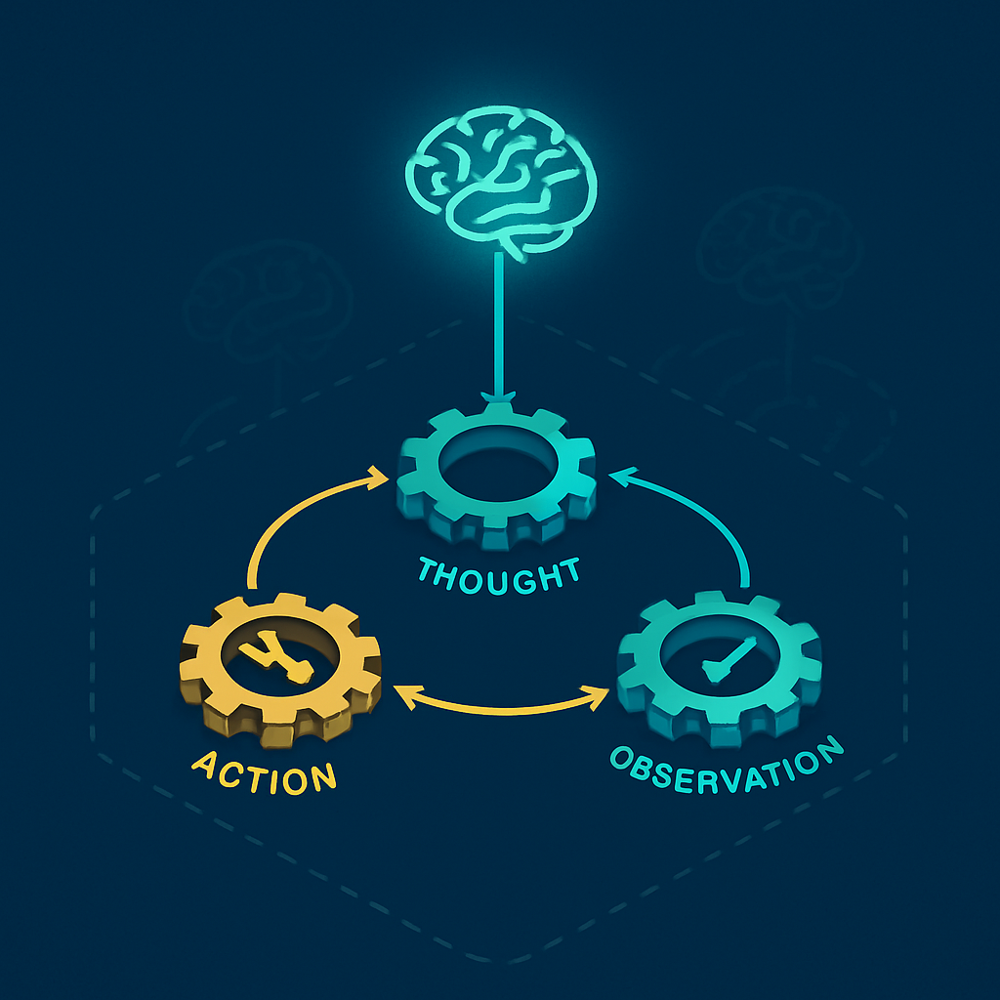

# Run: a execução interna do loop agêntico



O conceito anterior encerrou com uma promessa: o turn é o que o usuário vê, e o run é o que o sistema executa internamente. A distinção foi apresentada como solução para um diagnóstico impreciso — perda de contexto entre turns vs. perda de contexto dentro de um turn — mas a definição de run foi deixada em aberto. É hora de preenchê-la.

O run é **um único ciclo completo de raciocínio→ação→observação dentro de um turn**. Quando o agente recebe a mensagem do usuário e decide chamar uma ferramenta, isso constitui um run: o modelo raciocina, emite uma chamada de ferramenta, o sistema a executa, e o resultado é devolvido ao modelo. Se o modelo, ao ver o resultado, decide chamar outra ferramenta, isso é um segundo run. O turn só termina quando o modelo produz uma resposta sem nenhuma chamada de ferramenta — ou seja, quando decide que não precisa mais agir e pode responder ao usuário diretamente. Um turn, portanto, contém um ou mais runs. Em tarefas simples, um único run é suficiente. Em tarefas com encadeamento de tool calls, vários runs se sucedem dentro do mesmo turn antes de a resposta chegar ao usuário.

Esse padrão tem raízes no ReAct (Reasoning and Acting), um paradigma de agentes que formalizou a estrutura iterativa: o modelo alterna entre gerar um *pensamento* (raciocínio sobre o estado atual), tomar uma *ação* (chamar uma ferramenta), e observar o *resultado* (o retorno da ferramenta), repetindo até ter informação suficiente para responder. Cada iteração desse ciclo é um run. O ReAct não é uma implementação específica — é o padrão arquitetural que todos os frameworks de agentes (Haystack, LangGraph, OpenAI Agents SDK) seguem sob diferentes nomes e com diferentes detalhes de implementação.

```
TURN
│
├── RUN 1
│   ├── modelo raciocina: "preciso verificar o ticket no ClickUp"
│   ├── action: tool_call(get_ticket, ticket_id="CU-123")
│   └── observation: { status: "in_progress", assignee: "joao" }
│
├── RUN 2
│   ├── modelo raciocina: "preciso ver as notas do ticket"
│   ├── action: tool_call(get_ticket_comments, ticket_id="CU-123")
│   └── observation: [{ author: "maria", text: "aguardando aprovação" }]
│
└── RUN 3 (final)
    ├── modelo raciocina: "tenho tudo para responder"
    ├── response: "O ticket CU-123 está em progresso, aguardando aprovação da Maria."
    └── (sem tool call → turn encerra)
```

O que diferencia o run de um simples "ciclo do while" é que cada run é uma invocação completa ao modelo. O estado do raciocínio não persiste entre runs em memória de processo — o que persiste é a **janela de contexto**, que é incrementalmente expandida a cada run com o resultado do tool call anterior. No Run 2 do diagrama acima, o modelo não "lembra" o que pensou no Run 1 por nenhum mecanismo especial de memória; ele simplesmente tem acesso ao histórico da conversa dentro do turn, que inclui o pensamento do Run 1, a chamada de ferramenta, e o resultado. A continuidade entre runs dentro de um turn é garantida pela janela de contexto acumulada, não por estado em memória.

Isso tem uma consequência importante para o diagnóstico de bugs, e retoma exatamente a distinção que o primeiro conceito deste subcapítulo articulou. A tabela do conceito anterior mostrou dois cenários de perda de contexto — entre turns e dentro de um turn. O segundo cenário ("o resultado do primeiro tool call não está disponível para o segundo") é especificamente uma falha no nível do run: ou o resultado do Run 1 não foi adicionado à janela de contexto antes de chamar o modelo no Run 2, ou a janela de contexto foi descartada erroneamente entre runs. Ambos os casos são estruturalmente diferentes de "o agente não lembra o que o usuário disse há três turnos", que é uma falha de persistência de session.

No Haystack — o framework que o leitor já opera — o loop agêntico é implementado pelo componente `Agent` com suporte de `ToolInvoker`. O `Agent` itera internamente: chama o LLM, verifica se há tool calls na resposta, invoca as ferramentas via `ToolInvoker` se houver, e realimenta os resultados ao LLM para o próximo ciclo. O Haystack expõe isso como um pipeline com loops: a saída de um componente posterior pode ser roteada de volta a um componente anterior, e o pipeline mantém um contador de visitas por componente (`max_runs_per_component`, padrão 100) para evitar loops infinitos. Cada iteração desse ciclo interno no Haystack é um run no vocabulário deste livro. O framework não usa explicitamente o termo "run" para esse ciclo — ele fala em "loop iterations" — mas o conceito é idêntico.

A OpenAI Assistants API, por contraste, expõe o run como objeto de primeira classe. Quando você cria um run (via `POST /v1/threads/{thread_id}/runs`), o sistema executa o loop agêntico de forma assíncrona. O run pode passar por estados intermediários — `queued`, `in_progress`, `requires_action` — antes de atingir um estado terminal (`completed`, `failed`, `cancelled`, `expired`). O estado `requires_action` ocorre especificamente quando o modelo emitiu tool calls e está aguardando que o chamador execute as ferramentas e submeta os resultados; depois da submissão, o run retoma da onde parou. Cada "step" dentro de um run (um `message_creation` ou um `tool_calls`) é o equivalente a um ciclo de raciocínio→ação dentro do run. Essa granularidade de run steps é útil para observabilidade: permite ver não apenas o resultado final, mas cada passo intermediário que o modelo tomou.

```
OpenAI Assistants API — estados de um Run

  created ──→ queued ──→ in_progress ──→ requires_action ──┐
                                              ↑              │
                                              └──────────────┘
                                     (modelo emite tool call,
                                      chamador submete resultado,
                                      run retoma)
                              ↓ (sem mais tool calls)
                          completed
```

A distinção entre run e turn resolve um problema prático de instrumentação. Quando você adiciona observabilidade ao sistema — OpenTelemetry, logs estruturados, métricas — a granularidade correta para spans de raciocínio é o run, não o turn. Um span de turn cobre tudo do request ao response HTTP, incluindo I/O de banco e chamadas de rede para ferramentas externas. Esse span é útil para latência total, mas não revela quanto tempo o modelo gastou em cada ciclo de raciocínio, quantos tool calls foram necessários, ou qual ferramenta foi o gargalo. Spans de run, aninhados dentro do span de turn, respondem essas perguntas. O capítulo 12 vai detalhar esse modelo de rastreamento; por ora, o que importa é que a definição precisa de run como unidade de raciocínio→ação→observação é o que torna possível instrumentar em granularidade útil.

Há também uma implicação para os limites do Lambda que o capítulo 6 aprofundará. O timeout de 15 minutos por invocação Lambda é um constraint sobre o turn, não sobre o run individualmente. Mas o risco de estouro não vem de um único run demorado — vem do acúmulo. Cada run que chama uma ferramenta externa (Slack, ClickUp, MCP servers) adiciona latência de rede. Um turn com dez runs, cada um fazendo uma chamada HTTP de 2 segundos, já consome 20 segundos só em I/O de ferramentas, sem contar o tempo de inferência do modelo em cada ciclo. O diagnóstico correto de um timeout inesperado começa por saber quantos runs ocorreram dentro do turn que falhou — e esse dado só existe se o sistema instrumenta o conceito de run como unidade rastreável.

Por fim, vale fixar o que o run *não* é para evitar uma confusão que surgirá nos capítulos seguintes. O run não é uma invocação Lambda — essa é o turn. O run não é uma chamada ao modelo — cada run *inclui* uma chamada ao modelo, mas o run é o ciclo completo até o resultado da ferramenta ser processado. O run não é a ferramenta em si — `tool_call` é um evento dentro do run, não o run inteiro. E o run não persiste entre turns: quando um turn termina, o histórico de runs daquele turn fica registrado nos eventos da session (na forma de mensagens e tool call results), mas não como objetos de run separados com ciclo de vida próprio. O run é efêmero por design; o que sobrevive ao turn são seus artefatos — as mensagens e observações que foram adicionadas à session.

## Fontes utilizadas

- [How the agent loop works — Claude Code Docs](https://code.claude.com/docs/en/agent-sdk/agent-loop)
- [Understanding AI Agents through the Thought-Action-Observation Cycle — Hugging Face](https://huggingface.co/learn/agents-course/en/unit1/agent-steps-and-structure)
- [What Is the AI Agent Loop? The Core Architecture Behind Autonomous AI Systems — Oracle Developers Blog](https://blogs.oracle.com/developers/what-is-the-ai-agent-loop-the-core-architecture-behind-autonomous-ai-systems)
- [Agents — Haystack Documentation](https://docs.haystack.deepset.ai/docs/agents)
- [Pipeline Loops — Haystack Documentation](https://docs.haystack.deepset.ai/docs/pipeline-loops)
- [Runs — OpenAI API Reference](https://platform.openai.com/docs/api-reference/runs)
- [Run steps — OpenAI API Reference](https://platform.openai.com/docs/api-reference/run-steps)
- [From ReAct to Ralph Loop: A Continuous Iteration Paradigm for AI Agents — Alibaba Cloud Community](https://www.alibabacloud.com/blog/from-react-to-ralph-loop-a-continuous-iteration-paradigm-for-ai-agents_602799)
- [Rearchitecting Letta's Agent Loop: Lessons from ReAct, MemGPT, & Claude Code — Letta](https://www.letta.com/blog/letta-v1-agent)

---

**Próximo conceito** → [Thread: sequência linear de turns numa sessão](../05-thread-sequencia-linear-de-turns-numa-sessao/CONTENT.md)
