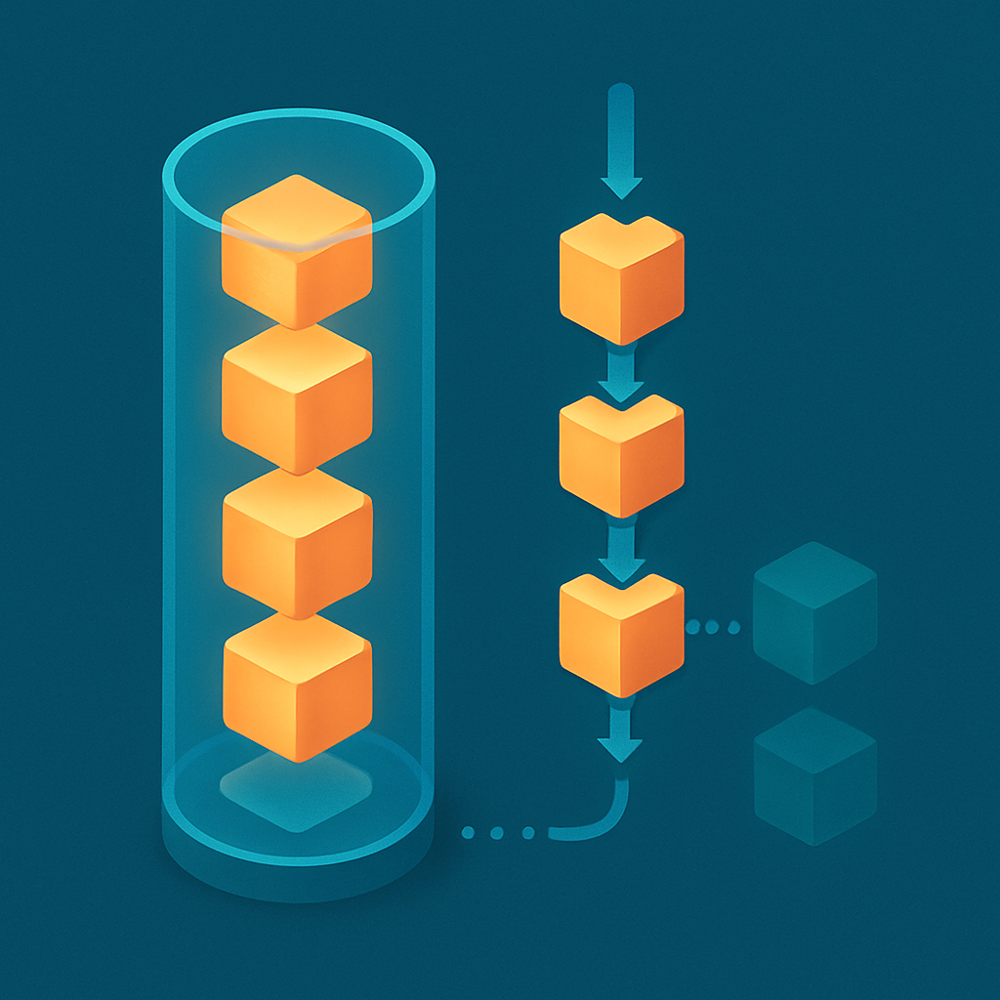

# Thread: sequência linear de turns numa sessão



O conceito anterior definiu o run como a unidade efêmera de raciocínio→ação→observação — o ciclo que se repete dentro de um turn até o modelo produzir uma resposta sem chamar mais ferramentas. Com session, turn e run no vocabulário, a hierarquia começa a tomar forma: a session é o container persistente; o turn é a unidade de interação vista do lado externo; o run é o ciclo interno dentro de um turn. Falta uma peça que conecta os turns entre si dentro de uma mesma session — e essa peça é a **thread**.

A thread é a **sequência linear e ordenada de turns dentro de uma session**. Ela responde a uma pergunta simples mas que o vocabulário anterior não endereçava explicitamente: em que ordem os turns ocorreram, e como essa ordem forma uma narrativa coerente de interação? Se a session é o container que persiste tudo, a thread é a estrutura que organiza o histórico como uma progressão linear — Turn 1 levou ao Turn 2, que levou ao Turn 3 — onde cada turno depende do estado deixado pelo anterior e contribui para o estado do próximo. É essa sequencialidade que dá ao agente a percepção de conversa contínua, não uma coleção desordenada de mensagens.

A distinção pode parecer sutil à primeira vista. Afinal, se a session já contém o histórico de todos os eventos, por que precisar do conceito separado de thread? A resposta fica clara quando se considera o que acontece em sistemas que suportam mais de uma thread por session. Imagine que o leitor está usando o agente para gerenciar um projeto no ClickUp. Numa conversa, ele pediu ao agente para criar um ticket e aguardar aprovação (Thread 1). Mais tarde, num contexto completamente diferente — talvez num device diferente, talvez em paralelo — ele abriu uma segunda conversa para discutir o orçamento do projeto (Thread 2). Ambas as threads pertencem à mesma session do usuário (mesma identidade, mesmo `user_id`), mas são linhas narrativas separadas com histórico independente. Tratar isso como uma única thread mesclada destruiria a coerência de ambas as conversas.

```
SESSION (user_id: "joao")
│
├── THREAD 1 (thread_id: "abc")
│   ├── Turn 1: "Crie um ticket para revisar a proposta"
│   ├── Turn 2: "Qual o status do ticket CU-456?"
│   └── Turn 3: "Notifique a Maria quando ele for aprovado"
│
└── THREAD 2 (thread_id: "xyz")
    ├── Turn 1: "Quanto foi gasto no Q1?"
    └── Turn 2: "Compare com o Q1 do ano passado"
```

A relação é clara no diagrama: a session é o container externo que identifica o usuário e agrega todo o estado persistente; as threads são as linhas narrativas dentro dela. Em sistemas simples — onde há exatamente uma thread por session — thread e session colidem funcionalmente e a distinção parece desnecessária. O LangGraph é um exemplo disso: ele usa o termo "thread" onde este livro usa "session", porque assume uma thread por conversa e não expõe o conceito de session como camada separada. A OpenAI Assistants API faz o inverso: usa "thread" para o que este livro chama de thread ou session indistintamente, pois o modelo dela não distingue formalmente os dois. É exatamente essa polissemia — que o primeiro conceito deste subcapítulo alertou — que justifica ter nomes precisos próprios ao invés de importar os nomes de cada framework.

O que torna uma thread uma thread — e não apenas uma lista de mensagens — é precisamente a propriedade de sequencialidade linear e a capacidade de ser ramificada. No modelo mais simples, uma thread é uma lista imutável e append-only de turns: Turn 1, Turn 2, ..., Turn N. Nenhum turn modifica os anteriores; apenas acrescenta ao final. Essa imutabilidade garante que o histórico é auditável — se algo der errado no Turn 7, é possível reconstruir exatamente o estado da session ao início do Turn 7 e reexecutar com logging detalhado. O capítulo 12 vai usar isso para construir o mecanismo de replay de runs.

A ramificação é o cenário mais avançado. Quando um sistema permite que o usuário "volte" a um ponto anterior da conversa e tome um caminho diferente — como o "edit message" do ChatGPT que cria um fork a partir de uma mensagem anterior — o que está acontecendo é que a thread se bifurca: a sequência linear original (Turn 1 → Turn 2 → Turn 3) é preservada como histórico imutável, e uma nova thread surge a partir do ponto de bifurcação (Turn 1 → Turn 2 → Turn 3' onde Turn 3' é a versão alternativa). Ambas as threads pertencem à mesma session; a session agrega o grafo completo de threads, não apenas uma sequência linear. O leitor que já usou LangGraph com checkpoints já trabalhou com esse mecanismo, embora o LangGraph o exponha como "graph nodes" e "snapshots" em vez de "threads e forks".

```
SESSION
│
└── THREAD PRINCIPAL
    ├── Turn 1: "Qual o status do ticket?"
    ├── Turn 2: "Adicione o comentário X"
    ├── Turn 3 (original): "Notifique a equipe"     ← ponto de fork
    │   └── Turn 4, 5, 6 ...                          (thread principal continua)
    │
    └── THREAD FORK (a partir do Turn 2)
        ├── Turn 3': "Não, cancele o ticket"          (alternativa ao Turn 3 original)
        └── Turn 4', 5' ...                           (thread fork continua)
```

Para o sistema que o leitor opera hoje — API Gateway + Lambda + MongoDB — a thread existe implicitamente mas não está estruturada como entidade própria. O MongoDB guarda mensagens com um `session_id` ou `conversation_id`, e a "thread" é simplesmente a consulta ordenada por timestamp desse identificador. Funciona para o caso de uma thread por conversa, mas não escala para múltiplas threads por session nem para ramificações. O `thread_id` como campo explícito, separado do `session_id`, é o que permitiria suportar esses casos sem reescrever o modelo de dados.

A distinção entre `session_id` e `thread_id` no documento de persistência é direta: a session tem um `session_id` que identifica o container de longa duração (usuário, metadados, estado global do agente); a thread tem um `thread_id` que identifica uma linha narrativa específica dentro da session, com sua própria sequência de turns. Num sistema sem ramificação e com uma thread por session, os dois IDs podem coexistir com o mesmo valor — mas são campos semanticamente diferentes, e isso importa quando o modelo evolui.

```python
# Documento de session no MongoDB
{
  "session_id": "sess_abc123",
  "user_id": "joao",
  "created_at": "2026-04-23T10:00:00Z",
  "status": "active",
  "state": { "current_task_id": "CU-456", "pending_approval": True },
  "threads": [
    {
      "thread_id": "thr_xyz001",
      "created_at": "2026-04-23T10:00:00Z",
      "turns": [
        { "turn_id": "turn_1", "user_msg": "...", "agent_response": "..." },
        { "turn_id": "turn_2", "user_msg": "...", "agent_response": "..." }
      ]
    }
    # threads adicionais seriam appended aqui
  ]
}
```

Esse esquema deixa explícito que a session é o envelope que contém threads (possivelmente mais de uma), e cada thread é a sequência linear de turns. O `state` do agente vive na session, não na thread, porque ele agrega informações de todas as threads — é o estado global do agente naquela session. Os `turns` dentro de uma thread são os eventos de interação ordenados cronologicamente.

Há uma implicação para a janela de contexto que o capítulo 2 vai aprofundar, mas vale mencionar aqui: quando o agente monta a janela de contexto para uma inferência, qual thread ele usa? Em sistemas com múltiplas threads, a resposta é: a thread ativa no momento do turn corrente. O agente não injeta automaticamente o histórico de todas as threads na janela de contexto — isso destruiria o budget de tokens. A thread ativa é o escopo de contexto relevante para aquele turn; se o usuário quiser cruzar referências entre threads, ele precisa solicitar explicitamente, e o agente pode trazer seletivamente eventos de outras threads como contexto adicional.

| Conceito | O que é | Escopo de vida | Chave de identidade |
|---|---|---|---|
| **Session** | Container de estado persistente do usuário | Longa duração (dias, semanas) | `session_id` |
| **Thread** | Sequência linear de turns numa session | Duração de uma linha narrativa | `thread_id` |
| **Turn** | Um ciclo usuário→agente completo | Uma invocação HTTP (no sistema do leitor) | `turn_id` ou timestamp |
| **Run** | Um ciclo raciocínio→ação→observação dentro de um turn | Efêmero, não persiste após o turn | sem ID persistido |

A thread é, portanto, a estrutura que organiza o que session armazena. Sem ela, a session é um balde de eventos; com ela, a session tem estrutura narrativa. Em sistemas que não suportam ramificações — o que inclui a maioria dos casos de uso reais, incluindo o do leitor hoje — a thread é uma formalidade: existe uma por session, e thread_id e session_id têm o mesmo valor efetivamente. Mas quando o sistema precisar escalar para múltiplas threads, o campo já está lá, semanticamente correto, sem precisar migrar o modelo de dados. Essa é a diferença entre projetar um vocabulário que antecipa a evolução e um que força uma reescrita.

O próximo conceito — Session vs Thread: a distinção que mais confunde — vai aprofundar exatamente por que essa separação gera mais confusão do que qualquer outro par de termos neste vocabulário, e como os frameworks existentes contribuem para essa confusão ao usar os dois termos intercambiavelmente.

## Fontes utilizadas

- [Threads, Runs, and Messages in the Foundry Agent Service — Microsoft Learn](https://learn.microsoft.com/en-us/azure/foundry-classic/agents/concepts/threads-runs-messages)
- [Conversation Management at Scale — Building an Agentic System](https://gerred.github.io/building-an-agentic-system/second-edition/part-ii-core-systems/chapter-4-thread-management-at-scale.html)
- [Multi-turn Conversations with Agents: Building Context Across Dialogues — Medium](https://medium.com/@sainitesh/multi-turn-conversations-with-agents-building-context-across-dialogues-f0d9f14b8f64)
- [Mastering Persistence in LangGraph: Checkpoints, Threads, and Beyond — Medium](https://medium.com/@vinodkrane/mastering-persistence-in-langgraph-checkpoints-threads-and-beyond-21e412aaed60)
- [An In-Depth Guide to Threads in OpenAI Assistants API — DZone](https://dzone.com/articles/openai-assistants-api-threads-guide)
- [Assistants API deep dive — OpenAI](https://developers.openai.com/api/docs/assistants/deep-dive)
- [Building an Agent Architecture: How Sessions, State, Events, Context, and Runner Work Together — Medium](https://medium.com/@aktooall/building-an-agent-architecture-how-sessions-state-events-context-and-runner-work-together-d8dbdb64d52b)

---

**Próximo conceito** → [Session vs Thread: a distinção que mais confunde](../06-session-vs-thread-a-distincao-que-mais-confunde/CONTENT.md)
