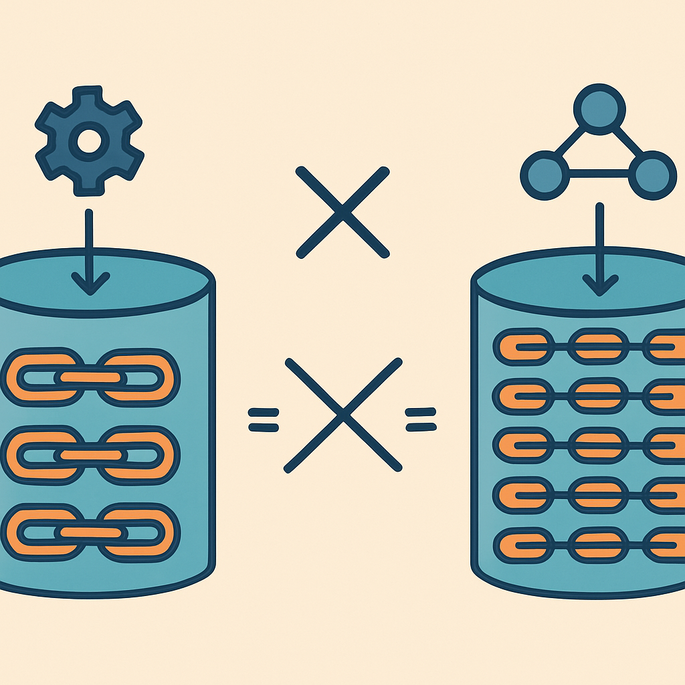

# Session vs Thread: a distinção que mais confunde



O conceito anterior encerrou com uma observação deliberadamente deixada em aberto: em sistemas que não suportam ramificações, thread e session "colidem funcionalmente" — e frameworks distintos exploram exatamente essa colisão ao usar os dois termos como sinônimos. O LangGraph usa "thread" onde este livro usa "session". A OpenAI Assistants API usa "thread" para cobrir o que aqui se chama de thread e, dependendo do contexto, também de session. O Microsoft Semantic Kernel tem uma classe chamada `AgentThread` que, internamente, pode mapear para uma session do AWS Bedrock ou para um thread da Azure AI. É essa polissemia que torna o par session/thread o mais confuso de todo o vocabulário deste livro — não porque os conceitos sejam difíceis, mas porque os frameworks de maior adoção fizeram escolhas de nomenclatura diferentes e incompatíveis entre si.

O ponto de partida para fixar a distinção é retomar o que já foi definido com precisão. A session é o container de longa duração que persiste o estado do agente para um determinado usuário ou contexto: ela armazena metadados de identidade, o estado estruturado do agente (tarefas ativas, preferências, dados de domínio) e a coleção de threads que compõem o histórico de interações. A thread é a sequência linear e ordenada de turns dentro dessa session — uma linha narrativa específica, com `thread_id` próprio, que pode ser ramificada ou coexistir com outras threads dentro da mesma session. A relação entre os dois é de contenção: a session contém threads; uma thread não contém sessions.

O problema começa porque, na maioria dos casos de uso reais, há exatamente uma thread por session. Quando essa é a premissa implícita do framework, a camada da session desaparece da API pública — o framework a collapsa sobre a thread. O LangGraph é o exemplo mais direto: cada conversa é identificada por um `thread_id`, e não existe um `session_id` separado na API. O estado que este livro chama de "estado da session" — os campos que persistem entre threads, como intenções ativas e contexto de domínio — vive no objeto de estado da thread (`AgentState`) e é gerenciado pelo checkpointer. Se o leitor precisar de múltiplas threads por usuário no LangGraph, precisa implementar essa lógica manualmente, usando o `thread_id` como identificador de conversa e adicionando um campo `user_id` ou namespace de memória de longo prazo separado via `MemorySaver` ou `langgraph.store`.

```
LangGraph (terminologia do framework):

  "thread" no LangGraph
  ├── = session deste livro (container de estado por usuário)
  └── = thread deste livro (sequência linear de turns)
       (os dois colapsados num único conceito)

  Para múltiplos "threads" por usuário:
  ├── thread_id: "conv_abc"   (Thread 1 deste livro)
  ├── thread_id: "conv_xyz"   (Thread 2 deste livro)
  └── user_id como campo no estado  ← sem session_id explícito na API
```

A OpenAI Assistants API faz uma escolha parecida, mas com uma camada a mais. O que a API chama de "thread" é, na prática, o equivalente ao que este livro chama de thread: uma sequência linear de mensagens com seu próprio `thread_id`, que pode acumular qualquer número de turns. A documentação oficial diz explicitamente "one thread per user" como padrão recomendado, e descreve a thread como "a single, continuous chat session". Nessa frase, a palavra "session" aparece não como conceito técnico separado, mas como sinônimo informal de "conversa contínua". Não existe, na Assistants API, uma entidade chamada `Session` com campo de estado de agente — o estado persistido além do histórico de mensagens precisa ser gerenciado externamente, geralmente via ferramentas ou pelo próprio aplicativo chamador. A thread da OpenAI, portanto, cobre o papel da thread deste livro mas não cobre o papel da session — e a ausência desse segundo conceito não é mencionada, apenas está implícita na ausência de campos como `agent_state` ou `active_intents` no objeto de thread.

```
OpenAI Assistants API:

  "thread" na OpenAI API
  ├── = thread deste livro (sequência linear de turns / mensagens)
  └── ≠ session deste livro (estado do agente, metadados de identidade)
       (a session não existe como entidade; seu conteúdo vai para
        ferramentas externas ou para o estado do aplicativo)

  "run" na OpenAI API
  ├── = run deste livro (execução do loop agêntico dentro de um turn)
  └── exposto como objeto assíncrono com estados: queued → in_progress
       → requires_action → completed
```

O Semantic Kernel vai em outra direção. Ele introduz `AgentThread` como abstração de primeiro nível — não é sinônimo de session nem de thread especificamente; é uma camada de indireção que abstrai diferentes backends. Um `BedrockAgentThread` encapsula uma "session" do AWS Bedrock (o que a AWS chama de session, que é mais próximo do que este livro chama de thread). Um `AzureAIAgentThread` encapsula uma thread da Azure AI Foundry. Na terminologia do Semantic Kernel, `AgentThread` é o conceito unificador que mapeia para whatever o backend subjacente usa — e o que o backend chama pode ser "session" (Bedrock) ou "thread" (Azure AI), mas ambos são expostos como `AgentThread` na API do SDK. A session deste livro — o container de estado persistente por usuário que transcende conversas individuais — não aparece como conceito explícito no Semantic Kernel; ela é responsabilidade do desenvolvedor implementar fora do SDK.

Essa divergência entre frameworks não é mero detalhe cosmético. Ela tem consequências práticas na hora de portar código, comparar arquiteturas ou ler documentação. Quando um engenheiro que veio do LangGraph diz "cada thread tem seu próprio checkpointer", ele está falando de uma entidade que este livro chamaria de session. Quando outro que veio da OpenAI diz "criamos uma thread por usuário para persistir o histórico", ele está descrevendo o que este livro chama de thread (e notando a ausência de session). Se os dois engenheiros entram numa revisão de arquitetura sem essa tradução explícita, a discussão sobre "devo criar uma thread por conversa ou por usuário?" vai parecer um desacordo sobre arquitetura quando na verdade é um desacordo sobre terminologia.

| Framework | Termo usado | O que cobre neste vocabulário | O que está ausente |
|---|---|---|---|
| **LangGraph** | `thread_id` | Session + Thread (colapsados) | Session como entidade separada |
| **OpenAI Assistants API** | `Thread` | Thread (sequência de mensagens) | Session (estado do agente, metadados) |
| **Semantic Kernel** | `AgentThread` | Abstração sobre Thread (ou Session do backend) | Nenhum conceito unificado de Session acima |
| **AWS Bedrock** | `Session` | Próximo de Thread (sequência de turns com `session_id`) | Session no sentido de container de estado multi-thread |
| **Este livro** | `Session` + `Thread` | Session: container persistente / Thread: linha narrativa de turns | — (os dois explicitamente separados) |

Para o leitor que opera a stack Lambda + MongoDB, a confusão se materializa de forma diferente. O `conversation_id` ou `session_id` que hoje existe no MongoDB cumpre o papel de identificar a conversa — o que este livro chama de thread. Não há, no modelo atual, nenhum objeto estruturado que corresponda à session: não existe um documento de session com `agent_state`, `active_intents` ou `created_at` separado do histórico de mensagens. Quando o subcapítulo de diagnóstico nomear as lacunas estruturais do sistema, essa ausência vai aparecer como item explícito. Por ora, o ponto é que o `session_id` atual no MongoDB está nomeado como session mas funcionando como thread — e entender essa diferença semântica é o que permite decidir, ao redesenhar o modelo de dados, quais campos pertencem ao documento de thread e quais pertencem a um documento de session separado.

A confusão se aprofunda porque os dois termos são usados intercambiavelmente até mesmo dentro de um mesmo framework ao longo do tempo. A documentação do LangGraph, por exemplo, usa "session" em textos de blog e "thread" na API — o mesmo conceito, dois nomes, dependendo de quem escreveu e quando. A lição não é escolher o nome "certo" de alguma autoridade externa; é fixar um vocabulário interno preciso e manter a disciplina de traduzir ao interagir com documentação e código de terceiros. O vocabulário deste livro usa "session" para o container de estado persistente de longa duração e "thread" para a sequência linear de turns — e esses conceitos permanecem estáveis independente do que cada framework decide chamar.

O mecanismo pelo qual a confusão leva a bugs reais é específico e vale articular. O bug clássico é o seguinte: o desenvolvedor cria um `thread_id` por usuário (seguindo o padrão recomendado pelo framework) e, quando o usuário inicia uma segunda conversa em outro dispositivo ou contexto, reutiliza o mesmo `thread_id` porque o código "de session" usa o `user_id` como chave. O resultado é que o histórico das duas conversas é misturado numa única sequência de turns — e o agente injeta na janela de contexto mensagens que pertencem a uma conversa diferente, produzindo respostas confusas ou contraditórias. A causa raiz é a ausência de um `thread_id` separado do `session_id`: como o framework não distinguia os dois, o código também não distinguiu, e o bug só aparece em produção quando usuários reais abrem múltiplas conversas.

```python
# Bug clássico de session/thread colapsados

# Código que parece correto
def get_or_create_thread(user_id: str) -> str:
    existing = db.threads.find_one({"user_id": user_id})
    if existing:
        return existing["thread_id"]
    thread_id = create_new_thread()
    db.threads.insert_one({"user_id": user_id, "thread_id": thread_id})
    return thread_id

# Problema: um thread_id por usuário → qualquer nova conversa
# acumula no mesmo thread → contexto misturado

# Versão correta com session/thread separados
def get_or_create_thread(session_id: str, context: str = "default") -> str:
    # session_id identifica o usuário; thread_id identifica a conversa
    thread_id = generate_thread_id()
    db.threads.insert_one({
        "session_id": session_id,   # container do usuário
        "thread_id": thread_id,     # linha narrativa específica
        "context": context,
        "created_at": datetime.utcnow()
    })
    return thread_id
```

O segundo bug — menos óbvio mas igualmente perigoso — ocorre quando o desenvolvedor trata o `thread_id` do framework como `session_id` para fins de autorização. Se a validação de segurança verifica apenas se `thread_id` pertence ao `user_id` autenticado, mas um usuário pode ter múltiplos `thread_id`s, a lógica de autorização precisa checar a relação `thread_id → session_id → user_id`, não `thread_id → user_id` diretamente. Sem a distinção explícita no modelo de dados, esse caminho de autorização fica achatado e propenso a falhas quando o modelo escala para múltiplas threads por usuário.

A fixação correta da distinção passa por um exercício simples: para qualquer framework com que o leitor vá interagir, mapear o termo do framework para o vocabulário deste livro antes de escrever código. A tabela acima serve como ponto de partida. Quando a documentação diz "crie uma thread por usuário", traduzir: isso é uma session ou uma thread? Se o framework não tem conceito de múltiplas threads por usuário, a "thread" dele é a session deste livro. Se tem, é a thread. Quando a documentação diz "o estado persiste na thread", traduzir: qual estado? Se é apenas histórico de mensagens, é thread. Se inclui estado do agente e metadados de identidade, é session. Essa tradução explícita, feita uma vez ao adotar cada ferramenta, elimina a classe inteira de bugs que nasce da ambiguidade terminológica.

## Fontes utilizadas

- [OpenAI Assistants API deep dive — OpenAI Developers](https://developers.openai.com/api/docs/assistants/deep-dive)
- [A practical guide to the OpenAI Threads API — eesel AI](https://www.eesel.ai/blog/openai-threads-api)
- [An In-Depth Guide to Threads in OpenAI Assistants API — DZone](https://dzone.com/articles/openai-assistants-api-threads-guide)
- [Mastering Persistence in LangGraph: Checkpoints, Threads, and Beyond — Medium](https://medium.com/@vinodkrane/mastering-persistence-in-langgraph-checkpoints-threads-and-beyond-21e412aaed60)
- [LangGraph State Management: How LangGraph Manages State for Multi-Agent Workflows — Medium](https://medium.com/@bharatraj1918/langgraph-state-management-part-1-how-langgraph-manages-state-for-multi-agent-workflows-da64d352c43b)
- [AgentThread Class — Microsoft Semantic Kernel (Python) — Microsoft Learn](https://learn.microsoft.com/en-us/python/api/semantic-kernel/semantic_kernel.agents.agent.agentthread?view=semantic-kernel-python)
- [Semantic Kernel Agent Architecture — Microsoft Learn](https://learn.microsoft.com/en-us/semantic-kernel/frameworks/agent/agent-architecture)
- [Exploring the Semantic Kernel Amazon Bedrock Agent — Microsoft Learn](https://learn.microsoft.com/en-us/semantic-kernel/frameworks/agent/agent-types/bedrock-agent)
- [Characterizing Faults in Agentic AI: A Taxonomy of Types, Symptoms, and Root Causes — arXiv](https://arxiv.org/html/2603.06847v1)
- [The State of AI Agent Frameworks: Comparing LangGraph, OpenAI Agent SDK, Google ADK — Medium](https://medium.com/@roberto.g.infante/the-state-of-ai-agent-frameworks-comparing-langgraph-openai-agent-sdk-google-adk-and-aws-d3e52a497720)

---

**Próximo conceito** → [Mapeamento para o código existente](../07-mapeamento-para-o-codigo-existente/CONTENT.md)
