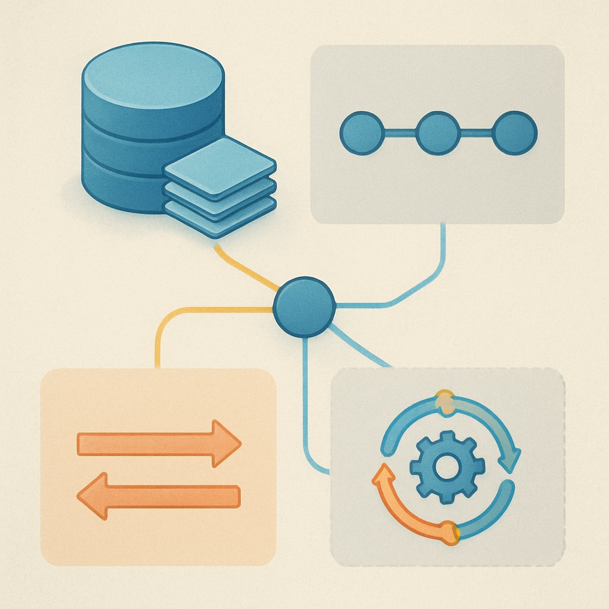

# Mapeamento para o código existente



O conceito anterior terminou com um exercício de tradução: para qualquer framework com que o leitor interagir, mapear o termo do framework para o vocabulário deste livro antes de escrever código. Este conceito aplica exatamente esse exercício, mas ao código que o leitor já tem rodando — a stack API Gateway + Lambda + MongoDB + Haystack. Ao final, o leitor será capaz de apontar, nesse código real, onde cada um dos quatro termos existe como entidade estruturada, onde está implícito mas sem representação explícita, e onde está simplesmente ausente. Essa auditoria é o pré-requisito direto do subcapítulo de diagnóstico que fecha este capítulo.

A natureza da stack é importante de entender antes do mapeamento. O Lambda é stateless por design — cada invocação começa com estado de processo zerado, sem variáveis globais persistentes entre chamadas (exceto conexões de banco reutilizadas pelo warm start, que é um detalhe de otimização, não de estado de aplicação). O MongoDB é externo ao Lambda e persiste dados entre invocações, portanto é onde qualquer estado que sobrevive entre turns precisa residir. O Haystack roda inteiramente dentro de uma invocação Lambda — ele cria e destrói seus objetos de estado (`State`, histórico de mensagens, tool results) dentro do ciclo de vida de um único request. A API Gateway é o ponto de entrada HTTP que delimita o que vem de fora e o que vai para dentro.

Com isso, o mapeamento começa pelo conceito mais concreto: o **turn**. Na stack existente, o turn tem fronteiras absolutamente precisas — é cada invocação do handler Lambda. O `POST /chat` chega pela API Gateway, dispara o handler, o handler executa e retorna a resposta. Um request, uma resposta, um turno. Não há ambiguidade: a invocação Lambda é o turn. O que o conceito de turn exige — carregar session no início, persistir session no fim, entregar resposta ao usuário — mapeia diretamente para o padrão natural de um handler Lambda:

```python
def handler(event, context):
    payload = json.loads(event["body"])
    session_id = payload.get("session_id")          # identificador do turno

    # INÍCIO DO TURN: carrega estado persistido
    history = mongo.get_messages(session_id)         # histórico de mensagens do MongoDB

    # EXECUÇÃO INTERNA: runs, tool calls, raciocínio
    response = haystack_agent.run(                   # o loop agêntico do Haystack
        messages=history + [new_message],
        ...
    )

    # FIM DO TURN: persiste estado atualizado
    mongo.append_messages(session_id, new_messages)  # salva novos eventos no MongoDB

    return {"session_id": session_id, "response": response_text}
```

O turn existe e está bem delimitado. O `session_id` no payload é o que conecta um turn ao próximo — sem ele, o handler não sabe qual histórico carregar, e cada invocação começa do zero. Se o leitor já tem esse campo no payload e faz esse carregamento, o conceito de turn está implementado corretamente na stack.

O **run** é onde o Haystack entra em cena como a entidade que implementa o conceito — mas sem expô-lo com esse nome. Quando o código chama `agent.run(messages=...)` ou executa o pipeline Haystack, o framework inicia seu loop interno: chama o modelo (Gemini via Vertex AI), verifica se a resposta contém tool calls, invoca o `ToolInvoker` para executar as ferramentas encontradas (Slack, ClickUp, MCP), alimenta os resultados de volta ao modelo no próximo ciclo, e repete até que o modelo responda sem chamar ferramentas — ou até que `max_runs_per_component` seja atingido (padrão: 100 iterações por componente). Cada iteração desse ciclo interno é um run no vocabulário deste livro.

O Haystack não expõe o run como objeto de primeira classe. Não existe um `run_id` gerado por iteração, não há API para inspecionar "o run 2 de 5 deste turn". O que existe é o objeto `State` — um container que o framework mantém em memória durante a execução do `agent.run()` — que acumula mensagens e resultados de ferramentas à medida que os ciclos se sucedem. O `State` é o mecanismo que garante que o resultado do Run 1 esteja disponível para o modelo no Run 2: as mensagens e os `ToolCallResult` gerados por cada ciclo são adicionados ao `State.messages`, e a janela de contexto montada para o próximo ciclo inclui esse histórico acumulado. Quando a execução do agente termina, o `State` é descartado — ele é efêmero, vive apenas dentro do turn.

```
INVOCAÇÃO LAMBDA (= TURN)
│
└── haystack_agent.run(messages=history)    ← State criado aqui
    │
    ├── CICLO 1 (= RUN 1)
    │   ├── LLM: "preciso verificar o ClickUp"
    │   ├── ToolInvoker: executa get_task(task_id)
    │   └── State.messages += [tool_call, tool_result]
    │
    ├── CICLO 2 (= RUN 2)
    │   ├── LLM: "preciso ver os comentários"
    │   ├── ToolInvoker: executa get_comments(task_id)
    │   └── State.messages += [tool_call, tool_result]
    │
    └── CICLO 3 (= RUN 3, terminal)
        ├── LLM: resposta final (sem tool calls)
        └── State descartado após agent.run() retornar
```

O run existe como comportamento — cada iteração do loop Haystack é um run — mas não existe como entidade estruturada com ID, timestamp de início e fim, ou rastreabilidade. Se o sistema instrumentar o loop Haystack para registrar cada chamada ao modelo com metadados de entrada e saída, os runs se tornam observáveis; sem isso, eles são caixas-pretas dentro do turn.

O mapeamento da **thread** é onde a stack atual começa a mostrar lacunas. O que o MongoDB guarda hoje — uma coleção de mensagens identificadas por um campo `session_id` ou `conversation_id` — funciona como thread no vocabulário deste livro: é a sequência linear e ordenada de eventos que compõem uma linha narrativa. A thread existe implicitamente como consulta MongoDB (`db.messages.find({"conversation_id": id}).sort("timestamp")`) mas não existe como entidade de primeira classe com `thread_id` próprio, `created_at`, ou relação explícita com uma session pai.

Isso tem uma consequência direta: o sistema suporta uma thread por identidade, e a identidade de thread é colapsada sobre a identidade da conversa. Se o campo que identifica as mensagens no MongoDB se chama `session_id`, ele está nomeado como session mas funcionando como thread — exatamente o bug de nomenclatura que o conceito anterior descreveu. A diferença não é apenas semântica: quando o leitor precisar suportar um usuário com duas conversas paralelas — digamos, um contexto de trabalho e um contexto pessoal com o mesmo agente — o modelo atual não tem estrutura para isso sem remodelar o schema. Com um `thread_id` explícito separado do identificador do usuário, essa extensão seria trivial.

| Conceito | Como existe na stack atual | O que está faltando |
|---|---|---|
| **Turn** | Invocação Lambda — fronteira precisa e implementada | Nenhuma lacuna estrutural; o campo `session_id` no payload é o elo |
| **Run** | Ciclos internos do Haystack — existem como comportamento | `run_id`, timestamps por ciclo, rastreabilidade; o run não é objeto |
| **Thread** | Consulta MongoDB por `conversation_id` — existe implicitamente | `thread_id` como campo explícito separado do identificador de usuário |
| **Session** | Ausente como entidade estruturada | Documento de session com `session_id`, `user_id`, `state`, `created_at`, `status` |

A **session** é a lacuna mais profunda. No vocabulário preciso que este subcapítulo construiu: session é o container de estado de longa duração com metadados de identidade, histórico de eventos e estado estruturado do agente. Nenhum desses três componentes existe como objeto coeso no MongoDB hoje. O que existe é o histórico de mensagens — o segundo componente — identificado por algum campo de conversa. Os metadados de identidade (quem é o usuário, quando a conversa começou, qual o status atual) não existem como documento separado. O estado estruturado do agente — o `state` com `current_task_id`, `pending_approval`, `active_intents` — não existe em lugar nenhum; ele se perde ao final de cada invocação Lambda junto com o `State` do Haystack.

O impacto dessa ausência é exatamente o colapso stateless descrito nos subcapítulos anteriores. O agente não tem como saber, no Turn 5, que no Turn 2 ele criou um ticket e estava aguardando aprovação — porque esse estado nunca foi persistido. Ele tem acesso às mensagens de texto que o usuário enviou e às respostas que ele deu, mas a intenção estruturada — o `pending_task` — não é uma mensagem; é estado do agente que precisa residir no documento de session. Sem esse documento, o agente injeta todo o histórico de chat na janela de contexto e espera que o modelo infira o estado a partir do texto — uma abordagem frágil que falha sob compactação, sob histórico longo, ou quando o estado relevante nunca foi expresso explicitamente em linguagem natural.

A ausência de session como entidade também significa que não há ciclo de vida explícito. Não há como marcar uma conversa como "suspensa" (aguardando input externo), "retomando" (o usuário voltou depois de horas), ou "expirada" (timeout sem atividade). O MongoDB pode ter um TTL index sobre os documentos de mensagem, mas isso não é o mesmo que um campo `status` na session que o sistema consulta antes de processar um turn. Sem esse campo, o sistema não consegue rejeitar corretamente um turn chegando numa conversa que já expirou, nem retomar de um ponto de checkpoint quando a sessão é reativada.

O diagnóstico completo, em termos de onde cada conceito se situa no código existente, é:

- Turn: **presente e correto** — invocação Lambda com `session_id` no payload.
- Run: **presente como comportamento, ausente como entidade** — o loop Haystack implementa o padrão, mas não há objeto de run rastreável.
- Thread: **presente implicitamente, ausente estruturalmente** — o `conversation_id` no MongoDB cumpre o papel, mas sem `thread_id` explícito nem relação com session pai.
- Session: **ausente** — não existe documento de session com `state`, `status`, `user_id` e `created_at` separados do histórico de mensagens.

Essa auditoria transforma o que antes era uma sensação vaga ("algo está errado com o estado do agente") num inventário técnico preciso: dois conceitos implementados com diferentes graus de completude, um implícito precisando de estruturação, e um ausente completamente. É exatamente esse tipo de diagnóstico que os subcapítulos seguintes vão converter em decisões de design — não uma lista de bugs, mas um mapa de onde o sistema está e o que precisaria mudar para avançar no espectro stateless→stateful.

## Fontes utilizadas

- [Agent — Haystack Documentation](https://docs.haystack.deepset.ai/docs/agent)
- [State — Haystack Documentation](https://docs.haystack.deepset.ai/docs/state)
- [Pipeline Loops — Haystack Documentation](https://docs.haystack.deepset.ai/docs/pipeline-loops)
- [Build a Tool-Calling Agent — Haystack](https://haystack.deepset.ai/tutorials/43_building_a_tool_calling_agent)
- [Good Listener: How Memory Enables Conversational Agents — Haystack](https://haystack.deepset.ai/blog/memory-conversational-agents)
- [Best schema design for storing chatbot conversations in MongoDB? — MongoDB Community](https://www.mongodb.com/community/forums/t/best-schema-design-for-storing-chatbot-conversations-in-mongodb/322798)
- [Effectively building AI agents on AWS Serverless — AWS Blog](https://aws.amazon.com/blogs/compute/effectively-building-ai-agents-on-aws-serverless/)
- [Store and retrieve conversation history and context with session management APIs — Amazon Bedrock](https://docs.aws.amazon.com/bedrock/latest/userguide/sessions.html)

---

**Próximo subcapítulo** → [O Espectro Stateless→Stateful](../../04-o-espectro-stateless-stateful/CONTENT.md)
