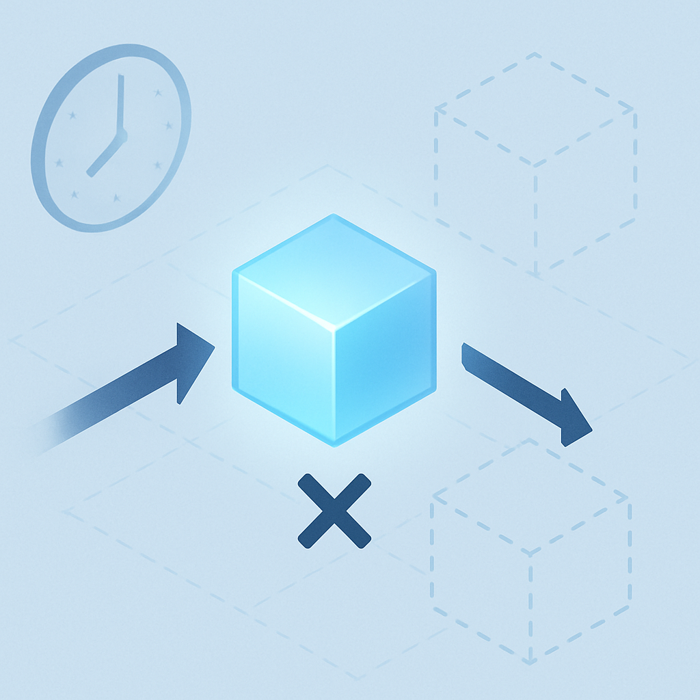

# O Polo Stateless Puro



O espectro stateless→stateful começa num polo que não é um defeito de design — é uma escolha deliberada com vantagens reais. Para entender por que o padrão atual do leitor (Lambda + MongoDB) ainda não escapa completamente dessa posição, é preciso primeiro entender o que ela é, o que ela garante mecanicamente e onde exatamente o teto é batido.

O polo stateless puro é a posição onde uma função processa cada invocação como se fosse a primeira da sua existência. No contexto da AWS, isso significa um Lambda que recebe um evento, executa, retorna uma resposta e, para todos os efeitos do seu raciocínio interno, desaparece. Não há escrita em banco externo, não há cache em memória compartilhada, não há arquivo em `/tmp` que a próxima invocação assume como disponível. O contrato com a infraestrutura é: tudo que você precisa está no payload de entrada; tudo que você precisa preservar está na saída.

A mecânica por baixo disso é precisa. O runtime do Lambda mantém execution environments — contêineres isolados que hospedam uma instância da função. Quando uma requisição chega, o serviço pode reutilizar um ambiente "morno" (warm start) ou criar um novo (cold start). O que distingue o polo stateless puro de outras posições não é o fato de os ambientes serem descartados — é o fato de que o código nunca escreve estado persistente em lugar nenhum. Se o ambiente é reaproveitado e uma variável global ainda tem o valor da invocação anterior, isso é um vazamento de estado acidental, não um design intencional. A posição stateless pura assume explicitamente que nunca deve haver esse vazamento.

```
Invocação N:
  evento → [ função isolada ] → resposta
              (sem escrita externa)

Invocação N+1:
  evento → [ função isolada ] → resposta
              (sem leitura de N)
```

As garantias que essa posição entrega são concretas e valiosas. Primeiro, escalabilidade horizontal sem fricção: como não há estado compartilhado, o serviço pode instanciar dezenas de execuções paralelas sem nenhum mecanismo de sincronização. Segundo, previsibilidade total — a mesma entrada sempre produz a mesma saída, o que torna testes unitários triviais e debugging direto. Terceiro, zero custo de gestão de sessão: não há TTL para monitorar, não há documento de sessão para desserializar, não há risco de estado corrompido persistindo entre usuários. Quarto, fault isolation pura: uma falha em uma invocação não contamina as seguintes, porque cada uma começa do zero.

Os casos de uso legítimos onde essa posição é suficiente são aqueles onde a natureza da tarefa é intrinsecamente single-turn e sem dependência histórica. Classificação de texto — um documento entra, uma categoria sai. Extração de entidades de um contrato — o texto entra completo, os campos estruturados saem. Geração de um rascunho de email dado um brief — o contexto todo está no prompt, a resposta é autocontida. Moderação de conteúdo, conversão de formatos, resposta a perguntas factuais sobre documentos fornecidos na mesma chamada — todos esses casos cabem no polo stateless puro porque a unidade de trabalho é completa em si mesma.

O teto dessa posição aparece no momento em que a tarefa exige continuidade entre invocações separadas no tempo. Não estamos falando de escalabilidade — o Lambda escala lindamente no polo stateless puro. Estamos falando de *coerência temporal*: a capacidade de uma invocação de N+1 saber o que N fez, decidiu, prometeu ou descobriu. No polo stateless puro, isso é estruturalmente impossível por definição. Não há como o Lambda, sem escrita externa, saber que na invocação anterior o usuário forneceu seu nome, que a tarefa de criação de ticket foi iniciada, ou que o agente estava no meio de um raciocínio encadeado de três steps.

Isso gera três impossibilidades operacionais que separam o polo stateless puro de qualquer arquitetura que se pretenda agêntica:

| Capacidade | Polo Stateless Puro | Impacto na prática |
|---|---|---|
| Lembrar resultado de tool call anterior | Impossível | Agente re-executa tools desnecessariamente |
| Rastrear intenção em progresso | Impossível | Cada turn começa como se nenhuma tarefa estivesse ativa |
| Detectar contradição com decisão anterior | Impossível | Agente pode criar em N+1 o que prometeu deletar em N |
| Personalizar resposta com base no histórico | Impossível | Zero personalização, zero memória do usuário |
| Retomar workflow interrompido | Impossível | Qualquer falha de rede reinicia tudo do zero |

Um detalhe técnico que é frequentemente mal entendido: o fato de que o Lambda pode reutilizar execution environments (warm containers) não move o sistema para fora do polo stateless puro. O warm start reaproveita o ambiente de execução — inicialização do runtime, imports de bibliotecas, eventuais variáveis globais que sobreviveram — mas isso é um efeito colateral do gerenciamento de capacidade da AWS, não uma garantia de persistência. A documentação oficial é explícita: *"assume that the environment exists only for a single invocation"*. Qualquer código que dependa do warm start para persistir estado entre invocações está construindo sobre areia — o ambiente pode ser destruído a qualquer momento, e o sistema volta ao comportamento de cold start sem aviso.

O outro confundente comum é pensar que passar a saída de uma invocação como entrada da próxima "move o sistema para fora do polo stateless puro". Não move. O sistema continua stateless puro do ponto de vista da função — ela não tem memória. O que muda é que o chamador está assumindo a responsabilidade de carregar estado externo no payload. Essa distinção é exatamente o que separa o polo stateless puro das posições seguintes do espectro, e será o objeto do próximo conceito.

Para o projeto do leitor — Lambda com Gemini e tool calling — o polo stateless puro descreve o que acontece quando a função é invocada sem nenhuma política de sessão ativa: cada chamada à API é processada independentemente, as tools são chamadas sem rastreamento de execuções anteriores, e o modelo começa cada resposta sem acesso a nada que não esteja explicitamente no prompt daquela invocação. Esse é o ponto de partida do espectro. Todos os conceitos seguintes descrevem como e por que sair dele.

## Fontes utilizadas

- [Designing Lambda applications - AWS Lambda](https://docs.aws.amazon.com/lambda/latest/dg/concepts-application-design.html)
- [Lambda execution environments - AWS Lambda](https://docs.aws.amazon.com/lambda/latest/dg/execution-environments.html)
- [Effectively building AI agents on AWS Serverless — AWS Blog](https://aws.amazon.com/blogs/compute/effectively-building-ai-agents-on-aws-serverless/)
- [Stateful vs Stateless AI Agents: Architecture Patterns That Matter — Ruh.ai](https://www.ruh.ai/blogs/stateful-vs-stateless-ai-agents)
- [State Management for AI Agents: Stateless vs Persistent — By AI Team](https://byaiteam.com/blog/2025/12/14/state-management-for-ai-agents-stateless-vs-persistent/)
- [Stateful vs Stateless AI Agents: A Practical Comparison — Tacnode](https://tacnode.io/post/stateful-vs-stateless-ai-agents-practical-architecture-guide-for-developers)

---

**Próximo conceito** → [Por que "Passar Histórico" não é ter Sessão](../02-por-que-passar-historico-nao-e-ter-sessao/CONTENT.md)
