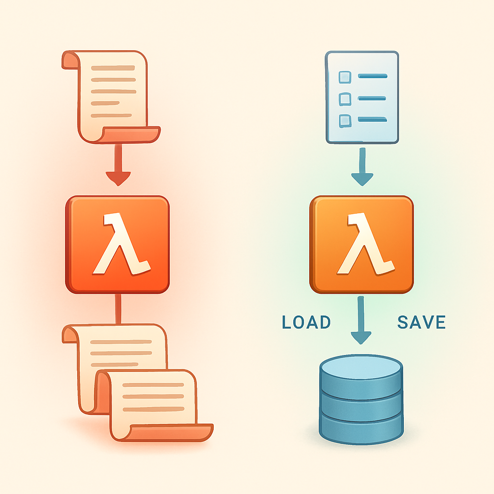

# Por que "Passar Histórico" não é ter Sessão



O conceito anterior estabeleceu que o polo stateless puro termina exatamente onde começa a necessidade de coerência temporal — e apontou que "passar a saída de uma invocação como entrada da próxima" não move o sistema para fora desse polo. Esse detalhe merece exame cuidadoso, porque é aqui que a maioria dos projetos com Lambda + MongoDB fica presa sem saber: eles saíram do polo stateless puro (há persistência no MongoDB), mas ainda não chegaram a ter sessão de verdade. Existe um nome técnico preciso para essa posição intermediária, e entendê-la é o que separa um diagnóstico correto de uma solução mal direcionada.

O padrão que o leitor opera hoje tem a seguinte mecânica: uma mensagem chega ao Lambda, o handler busca no MongoDB o histórico de mensagens associado àquele usuário, constrói um prompt que injeta esse histórico como bloco de contexto, chama o Gemini, grava a resposta de volta no MongoDB, e retorna. À superfície isso parece resolver o problema de continuidade — afinal, a mensagem de ontem está disponível agora. Mas a operação que está acontecendo é fundamentalmente diferente de manter estado estruturado de sessão. Para entender por quê, é preciso examinar o que exatamente cada abordagem faz ao estado.

Injetar histórico é uma operação de **projeção read-only**: o Lambda pega um registro linear de mensagens trocadas no passado e o projeta na janela de contexto da inferência atual. O MongoDB nesse padrão é um log — uma lista ordenada de pares `{role, content, timestamp}`. Nada no documento MongoDB representa "o que o agente está fazendo agora", "quais intenções estão em progresso", "qual foi a última tool executada com sucesso" ou "em que ponto do workflow o agente está". Essas informações não existem no documento. Se existissem, teriam que ser inferidas retroativamente lendo as mensagens — o que é fundamentalmente diferente de tê-las como campos explícitos e estruturados.

```python
# Padrão atual: histórico como log de mensagens
def handle(event):
    user_id = event["user_id"]
    
    # Busca histórico: lista de mensagens
    history = mongo.find({"user_id": user_id}, sort="timestamp")
    # history = [
    #   {"role": "user", "content": "Crie um ticket para o bug X"},
    #   {"role": "assistant", "content": "Vou criar o ticket..."},
    #   {"role": "tool", "content": "{\"ticket_id\": \"TK-123\"}"},
    #   ...
    # ]
    
    # Injeta tudo como bloco de contexto
    prompt = build_prompt(history, event["message"])
    response = gemini.generate(prompt)
    
    # Grava a nova troca no log
    mongo.insert({"role": "user", "content": event["message"]})
    mongo.insert({"role": "assistant", "content": response})
    
    return response

# O que NÃO existe nesse documento:
# - session_id explícito que identifica esta conversa como entidade
# - campo "current_intent" indicando o que o agente está tentando fazer
# - campo "pending_tool_calls" com resultados parciais
# - campo "agent_state" (idle / running / waiting_for_confirmation)
# - campo "context_tokens_used" para decisão de compactação
```

A diferença não é cosmética. Quando o agente com histórico injetado chega ao turno atual, ele tem acesso às palavras que foram ditas — mas não tem acesso a nenhuma representação estruturada do estado atual. Para saber "o ticket foi criado ou apenas prometido?", o modelo precisa ler as mensagens e inferir. Para saber "o usuário está esperando confirmação ou devo continuar?", o modelo precisa interpretar o texto. Para saber se a session está "viva" ou expirou por inatividade, não há campo de timestamp de última atividade — seria preciso ler a última mensagem e calcular. Toda interpretação de estado passa pelo modelo de linguagem, que pode errar, alucinear ou simplesmente não ter os tokens necessários para o histórico completo quando ele cresceu demais.

Um estado estruturado de sessão funciona diferente. Existe um documento de sessão — separado do log de mensagens — que contém campos com significado operacional explícito:

```json
{
  "session_id": "sess_abc123",
  "user_id": "usr_456",
  "status": "waiting_for_confirmation",
  "current_intent": "create_ticket",
  "intent_metadata": {
    "project": "Backend",
    "title": "Bug no endpoint de login",
    "assignee": "joao"
  },
  "pending_actions": [
    {"type": "awaiting_user_approval", "action": "create_ticket", "expires_at": "2026-04-23T15:00:00Z"}
  ],
  "last_activity": "2026-04-23T14:45:00Z",
  "context_tokens_used": 3420,
  "message_count": 12
}
```

Nesse modelo, o Lambda não precisa ler as mensagens para saber o que está acontecendo. O campo `status` diz diretamente que o agente está aguardando confirmação. O campo `current_intent` diz que a intenção ativa é criar um ticket. O campo `pending_actions` lista o que está esperando. O handler pode carregar esse documento, tomar decisões com base nos campos estruturados, atualizar os campos após a ação, e gravar de volta — tudo sem depender de que o modelo infira o estado lendo texto.

Essa diferença cria implicações operacionais que o padrão de injeção de histórico não consegue cobrir:

| Capacidade | Histórico Injetado (padrão atual) | Session Object Estruturado |
|---|---|---|
| Saber o status atual da conversa | Inferir lendo mensagens | Ler campo `status` diretamente |
| Detectar intenção em progresso | Depende do modelo interpretar texto | Campo `current_intent` explícito |
| Retomar workflow após timeout | Reconstruir do zero com histórico | Carregar `pending_actions` e continuar |
| Expirar sessão por inatividade | Calcular a partir da última mensagem | Comparar `last_activity` com TTL |
| Decidir compactação de contexto | Contar tokens indiretamente | Ler `context_tokens_used` diretamente |
| Detectar loop ou contradição | Parsear histórico completo | Verificar `current_intent` vs. nova ação |
| Isolar sessões de um mesmo usuário | Filtrar por `user_id` na coleção de mensagens | `session_id` como chave primária da sessão |

O problema de crescimento é igualmente importante. Com injeção de histórico pura, cada turno adiciona mensagens ao log e o payload injetado cresce linearmente. Quando uma conversa tem 50 turnos com tool calls, o bloco de histórico pode consumir 30.000 tokens antes de o modelo poder começar a raciocinar sobre a nova mensagem. Não há política de compactação automática porque não há metadado que diga "este bloco pode ser resumido" — seria necessário que o modelo lesse e decidisse, o que gasta os tokens que o crescimento está consumindo. Com um session object que mantém `context_tokens_used` e `message_count`, o handler pode detectar programaticamente que a compactação é necessária antes de construir o prompt, separando a decisão de gestão de contexto da inferência em si.

Há uma confusão frequente que vale nomear diretamente: usar `session_id` como chave de lookup no MongoDB para filtrar mensagens não é o mesmo que ter um session object. Muitos projetos adicionam um campo `session_id` na coleção de mensagens e passam a filtrar por ele — isso organiza o log por sessão, mas o documento de sessão em si continua não existindo. O `session_id` é só uma chave de filtro num log. Para ter sessão real, é necessário que exista um documento separado cuja responsabilidade é representar o estado corrente da sessão como entidade — não um log do que aconteceu, mas uma representação do que está acontecendo agora.

O ponto de vista da arquitetura é: injeção de histórico transforma o modelo de linguagem no único mecanismo de interpretação de estado. Toda pergunta operacional ("o que o agente está fazendo?", "o que foi concluído?", "o que está pendente?") só tem resposta se o modelo ler o histórico e inferir. Isso é frágil porque o modelo pode errar; ineficiente porque gasta tokens para responder perguntas que campos estruturados respondem em O(1); e não escalável porque o histórico cresce e a inferência fica mais cara. Um session object estruturado move essas perguntas para fora do modelo — o código as responde diretamente, e o modelo usa seus tokens para raciocinar sobre o que fazer a seguir, não para reconstruir onde estava.

Esse é o salto qualitativo que separa "stateless com histórico externo" de "stateful com session explícita" — a segunda posição do espectro, que o próximo conceito descreve com o que muda quando esse session object finalmente existe e é carregado a cada turn.

## Fontes utilizadas

- [Introduction to Conversational Context: Session, State, and Memory — Google ADK Docs](https://google.github.io/adk-docs/sessions/)
- [Building an Agent Architecture: How Sessions, State, Events, Context, and Runner Work Together](https://medium.com/@aktooall/building-an-agent-architecture-how-sessions-state-events-context-and-runner-work-together-d8dbdb64d52b)
- [Memory and State in LLM Applications — Arize AI](https://arize.com/blog/memory-and-state-in-llm-applications/)
- [Stateful vs Stateless AI Agents: Architecture Patterns That Matter — Ruh.ai](https://www.ruh.ai/blogs/stateful-vs-stateless-ai-agents)
- [Conversational Memory for LLMs with Langchain — Pinecone](https://www.pinecone.io/learn/series/langchain/langchain-conversational-memory/)
- [Context Engineering for Personalization - State Management with Long-Term Memory — OpenAI Cookbook](https://cookbook.openai.com/examples/agents_sdk/context_personalization)

---

**Próximo conceito** → [Stateful com Session Explícita](../03-stateful-com-session-explicita/CONTENT.md)
