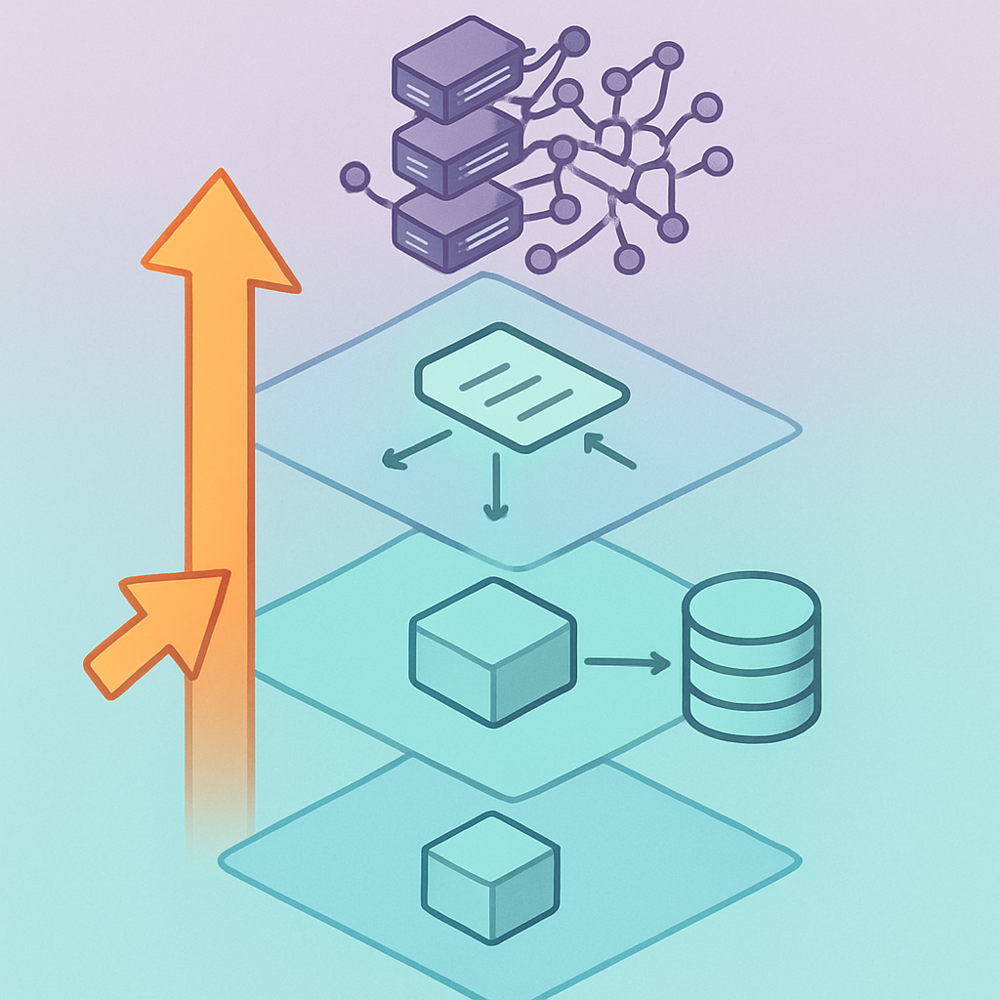

# O Critério de Posicionamento no Espectro



O conceito anterior encerrou com uma afirmação precisa: memória episódica completa é provável overengineering para o projeto do leitor no horizonte imediato. Mas "provável" não é suficiente para uma decisão de arquitetura — é exatamente o tipo de julgamento intuitivo que precisa ser substituído por critérios objetivos. Quatro conceitos foram dedicados a descrever as posições do espectro; este fecha o subcapítulo respondendo a pergunta que torna todo esse mapa operacionalizável: como identificar, sem ambiguidade, em qual posição um sistema está hoje e qual é a próxima posição racional a atingir sem queimar etapas?

A resposta exige dois movimentos separados. Primeiro, diagnóstico de posição atual — uma inspeção estrutural do que o código realmente persiste e como o handler usa esse estado. Segundo, avaliação de necessidade de upgrade — um conjunto de perguntas sobre o comportamento que o sistema precisa ter, não sobre o que o desenvolvedor acha elegante ou moderno. Os dois movimentos são independentes: um sistema pode estar no polo stateless puro e não precisar de nenhuma mudança, ou pode estar com session explícita e ainda assim necessitar de memória episódica. A posição atual e a posição necessária são determinadas por critérios distintos.

**Diagnóstico da posição atual** começa por uma inspeção estrutural do handler. O teste é simples mas preciso: o que o código lê antes de chamar o modelo, o que o código escreve depois de chamar o modelo, e qual é a estrutura dessas leituras e escritas? A seguinte tabela funciona como checklist de diagnóstico:

| O que o handler faz | Posição no espectro |
|---|---|
| Não lê nem escreve nada externo | Polo stateless puro |
| Lê lista de mensagens; escreve nova mensagem na mesma lista | Stateless com histórico externo |
| Lê documento de sessão com campos operacionais (`status`, `current_intent`, etc.) e o atualiza a cada turno | Stateful com session explícita |
| O agente invoca ferramentas de memória (`memory_replace`, `archival_memory_insert`) para gerenciar seu próprio contexto | Memória episódica completa |

A distinção entre a segunda e terceira linha é onde a maioria dos projetos se confunde — e é a confusão mais custosa porque cria a falsa sensação de ter sessão quando não se tem. Se o único documento que o handler busca no MongoDB é uma lista de mensagens ordenada por timestamp, e o único campo que o handler usa para decidir o comportamento é `user_id` ou uma chave de filtro equivalente, o sistema está na segunda posição. Se existe um documento separado — com `session_id` como chave primária, com campos como `status`, `pending_actions` ou `context_tokens_used` que o *código* lê para tomar decisões sem passar pelo modelo — o sistema está na terceira. A diferença não é de tamanho ou riqueza dos dados: é de quem interpreta o estado. Na segunda posição, o modelo interpreta; na terceira, o código interpreta.

Um teste prático para a distinção: responda a pergunta "qual é o status atual desta sessão?" sem usar o modelo. Se você não consegue responder em O(1) lendo um campo de um documento — se precisa ler as mensagens e inferir — o sistema está na segunda posição, independente de quantos campos tenham sido adicionados à coleção de mensagens.

**Avaliação de necessidade de upgrade** é determinada por cinco perguntas sobre comportamento, não sobre tecnologia:

1. **O agente precisa de coerência entre turnos separados no tempo?** Se cada turno é semanticamente independente — o usuário pode dizer qualquer coisa em qualquer ordem e o histórico não importa para a correção da resposta — a segunda posição (ou mesmo a primeira) é suficiente. Se o agente precisa rastrear que "a task X foi prometida no turno 3 e ainda não foi criada no turno 7", a segunda posição falha porque essa informação só existe inferida no histórico.

2. **O código precisa tomar decisões de controle sem passar pelo modelo?** Expiração de sessão, detecção de loop, compactação de contexto, tratamento de ação pendente — se qualquer uma dessas decisões precisa ser tomada antes da inferência ou de forma determinística, um session object com campos estruturados é necessário. Se o sistema pode tolerar que essas decisões sejam tomadas pelo modelo a partir do histórico, a segunda posição pode ser suficiente temporariamente.

3. **O agente precisa de conhecimento acumulado *entre sessões distintas*?** A chave aqui é "entre sessões" — não "dentro de uma sessão". Se o agente precisa lembrar, na sessão de amanhã, o que o usuário disse na sessão de ontem, e essa memória deve informar o comportamento de forma estruturada (não apenas via injeção de histórico antigo), alguma forma de memória cross-session é necessária. Para memórias factuais estáticas, um session object com campos carregados de um perfil de usuário externo pode ser suficiente. Para memórias que evoluem e são gerenciadas pelo próprio agente, memória episódica completa passa a ser justificada.

4. **O número de sessões simultâneas e o volume de turnos por sessão geram pressão de custo mensurável?** Este é o critério econômico que as análises de escala revelam. Stateful com session explícita adiciona latência de read/write por turno (em geral 5-30ms de overhead para MongoDB ou Redis local) e custo de storage proporcional ao número de sessões ativas. Se o sistema tem alta concorrência com sessões curtas e de baixo valor de personalização, o overhead pode não se justificar. Se as sessões são longas e o valor de não repetir perguntas é mensurável em satisfação do usuário ou custo de inferência evitado, o investimento é justificado.

5. **A equipe tem capacidade operacional para a posição?** Memória episódica completa exige servidor Letta ou equivalente, banco de dados vetorial para archival memory, monitoramento dos ciclos de paginação, e testabilidade muito mais complexa do comportamento de memória. Se a equipe não tem essa capacidade hoje, escolher essa posição não é ambição técnica — é débito operacional que vai se pagar com incidentes.

A lógica de progressão entre posições é o ponto mais importante deste critério: **nunca pule posições**. Mover do histórico injetado diretamente para memória episódica completa sem implementar session explícita primeiro é um erro arquitetural recorrente. O motivo é que cada posição é pré-requisito operacional da seguinte: memória episódica completa pressupõe que você sabe gerenciar o ciclo de vida de uma sessão (expiração, compactação, estado estruturado) — habilidades que só são desenvolvidas ao implementar a posição anterior. Projetos que tentam o salto direto geralmente terminam com um wrapper em cima de Letta que não entende o que está acontecendo por baixo, não consegue debugar comportamentos de memória, e não tem observabilidade sobre por que o agente tomou determinada decisão.

```
Posição atual           Próxima posição racional        Critério de gatilho
─────────────────────────────────────────────────────────────────────────────
Stateless puro       →  Stateless c/ histórico          Turnos precisam de contexto
Stateless c/ hist.   →  Stateful c/ session explícita   Código precisa controlar estado
Stateful c/ session  →  Memória episódica completa       Conhecimento deve sobreviver sessões
```

Para o projeto do leitor, o diagnóstico de posição atual com o checklist acima é direto: o handler busca mensagens do MongoDB, injeta como histórico, grava resposta de volta — segunda posição, stateless com histórico externo. A avaliação de necessidade de upgrade pelas cinco perguntas também é direta: (1) sim, o agente precisa de coerência entre turnos — rastrear intenções em progresso e tool calls executadas é parte do funcionamento; (2) sim, código precisa controlar expirações e compactação sem depender do modelo; (3) não imediatamente — sessões são de escala de horas a dias, não meses; (4) o volume atual não gera pressão que justifique otimizar custo antes de corretude; (5) a equipe tem capacidade de implementar um session object em MongoDB, que já está disponível. O diagnóstico aponta para uma conclusão única: a próxima posição racional é stateful com session explícita — e nenhum dos critérios justifica ir além disso agora.

Esse resultado — que pode parecer óbvio ao final de quatro conceitos detalhados — é o objetivo real do espectro como ferramenta. Não é um framework acadêmico para categorizar arquiteturas; é um instrumento de decisão que transforma "acho que precisamos de mais estado" em "a posição atual é X, os critérios de upgrade apontam para Y, e não há justificativa para Z". O subcapítulo seguinte aplica exatamente esse instrumento ao projeto existente: não mais o espectro em abstrato, mas o diagnóstico concreto de onde cada peça do sistema Lambda + MongoDB + Haystack se encaixa — e o que precisa ser construído para chegar à próxima posição.

## Fontes utilizadas

- [Stateful vs Stateless AI Agents: Architecture Guide for Developers — Tacnode](https://tacnode.io/post/stateful-vs-stateless-ai-agents-practical-architecture-guide-for-developers)
- [Stateful vs Stateless AI Agents: Architecture Patterns That Matter — Ruh.ai](https://www.ruh.ai/blogs/stateful-vs-stateless-ai-agents)
- [Stateful vs Stateless AI Agents: Know Key Differences — Daffodil](https://insights.daffodilsw.com/blog/stateful-vs-stateless-ai-agents-when-to-choose-each-pattern)
- [Building Production AI Agent Systems: Architecture Patterns That Scale — HyperTrends](https://www.hypertrends.com/2026/04/production-ai-agent-architecture-patterns/)
- [Effectively building AI agents on AWS Serverless — AWS Blog](https://aws.amazon.com/blogs/compute/effectively-building-ai-agents-on-aws-serverless/)
- [State Management for AI Agents: Stateless vs Persistent — By AI Team](https://byaiteam.com/blog/2025/12/14/state-management-for-ai-agents-stateless-vs-persistent/)

---

**Próximo subcapítulo** → [Diagnóstico do Projeto Atual](../../05-diagnostico-do-projeto-atual/CONTENT.md)
