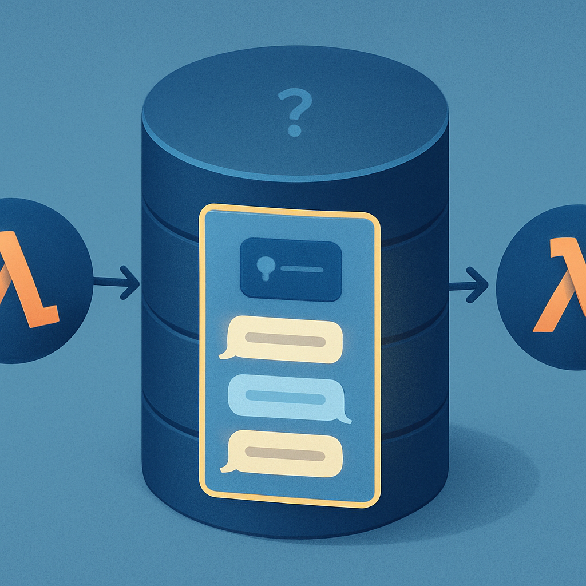

# O que o MongoDB como histórico de chat já resolve



O diagnóstico começa por reconhecer o que já funciona — e o MongoDB no papel de armazenamento de histórico de mensagens entrega um valor genuíno que não deve ser subestimado. O ponto de partida para entendê-lo é a natureza stateless do Lambda: cada invocação começa com memória de trabalho zerada. Sem uma camada de persistência externa, cada chamada à API seria uma conversa completamente nova — o agente não saberia que o usuário acabou de pedir para criar uma tarefa no ClickUp, nem que a tarefa foi criada com sucesso dois turnos atrás. O MongoDB resolve exatamente esse problema de amnésia entre invocações, e resolve de forma robusta.

O mecanismo é direto: ao final de cada turn, as mensagens geradas — tanto as do usuário quanto as do agente, incluindo os resultados dos tool calls — são persistidas numa coleção MongoDB. Na invocação seguinte, antes de chamar o modelo, o sistema carrega esse histórico e injeta as mensagens no contexto. O modelo recebe a lista ordenada de trocas anteriores e consegue raciocinar sobre elas como se a conversa fosse contínua. Para o Gemini, via Vertex AI, não há diferença semântica entre uma mensagem que chegou agora e uma que foi recuperada do banco — tudo é contexto de entrada.

Essa recuperação por session key é o núcleo do que o MongoDB entrega. Um documento de conversa típico nessa arquitetura contém uma lista de mensagens identificada por algum campo que funciona como identificador de sessão — pode ser um `user_id`, um `conversation_id` ou até um identificador de canal do Slack. A query é simples:

```python
messages = collection.find_one({"session_id": session_id})["messages"]
```

E a gravação ao final do turn é igualmente direta — append de novas mensagens ao array existente:

```python
collection.update_one(
    {"session_id": session_id},
    {"$push": {"messages": {"$each": new_messages}}},
    upsert=True
)
```

O que esse padrão garante concretamente: o agente consegue responder a perguntas de acompanhamento com coerência ("qual foi o resultado da busca anterior?"), evitar repetir perguntas já respondidas pelo usuário ("qual projeto você quer usar?"), e manter o fio narrativo de um workflow que se estende por múltiplos turnos dentro de uma sessão de uso normal. Para o caso de uso de um assistente Slack que ajuda a gerenciar tarefas no ClickUp, isso cobre a maior parte das interações do dia a dia.

O MongoDB também entrega durabilidade. O histórico sobrevive a reinicializações do Lambda, a deploys, a falhas transientes de rede — qualquer evento que derrubaria o estado em memória não afeta o que está persistido. Isso é especialmente relevante num ambiente Lambda onde o container pode ser reciclado a qualquer momento e a warm start não é garantida. A conversa existe independente do ciclo de vida da função.

Há também um benefício operacional relevante: o MongoDB como store de histórico cria um log auditável de todas as interações. É possível consultar retrospectivamente o que o agente disse e fez, depurar comportamentos inesperados comparando o input com o output, e medir métricas de uso sem precisar de instrumentação adicional. O histórico de mensagens é naturalmente um log de eventos — e o MongoDB o torna pesquisável.

A distinção crítica que esse conceito prepara para os seguintes é esta: o MongoDB com histórico de mensagens resolve a **persistência de mensagens entre invocações**, mas não cria um **session object estruturado**. A diferença não é cosmética — é arquitetural. O que o MongoDB armazena é uma lista de `{role, content}` pares. O que uma sessão real precisa conter vai além: o `session_id` explicitamente rastreado e associado a um usuário, o estado do agente no meio de um workflow (quais intenções estão ativas, quais ações foram iniciadas e não concluídas), metadados sobre o ciclo de vida da sessão (quando começou, quando foi o último turn, se está ativa ou expirada), e os resultados de tool calls como eventos tipados — não apenas o texto que o modelo recebeu de volta.

```
O que o MongoDB como histórico entrega:
┌─────────────────────────────────────────────┐
│  [turn 1] user: "crie tarefa X"             │
│  [turn 1] assistant: "tarefa criada: #123"  │
│  [turn 2] user: "adicione descrição"        │
│  [turn 2] assistant: "descrição adicionada" │
└─────────────────────────────────────────────┘
                   ↓ persiste e carrega ✓

O que ainda está ausente:
┌─────────────────────────────────────────────┐
│  session_id explícito: ✗                    │
│  estado do agente entre runs: ✗             │
│  intenções ativas: ✗                        │
│  tool calls como eventos tipados: ✗         │
│  lifecycle da sessão (idle/running/exp): ✗  │
└─────────────────────────────────────────────┘
```

Outro ponto que o MongoDB não resolve: a injeção de todo o histórico no contexto a cada turn não escala. Numa conversa longa, o array de mensagens cresce indefinidamente. Em algum momento, o volume de tokens do histórico começa a competir com o espaço disponível para o raciocínio do agente — e sem uma política de compactação, a única estratégia disponível é truncar pelo início ou pelo final, ambas destruidoras de contexto relevante. O MongoDB armazena as mensagens com fidelidade; a decisão de quais mensagens projetar para a janela de contexto em cada inferência é um problema separado, que o histórico plano não endereça.

Uma confusão comum nessa fase é acreditar que "ter MongoDB com histórico de chat" equivale a "ter sessão". A razão pela qual o erro é tentador: na maioria dos turnos do dia a dia, o comportamento observável é indistinguível. O agente parece lembrar, parece continuar. A falha só aparece quando o estado que precisa persistir não é uma mensagem de texto — é o conhecimento de que uma ação foi iniciada e não concluída, de que o usuário está no meio de um workflow com cinco passos, de que a sessão durou mais do que o timeout do Lambda e o contexto em memória foi perdido. Nesses casos, o histórico de mensagens devolve o texto do que foi dito, mas não o estado estruturado do que estava acontecendo.

O posicionamento no espectro discutido no subcapítulo anterior ficou claro: o sistema atual está na posição de **stateless com histórico externo**, não stateful. O MongoDB eleva o sistema acima do Lambda puro sem persistência — isso é real e importante. Mas a distância entre essa posição e ter um session object com ciclo de vida gerenciado é justamente o que os próximos conceitos deste diagnóstico vão medir com precisão.

## Fontes utilizadas

- [Powering Long-Term Memory For Agents With LangGraph And MongoDB — MongoDB Blog](https://www.mongodb.com/company/blog/product-release-announcements/powering-long-term-memory-for-agents-langgraph)
- [3-Hello Agentic AI: Storing Chat History with MongoDB — Medium](https://medium.com/@alessandro.a.pagliaro/hello-agentic-ai-storing-chat-history-with-mongodb-779a68fd5c2e)
- [Session: Tracking Individual Conversations — Google ADK Docs](https://adk.dev/sessions/session/)
- [From Stateless LLMs to Stateful Agents: Building Production-Grade Memory with MongoDB — TLDRcap](https://tldrecap.tech/posts/2026/mongodb-local-sf/agentic-application-building-strategies/)
- [Building an Agent Architecture: How Sessions, State, Events, Context, and Runner Work Together — Medium](https://medium.com/@aktooall/building-an-agent-architecture-how-sessions-state-events-context-and-runner-work-together-d8dbdb64d52b)
- [MongoDB | LangChain Integration Docs](https://python.langchain.com/docs/integrations/memory/mongodb_chat_message_history/)

---

**Próximo conceito** → [O que o Haystack e o tool calling entregam parcialmente](../02-o-que-o-haystack-e-o-tool-calling-entregam-parcialmente/CONTENT.md)
