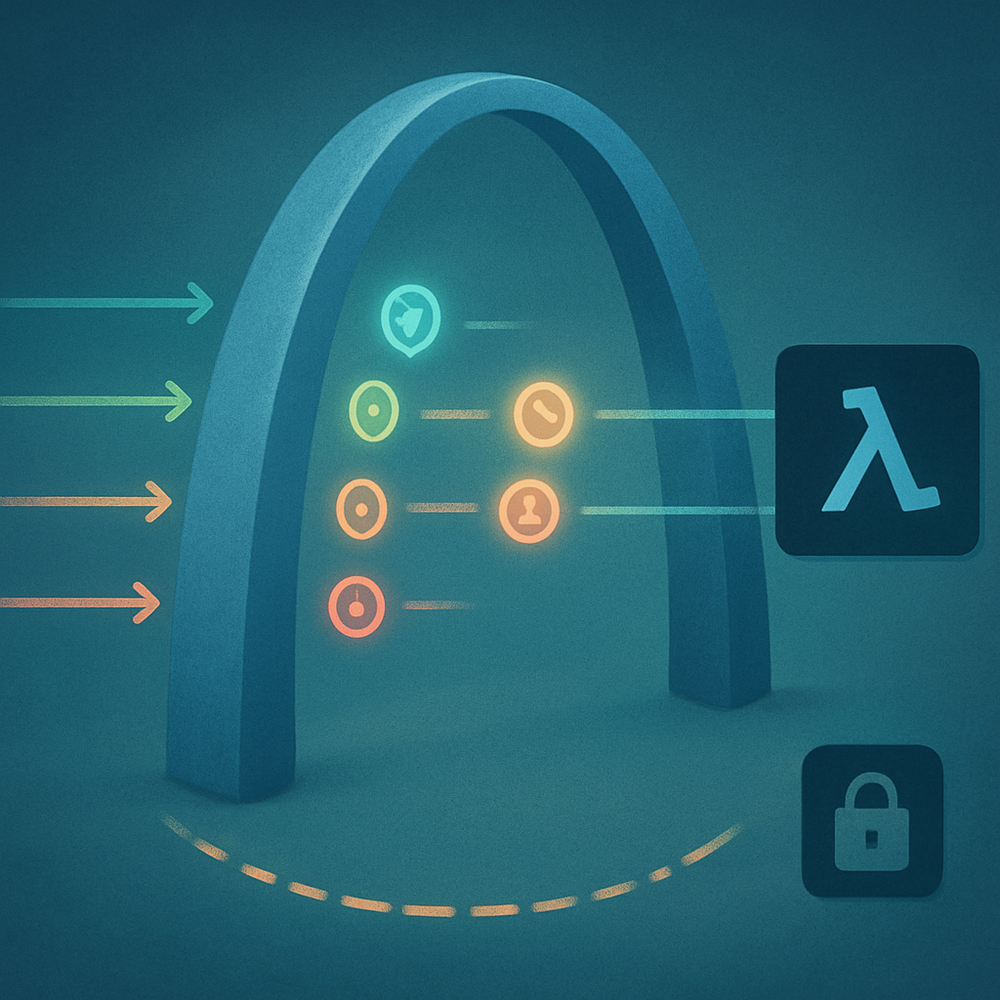

# O que a API Gateway contribui implicitamente



O diagnóstico mapeou até aqui duas camadas do sistema: o MongoDB que persiste mensagens entre invocações, e o Haystack que estrutura o loop interno de tool calling dentro de uma invocação. Existe uma terceira camada que o diagnóstico costuma ignorar — não porque seja invisível, mas porque opera em silêncio, sem que nenhum código da aplicação a tenha criado explicitamente. A API Gateway, como ponto de entrada único de todas as requisições, desenha fronteiras ao redor das interações de uma forma que tem consequências reais para a sessão, mesmo que o sistema não as trate como tal.

O ponto de partida é entender o que a API Gateway vê quando uma requisição chega. Cada request HTTP que passa pela API Gateway carrega um conjunto de informações que ela extrai, valida e encaminha para o Lambda como parte do `event` object. O mais imediato é o corpo da requisição — a mensagem do usuário. Mas o que a Gateway contribui além do payload são os metadados de contexto que chegam na chave `requestContext` do evento:

```json
{
  "requestContext": {
    "requestId": "abc123xyz456",
    "identity": {
      "sourceIp": "203.0.113.5",
      "userAgent": "Mozilla/5.0 ..."
    },
    "authorizer": {
      "jwt": {
        "claims": {
          "sub": "user-uuid-1234",
          "email": "user@example.com",
          "custom:org_id": "org-567"
        }
      }
    },
    "stage": "prod",
    "path": "/agent/chat",
    "httpMethod": "POST"
  }
}
```

Quando um Lambda authorizer ou um JWT authorizer está configurado na API Gateway, a identidade do chamador — extraída e validada do token JWT antes de a requisição sequer chegar ao Lambda — chega no evento como claims desestruturados. O `sub` do JWT, por exemplo, é o identificador único do usuário autenticado. O `custom:org_id` é o tenant no caso de um sistema multi-tenant. Esses dados chegam validados, assinados, imutáveis do ponto de vista da função Lambda — a API Gateway já fez a verificação criptográfica da assinatura antes de encaminhar.

O que isso significa para a sessão, mesmo de forma implícita: o Lambda não precisa descobrir quem é o usuário. Esse dado já chegou no `event`. Se o código da aplicação decidir usar o `sub` do JWT como chave para buscar histórico no MongoDB — que é exatamente o que o padrão atual faz — então a API Gateway está contribuindo com a **identidade do dono da sessão** sem que a aplicação tenha precisado fazer nenhum trabalho de autenticação. A fronteira de "qual sessão pertence a qual usuário" foi desenhada na Gateway, não no código do agente.

Além da identidade, há o `requestId`. Cada requisição que a AWS API Gateway processa recebe um identificador único — disponível no header de resposta `x-amzn-requestid` e no `event.requestContext.requestId` do Lambda. Esse identificador não é um session_id, mas é um **ID de correlação de turno**: permite rastrear, nos logs do CloudWatch, exactamente qual requisição HTTP gerou qual invocação do Lambda, quais tool calls aconteceram dentro dela, e qual foi o output. O `requestId` é efêmero — não persiste entre turnos — mas cria o elo entre a camada HTTP e a execução interna do agente para fins de observabilidade e debugging.

```
Fluxo de identidade pela API Gateway:

  Cliente HTTP
      │
      │  POST /agent/chat
      │  Authorization: Bearer eyJ...
      │
      ▼
  ┌─────────────────────────────────────┐
  │          API Gateway                │
  │                                     │
  │  1. Valida JWT (assinatura, exp)    │
  │  2. Extrai claims (sub, org_id...)  │
  │  3. Injeta em requestContext        │
  │  4. Gera requestId único            │
  └─────────────────────────────────────┘
      │
      │  event = {
      │    body: "mensagem do usuário",
      │    requestContext: {
      │      requestId: "abc123",
      │      authorizer: { jwt: { claims: { sub: "user-1234" } } }
      │    }
      │  }
      │
      ▼
  Lambda (código da aplicação)
  → usa sub como session_key para buscar MongoDB
  → nunca viu o JWT, nunca validou assinatura
```

Há também uma contribuição mais sutil: a **natureza request/response do protocolo HTTP** impõe uma granularidade natural de turn. Cada chamada HTTP é atômica do ponto de vista da Gateway — ela tem um início, uma execução e um fim com resposta. Isso mapeia diretamente para o conceito de turn definido no subcapítulo 3: uma unidade de interação usuario→agente com fronteiras claras. A API Gateway não sabe o que é um turn no sentido agêntico, mas a estrutura que ela impõe — um POST in, uma resposta out — cria essa fronteira de forma automática. O sistema nem precisou projetá-la: ela emergiu do protocolo.

Para um sistema sincronamente chamado via REST, essa granularidade é conveniente. O Lambda sabe que quando começa a executar, está no início de um turn; quando retorna a resposta, o turn terminou. A API Gateway age como um marcador de tempo implícito: início do turn = chegada da requisição, fim do turn = envio da resposta. Sem essa fronteira, seria necessário definir explicitamente o que delimita um turn — o que é uma questão não trivial em sistemas com conexões WebSocket ou streaming, onde o protocolo não impõe a mesma granularidade.

| O que a API Gateway contribui | Como contribui | Para a sessão, isso significa |
|-------------------------------|---------------|-------------------------------|
| Identidade validada do usuário (`sub`, `org_id`) | JWT authorizer extrai e injeta no `event` | O dono da sessão já chegou identificado |
| `requestId` único por requisição | Gerado automaticamente e injetado no contexto | ID de correlação de turn para observabilidade |
| Fronteira request/response | HTTP REST é atômico por design | Turn tem início e fim implícitos sem precisar de código |
| IP de origem e User-Agent | Presentes em `requestContext.identity` | Metadados de dispositivo/localização disponíveis |
| Stage e path da requisição | `requestContext.stage`, `requestContext.path` | Roteamento implícito por ambiente (prod/dev) |

Esse conjunto de contribuições é real e útil. O sistema que não tivesse uma API Gateway configurada com authorizer teria que reimplementar a validação do JWT no próprio Lambda — adicionando latência, complexidade e superfície de erro. O sistema que não tivesse o `requestId` teria muito mais dificuldade em correlacionar logs de diferentes serviços. A API Gateway faz esse trabalho de graça, como efeito colateral da sua função primária de roteamento e segurança.

O limite — e por que a contribuição da Gateway não é suficiente — fica claro quando se olha para o que uma sessão agêntica real precisa conter. O `sub` do JWT identificou o usuário, mas não há nenhum `session_id` gerado, persistido e gerenciado pelo sistema. Se o mesmo usuário abre duas conversas paralelas, o sistema atual não tem como distingui-las: ambas chegam com o mesmo `sub`, e o MongoDB vai retornar o mesmo histórico para as duas. Não há o conceito de "essa é a sessão X desta conversa" e "essa é a sessão Y de outra conversa do mesmo usuário".

O `requestId` correlaciona um turn a uma invocação Lambda, mas não conecta turns entre si. Entre o turn 3 e o turn 4 de uma mesma conversa, não há nenhum identificador que diga "estes dois turns pertencem à mesma sessão". O MongoDB os conecta pela chave usada para buscar o histórico — mas essa chave não é um `session_id` com ciclo de vida gerenciado, é uma chave de negócio (como o `channel_id` do Slack) que foi reutilizada como identificador de sessão por conveniência.

A fronteira de turn também expõe o seu custo em contextos agênticos mais ricos. Para o sistema atual, cada turn se resolve sincronamente dentro do timeout do Lambda — o que funciona para tool calls simples. Mas quando o agente precisar executar workflows longos, ou quando o usuário quiser retomar uma sessão horas depois, a fronteira request/response imposta pela Gateway começa a conflitar com o modelo de sessão que o agente precisa. A Gateway resolveu a granularidade de turn para o caso HTTP síncrono; para sessões que transcendem esse modelo, a arquitetura precisa evoluir — o que o livro explora a partir do capítulo 8, com WebSocket e Fargate.

O diagnóstico desta camada é, portanto, preciso: a API Gateway contribui com identidade do usuário validada, correlação de turno via `requestId`, e granularidade natural de turn pelo protocolo HTTP — tudo implicitamente, sem que a aplicação tenha pedido. Mas não contribui com `session_id` gerenciado, não distingue múltiplas sessões do mesmo usuário, não persiste nenhum estado entre turns, e não tem modelo do ciclo de vida de uma sessão agêntica. É uma fundação sólida para o que existe hoje, e uma fundação insuficiente para o que o sistema precisa se tornar.

## Fontes utilizadas

- [Identity Propagation in an API Gateway Architecture — Google Cloud Blog](https://cloud.google.com/blog/products/api-management/identity-propagation-in-an-api-gateway-architecture)
- [Use API Gateway Lambda authorizers — Amazon API Gateway Docs](https://docs.aws.amazon.com/apigateway/latest/developerguide/apigateway-use-lambda-authorizer.html)
- [Control access to HTTP APIs with JWT authorizers — Amazon API Gateway Docs](https://docs.aws.amazon.com/apigateway/latest/developerguide/http-api-jwt-authorizer.html)
- [Capture and forward correlation IDs through different Lambda event sources — theburningmonk.com](https://theburningmonk.com/2017/09/capture-and-forward-correlation-ids-through-different-lambda-event-sources/)
- [Mastering API Gateway Session Management: Best Practices for Scalable Architectures — ones.com](https://ones.com/blog/mastering-api-gateway-session-management-best-practices/)
- [Session Management in AWS Lambda: Guide — AWS for Engineers](https://awsforengineers.com/blog/session-management-in-aws-lambda-guide/)
- [How Authentication Works in Microservices — Kong Inc.](https://konghq.com/blog/learning-center/microservices-security-and-session-management)
- [Introducing and applying tenant context — AWS Prescriptive Guidance](https://docs.aws.amazon.com/prescriptive-guidance/latest/agentic-ai-multitenant/introducing-and-applying-tenant-context.html)

---

**Próximo conceito** → [As lacunas estruturais do sistema atual](../04-as-lacunas-estruturais-do-sistema-atual/CONTENT.md)
