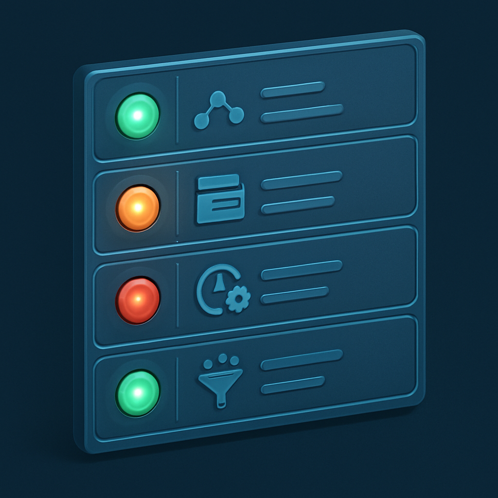

# O checklist operacional de diagnóstico

O inventário dos quatro conceitos anteriores foi específico ao sistema Lambda + MongoDB + Haystack + API Gateway do leitor. A pergunta que este conceito responde é diferente: como aplicar o mesmo rigor diagnóstico a qualquer sistema agêntico — inclusive ao próprio sistema daqui a seis meses, quando ele tiver evoluído e o leitor precisar saber onde está no espectro novamente? A resposta é um conjunto de perguntas operacionais que cobrem cada dimensão de gestão de sessão identificada ao longo do capítulo, organizadas de forma que cada grupo de perguntas corresponda a uma categoria de lacuna distinta.

A lógica do checklist não é preencher uma lista de verificação de conformidade. É usar perguntas como sondas: cada resposta "não" ou "parcialmente" localiza com precisão onde o sistema está abaixo do que um agente real precisa. A precisão importa porque "o sistema tem problemas com sessão" não informa nada sobre o que construir — "o sistema não tem session_id explícito gerenciado, o que significa que múltiplas sessões do mesmo usuário são indistinguíveis" informa exatamente o que está faltando e onde. O vocabulário construído nos subcapítulos anteriores — session, turn, run, thread, posição no espectro — é o que transforma respostas ao checklist em diagnósticos acionáveis.

O checklist tem cinco grupos, cada um mapeado para uma dimensão de sessão:

---

**Grupo 1: Identidade da sessão**

| Pergunta | Resposta esperada em sistema maduro | O que a ausência indica |
|----------|-------------------------------------|------------------------|
| Existe um `session_id` explicitamente gerado e persistido como campo de primeira classe? | Sim — UUID gerado na criação da sessão, gravado no documento de sessão | Sistema usa chave de negócio (user_id, channel_id) como proxy de sessão |
| O `session_id` é passado em todos os turns de uma mesma conversa? | Sim — o cliente envia `session_id` em cada request, ou o sistema o recupera de forma determinística | Cada turn busca histórico por chave diferente; múltiplas sessões do mesmo usuário são indistinguíveis |
| É possível ter múltiplas sessões paralelas para o mesmo usuário? | Sim — cada sessão tem seu próprio `session_id` independente do `user_id` | Dois contextos simultâneos do mesmo usuário se mesclam num único histórico |
| O sistema consegue recuperar uma sessão específica pelo seu `session_id` sem ambiguidade? | Sim — lookup direto pelo identificador | A sessão só pode ser recuperada pelo dono, não pelo identificador da conversa |

---

**Grupo 2: Estado do agente entre runs**

| Pergunta | Resposta esperada em sistema maduro | O que a ausência indica |
|----------|-------------------------------------|------------------------|
| O estado do agente ao final de um run é persistido separadamente das mensagens? | Sim — campo `agent_state` no documento de sessão, atualizado após cada run | Apenas mensagens sobrevivem; intenções ativas e workflows em andamento são perdidos |
| Se o agente estava no meio de um workflow multi-step e o turn terminou, o próximo turn sabe disso? | Sim — o documento de sessão contém o checkpoint do workflow | O agente começa o próximo turn sem saber que havia um workflow em andamento |
| Os resultados de tool calls são persistidos como eventos estruturados (com `tool_call_id`, args, resultado e flag de erro)? | Sim — como lista de `ToolCallEvent` no documento de sessão | Tool calls sobrevivem apenas como texto nas mensagens; estrutura tipada se perde |
| O `State` do Haystack (ou equivalente) é serializado e carregado entre invocações? | Sim — serialização do `State` para JSON antes do fim do Lambda | Dados acumulados pelas ferramentas durante o run somem ao final da invocação |

---

**Grupo 3: Ciclo de vida da sessão**

| Pergunta | Resposta esperada em sistema maduro | O que a ausência indica |
|----------|-------------------------------------|------------------------|
| O documento de sessão contém `status` explícito (idle, running, waiting, suspended, expired)? | Sim — atualizado em cada transição de estado | O sistema não sabe se uma sessão está ativa, parada ou expirada |
| O sistema detecta e marca sessões expiradas com base em TTL ou inatividade? | Sim — job periódico ou lazy expiration no carregamento | Sessões antigas nunca expiram; o banco acumula documentos sem uso |
| É possível suspender uma sessão e retomá-la horas ou dias depois com estado íntegro? | Sim — o documento de sessão é o ponto de restauração completo | Retomadas longas perdem o estado do agente; só o texto das mensagens sobrevive |
| O `created_at` e `last_turn_at` estão registrados na sessão? | Sim — timestamps de ciclo de vida como campos de primeira classe | Impossível calcular duração de sessão, frequência de uso, ou detectar abandono |

---

**Grupo 4: Gerenciamento de contexto**

| Pergunta | Resposta esperada em sistema maduro | O que a ausência indica |
|----------|-------------------------------------|------------------------|
| O sistema tem uma política explícita sobre quais mensagens injetar na janela de contexto a cada turn? | Sim — sliding window, summarização, relevance scoring, ou combinação | Todo o histórico é injetado em todo turn; custo cresce linearmente e qualidade da atenção degrada |
| Os turns são numerados sequencialmente na sessão? | Sim — campo `turn_index` em cada turn ou no documento de sessão | Impossible implementar sliding window ou summarizar "os últimos N turns" |
| Existe um token budget por turn, com contagem de tokens por mensagem? | Sim — campo `token_count` em cada `ChatMessage` ou por turn | Não há como saber quando a janela de contexto está chegando ao limite antes de estourar |
| O sistema distingue entre o que está **persistido** (substrato) e o que é **projetado** para o LLM (janela de contexto efêmera)? | Sim — a projeção é montada dinamicamente no início de cada run | Substrato e janela de contexto são a mesma coisa; compactação é impossível sem reescrever a lógica de persistência |

---

**Grupo 5: Infraestrutura para sessões longas**

| Pergunta | Resposta esperada em sistema maduro | O que a ausência indica |
|----------|-------------------------------------|------------------------|
| O sistema grava checkpoints durante a execução de workflows longos? | Sim — após cada passo significativo, o estado é gravado | Um timeout do Lambda no meio de um workflow perde todos os passos concluídos |
| Há mecanismo de retomada de um workflow a partir do último checkpoint? | Sim — a próxima invocação lê o checkpoint e continua de onde parou | Falhas parciais forçam reexecução do workflow inteiro do início |
| O timeout de 15 minutos do Lambda é explicitamente monitorado para os workflows do sistema? | Sim — métricas de duração de invocação com alertas próximos ao limite | O timeout é um limite surpresa que só aparece em produção, sob carga real |
| A arquitetura tem uma estratégia definida para workflows que excedem o timeout do Lambda? | Sim — ponto de migração para Step Functions, Lambda Durable Functions ou Fargate identificado | O sistema não tem onde crescer; o timeout do Lambda é um teto sem rota de escape |

---

A função de cada grupo vai além de confirmar ausências. Cada pergunta respondida com "sim" é uma garantia de robustez — e cada pergunta respondida com "não" mapeia para um ponto de trabalho concreto em capítulos específicos do livro. O Grupo 1 (identidade da sessão) é o pré-requisito de todos os outros: nenhuma política de compactação, nenhuma state machine de ciclo de vida, nenhum checkpoint é útil se não há um `session_id` que ancore o estado da sessão num objeto coerente. Por isso a primeira pergunta do Grupo 1 é, na prática, a pergunta central de todo o diagnóstico.

Para usar o checklist sobre o sistema atual do leitor: aplicar o Grupo 1 primeiro e verificar se existe `session_id` explícito como campo gerado e persistido. Se a resposta for não — e o diagnóstico dos conceitos anteriores mostrou que é não para o sistema Lambda + MongoDB atual —, os grupos 2, 3, 4 e 5 ficam automaticamente comprometidos, porque dependem do `session_id` como âncora. Isso não significa que não vale a pena responder os outros grupos: vale, porque eles revelam o que já existe parcialmente (o Haystack entrega parte do Grupo 2 implicitamente, por exemplo) e o que precisa ser construído do zero. O resultado é uma tabela com três colunas — existe, existe parcialmente, ausente — que é exatamente o mapa de decisões que o conceito seguinte vai usar para alimentar o design do capítulo 2.

A outra utilidade do checklist é como critério de aceitação para a evolução do sistema. Quando o leitor implementar o session object do capítulo 2, pode usar as perguntas do Grupo 1 e do Grupo 3 como critério para saber se a implementação está completa. Quando implementar as políticas de compactação do capítulo 5, as perguntas do Grupo 4 funcionam como o teste de aceitação da funcionalidade. O checklist não é um documento estático de diagnóstico inicial — é um instrumento reutilizável ao longo de toda a evolução do sistema.

Uma nota sobre o que o checklist não cobre: ele não inclui perguntas sobre observabilidade, multi-tenancy ou o modelo de sessão de produto (UX de retomada de sessão, branch de sessão, visibilidade do estado para o usuário). Essas dimensões são reais e importantes — os capítulos 11 e 12 do livro as abordam. Elas foram excluídas aqui deliberadamente: o checklist operacional cobre a camada de sessão como infraestrutura técnica, não como produto. Misturar as duas categorias na fase de diagnóstico cria uma lista de tarefas que paralisa em vez de orientar. O diagnóstico técnico vem primeiro; as decisões de produto seguem sobre uma base sólida.

## Fontes utilizadas

- [Building an Agent Architecture: How Sessions, State, Events, Context, and Runner Work Together — Medium](https://medium.com/@aktooall/building-an-agent-architecture-how-sessions-state-events-context-and-runner-work-together-d8dbdb64d52b)
- [Agent Evaluation Readiness Checklist — LangChain Blog](https://blog.langchain.com/agent-evaluation-readiness-checklist/)
- [Evaluating Memory and State Handling in Leading AI Agent Frameworks — GoCodeo](https://www.gocodeo.com/post/evaluating-memory-and-state-handling-in-leading-ai-agent-frameworks)
- [What Is Workflow State vs Session State in AI Agents? — MindStudio](https://www.mindstudio.ai/blog/workflow-state-vs-session-state-ai-agents)
- [Stateful vs Stateless AI Agents: Architecture Patterns That Matter — ruh.ai](https://www.ruh.ai/blogs/stateful-vs-stateless-ai-agents)
- [ATANT: The first open evaluation framework for AI continuity — Kenotic Labs / GitHub](https://github.com/Kenotic-Labs/ATANT)
- [How to maintain session state across HTTP requests in Bedrock AgentCore Runtime — AWS re:Post](https://repost.aws/questions/QU-YbedQP2Qj6QwqR5EnuELQ/how-to-maintain-session-state-across-http-requests-in-bedrock-agentcore-runtime-for-mcp-servers)

---

**Próximo conceito** → [O diagnóstico como documento de decisão](../06-o-diagnostico-como-documento-de-decisao/CONTENT.md)
