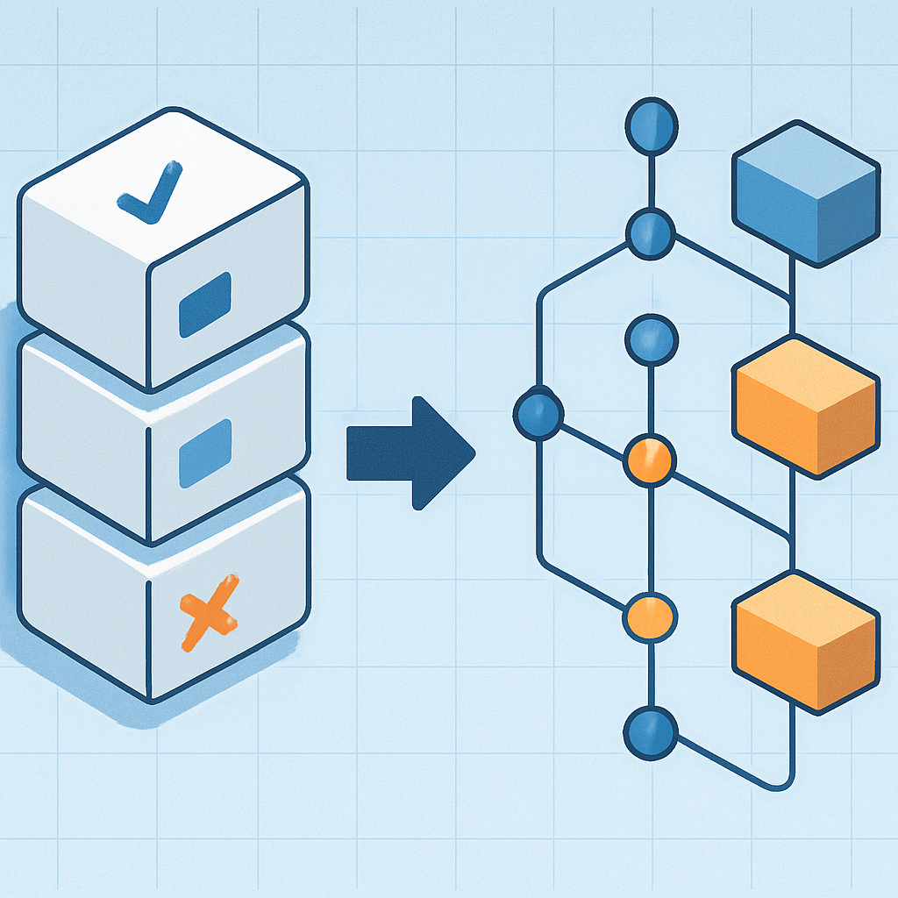

# O diagnóstico como documento de decisão



O checklist do conceito anterior produziu um resultado preciso: para cada dimensão de sessão — identidade, estado do agente, ciclo de vida, gerenciamento de contexto, infraestrutura para sessões longas —, o sistema Lambda + MongoDB + Haystack + API Gateway tem respostas "sim", "parcialmente" ou "não". Esse inventário é o ponto de partida. Mas um inventário não é um plano. A distinção é mais importante do que parece: inventários descrevem o estado atual; documentos de decisão propõem o que fazer a respeito, em que ordem, por quê, e com quais trade-offs explicitados. A transição de um para o outro é o que este conceito trata — e é onde a maioria dos projetos perde o fio.

O problema com transformar um diagnóstico diretamente em lista de tarefas é que uma lista de tarefas não carrega raciocínio. Ela diz "implementar `session_id` explícito", mas não diz por que essa lacuna é o pré-requisito de todas as outras, nem o que acontece se a decisão de implementação for feita de uma forma em vez de outra. Dois meses depois, quando um engenheiro olha para o código e se pergunta "por que o `session_id` é um UUID gerado no servidor e não no cliente?", a lista de tarefas não responde. Um documento de decisão responde — porque ele registra o contexto que tornava a decisão não óbvia no momento em que foi tomada.

O padrão que formaliza isso é o ADR (Architecture Decision Record), introduzido por Michael Nygard em 2011 e adotado amplamente como forma de preservar o "porquê" por trás de escolhas arquiteturais. A estrutura mínima de um ADR é deliberadamente simples: contexto (o que está acontecendo que tornava uma decisão necessária), decisão (o que foi escolhido), consequências (o que muda — positivo, negativo, neutro). Essa estrutura importa não porque é um template burocrático, mas porque força a articulação de três coisas que tendem a se perder: a situação que gerou a necessidade, a escolha feita entre as alternativas disponíveis, e o que se abre e o que se fecha com essa escolha.

Para o diagnóstico do sistema atual, a transição para documento de decisão acontece em um movimento específico: agrupar as lacunas por dependência lógica, não por similaridade temática, e para cada grupo articular qual decisão precisa ser tomada antes das outras. O resultado não é uma lista de tarefas sequenciais — é um mapa de dependências entre decisões, onde cada nó tem um contexto e consequências explícitas.

O mapa para o sistema atual tem uma estrutura clara. Existe uma decisão que é o pré-requisito de todas as outras, e que o checklist identificou como o "sim" ausente no Grupo 1: a decisão sobre o session object — o que ele contém, onde vive, como é identificado. Sem essa decisão tomada e implementada, as decisões sobre compactação de contexto (que requer turns numerados na sessão), state machines de ciclo de vida (que requerem `status` como campo de primeira classe), e checkpointing de workflows longos (que requer um documento de sessão como ponto de restauração) ficam sem âncora. Elas podem ser discutidas em abstrato, mas não podem ser implementadas de forma coerente.

```
Mapa de dependências entre decisões (sistema atual → capítulo 2 em diante):

  ┌─────────────────────────────────────────────────────┐
  │  DECISÃO RAIZ: design do session object             │
  │  • o que contém (session_id, user_id, messages,     │
  │    agent_state, status, timestamps)                 │
  │  • onde persiste (MongoDB — extensão do que existe) │
  │  • como o session_id é gerado e quem o gera         │
  └───────────────────────┬─────────────────────────────┘
                          │ pré-requisito de:
          ┌───────────────┼───────────────────┐
          ▼               ▼                   ▼
  ┌───────────────┐ ┌──────────────┐ ┌───────────────────┐
  │ State machine │ │ Compactação  │ │ Checkpointing e   │
  │ de ciclo de   │ │ de contexto  │ │ infraestrutura    │
  │ vida (cap. 3) │ │ (cap. 5)     │ │ para sessões      │
  │               │ │              │ │ longas (cap. 6-8) │
  └───────────────┘ └──────────────┘ └───────────────────┘
```

Essa estrutura de dependência não é arbitrária — ela emerge diretamente de o que cada capítulo vai precisar que já exista. O capítulo 3 (State Machines para o Ciclo de Vida de uma Sessão) vai definir estados como `idle`, `running`, `waiting_tool`, `compacting`, `suspended` e `expired`, e as transições entre eles. Para que esses estados sejam úteis, eles precisam ser armazenados em algum lugar — e esse lugar é o campo `status` do session object. O capítulo 5 (Gerenciamento de Contexto e Compactação) vai implementar sliding window e summarização, que requerem turns numerados e a separação entre substrato persistido e projeção para o LLM. Ambos requerem o session object como fundação. O capítulo 7 (Lambda Durable Functions) e o 8 (Fargate/ECS) vão lidar com execuções longas que precisam de um ponto de restauração — e esse ponto é o documento de sessão com o estado do agente serializado.

O documento de decisão para o capítulo 2 captura isso de forma explícita. Em formato ADR mínimo:

```
ADR-001: Design do Session Object como Componente de Primeira Classe

Contexto:
O sistema atual usa o sub do JWT (ou channel_id do Slack) como
chave para buscar histórico de mensagens no MongoDB. Isso resolve
persistência de mensagens entre invocações, mas não cria uma sessão
com identidade gerenciada. Múltiplas sessões do mesmo usuário são
indistinguíveis; o estado do agente entre runs não é persistido;
não há objeto sobre o qual implementar state machine, compactação
ou checkpointing.

Decisão:
Introduzir um documento de sessão explícito no MongoDB com campos:
session_id (UUID v4 gerado pelo servidor), user_id, messages[],
agent_state{}, status (idle|running|suspended|expired), created_at,
last_turn_at, turn_count. O session_id é o identificador primário
passado em todas as requisições subsequentes de um mesmo contexto
de conversa.

Consequências:
+ Habilita state machine de ciclo de vida (cap. 3)
+ Habilita compactação com turns numerados (cap. 5)
+ Habilita checkpointing de agent_state entre runs (cap. 2)
+ Distingue múltiplas sessões do mesmo usuário
- Requer migração: conversas existentes no MongoDB precisam ser
  convertidas para o novo esquema ou mantidas como legado
- O cliente precisa ser atualizado para enviar/receber session_id
~ session_id gerado pelo servidor (não pelo cliente) por razões de
  segurança: evita colisão e garante que apenas o sistema pode
  criar sessões válidas
```

A força desse formato não está na burocracia, mas na presença do campo "Consequências negativas" e do campo "Neutras/Trade-offs". Um documento que lista apenas consequências positivas não é um documento de decisão — é um argumento de venda. Consequências negativas explicitadas (a necessidade de migração, a dependência de mudança no cliente) são o que permite que, seis meses depois, a equipe entenda por que a implementação tem aquelas arestas — e avalie se as premissas ainda são válidas.

A distinção entre decisão raiz e decisões dependentes também protege contra um erro comum: tentar resolver todas as lacunas simultaneamente. O checklist identificou ausências no Grupo 1, 2, 3, 4 e 5 — mas atacá-las em paralelo sem o session object como fundação cria soluções que não se conectam. Implementar compactação sem session_id explícito produz uma lógica de compactação que opera sobre uma lista plana de mensagens sem identidade de sessão — que precisa ser reescrita quando o session object for introduzido. Implementar state machine sem session object produz um gerenciador de estados sem onde persistir o estado — que também precisa ser reescrito. O documento de decisão, ao tornar a dependência explícita, justifica a sequência de implementação.

Há uma tensão que o documento de decisão também precisa capturar: a diferença entre o que é ausente e precisa ser construído agora versus o que é ausente mas cujo custo de ausência é baixo para o próximo passo. As quatro lacunas identificadas no conceito 04 não têm o mesmo urgência. A ausência de `session_id` explícito bloqueia tudo. A ausência de compactação de contexto não bloqueia nada ainda — o Gemini 1.5 Pro com janela de 1 milhão de tokens vai absorver conversas longas por muito tempo antes que o custo e a degradação de qualidade se tornem visíveis. A ausência de suporte a sessões que excedem o timeout do Lambda não bloqueia nada para o caso de uso atual de assistente Slack/ClickUp com tool calls de segundos a minutos.

Essa graduação de urgência é o que transforma o diagnóstico num mapa de decisões com sequência lógica, em vez de uma lista de tarefas com prioridade arbitrária. A forma de documentá-la é simples:

| Lacuna | Urgência | Motivo | Capítulo que endereça |
|--------|----------|--------|----------------------|
| `session_id` explícito como objeto gerenciado | Alta — bloqueia tudo | Sem session_id, nenhuma das outras lacunas pode ser endereçada de forma durável | 2 |
| Estado do agente entre runs (`agent_state`) | Alta — bloqueia workflows multi-step | Sem persistência do state do agente, workflows inacabados são invisíveis ao próximo turn | 2 |
| State machine de ciclo de vida | Média — sem bloqueio imediato | Sessões sem TTL acumulam no banco; sem `status`, o sistema não sabe o que está ativo | 3 |
| Serialização estruturada de ToolCall/ToolCallResult | Média | A riqueza tipada do Haystack pode se perder na serialização atual, mas o sistema funciona | 2-4 |
| Compactação de contexto | Baixa — sem bloqueio para o caso de uso atual | O Gemini tolera janelas longas; o custo cresce antes da qualidade degradar visivelmente | 5 |
| Suporte a sessões além do timeout do Lambda | Baixa — sem bloqueio para o caso de uso atual | Tool calls de segundos a minutos raramente chegam perto do limite de 15 minutos | 6-8 |

O critério de urgência não é "é importante?" — todas as lacunas são importantes. É "bloqueia o próximo passo?" e "o custo de adiar é imediato ou futuro?". Essas duas perguntas são o que permite decompor o problema em entregas que constroem sobre si mesmas em vez de exigir tudo de uma vez.

O último elemento que o documento de decisão precisa capturar é o critério de conclusão de cada decisão. Não "quando estiver pronto", mas "quais perguntas do checklist passarão de 'não' para 'sim'?". Isso fecha o ciclo entre diagnóstico, decisão e implementação: as mesmas perguntas do Grupo 1 do checklist — "existe um `session_id` explicitamente gerado e persistido como campo de primeira classe?", "é possível ter múltiplas sessões paralelas para o mesmo usuário?" — funcionam como critérios de aceitação para a implementação do capítulo 2. Quando as quatro perguntas do Grupo 1 puderem ser respondidas com "sim", a decisão raiz foi implementada e as decisões dependentes podem ser abordadas.

O que o leitor leva do subcapítulo como um todo — e deste conceito como fechamento — é um diagnóstico com forma operacional: um inventário categorizando o que funciona, o que está incompleto e o que está ausente; um mapa de dependências mostrando qual lacuna é pré-requisito de quais; e um documento de decisão que captura o contexto, a escolha e as consequências da primeira decisão que desbloqueia todas as outras. Esse documento não é um entregável burocrático — é o instrumento que transforma a sensação de que "algo está errado" num ponto de partida técnico concreto para o capítulo 2.

## Fontes utilizadas

- [Documenting Architecture Decisions — Michael Nygard / Cognitect](https://www.cognitect.com/blog/2011/11/15/documenting-architecture-decisions)
- [Architecture Decision Record — Martin Fowler bliki](https://martinfowler.com/bliki/ArchitectureDecisionRecord.html)
- [ADR process — AWS Prescriptive Guidance](https://docs.aws.amazon.com/prescriptive-guidance/latest/architectural-decision-records/adr-process.html)
- [Architectural Decision Records (ADRs) — adr.github.io](https://adr.github.io/)
- [From Architectural Decisions to Design Decisions — ZIO / Medium](https://medium.com/olzzio/from-architectural-decisions-to-design-decisions-f05f6d57032b)
- [How to Get Tech-Debt on the Roadmap — InfoQ](https://www.infoq.com/articles/getting-tech-debt-on-roadmap/)
- [Building an Agent Architecture: How Sessions, State, Events, Context, and Runner Work Together — Medium](https://medium.com/@aktooall/building-an-agent-architecture-how-sessions-state-events-context-and-runner-work-together-d8dbdb64d52b)

---

**Próximo capítulo** → [Substrato Persistente e Janela de Contexto](../../../02-substrato-persistente-e-janela-de-contexto/CONTENT.md)
