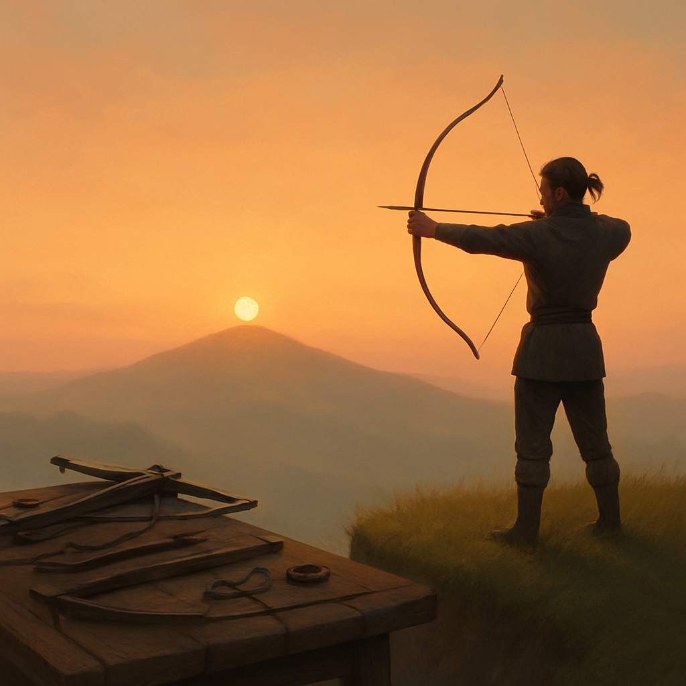

# Por que o recorte do jogo-alvo vem antes de qualquer decisão de engine

## O que é?

Projetos pessoais de gamedev morrem, em sua enorme maioria, por uma mesma causa: o autor começou a escolher ferramenta antes de saber o que estava construindo. "O recorte vem antes da engine" é o princípio de que a especificação compacta do jogo-alvo — suas mecânicas não-negociáveis, sua fronteira de MVP, o que explicitamente fica de fora — precisa existir **antes** de qualquer comparação de engine, linguagem ou arquitetura. Sem esse recorte fixado, a escolha de ferramenta vira gosto pessoal e o escopo engorda sem freio.

## Explicação técnica

Um **recorte do jogo-alvo** é uma especificação breve mas fechada que responde, com precisão, quatro perguntas:

1. **Qual é o inventário de mecânicas não-negociáveis?** (top-down em grid, tile-a-tile, NPCs com diálogo, combate por turnos, party, mundo persistente.)
2. **Qual é a fronteira do MVP jogável?** (mapa navegável + combate funcional + dois clientes vendo o mesmo mundo.)
3. **O que explicitamente fica de fora?** (captura, evolução, sistema completo de tipos, dezenas de mapas — fora por decisão, não por esquecimento.)
4. **Qual é a trilha incremental até esse MVP?** (blocos encadeados, cada um com entregável testável.)

Formalmente, é uma versão compactada de dois artefatos clássicos da literatura de gamedev: o **Game Design Document (GDD)**, que descreve o jogo completo, e o **Minimum Viable Product (MVP)**, que descreve a menor versão que prova o núcleo jogável. O recorte do jogo-alvo é o cruzamento útil dos dois: o suficiente para fundamentar decisões técnicas, nada além.

A razão pela qual essa ordem é obrigatória é de **dependência causal** entre decisões técnicas. Cada engine é boa em algumas coisas e ruim em outras por projeto, não por acaso: Phaser brilha em 2D para web mas não tem multiplayer de alto nível nativo; Unity cobre quase tudo ao preço de curva e licença; Godot acerta o ponto ótimo para 2D com multiplayer nativo sob MIT — **se** o recorte exige 2D + multiplayer. Sem recorte, você está escolhendo ferramenta sem conhecer a tarefa.

Duas falhas clássicas que essa ordem previne:

- **Engine-first (análise-paralisia).** Comparar engines em abstrato vira debate filosófico porque todo comparativo tem viés. É o recorte que transforma "Godot vs. Unity" em uma decisão objetiva ("qual atende este conjunto fixo de exigências com menor custo?").
- **Scope creep (inchaço de escopo).** Surveys com indie devs apontam "escopo grande demais" como causa principal de abandono em mais de 70% dos casos. Um recorte explícito com "o que fica de fora" é a defesa anti-escopo: quando a tentação de adicionar uma mecânica aparece, você confere contra o recorte em vez de decidir no impulso.

## Exemplo concreto

Imagine dois engenheiros, **Ana** e **Bruno**, ambos decididos a fazer "um jogo tipo Pokémon online".

**Bruno pula o recorte.** Abre o Reddit, lê três threads sobre engines, assiste dois vídeos no YouTube ("Unity vs Godot 2026"), instala Unity porque tem mais tutoriais. Começa pelo que acha legal: modela um Pokémon em 3D. Depois tenta um sistema de captura. Depois percebe que quer online, mas configurar Mirror no Unity dá trabalho — então adia. Três meses depois tem um dungeon 3D sem gameplay definido, nenhum combate funcional, nenhum online, e uma pasta de assets abandonados. Desiste.

**Ana faz o recorte primeiro.** Escreve, em uma página:

- **Inventário não-negociável:** top-down em grid, movimento tile-a-tile, combate por turnos simplificado (sem tipos), NPCs com diálogo, party de até três criaturas, dois clientes vendo o mesmo mundo.
- **Fora do MVP:** captura, evolução, sistema de tipos, shiny, trade, dezenas de mapas — explicitamente.
- **Fronteira do MVP:** um mapa navegável, uma batalha funcional, dois clientes sincronizados.
- **Trilha:** (1) fundamentos da engine, (2) sistemas Pokémon-like offline, (3) rede, (4) pipeline de assets.

Com isso na mão, a comparação de engine vira prática: "preciso de 2D com tilemap, multiplayer de alto nível nativo, rodar solo sem royalty e ter hot reload decente". A resposta cai para Godot 4 em minutos, não em semanas. Quando a tentação de adicionar "sistema de tipos" aparece no mês 2, Ana confere o recorte e responde "fora do MVP — depois do protótipo funcionar".

A diferença entre Ana e Bruno não é talento nem stack; é **ordem de operações**.

## Intuição

Pense em construir uma casa. Se você começa comprando ferramentas antes de desenhar a planta, acaba com uma garagem cheia de serras que cortam mal o tipo de madeira que você precisa. A planta não é a casa — é um pedaço de papel barato — mas é ela que determina se a marreta ou o martelo de unha é a ferramenta certa. Sem planta, toda ferramenta parece potencialmente útil, e é assim que a garagem entope.

Uma analogia mais próxima da sua bagagem: é o mesmo princípio de **escolher um banco de dados só depois de entender o padrão de acesso**. Ninguém com experiência em engenharia de dados adota Cassandra antes de saber se os reads são point-lookups ou scans amplos; ninguém escolhe DynamoDB sem saber o access pattern. Gamedev funciona igual — a engine é o banco, o recorte é o access pattern.

**Onde a analogia quebra:** em engenharia de dados o padrão de acesso, uma vez entendido, muda pouco; em gamedev pessoal, o recorte é pressionado o tempo todo pela sua própria vontade de adicionar features. Por isso o recorte precisa ser **escrito** — oralmente ele cede; no papel, ele resiste.

## Síntese

Decidir a engine antes do recorte é escolher a ferramenta antes de descrever a peça — eficaz só por acaso, caro por consequência. O recorte é o contrato contra seu próprio entusiasmo: escrito, ele protege o projeto de scope creep; fixado, ele transforma comparação de engines em decisão em vez de debate. Este conceito é o porteiro dos próximos seis conceitos deste subcapítulo — o inventário de mecânicas, a definição de MVP, a fronteira concreta do protótipo, o que fica de fora, o twist do online e a trilha incremental só fazem sentido depois que você aceita que o recorte vem primeiro.

## Fontes utilizadas

- [Scope Creep: The Silent Killer of Solo Indie Game Development (Wayline)](https://www.wayline.io/blog/scope-creep-solo-indie-game-development)
- [Why Scope Is the Most Dangerous Enemy of Indie Games (All That's Epic)](https://allthatsepic.com/blog/why-scope-is-the-most-dangerous-enemy-of-indie-games)
- [How to Choose the Right Game Engine (Wayline)](https://www.wayline.io/blog/how-to-choose-the-right-game-engine)
- [What is an MVP? Starting Game Production (Tiny Colony / Medium)](https://medium.com/@TinyColonyGame/what-is-an-mvp-starting-game-production-40f5a552856d)
- [Baby Steps in Game Development: Discovery-Only, Alpha Release, Prototype, or MVP? (Filament Games)](https://www.filamentgames.com/blog/baby-steps-in-game-development-discovery-only-alpha-release-prototype-or-mvp/)
- [Game design document (Wikipedia)](https://en.wikipedia.org/wiki/Game_design_document)
- [The Best Way to Approach Game Development as a Solo Indie Dev (Stackademic)](https://blog.stackademic.com/the-best-way-to-approach-game-development-as-a-solo-indie-dev-without-losing-your-mind-maintaining-2fcf4523371b)
- [5 common new game developer mistakes (Unity)](https://unity.com/how-to/beginner/5-common-new-game-developer-mistakes)
