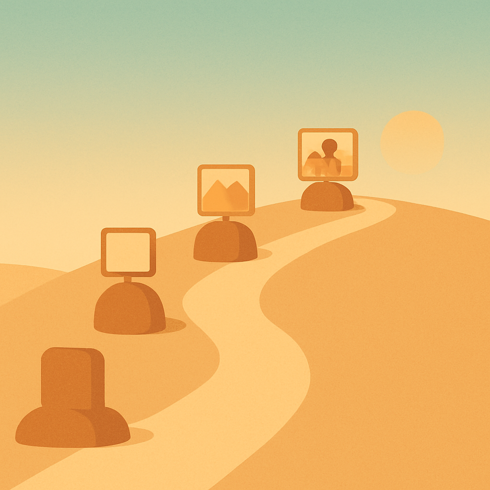

# A trilha incremental até o MVP

## O que é?

Projeto pessoal de gamedev morre porque o desenvolvedor passa meses construindo peças soltas — arte aqui, sistema de combate ali, prototipo de rede noutro canto — e nunca tem um jogo rodando. A trilha incremental é a contramedida: dividir o caminho até o MVP em **blocos sequenciais**, onde cada bloco **depende apenas do anterior** e termina em um **entregável testável**, ou seja, algo que dá para abrir, rodar e jogar, mesmo que feio e incompleto. No recorte deste livro, são quatro blocos: fundamentos do Godot, sistemas Pokémon-like single-player, camada online, e pipeline de assets com AI.

## Explicação técnica

A trilha é uma aplicação direta de **iterative development** ao recorte do MVP: em vez de entregar tudo de uma vez ao final (modelo waterfall — onde o "jogo" só existe no mês 12 e até lá você está construindo partes mortas), você entrega um jogo *pior* ao fim do bloco 1, *menos pior* ao fim do bloco 2, e assim por diante. Cada bloco é um **playable increment**: um estado do repositório em que `godot --path .` abre algo jogável.

O antipadrão que essa estrutura evita tem nome na literatura ágil de gamedev: **component factory** — arte fabrica sprites num canto, código fabrica sistemas noutro, design escreve documentos, e nada é integrado em um estado jogável até uma data futura. É o modo mais confiável de produzir um "pile of parts" que nunca vira um jogo. A trilha incremental força integração contínua: ao fim de cada bloco, tudo que foi construído até ali está compondo um executável.

Os quatro blocos deste livro, com suas dependências:

1. **Fundamentos de Godot (capítulos 2–6)** — `Node`, `Scene`, árvore de cena, `_process` / `_physics_process`, GDScript, `signals`, `Sprite2D` / `AnimatedSprite2D`, `Resource`, `TileMap` / `TileMapLayer` / `TileSet`. Entregável: um personagem animado andando sobre um mapa de tiles com colisão.
2. **Sistemas Pokémon-like single-player (capítulos 7–11)** — movimento em grid tile-a-tile, câmera, transições entre mapas, NPCs com diálogo, combate por turnos, party, inventário, persistência local em `user://`. Entregável: um Pokémon mínimo single-player, rodando em um cliente só, salvando em disco.
3. **Camada online (capítulos 12–14)** — `ENetMultiplayerPeer` ou `WebSocketMultiplayerPeer`, arquitetura cliente-servidor com servidor dedicado em modo headless, `MultiplayerSynchronizer` para replicação, autoridade do servidor, persistência server-side (banco no servidor, contas). Entregável: dois clientes conectados ao mesmo servidor veem o mesmo mapa, veem um ao outro se movendo, e o estado persiste entre sessões.
4. **Pipeline de assets com AI (capítulo 15)** — geração de sprites, tilesets e trilha sonora via OpenAI / Midjourney / modelos de música, pós-processamento para o formato do Godot (folhas de sprite, paleta indexada, loops), integração com o projeto. Entregável: o MVP do bloco 3 visualmente re-skinnado com assets gerados pelo pipeline.

Três regras que selam o design da trilha:

- **Dependência estritamente ascendente.** O bloco N não assume nada além do bloco N-1. Movimento em grid (bloco 2) depende de `TileMap` (bloco 1), não da arquitetura de rede. Isso impede commits especulativos que desfazem depois.
- **Entregável testável, não polido.** O fim de cada bloco é um "first playable" no sentido de Rami Ismail — algo que *roda*, não algo vendável. Quadrado branco sobre grid cinza é um entregável válido do bloco 1.
- **O risco técnico de cada bloco cabe no bloco.** Sincronização de estado é difícil — por isso está isolada no bloco 3, em cima de um single-player que já funciona. Tentar sincronizar um combate que ainda não existe é o caminho curto para a paralisia.

## Exemplo concreto

Imagine que você parou no fim do capítulo 11. O que existe no seu projeto Godot?

Existe uma cena `World.tscn` com um `TileMapLayer` pintado à mão — três ou quatro mapas pequenos, ligados por zonas de transição. Um `Player.tscn` instanciado nela: `CharacterBody2D` com um `AnimatedSprite2D` de quatro direções, um script que lê `Input.is_action_pressed("ui_up/down/left/right")` e move o personagem tile-a-tile com interpolação. Três `NPC.tscn` espalhados pelos mapas, cada um com um script que dispara um diálogo via `signal` quando o jogador aperta a tecla de interação perto dele. Uma cena `Battle.tscn` que carrega quando um NPC do tipo "treinador" é acionado, com uma party de 3 criaturas de cada lado, menu de ataques, cálculo de dano e condição de vitória. Ao apertar F5, você joga um Pokémon minúsculo, salva em `user://save.tres`, fecha, reabre, e o progresso está lá.

É **feio**: sprites placeholder, só 3 mapas, 4 ataques no total, sem captura, sem tipos, sem evolução. Mas é **jogável**. Esse é o entregável do bloco 2. Se o projeto for abandonado aqui por qualquer motivo, você não tem um amontoado de peças — você tem um jogo que roda.

Agora começa o bloco 3. A primeira coisa que você faz **não** é reescrever o combate para ser multiplayer. É extrair um servidor headless que autoriza o estado do mundo e fazer dois clientes se moverem nele simultaneamente. Combate multiplayer só entra quando o andar sincronizado já está verde. Se você tivesse tentado sincronizar tudo de uma vez, ficaria preso no acoplamento entre sistemas ainda instáveis. Como a trilha é incremental, cada coisa de cada vez.

Contraexemplo do mesmo ponto: um desenvolvedor que ignora a trilha decide, no mês 1, já estruturar "corretamente" a arquitetura cliente-servidor do jogo inteiro, com banco de dados, contas e replicação, antes de ter um `TileMap` funcionando. Três meses depois tem um servidor que autoriza nada, porque não há gameplay para autorizar. É o component factory em ação.

## Síntese

A trilha incremental converte o recorte do MVP em uma sequência de quatro estados do repositório, cada um jogável por si só, cada um construído estritamente sobre o anterior: fundamentos, sistemas single-player, camada online, pipeline com AI. Ela existe porque gamedev pessoal morre por falta de integração contínua, não por falta de ambição; um projeto que sempre tem "algo que roda" é um projeto que sobrevive a pausas, a dúvidas e a mudanças de direção. Essa trilha é o fio narrativo que conecta o alvo do recorte (definido nos conceitos 1–6 deste subcapítulo) aos capítulos concretos que virão depois — a escolha do Godot no próximo subcapítulo só passa a fazer sentido porque sabemos exatamente quais blocos a engine precisa suportar.

## Fontes utilizadas

- [Milestones — Levelling The Playing Field (Rami Ismail)](https://ltpf.ramiismail.com/milestones/)
- [Game Dev Glossary: Prototype, Vertical Slice, First Playable, MVP, Demo (askagamedev)](https://www.tumblr.com/askagamedev/746300998961741824/game-dev-glossary-prototype-vertical-slice)
- [Iterative Development: Are You Building a Playable Game, or Just a Pile of Parts? (Codecks)](https://www.codecks.io/blog/iterative-development-are-you-building-a-playable-game-or-just-a-pile-of-parts/)
- [Agile Game Development is Hard (Game Developer)](https://www.gamedeveloper.com/programming/agile-game-development-is-hard)
- [What Is A Vertical Slice? Exploring Key Concepts And Benefits (GIANTY)](https://www.gianty.com/vertical-slice-game-development/)
- [Game Project Milestones: Efficient Planning for Indie Game Developers (Wayline)](https://www.wayline.io/blog/game-project-milestones-indie-devs-planning)
- [High-level multiplayer — Godot Engine documentation](https://docs.godotengine.org/en/stable/tutorials/networking/high_level_multiplayer.html)
- [Multiplayer in Godot 4.0: Scene Replication (Godot Engine)](https://godotengine.org/article/multiplayer-in-godot-4-0-scene-replication/)

---

**Próximo subcapítulo** → [Panorama de Engines 2D em 2026](../../02-panorama-de-engines-2d-em-2026/CONTENT.md)
