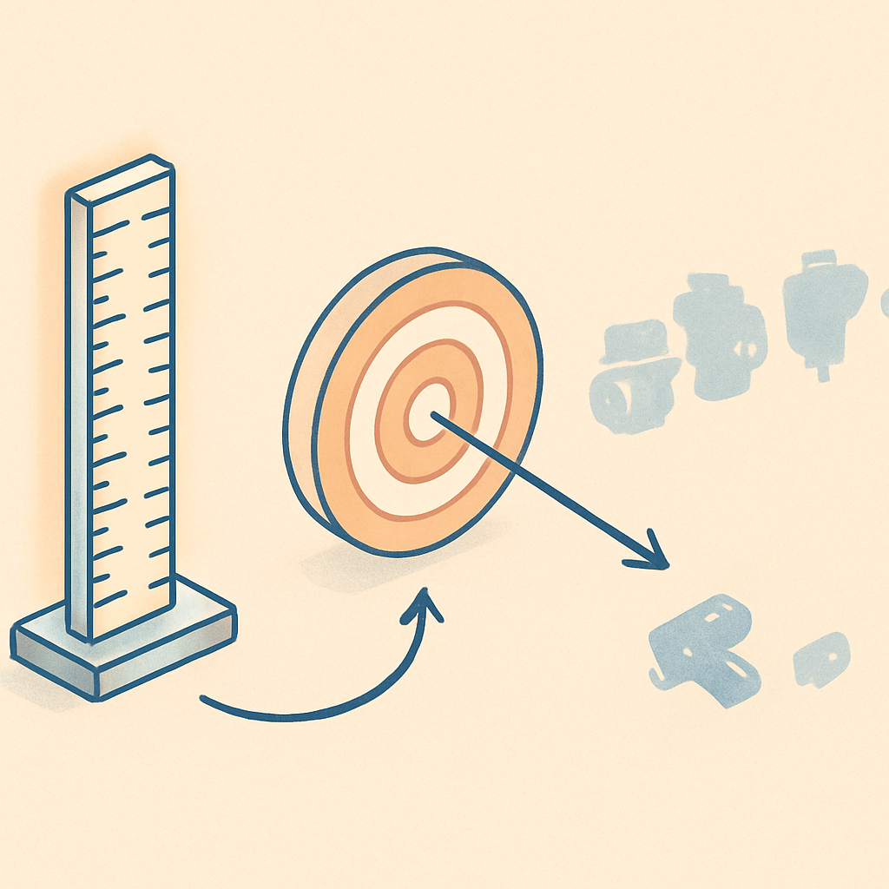

# O Critério de Avaliação Antes da Lista

Comparar engines sem um alvo fixado é como comparar facas de cozinha sem saber para que vai cozinhar — você acumula fatos verdadeiros e inúteis ao mesmo tempo. "Unity tem a maior Asset Store", "Godot é open-source", "Phaser gera builds pequenas para o browser" são afirmações corretas que não ajudam a tomar nenhuma decisão enquanto não existe um projeto concreto por trás delas. O critério de avaliação é exatamente isso: o conjunto de dimensões mensuráveis, derivadas das exigências reais do seu projeto, que transforma uma lista de engines em uma ferramenta de decisão.

A lógica é direta. Uma engine é uma ferramenta, e ferramentas só se comparam de forma útil quando há um trabalho específico a fazer. A mesma engine excelente para um endless runner mobile pode ser péssima para um RPG top-down online — não porque seja uma engine ruim, mas porque as exigências do projeto ativam dimensões diferentes. Por isso, o primeiro passo não é "quais engines existem?", mas "quais são as exigências inegociáveis do meu projeto?".

Para este projeto — um RPG 2D top-down online no molde de Pokémon Fire Red, desenvolvido por um engenheiro de software sênior sem histórico em gamedev —, sete dimensões emergem das exigências do jogo:

| # | Dimensão | Por que importa para este projeto |
|---|----------|-----------------------------------|
| 1 | **Pipeline 2D nativo** | O jogo é 100% 2D top-down. Engines que tratam 2D como bolt-on sobre uma base 3D geram fricção constante: editor orientado ao 3D, sistemas de TileMap de segunda classe, configuração extra para colisão e câmera ortogonal. |
| 2 | **Multiplayer de alto nível embutido** | O jogo é online desde o MVP. Engine sem suporte nativo robusto joga o peso da camada de rede para o desenvolvedor — protocolos, serialização de estado, autoridade de servidor, tick rate — tudo a implementar do zero ou via lib de terceiro. |
| 3 | **Custo de aprendizado para o perfil do leitor** | O leitor pensa em sistemas e arquitetura (engenheiro sênior), mas não tem modelo mental de game loop, nodes ou scenes. A pergunta não é "a engine é simples?" mas "a curva faz sentido dado o que ele já sabe?". |
| 4 | **Licença e modelo de negócio** | Engines com royalties sobre receita ou com histórico de mudanças abruptas de licenciamento introduzem risco de negócio mesmo em projetos pessoais de longa duração. Licença MIT ou equivalente elimina essa variável. |
| 5 | **Footprint e tempo até o primeiro frame jogável** | Quanto tempo desde `git clone` até o personagem se mover na tela? Engines pesadas atritam exatamente quando a motivação mais precisa ser sustentada por feedback rápido. |
| 6 | **Ergonomia do editor para 2D** | O editor visual é a interface principal durante o desenvolvimento. Editores pensados para 3D com 2D adicionado depois têm atrito constante: câmera errada por padrão, inspector cheio de eixos que não existem no jogo, layers pouco intuitivas. |
| 7 | **Ecossistema e documentação** | Quantidade de tutoriais, qualidade da documentação oficial, tamanho da comunidade. Para quem aprende do zero, um ecossistema rico vale tanto quanto features técnicas — é o que diminui o tempo parado esperando resposta. |

Essas sete dimensões não têm peso igual. Para este projeto, as dimensões 1 (pipeline 2D nativo) e 2 (multiplayer embutido) são **eliminatórias** — uma engine fraca em qualquer uma delas exige trabalho de infraestrutura que não faz parte do aprendizado que o livro propõe. As demais funcionam como fatores de desempate entre as candidatas que sobreviverem ao crivo inicial.

O papel do critério na estrutura deste subcapítulo é estabelecer a régua antes de apresentar qualquer engine. Sem ele, cada seção seria uma coleção de fatos isolados; com ele, cada conceito seguinte se torna uma aplicação do mesmo filtro — o leitor não precisa memorizar as características de cada engine separadamente, só precisa ver onde cada uma passa ou falha no mesmo conjunto de dimensões. O mapa de trade-offs consolidado no último conceito do subcapítulo só faz sentido porque existe uma régua comum desde o início.

## Fontes utilizadas

- [10 Criteria for Adopting a Game Engine (LinkedIn)](https://www.linkedin.com/pulse/10-criteria-adopting-game-engine-oluwaseye-ayinla)
- [4 Steps to Choose the Best Game Engine for Indie Developers (Techneeds)](https://www.techneeds.com/2025/08/04/4-steps-to-choose-the-best-game-engine-for-indie-developers/)
- [Picking a Game Engine in 2025 (Without Crying) — GameDev.net](https://gamedev.net/blogs/entry/2295692-picking-a-game-engine-in-2025-without-crying/)
- [Right Game Engine for 2D Game Development Project (Tekrevol)](https://www.tekrevol.com/blogs/choosing-the-right-game-engine-for-your-2d-game-development-project/)
- [Evaluating the Efficiency of General Purpose and Specialized Game Engines for 2D Games (Purdue)](https://hammer.purdue.edu/articles/thesis/Evaluating_the_efficiency_of_general_purpose_and_specialized_game_engines_for_2D_games/25674288)

**Próximo conceito →** [Unity — a Engine Generalista de Mercado](../02-unity-a-engine-generalista-de-mercado/CONTENT.md)
