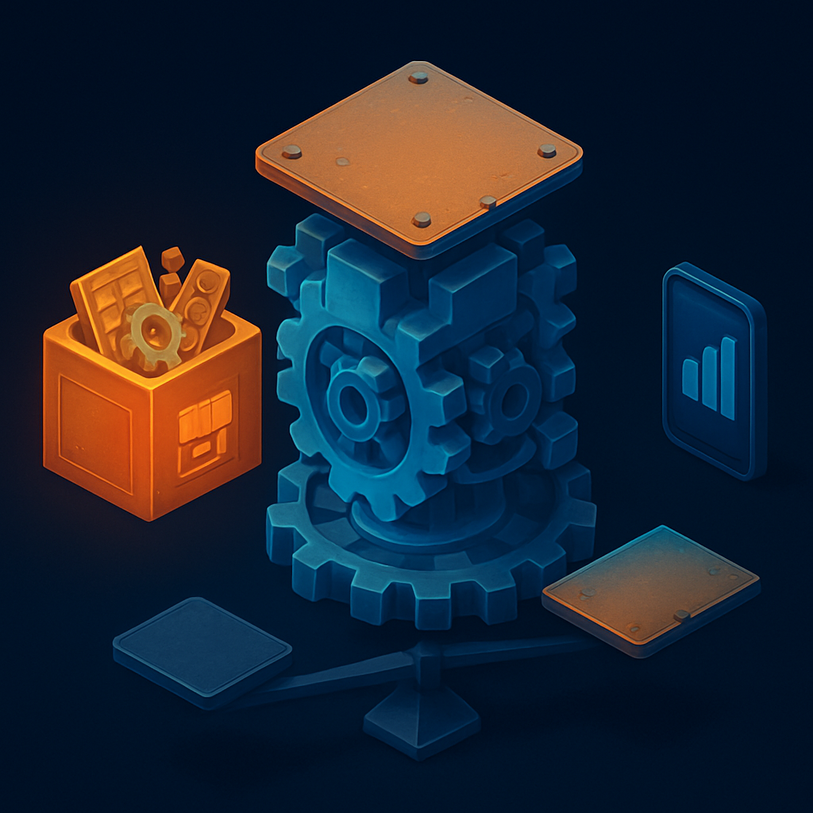

# Unity — a Engine Generalista de Mercado

Com as sete dimensões do critério de avaliação estabelecidas, Unity é a primeira candidata natural a entrar no crivo — e a mais óbvia. Mais de 50% de todos os jogos mobile e 51% dos jogos lançados na Steam em 2024 foram feitos com ela. Para quem chega de fora do gamedev, "qual engine usar?" frequentemente termina em Unity por inércia de mercado. Mas a dominância de market share é um dado sobre adoção, não sobre adequação ao projeto — e ao aplicar as sete dimensões, a imagem fica mais nuançada.

**Dimensão 1 — Pipeline 2D nativo:** Unity nasceu em 2005 como engine 3D. O suporte nativo a sprites chegou na versão 4.3 em 2013 — quase uma década depois. Isso não é detalhe histórico: por baixo dos panos, um jogo 2D em Unity ainda opera sobre a mesma pilha de renderização 3D. A câmera perspectiva é convertida para ortogonal por configuração, o `Transform` carrega três eixos (o Z existe só para ordenação de camadas), e o `SpriteRenderer` emite meshes planas para um pipeline concebido para geometria volumétrica. O editor aberto em modo 2D ainda exibe `Position Z`, `Rotation X`, `Rotation Y` no inspector — eixos que não existem no jogo, mas que estão sempre presentes. O sistema de `TileMap` chegou em 2018 e evoluiu bastante, mas recursos como `TileMapLayer` separadas, regras de autotile e física integrada ao tilemap exigem configuração manual ou plugins que em engines 2D nativas vêm por padrão. Para o critério estabelecido no conceito anterior: **falha parcial** na dimensão 1 — a engine funciona para 2D, mas com atrito constante, não com suporte de primeira classe.

**Dimensão 2 — Multiplayer de alto nível embutido:** Unity não tem uma solução de multiplayer unificada e integrada. A oferta atual é uma pilha de pacotes opcionais que precisam ser compostos manualmente:

| Solução | Paradigma | Limite prático | Quando usar |
|---------|-----------|----------------|-------------|
| **Netcode for GameObjects (NGO)** | MonoBehaviour tradicional | ~64 jogadores/sessão | Jogos cooperativos simples |
| **Netcode for Entities (NFE)** | ECS/DOTS | Sem limite fixo | Competitivo com predição/interpolação |
| **Unity Gaming Services (UGS)** | Cloud (relay, matchmaking) | Custo variável | Complemento a NGO/NFE |

Para um RPG online server-authoritative no molde de Pokémon — onde o servidor sincroniza posições, estado de combate e inventário para múltiplas sessões simultâneas —, o NGO sozinho fica curto; o NFE exige aprender ECS (um paradigma substancialmente diferente do MonoBehaviour convencional) ao mesmo tempo que se aprende a própria engine. O ponto crítico é que NGO assume client-authority por padrão em várias partes da API: mudar para server-authoritative exige entender a diferença entre `ServerRpc`, `ClientRpc` e `NetworkVariable` com permissões customizadas antes do segundo jogador aparecer na tela. **Falha na dimensão 2 como eliminatória** — a stack existe, mas não é "embutida de forma integrada"; é um conjunto de escolhas e configurações que aumentam a carga cognitiva para quem está aprendendo gamedev ao mesmo tempo.

**Dimensão 3 — Custo de aprendizado:** Unity usa C# como linguagem principal. Para um engenheiro sênior confortável com Java ou Kotlin, a sintaxe é familiar, mas a curva não vem da linguagem — vem do modelo de componentes (`MonoBehaviour`), do ciclo de vida do GameObject (`Awake`, `Start`, `Update`, `FixedUpdate`, `OnDestroy`), das coroutines com `IEnumerator` (que são uma forma de cooperative multitasking, não async/await real), e do `async/await` que *não* se comporta como em .NET padrão dentro do contexto de game loop. Um engenheiro de back-end que já trabalhou com fibers ou generators vai reconhecer a mecânica de coroutines rapidamente, mas vai se surpreender com as limitações (não pode fazer `await` dentro de um método `IEnumerator`, não pode usar `Task.Delay` sem thread overhead). **Custo razoável** para um engenheiro sênior, mas não baixo.

**Dimensão 4 — Licença e modelo de negócio:** Em setembro de 2023, Unity anunciou um "Runtime Fee" — cobrança por instalação depois que o projeto ultrapassasse determinado faturamento. A reação foi imediata: estúdios ameaçaram migrar em massa e o Godot entrou no radar de equipes grandes pela primeira vez como alternativa real. Unity recuou e cancelou o Runtime Fee em setembro de 2024, substituindo-o por aumento nos preços das assinaturas Pro e Enterprise. O plano Personal continua gratuito, mas o episódio deixou um sinal claro: a empresa demonstrou disposição de alterar retroativamente as condições de uso de projetos em desenvolvimento. Para um projeto de longa duração, isso é exatamente o tipo de variável de risco que engenheiros acostumados a pensar em SLAs e contratos de serviço reconhecem de imediato. **Sinal de alerta na dimensão 4** — não eliminatório para um projeto pessoal no plano gratuito, mas não ignorável.

**Dimensão 7 — Ecossistema:** É aqui que Unity genuinamente vence. A Asset Store tem mais de 60.000 pacotes. A comunidade é a maior do gamedev: Stack Overflow, Reddit, YouTube, tutoriais em dezenas de idiomas. A probabilidade de encontrar resposta pronta para qualquer dúvida técnica é altíssima — o que tem valor real especialmente no início da curva de aprendizado. **Excelente na dimensão 7.**

Aplicando o filtro das dimensões eliminatórias: Unity apresenta atrito claro na dimensão 1 (2D bolt-on sobre base 3D) e falha como eliminatória na dimensão 2 (multiplayer fragmentado, não embutido). A dimensão 4 adiciona um terceiro fator de risco que não existia antes de 2023. O ecossistema excepcional (dimensão 7) não compensa as falhas nas dimensões que foram definidas como eliminatórias — e esse é exatamente o papel do critério: evitar que o ponto forte mais visível ofusque os pontos fracos nas dimensões que realmente importam para o projeto.

## Fontes utilizadas

- [Unity (game engine) — Wikipedia](https://en.wikipedia.org/wiki/Unity_(game_engine))
- [Unity is Canceling the Runtime Fee — Unity Blog](https://unity.com/blog/unity-is-canceling-the-runtime-fee)
- [Unity scraps controversial Runtime Fee but raises prices — CG Channel](https://www.cgchannel.com/2024/09/unity-scraps-controversial-runtime-fee-but-raises-prices/)
- [Netcode for GameObjects — Unity Multiplayer Docs](https://docs-multiplayer.unity3d.com/netcode/current/about/)
- [Games Made with Unity Engine: Dominating 50% of the Mobile Market — Cubix](https://www.cubix.co/blog/50-of-all-mobile-games-are-developed-on-cross-platform-engine-unity/)
- [Godot vs Unity in 2026: Which Engine Should Indie Developers Choose? — DEV Community](https://dev.to/linou518/godot-vs-unity-in-2026-which-engine-should-indie-developers-choose-50g4)

**Próximo conceito →** [Phaser — o Framework JavaScript para Web](../03-phaser-o-framework-javascript-para-web/CONTENT.md)
