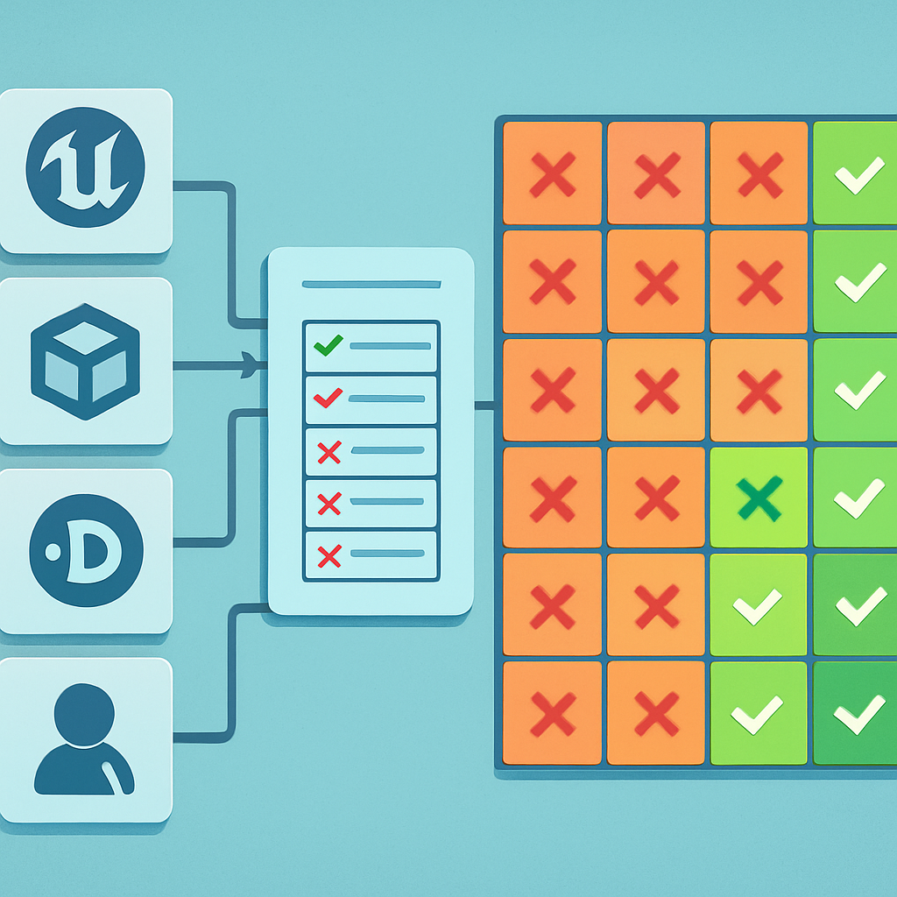

# O Mapa de Trade-offs Consolidado

Depois de passar Unity, Phaser, GameMaker, Defold, Construct e Unreal pelas mesmas sete dimensões, o que sobra não é uma lista de engines ruins — é um mapa de por que cada uma falha especificamente para este projeto. A falha de cada candidata tem uma geometria própria, e reconhecer essa geometria é o que transforma o panorama numa decisão fundamentada.

A tabela abaixo reúne tudo em uma única leitura. As células em negrito marcam as dimensões eliminatórias (pipeline 2D nativo e multiplayer embutido) — as duas dimensões que, quando falham, encerram a conversa independente de quantos pontos a engine marca nas demais.

| Dimensão | Unity | Phaser | GameMaker | Defold | Construct | Unreal | **Godot 4** |
|----------|-------|--------|-----------|--------|-----------|--------|-------------|
| **Pipeline 2D nativo** | **Bolt-on sobre 3D** — Z existe no inspector, câmera precisa ser configurada para ortogonal, TileMap de segunda classe | Nasceu para 2D, sem herança 3D — sem atrito de pipeline | Excelente, 2D de primeira classe desde sempre | Bom, TileMap nativo, sem base 3D | Bom para projetos simples | **Paper2D abandonado** — editor abre em 3D por padrão, eixos Z/Y em todo inspector | **Nativo e de primeira classe** — TileMapLayer com autotile, AnimatedSprite2D, física 2D integrada, pixel-perfect como checkbox |
| **Multiplayer embutido** | **Falha** — NGO + NGE + UGS: três pacotes separados, client-authority por padrão, server-auth exige configuração extra antes de qualquer mecânica funcionar | **Falha eliminatória** — zero nativo; toda camada de rede é código de aplicação (Colyseus/Socket.io external) | **Falha** — rollback networking voltado a jogos de luta; RPG server-auth exige Node.js externo igual ao Phaser | **Falha** — Photon Realtime externo, para sessões curtas; mundo persistente inteiramente por conta do dev | **Falha** — WebRTC peer-to-peer sem servidor dedicado; servidor real = stack externa custom | Replicação robusta via `UPROPERTY(Replicated)` e RPC — mas projetada para 3D AAA, sem atalho pelo recorte 2D | **Alta nível nativo** — `MultiplayerSynchronizer`, `MultiplayerSpawner`, ENet e WebSocket embutidos; server-authoritative é o modelo padrão |
| Custo de aprendizado | C# familiar, mas MonoBehaviour, coroutines com `IEnumerator` e `async/await` não-padrão têm armadilhas reais | JS/TS familiar; sem editor como guia, a curva vem da arquitetura a construir manualmente | GML proprietário — reconhecível, mas sem generics, interfaces, módulos; projetos grandes acumulam colisões de nome | Lua + message passing assíncrono — curva diferente, debugar por logs de mensagem em vez de stack trace | Event Sheets até certo ponto; JS depois — duas curvas, dois paradigmas | C++ com macros `UCLASS`/`UPROPERTY`, garbage collector customizado, Blueprints que não escalam — a mais íngreme de todas | **GDScript inspirado em Python** — engenheiro com Java/Kotlin produtivo em horas; node-scene mapeia diretamente ao pensamento em sistemas |
| Licença e modelo de negócio | Personal gratuito, Pro $1.200–$2.400/mês; histórico de Runtime Fee revertido após pressão — risco de retroatividade documentado | MIT — sem restrições | Gratuito não-comercial; $99,99 vitalício para comercial | Permissiva própria (não MIT), gratuita para uso comercial | Assinatura mensal obrigatória (~$99/ano); exportação bloqueada sem assinatura ativa | Gratuita com 5% de royalty acima de $1 milhão de receita — não eliminatório para projeto pessoal | **MIT irrevogável** — sem royalties, sem thresholds de receita, sem assinaturas; o Godot Foundation não pode alterar retroativamente o que já foi distribuído |
| Footprint e tempo até o primeiro frame | Médio — setup razoável, Asset Store compensa parte da configuração inicial | Excelente — bundle estático, abre no browser em segundos | Razoável | Excelente — runtime ~2MB compilado nativo | Excelente — editor no browser, zero instalação | **Pesadíssimo** — 60 a 115 GB em disco antes de escrever uma linha de código; Epic Games Launcher como overhead estrutural | **~80 MB** — editor completo; personagem se movendo na tela em minutos após o download |
| Ergonomia do editor para 2D | Inspector com eixos Z/Rotation X que não existem no jogo; câmera perspectiva convertida manualmente; TileMap funcional mas com configuração extra | **Sem editor** — todo ajuste de tilemap é ciclo externo: Tiled → exportar JSON → recarregar no browser | Room Editor, Sprite Editor, Tile Layer dedicados — bom para 2D | Bom, hot reload, editor funcional para 2D | Bom para projetos simples, mas browser-only — restrições de integração com pipeline local | **3D por padrão** — câmera perspectiva, Lumen, Nanite na interface; trabalhar em top-down 2D exige configurar manualmente o que deveria ser o estado padrão | **2D por padrão** — viewport ortogonal, inspector com Position X/Y apenas, camadas de tilemap com autotile acessíveis em dois cliques |
| Ecossistema e documentação | Mais rico de todos — 60.000+ assets, Stack Overflow, YouTube, tutoriais em dezenas de idiomas | Bom para jogos casuais no browser; documentação fina para RPG complexo online | Médio — fórum ativo, tutoriais de qualidade variável para projetos complexos | Pequeno — resposta rápida da equipe no Discord, mas volume de conteúdo sobre RPG top-down/multiplayer é fração do que existe em Godot | Pequeno a médio — voltado a iniciantes e jogos simples | Grande para 3D AAA — escasso para Paper2D e RPG top-down em específico | **Crescente e acelerado** — docs oficiais com exemplos de multiplayer e tilemaps, GDQuest, YouTube, comunidade que mais cresceu no GitHub em 2024/2025 |

O padrão que emerge ao olhar a tabela inteira é que **as falhas nas dimensões eliminatórias não são distribuídas uniformemente** — elas convergem em dois pontos cegos que se repetem em quase todas as candidatas. Primeiro, multiplayer nativo server-authoritative: Unity entrega via composição de pacotes, não via integração coesa; Phaser, GameMaker, Defold e Construct empurram o problema para uma stack externa; Unreal entrega, mas acoplado a uma maquinaria que não traz nenhum atalho para o recorte 2D. Segundo, 2D como cidadão de primeira classe: Phaser passa, GameMaker passa, Defold passa parcialmente — mas qualquer uma dessas falha em multiplayer. A intersecção de "pipeline 2D nativo de primeira classe" e "multiplayer server-authoritative embutido" forma um buraco que as alternativas deixam em aberto. É exatamente esse buraco que Godot 4 preenche.

Godot 4 não é a engine com mais assets disponíveis — Unity vence nessa dimensão sem discussão. Não tem a stack server-authoritative mais madura do mercado — Unreal tem uma replicação mais sofisticada para o contexto 3D AAA. Não tem o menor footprint — Defold e Construct ganham nesse ponto. O que Godot 4 tem é a **combinação correta de trade-offs para este projeto específico**: 2D de primeira classe, `MultiplayerSynchronizer` e ENet embutidos com modelo server-authoritative como padrão, GDScript que um engenheiro sênior vindo de qualquer linguagem dominada lê em horas, licença MIT que elimina o risco de retroatividade que Unity demonstrou ser real, e footprint que permite ter um personagem se movendo na tela em menos de uma hora a partir do download. A soma desses fatores não é coincidência — é o design intencional de uma engine construída para ser a ferramenta certa para projetos exatamente nesse recorte.

O próximo subcapítulo constrói sobre esse mapa: em vez de comparar alternativas, vai dentro do Godot — o sistema de nodes e scenes, o GDScript, os signals, o `MultiplayerSynchronizer` — provando, conceito por conceito, que as afirmações acima têm substância técnica real por trás.

## Fontes utilizadas

- [Godot vs Unity vs Unreal: The Best Engine for Your Game — VSQUAD](https://vsquad.art/blog/godot-vs-unity-vs-unreal-which-engine-really-wins)
- [Is Godot 4's Multiplayer a Worthy Alternative to Unity? — Rivet](https://rivet.dev/blog/godot-multiplayer-compared-to-unity/)
- [High-level multiplayer — Godot Engine (stable) documentation](https://docs.godotengine.org/en/stable/tutorials/networking/high_level_multiplayer.html)
- [Godot Multiplayer in 2026: What Actually Works — Ziva](https://ziva.sh/blogs/godot-multiplayer)
- [Godot vs Unity: 1 Clear Winner in 2026 — Tech Insider](https://tech-insider.org/godot-vs-unity-2026/)
- [The Best Game Engines for 2D Games in 2026 — Ziva](https://ziva.sh/blogs/best-2d-game-engines)
- [5 Engineering Decisions That Made Godot the Fastest-Growing Game Engine — DEV Community](https://dev.to/ziva/5-engineering-decisions-that-made-godot-the-fastest-growing-game-engine-5hgh)
- [Can Godot screw us like Unity did? — David Serrano](https://davidserrano.io/can-godot-screw-us-like-unity-did)
- [Top Game Engines 2026: Unity vs Unreal & More — Hitem3D](https://www.hitem3d.ai/blog/en-Top-5-Game-Engines-Compared-Unity-vs-Unreal-vs-Godot-and-More-in-2026/)
- [Godot vs Unity in 2026: Which Engine Should Indie Developers Choose? — DEV Community](https://dev.to/linou518/godot-vs-unity-in-2026-which-engine-should-indie-developers-choose-50g4)

**Próximo subcapítulo →** [Por que Godot 4 Vence para Este Projeto](../../03-por-que-godot-4-vence-para-este-projeto/CONTENT.md)
