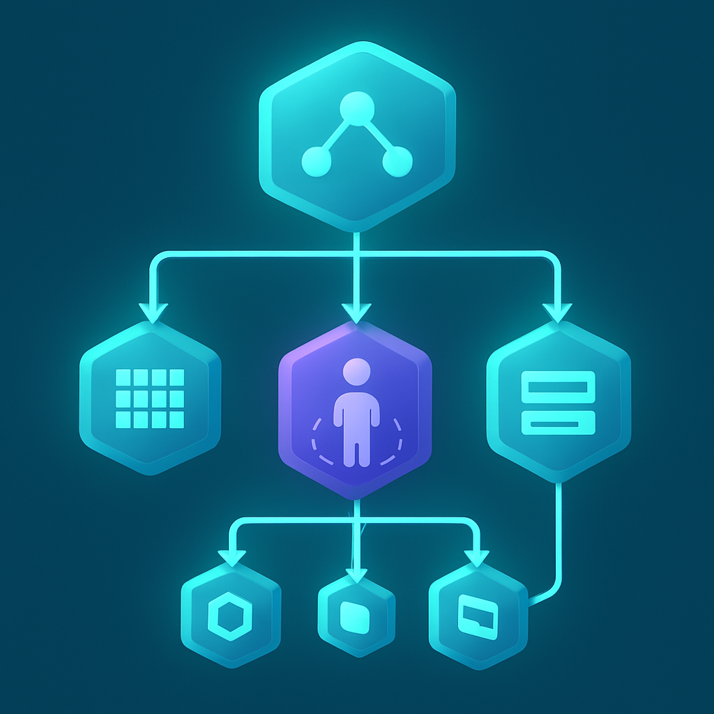
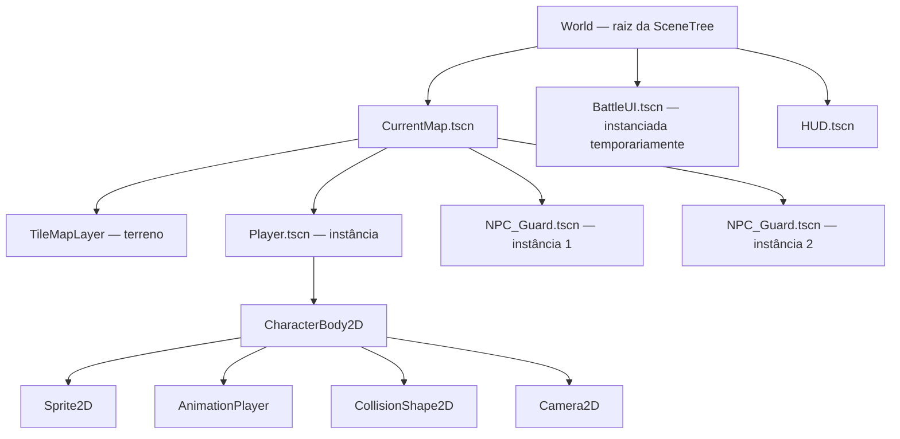

# Cena-como-Árvore: o Paradigma Central do Godot



A pergunta que abre este subcapítulo — por que o Godot 4 vence para este projeto específico — começa a ser respondida antes mesmo de olhar para multiplayer, licença ou footprint. Ela começa no modelo mental que a engine impõe ao desenvolvedor. Toda engine é, no fundo, uma tomada de decisão sobre *como você pensa sobre o seu jogo*: Unity diz que o mundo é feito de GameObjects genéricos com Components colados; Unreal diz que é feito de Actors com Blueprints herdados; o Godot diz que é feito de **árvores de nós**, e essa diferença não é superficial — ela determina como você estrutura código, como organiza assets, como pensa em reuso e como encaixa sistemas complexos sem criar dependências frágeis.

No Godot, a unidade fundamental é o **node** (nó). Um node não é um objeto genérico esperando receber comportamento via componentes colados: o node já *é* o comportamento. `Sprite2D` renderiza uma textura. `CollisionShape2D` define uma forma física. `AnimationPlayer` gerencia animações. `Camera2D` controla o viewport. Cada tipo de node carrega uma responsabilidade específica e bem delimitada, exposta como propriedades editáveis no inspetor e como métodos acessíveis em GDScript. Quando você precisa de uma entidade mais complexa, não cria um "objeto genérico com quatro comportamentos colados" — você **compõe uma árvore de nodes especializados**, onde cada node faz uma coisa bem definida e o conjunto forma a entidade.

```
CharacterBody2D          ← raiz da entidade Jogador (física)
├── Sprite2D             ← renderização do sprite
├── AnimationPlayer      ← controle de animações
├── CollisionShape2D     ← hitbox para física e colisões
└── Camera2D             ← câmera seguindo o jogador
```

Esse conjunto de nodes, salvo em disco como um arquivo `.tscn`, é uma **cena**. A cena é simultaneamente um template (um blueprint reutilizável) e uma unidade de instanciação: quando o jogo precisa de um jogador, instancia a cena `Player.tscn` — o Godot lê o arquivo, recria a árvore inteira e a insere como subárvore dentro da árvore maior do jogo. Você pode instanciar a mesma cena dezenas de vezes, e cada instância é independente com seu próprio estado, mas todas partem da mesma definição. Modificar o arquivo-template `Player.tscn` propaga a mudança para todas as instâncias futuras — comportamento análogo a um prefab do Unity, mas com uma diferença crítica: no Godot, **qualquer subárvore de nodes pode ser extraída e salva como cena**, sem cerimônia. A granularidade do reuso é sua para definir.

A **SceneTree** é o objeto singleton que gerencia o grafo de execução do jogo inteiro. Ela mantém a árvore ativa de nodes, processa o game loop (atualizando `_process` e `_physics_process` em todos os nodes ativos frame a frame), roteia input e despacha notificações do sistema como pausa, foco de janela e enceramento. Quando você chama `add_child(node)`, está literalmente inserindo um nó na árvore gerenciada pela SceneTree. Quando remove um node com `queue_free()`, ele é desligado na próxima oportunidade segura — seus callbacks `_exit_tree` disparam, recursos são liberados e a memória é devolvida.

O ciclo de vida de um node tem quatro momentos principais que importam na prática:

| Callback | Quando dispara | Uso típico |
|---|---|---|
| `_init()` | Na instanciação do objeto, antes de entrar na árvore | Inicializar variáveis internas |
| `_enter_tree()` | Quando o node é inserido na SceneTree | Registrar-se em sistemas globais |
| `_ready()` | Após o node e **todos os seus filhos** estarem prontos | Conectar signals, pegar referências a filhos |
| `_exit_tree()` | Quando o node é removido da árvore | Desregistrar-se, liberar conexões |

A ordem de `_ready` merece atenção: os filhos disparam `_ready` antes do pai. Isso significa que quando o script do `CharacterBody2D` raiz recebe `_ready`, todos os nós filhos já existem e já estão prontos — você pode chamar `$Sprite2D`, `$AnimationPlayer` e `$Camera2D` sem verificar se eles existem. Essa garantia elimina uma classe inteira de bugs de inicialização que afligem sistemas baseados em componentes com ordem de inicialização indeterminada.

A propagação de transformações segue a hierarquia: quando um node pai se move, todos os filhos se movem junto, herdando a transformação acumulada. O `Sprite2D` filho do `CharacterBody2D` sempre está na posição relativa ao pai — mover o personagem significa mover a raiz, e os filhos seguem automaticamente. Isso torna a composição física de entidades intuitiva: câmera, sprite, hitbox e overlay de UI vivem todos na mesma árvore local e se comportam como um conjunto coeso sem código de sincronização manual.

Para um RPG 2D no molde de Pokémon, esse paradigma encaixa de forma quase direta. O mapa completo de uma cidade é uma cena com um `TileMapLayer` como raiz (o tilemap do terreno), filhos para obstáculos, spawns de NPCs e triggers de transição. Os NPCs são cenas independentes instanciadas dentro do mapa — cada um com seu `CharacterBody2D`, `Sprite2D`, `AnimationPlayer` e um script de comportamento anexado à raiz. A UI de batalha é outra cena separada, instanciada temporariamente sobre o mapa durante o combate e removida da árvore ao término. O jogo inteiro, em execução, é uma árvore de cenas aninhadas:



O contraste com Unity fica nítido aqui: no Unity, um NPC é um GameObject vazio ao qual você adiciona um `SpriteRenderer` component, um `Rigidbody2D` component, um `Collider2D` component e um `NPCBehavior` MonoBehaviour. A semântica do objeto é determinada pelo conjunto de components colados — o objeto em si é neutro. No Godot, o node raiz `CharacterBody2D` *já implica* física e colisão — você escolhe o tipo certo de node como raiz e adiciona os filhos especializados para completar o conjunto. A leitura da árvore de nodes é autodocumentada: ver `CharacterBody2D > Sprite2D + CollisionShape2D + AnimationPlayer` na cena já conta a história do que essa entidade faz, sem precisar abrir scripts para descobrir quais components foram colados.

Há um princípio de comunicação que emerge naturalmente dessa hierarquia e que a documentação oficial do Godot formaliza: **"call down, signal up"**. Um node pai pode chamar métodos de seus filhos diretamente — ele tem referência a eles via `$NomeDoFilho` — porque ele os criou e os gerencia. Um node filho, ao contrário, não deve chamar métodos do pai diretamente (isso criaria acoplamento de baixo para cima, quebrando a encapsulação da cena). Em vez disso, o filho emite um **signal** (sinal), e o pai — ou qualquer outro interessado — se conecta a esse sinal para reagir. Esse padrão aparecerá com frequência ao longo do livro: o `AnimationPlayer` emite `animation_finished`, o `CharacterBody2D` raiz escuta e toma a ação apropriada. Signals são o próximo conceito neste subcapítulo, e a árvore de cenas é o contexto que os torna necessários.

Para quem vem de sistemas distribuídos e arquitetura de software, o modelo de cena-como-árvore ressoa com padrões já familiares: composição sobre herança, encapsulamento por módulo (cada cena é uma unidade coesa com interface mínima), separação clara de responsabilidades por tipo de node. O que o Godot adiciona é a *integração de runtime* — a SceneTree não é só uma estrutura de dados; é o motor que executa cada frame, propaga input e gerencia o ciclo de vida. A árvore não é decorativa; ela é operacional.

## Fontes utilizadas

- [Nodes and Scenes — Godot Engine documentation](https://docs.godotengine.org/en/stable/getting_started/step_by_step/nodes_and_scenes.html)
- [Using SceneTree — Godot Engine documentation](https://docs.godotengine.org/en/stable/tutorials/scripting/scene_tree.html)
- [Overview of Godot's key concepts — Godot Engine documentation](https://docs.godotengine.org/en/stable/getting_started/introduction/key_concepts_overview.html)
- [Scene organization — Godot Engine documentation](https://docs.godotengine.org/en/stable/tutorials/best_practices/scene_organization.html)
- [Why Godot Scenes Might Beat Unity Prefabs — Wayline](https://www.wayline.io/blog/godot-scenes-vs-unity-prefabs)
- [Godot's Scene System Is Just Brilliant — Joseph Humfrey](https://joethephish.me/blog/godot-scene-system/)
- [From Unity to Godot: Game Objects and Components in Godot? — Alfred Reinold Baudisch](https://alfredbaudisch.medium.com/from-unity-to-godot-game-objects-and-components-in-godot-84594874efdc)
- [Nodes and Scene Tree — DeepWiki](https://deepwiki.com/godotengine/godot-docs/5.1-nodes-and-scene-tree)

**Próximo conceito →** [GDScript: Ergonomia e Integração com a Engine](../02-gdscript-ergonomia-e-integracao-com-a-engine/CONTENT.md)
