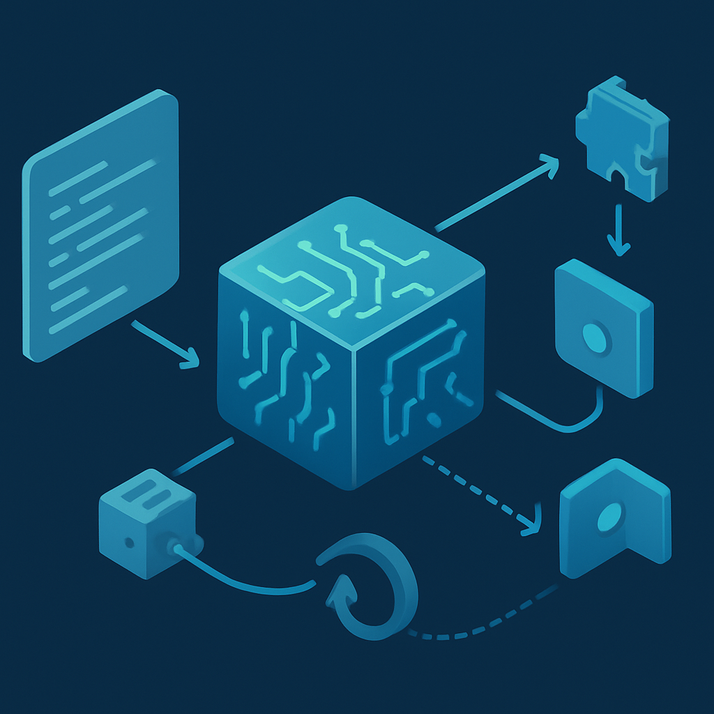

# GDScript: Ergonomia e Integração com a Engine



O conceito anterior estabeleceu que o Godot organiza o jogo como uma árvore de nodes compostos — e que cada node carrega uma responsabilidade específica, exposta como propriedades e métodos. O que esse modelo pede, naturalmente, é uma linguagem de scripting que pense nos mesmos termos: que acesse nodes como cidadãos de primeira classe, que emita e consuma signals com a mesma facilidade com que chama um método, e que não exija cerimônia burocrática para fazer coisas simples. É exatamente esse contrato que o GDScript cumpre.

GDScript é a linguagem de scripting nativa do Godot. Ela não é uma linguagem de propósito geral emprestada para a engine — foi projetada de dentro para fora para operar sobre o modelo de nodes e cenas. A consequência mais imediata disso é que tudo que é central no Godot tem sintaxe nativa em GDScript: acessar um node filho, conectar um signal, declarar uma exportação de propriedade para o inspetor, marcar uma função como chamável pela rede — nenhuma dessas operações exige importações, decorators externos ou boilerplate. Elas são parte da gramática da linguagem.

A superfície sintática imita Python de forma deliberada. Indentação define blocos, funções são declaradas com `func`, variáveis com `var`, classes com `class_name`, herança com `extends`. Quem já escreveu Python ou qualquer linguagem moderna de tipagem gradual (TypeScript, Kotlin, Swift) vai reconhecer o ritmo em minutos. A diferença central não está na sintaxe de controle de fluxo — está nos primitivos que a linguagem adiciona para falar com a engine.

O mais imediato desses primitivos é a notação `$`. Dentro de um script GDScript anexado a um node, `$Sprite2D` é equivalente a `get_node("Sprite2D")` — retorna o node filho com aquele nome na árvore local. `$AnimationPlayer`, `$CollisionShape2D`, `$Camera2D`: cada referência resolve diretamente para o objeto node, já com seus métodos e propriedades expostos. O idioma canônico é capturar essas referências uma única vez no `_ready()` usando o decorator `@onready`:

```gdscript
extends CharacterBody2D

@onready var sprite: Sprite2D = $Sprite2D
@onready var anim: AnimationPlayer = $AnimationPlayer
@onready var collision: CollisionShape2D = $CollisionShape2D
```

O `@onready` instrui o GDScript a avaliar a expressão do lado direito no momento em que `_ready()` dispara — que é, como vimos no conceito anterior, o momento em que todos os filhos já estão prontos. A referência é então armazenada na variável; qualquer acesso subsequente nos callbacks `_process`, `_physics_process` ou em funções customizadas usa a variável cacheada, sem percorrer a árvore a cada frame. Esse padrão elimina uma das armadilhas mais comuns de iniciantes em GDScript: chamar `$Sprite2D` dentro de `_process()`, que roda 60 vezes por segundo, traversando a árvore a cada chamada. O `@onready` torna o caminho certo também o caminho natural.

A tipagem em GDScript é gradual — você pode omitir tipos completamente, ou anotá-los explicitamente com `:`. Ambos os estilos são válidos e interoperam:

```gdscript
# Dinâmico — funciona, mas sem autocompletar específico
var velocidade = Vector2(100, 0)

# Estático — engine sabe o tipo, autocompletar completo, erros em tempo de edição
var velocidade: Vector2 = Vector2(100, 0)

# Inferência de tipo — o compilador deduz a partir do valor inicial
var velocidade := Vector2(100, 0)
```

A diferença não é só estética. GDScript com tipos estáticos usa opcodes otimizados em tempo de compilação — benchmarks práticos mostram ganhos de desempenho acima de 40% em release builds comparado a código totalmente dinâmico. O editor de Godot também usa os tipos para fornecer autocompletar preciso e sinalizar erros antes de rodar o jogo. Para um projeto de longa duração como este RPG, adotar tipagem estática desde o início é a decisão que mais facilmente paga dividendos: você chega mais longe sem regredir para depurar erros que um compilador teria capturado.

Signals em GDScript têm sintaxe de primeira classe desde o Godot 4. Declarar um signal customizado é uma linha:

```gdscript
signal batalha_iniciada(pokemon_selvagem: String)
signal dialogo_encerrado
```

Emitir é uma chamada direta:

```gdscript
batalha_iniciada.emit("Pikachu Selvagem")
```

Conectar é igualmente direto, com lambda ou referência de função:

```gdscript
# Conectando com lambda — idiomático para conexões simples
npc.dialogo_encerrado.connect(func(): estado = EstadoNPC.IDLE)

# Conectando com referência de função — melhor para callbacks com lógica
player.batalha_iniciada.connect(_on_batalha_iniciada)
```

Antes do Godot 4, signals eram passados como strings — `connect("sinal_nome", self, "callback")` — com todos os riscos de typos silenciosos e sem autocompletar. No Godot 4, signals são objetos `Signal`, inspecionáveis e tipados. O editor autocompleta os nomes, o compilador verifica a assinatura, e conexões inválidas produzem erros em tempo de edição. Para o princípio de "call down, signal up" que governa a comunicação na árvore de cenas, essa ergonomia importa: você vai declarar e conectar signals com frequência, e a fricção baixa faz diferença acumulada ao longo de semanas de desenvolvimento.

O decorator `@export` merece atenção especial porque é o mecanismo pelo qual o GDScript expõe variáveis para o inspetor do editor — sem código extra, sem atributos verbose:

```gdscript
@export var velocidade_movimento: float = 4.0
@export var pontos_de_vida: int = 100
@export var sprite_caminhada: SpriteFrames
@export_enum("Idle", "Andando", "Correndo") var estado_atual: int = 0
```

Cada uma dessas variáveis aparece no painel Inspetor quando o node está selecionado, editável sem tocar no código. Para um RPG onde você vai querer tunar velocidades de movimento, pontos de vida de NPCs e probabilidades de encontro sem recompilar ou reabrir scripts, `@export` é o primitivo que torna isso possível. Designers de sistemas — ou você mesmo em dois meses — conseguem iterar sobre os parâmetros diretamente no editor.

O **hot reload** do GDScript merece uma nota técnica honesta. Quando o jogo está rodando a partir do editor e você salva um arquivo `.gd`, o Godot detecta a mudança e recompila o script. Se o script pertence a nodes na cena ativa, o engine tenta atualizar os instances em execução sem reiniciar o jogo — variáveis marcadas com valores padrão são redeclaradas, mas o estado de runtime (variáveis modificadas durante execução) pode ou não ser preservado dependendo da natureza da mudança. O hot reload funciona de forma mais confiável com scripts simples e variáveis de tipo primitivo; mudanças que alteram a estrutura da classe (novos métodos, novos signals) às vezes exigem reiniciar a cena. Com editor externo (VSCode), o comportamento depende de configuração adicional — o editor precisa estar configurado para observar alterações de arquivo. Para o perfil de uso que importa aqui — tunar parâmetros, ajustar lógica de movimento, corrigir bugs de estado — o hot reload funciona bem e acelera significativamente os ciclos de tentativa-erro. O capítulo 5 (footprint e iteração rápida) aprofunda esse ponto no contexto do fluxo de trabalho geral.

Há diferenças entre GDScript e Python que importam na prática e que confundem quem faz a transição:

| Aspecto | Python | GDScript |
|---|---|---|
| Declaração de função | `def` | `func` |
| Herança | `class Foo(Bar):` | `extends Bar` (no topo do arquivo) |
| Último item de lista | `lista[-1]` | `lista[lista.size() - 1]` |
| `self` | explícito como parâmetro | implícito, disponível como `self` |
| Módulos | `import` | `preload()` / `load()` / `class_name` global |
| Corrotinas | `async/await` com `asyncio` | `await` nativo sobre signals |
| Ausência de tipos em stdlib | Python tem tipagem gradual via `typing` | GDScript tem tipagem gradual integrada |

A ausência de indexação negativa é um gotcha concreto. A ausência de `import` como em Python também: em GDScript, scripts são acessíveis globalmente se registrados com `class_name`, ou carregados explicitamente com `preload("res://caminho/Script.gd")`. Para um projeto de RPG com dezenas de scripts, definir `class_name` em classes centrais (como `BattleState`, `PartyMember`, `DialogueLine`) é o idioma que evita caminhos de `preload` espalhados por toda a base de código.

O `await` sobre signals é um dos recursos mais elegantes do GDScript moderno. Em vez de encadear callbacks para sequências assíncronas — o tipo de lógica que aparece em diálogos de NPC, animações de batalha e transições de mapa — você escreve código linear:

```gdscript
func iniciar_dialogo(npc: NPC) -> void:
    hud.mostrar_caixa_dialogo(npc.primeira_fala)
    await hud.dialogo_encerrado          # pausa aqui até o signal disparar
    hud.mostrar_caixa_dialogo(npc.segunda_fala)
    await hud.dialogo_encerrado
    hud.esconder_caixa_dialogo()
    emit_signal("dialogo_concluido")
```

Sem callbacks aninhados, sem máquina de estado manual para controlar a sequência de falas — o `await` suspende a corotina e devolve o controle ao game loop até o signal chegar. Para sistemas de diálogo, que são inerentemente sequenciais e baseados em eventos, esse pattern é transformador.

A integração do GDScript com o paradigma de cena-como-árvore não é superficial. A linguagem foi desenhada para que o código que expressa a lógica de um RPG 2D se pareça com o próprio problema, não com a plataforma em que roda. Declarar que um node é um `CharacterBody2D`, acessar seus filhos por nome com `$`, exportar parâmetros para o inspetor com `@export`, reagir a eventos com `await signal` — cada uma dessas construções mapeia diretamente para uma operação conceitual no jogo. Isso é o que "integração profunda com a engine" significa na prática: a distância entre o modelo mental do desenvolvedor e o código que ele escreve é mínima.

## Fontes utilizadas

- [GDScript reference — Godot Engine documentation](https://docs.godotengine.org/en/stable/tutorials/scripting/gdscript/gdscript_basics.html)
- [Static typing in GDScript — Godot Engine documentation](https://docs.godotengine.org/en/stable/tutorials/scripting/gdscript/static_typing.html)
- [Using signals — Godot Engine documentation](https://docs.godotengine.org/en/stable/getting_started/step_by_step/signals.html)
- [GDScript progress report: Feature-complete for 4.0 — Godot Engine](https://godotengine.org/article/gdscript-progress-report-feature-complete-40/)
- [GDScript vs Python (from a Python Dev's perspective) — Dev Oops](https://mcgillij.dev/godot-vs-python.html)
- [Yes, your Godot game runs faster with static types — beep.blog](https://www.beep.blog/2024-02-14-gdscript-typing/)
- [Node communication (the right way) — Godot 4 Recipes](https://kidscancode.org/godot_recipes/4.x/basics/node_communication/index.html)
- [Signals and Event Communication — DeepWiki](https://deepwiki.com/godotengine/godot-docs/5.2-signals-and-event-communication)
- [Godot GDScript guidelines — GDQuest](https://gdquest.gitbook.io/gdquests-guidelines/godot-gdscript-guidelines)

**Próximo conceito →** [Licença MIT e Modelo Sem Royalties](../03-licenca-mit-e-modelo-sem-royalties/CONTENT.md)
