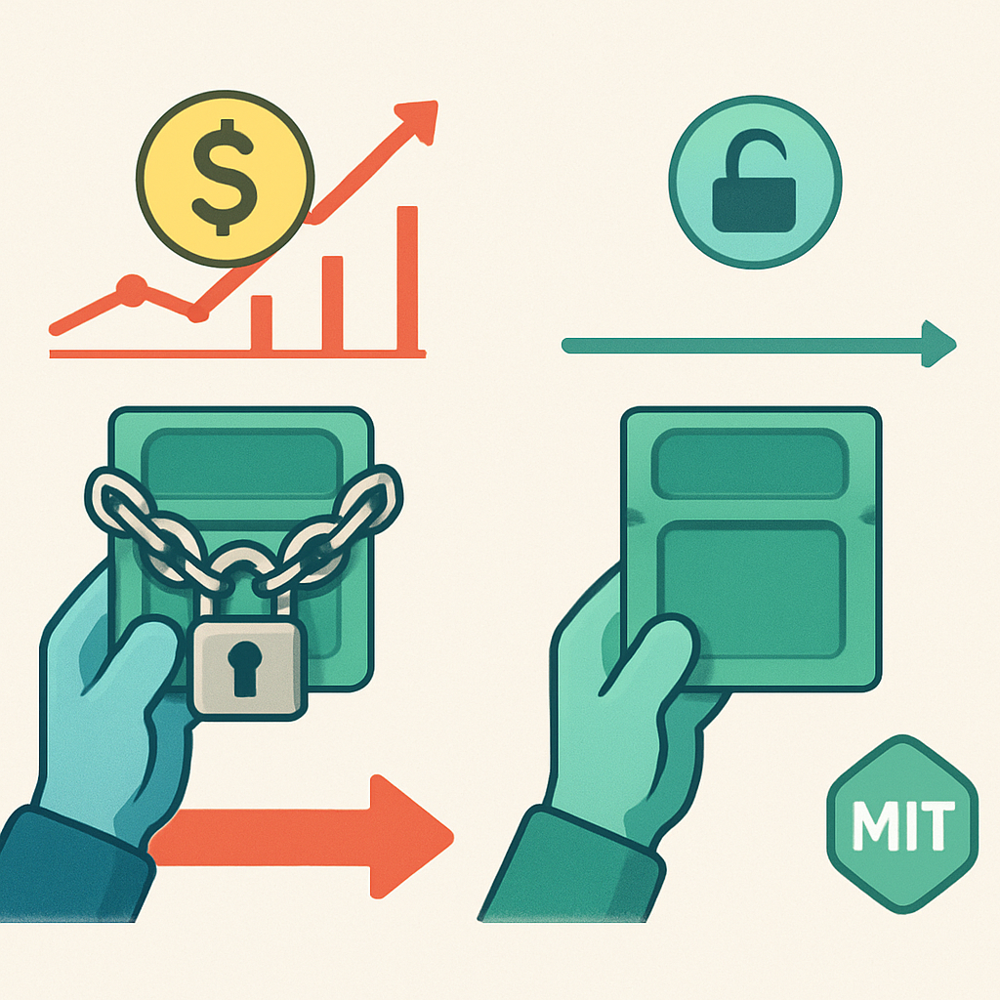

# Licença MIT e Modelo Sem Royalties

Depois de estabelecer o paradigma de cena-como-árvore e a ergonomia do GDScript, há um terceiro pilar da escolha pelo Godot 4 que opera numa dimensão completamente diferente: não é sobre como a engine funciona tecnicamente, mas sobre o contrato legal e econômico que ela estabelece com quem a usa. Esse contrato tem nome — MIT License — e suas implicações práticas para um projeto pessoal de longa duração que pode ou não se tornar produto são mais substanciais do que parecem à primeira vista.

A MIT License (formalmente chamada de Expat License) é uma das licenças de software livre mais permissivas que existem. Em termos práticos, ela concede ao usuário quatro direitos sem restrição: usar o software para qualquer finalidade, modificar o código-fonte livremente, distribuir cópias do software original ou modificado, e sublicenciar — incluindo como parte de um produto comercial fechado. A única obrigação que ela impõe é preservar o aviso de copyright e o texto da licença nas cópias distribuídas. Não há cláusulas de copyleft (ao contrário da GPL, que exigiria que derivados fossem também open source). Não há cláusulas de royalties. Não há restrições sobre uso comercial. Não há limites de receita que ativem taxas adicionais.

Para o Godot especificamente, a licença MIT cobre o motor da engine — todo o código C++ que executa o game loop, renderiza as cenas, processa física, gerencia a SceneTree. O que você constrói com esse motor — seus scripts GDScript, suas cenas, seus assets, sua lógica de jogo — não é coberto pela licença do Godot. A documentação oficial é explícita: "Godot Engine's license terms and copyright do not apply to the content you create with it; you are free to license your games how you see best fit, and will be their sole copyright owner(s)." Traduzindo sem ambiguidade: o código e os assets do seu RPG são seus, integralmente, e você pode distribuí-los sob qualquer licença — proprietária, creative commons, ou outra MIT.

A única obrigação concreta para quem distribui um jogo feito em Godot é incluir o aviso de copyright e o texto da licença em algum lugar acessível — tipicamente na tela de créditos ou na documentação. A documentação do Godot aceita explicitamente um link para `godotengine.org/license` como forma de cumprir esse requisito. Para um jogo indie, isso equivale a uma linha nos créditos. Não há burocracia, não há aprovação necessária, não há nenhum processo que exija interação com a Godot Foundation.

O contraste com o modelo histórico e atual da Unity torna esse ponto mais tangível. Em setembro de 2023, a Unity Technologies anunciou o Runtime Fee: uma cobrança por instalação de jogo que entraria em vigor para desenvolvedores que atingissem determinados limiares de receita e instalações. A lógica era que jogos bem-sucedidos feitos em Unity passariam a pagar à Unity Technologies uma fração de seu crescimento, retroativamente, com base em instalações já realizadas. A comunidade de desenvolvedores reagiu com força — mais de 1.000 devs indie assinaram carta aberta de protesto, alguns estúdios anunciaram que abandonariam a engine, a Devolver Digital removeu temporariamente jogos da Steam por precaução. A Unity recuou parcialmente em setembro de 2023 e eliminou o Runtime Fee por completo em setembro de 2024, substituindo-o por aumentos de preço nas assinaturas. O CEO John Riccitiello deixou a empresa um mês após o anúncio inicial.

O episódio não é um detalhe histórico curioso — ele demonstrou um risco estrutural de qualquer engine proprietária: a empresa que a controla pode mudar os termos unilateralmente, e projetos que já existem estão sujeitos às novas regras. Com Godot, esse risco é arquiteturalmente impossível. Como o código-fonte do Godot é distribuído sob MIT e reside num repositório público (github.com/godotengine/godot), qualquer versão já lançada permanece permanentemente sob essa licença. A MIT License, uma vez concedida, não pode ser revogada por quem a concedeu para as cópias já distribuídas. Se a Godot Foundation decidisse — em alguma hipótese absurda — mudar a licença das versões futuras, todas as versões anteriores continuariam disponíveis e usáveis sob MIT, e a comunidade poderia simplesmente fazer um fork e continuar o desenvolvimento. A estrutura de governança da Godot Foundation reforça isso: contribuidores não assinam CLA (Contributor License Agreement) e retêm o copyright de suas contribuições individuais, o que significa que o copyright do projeto é compartilhado entre centenas de contribuidores — não há uma entidade única que possa renegociar os termos sozinha.

Para um projeto pessoal como o deste livro — um RPG 2D que existe hoje como exploração técnica e aprendizado mas que pode, em algum momento futuro, virar um produto — essa arquitetura legal tem uma implicação direta: **a decisão sobre o que fazer com o jogo pode ser adiada indefinidamente sem custo**. Você pode construir o projeto inteiro, deixá-lo rodar em modo pessoal por dois anos, decidir lançá-lo comercialmente na Steam ou itch.io, distribuí-lo gratuitamente, ou simplesmente mantê-lo como portfólio — e em nenhum desses caminhos você encontrará uma barreira legal criada pela engine. Não há um limiar de receita que ative royalties. Não há uma taxa de "sucesso" que cresça junto com seu jogo. A licença não muda enquanto o projeto cresce.

O modelo econômico do Godot funciona por doações e patrocínio. A Godot Foundation recebe apoio financeiro de empresas (W4Games, Epic Games MegaGrant, entre outros) e de indivíduos via plataformas de doação. Esse modelo significa que a sustentabilidade da engine não depende de extrair valor dos desenvolvedores que a usam — ela depende de um ecossistema amplo de contribuidores e patrocinadores que têm interesse no crescimento da plataforma. Para o desenvolvedor individual, isso tem uma consequência prática: o custo total de adoção é exatamente zero, agora e no futuro, independente do sucesso do projeto.

Há uma nuance técnica que vale registrar: o Godot Engine empacota, no binário exportado, não apenas o código do motor mas também bibliotecas de terceiros com suas próprias licenças. Componentes como FreeType (fonte), libpng, zlib, OpenSSL e outros têm licenças compatíveis com MIT mas com seus próprios textos de atribuição. A documentação oficial de "Complying with Licenses" do Godot lista todos esses componentes e seus respectivos textos — para uma distribuição completa e formalmente correta, o ideal é incluir esse arquivo de atribuições nos créditos ou documentação do jogo. Na prática, a maioria dos jogos indie inclui esse arquivo como um `.txt` na pasta de instalação. É trabalho de um minuto, não um obstáculo real.

A licença MIT, portanto, não é apenas uma característica técnica da engine — é parte da proposta de valor do Godot para projetos que têm horizonte incerto. Ela remove uma variável de risco que seria concreta com qualquer alternativa proprietária: o risco de que a engine mude as regras enquanto o projeto está a meio caminho. Para quem está investindo tempo aprendendo uma nova plataforma e construindo um sistema complexo de longa duração, eliminar esse risco não é trivial.

## Fontes utilizadas

- [License — Godot Engine (site oficial)](https://godotengine.org/license/)
- [Complying with licenses — Godot Engine documentation](https://docs.godotengine.org/en/stable/about/complying_with_licenses.html)
- [Frequently asked questions — Godot Engine documentation](https://docs.godotengine.org/en/stable/about/faq.html)
- [Should I put the MIT license in my game created with Godot? — GitHub issue #6745](https://github.com/godotengine/godot/issues/6745)
- [Is MIT License Revocable? — Godot Forum](https://forum.godotengine.org/t/is-mit-license-revocable/24031)
- [Unity Pricing Controversy: What It Means for Developers Moving Forward — BairesDev](https://www.bairesdev.com/blog/unity-pricing-controversy/)
- [Unity scraps controversial Runtime Fee but raises prices — CG Channel](https://www.cgchannel.com/2024/09/unity-scraps-controversial-runtime-fee-but-raises-prices/)
- [Godot vs Unity in 2026: Which Engine Should Indie Developers Choose? — DEV Community](https://dev.to/linou518/godot-vs-unity-in-2026-which-engine-should-indie-developers-choose-50g4)
- [Godot Engine Ecosystem Vision Statement — Godot Foundation](https://godot.foundation/policies-and-procedures/ecosystem-vision-statement)

**Próximo conceito →** [API de Multiplayer de Alto Nível Nativa](../04-api-de-multiplayer-de-alto-nivel-nativa/CONTENT.md)
