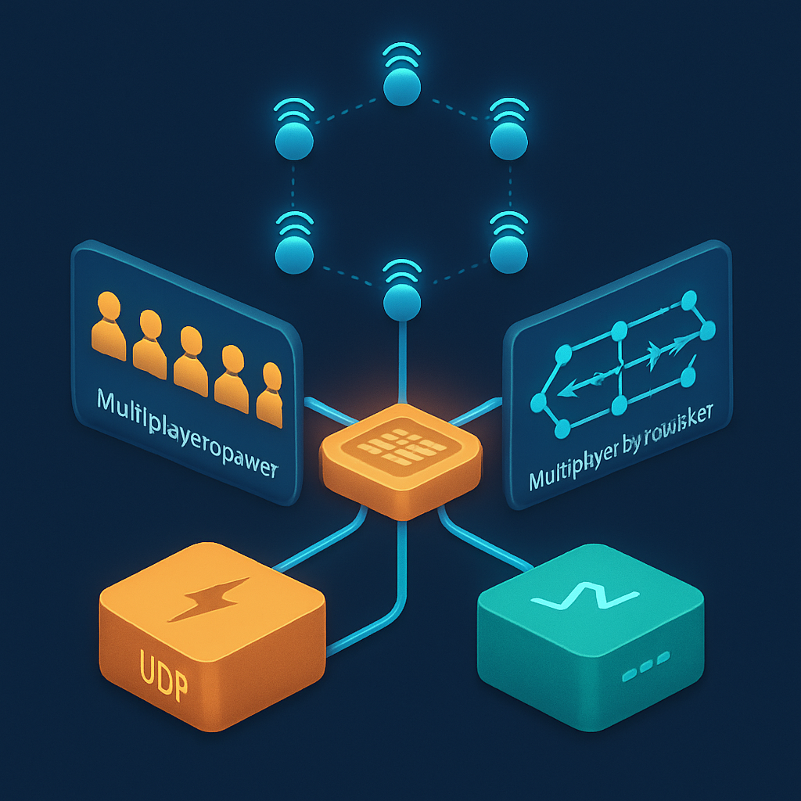
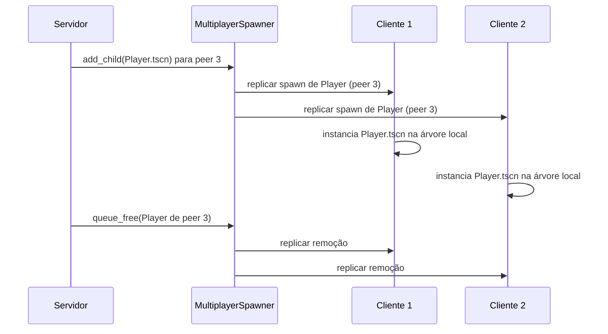

# API de Multiplayer de Alto Nível Nativa



Depois de cobrir o paradigma de cena-como-árvore, a ergonomia do GDScript e o contrato legal da licença MIT, chega o argumento que mais diretamente determina se o Godot é viável como base para este projeto: a existência, integrada na engine, de uma camada de multiplayer de alto nível que elimina a necessidade de montar protocolo de rede do zero. Para entender por que isso importa, é útil partir do que a ausência dessa camada custa nas alternativas.

Construir multiplayer sem suporte nativo de engine significa escolher uma biblioteca de rede (como o Mirror no Unity, que é um projeto comunitário e não faz parte da engine oficial; ou o Netcode for GameObjects, que a Unity mantém mas que ainda carece de maturidade para muitos cenários), integrar essa biblioteca ao loop de jogo, implementar manualmente o modelo de autoridade (quem pode mudar qual estado), criar um sistema de replicação de propriedades (quais campos são sincronizados e com que frequência), e gerenciar o ciclo de vida de entidades remotas (quando um peer entra ou sai, o que acontece com os nodes dele na árvore dos outros). Cada uma dessas peças pode ser feita — mas juntas representam semanas de trabalho antes de ver o primeiro personagem se mover em sincronia entre dois clientes. O Phaser, por exemplo, não tem nada disso: ele é um framework de renderização e input, e multiplayer é inteiramente problema do desenvolvedor, que precisa integrar Socket.io ou Colyseus separadamente e gerenciar toda a camada de sincronia à mão. GameMaker e Defold têm primitivos de rede de baixo nível, mas a camada de alto nível — autoridade, replicação, spawn remoto — não existe nativamente.

O Godot 4 resolve esse problema com uma arquitetura em três camadas que funcionam de forma integrada desde o primeiro projeto.

A primeira camada é o **transport** — o protocolo de comunicação subjacente. O Godot expõe dois transports nativos: `ENetMultiplayerPeer` e `WebSocketMultiplayerPeer`. ENet é construído sobre UDP, com um sistema próprio de canais e modos de entrega que permitem escolher entre confiável (garantia de chegada e ordem, como TCP) e não-confiável (sem garantia, latência menor). Para um jogo desktop que se conecta diretamente a um servidor em IP conhecido, ENet é a escolha natural. WebSocket opera sobre TCP e é obrigatório para exportações HTML5, onde UDP simplesmente não está disponível nos browsers. A interface de programação é idêntica para ambos — o código que usa o `MultiplayerAPI` não sabe e não precisa saber qual transport está embaixo; você troca um por outro alterando uma única linha de inicialização.

```gdscript
# Inicializando como servidor com ENet
var peer = ENetMultiplayerPeer.new()
peer.create_server(PORT, MAX_PLAYERS)
multiplayer.multiplayer_peer = peer

# A mesma lógica, mas com WebSocket para exports HTML5
var peer = WebSocketMultiplayerPeer.new()
peer.create_server(PORT)
multiplayer.multiplayer_peer = peer
```

A segunda camada é a **`MultiplayerAPI`** — o objeto singleton que gerencia identidade de peers, autoridade de nodes e o sistema de RPC. Cada conexão tem um peer ID único: o servidor sempre tem ID 1; clientes recebem IDs atribuídos automaticamente no momento da conexão. Esse ID é o mecanismo central de identidade — quando um personagem do jogador 3 precisa mover, o servidor verifica que a mensagem veio do peer 3 antes de processar. A `MultiplayerAPI` também define o conceito de **multiplayer authority**: cada node da árvore tem um peer que é sua "autoridade", e só esse peer pode enviar certas mensagens sobre esse node. Por padrão, a autoridade de todos os nodes é o servidor (peer ID 1). Para um personagem controlado pelo cliente, o servidor chama `set_multiplayer_authority(peer_id)` no node daquele personagem, delegando a autoridade de input para o cliente correto.

O mecanismo de comunicação ativa dessa camada são os **RPCs** (Remote Procedure Calls), declarados com a anotação `@rpc` no GDScript:

```gdscript
# Qualquer peer pode chamar essa função — o servidor valida antes de processar
@rpc("any_peer", "reliable")
func enviar_movimento(direction: Vector2) -> void:
    if multiplayer.get_remote_sender_id() != get_multiplayer_authority():
        return  # ignora se veio do peer errado
    velocity = direction * SPEED
    move_and_slide()

# Só o servidor chama essa — sincroniza efeito visual para todos os clientes
@rpc("authority", "unreliable_ordered")
func atualizar_posicao_remota(pos: Vector2) -> void:
    position = pos
```

Os parâmetros do `@rpc` controlam dois eixos independentes. O primeiro é **quem pode chamar** — `"any_peer"` permite que qualquer peer dispare a chamada remota; `"authority"` restringe ao peer que possui autoridade sobre o node. O segundo é o **modo de entrega** — `"reliable"` garante chegada e ordem (equivalente a TCP), ao custo de retransmissões; `"unreliable"` envia e esquece, útil para posição em jogos onde um frame perdido não importa porque o próximo atualiza tudo; `"unreliable_ordered"` descarta pacotes antigos que chegam depois dos novos, sem retransmitir — ideal para atualizações de estado como posição de entidades. Há ainda o parâmetro de canal (`channel: int`), que permite separar streams de comunicação diferentes dentro da mesma conexão — RPCs de chat e RPCs de combate em canais distintos não se bloqueiam mutuamente.

Chamar um RPC é igual a chamar uma função local, com prefixo `rpc()` ou `rpc_id()`:

```gdscript
# Envia o RPC para todos os peers conectados (incluindo servidor)
enviar_movimento.rpc(Vector2(1, 0))

# Envia apenas para o peer com ID 2
atualizar_posicao_remota.rpc_id(2, position)
```

A terceira camada é a de **replicação declarativa**, composta por dois nodes especializados que o Godot 4 introduziu: `MultiplayerSpawner` e `MultiplayerSynchronizer`. Esses dois nodes são o que a documentação chama de "scene replication" — e são a diferença mais prática entre o Godot e engines que dependem de multiplayer manual.

O **`MultiplayerSpawner`** gerencia o ciclo de vida de nodes remotos — criação e remoção de entidades que precisam existir simultaneamente em todos os peers. Você configura sua `spawn_path` (onde os nodes filhos serão adicionados) e uma lista de cenas elegíveis para spawn remoto. Quando a autoridade (o servidor) instancia uma cena filho sob esse path com `add_child()`, o `MultiplayerSpawner` detecta e replica automaticamente esse evento para todos os clientes conectados — que recebem a cena já instanciada em suas próprias árvores. Quando o node é removido no servidor com `queue_free()`, a remoção também é replicada. Para um RPG onde jogadores entram e saem enquanto o mundo corre, o `MultiplayerSpawner` elimina o boilerplate de gerenciar manualmente "player entrou → enviar RPC para todos → todos criam o node do player com os parâmetros corretos → player saiu → todos removem o node".



O **`MultiplayerSynchronizer`** gerencia a sincronização contínua de propriedades — não eventos discretos como RPCs, mas estado que muda a cada frame e precisa ser refletido em todos os peers. Você adiciona um `MultiplayerSynchronizer` à cena de um personagem e, no inspetor, especifica quais propriedades sincronizar: `position`, `rotation`, `animation`, qualquer propriedade exportada. O `MultiplayerSynchronizer` lê esses valores na autoridade em cada tick de sincronização e transmite as diferenças para os peers. Clientes que recebem esses valores atualizam as propriedades localmente.

Um padrão arquitetural que emerge da combinação dos dois nodes é o da **separação de autoridade por domínio**: para um personagem online, você pode ter dois `MultiplayerSynchronizer` dentro da mesma cena — um com autoridade do servidor (sincroniza `position` e estado de combate, lidos de movimentos validados pelo servidor) e outro com autoridade do cliente dono do personagem (sincroniza a *intenção* de movimento, como a direção do input). Isso cria um canal natural de comunicação onde o cliente comunica input, o servidor valida e propaga posição autoritativa, e os outros clientes exibem o resultado.

```
Player.tscn
├── CharacterBody2D
│   ├── Sprite2D
│   ├── AnimationPlayer
│   └── CollisionShape2D
├── MultiplayerSynchronizer (authority=servidor)
│   └── sincroniza: position, animation_state, hp
└── MultiplayerSynchronizer (authority=peer_dono)
    └── sincroniza: input_direction (para servidor processar)
```

Uma limitação real do `MultiplayerSynchronizer` que vale conhecer desde agora: ele suporta nativamente tipos primitivos e tipos built-in do Godot (Vector2, Color, int, float, String, etc.). Estruturas de dados complexas — como um inventário representado por um Array de Resources — exigem serialização manual em `PackedByteArray` antes de trafegar. Para as propriedades que o RPG deste livro precisa sincronizar na maioria dos casos (posição, direção de animação, estado de combate), o `MultiplayerSynchronizer` funciona sem código extra. Para inventário e party — que são estruturas de dados ricas — o caminho é o envio via RPC com serialização explícita, ou um sistema de persistência server-side que os clientes consultam quando necessário. O capítulo 13 (Sincronização de Estado e Autoridade) aprofunda essa distinção.

O contraste que essas três camadas formam com outras engines fica mais nítido quando se considera o que um projeto análogo exigiria no Unity. A Unity disponibiliza o Netcode for GameObjects como solução de alto nível, mas ele é uma dependência separada, instalada via Package Manager, e sua curva de aprendizado é considerável — entender o sistema de NetworkObject, NetworkBehaviour, NetworkVariable e o modelo de ownership exige estudo específico além do próprio Unity. Mirror (a alternativa comunitária mais usada) tem API mais simples mas também é uma instalação adicional, com documentação fragmentada e suporte que depende de voluntários. Em nenhum dos casos multiplayer é algo que a engine entrega como paradigma central; é uma adição sobre a base existente. No Godot, `MultiplayerAPI`, `MultiplayerSpawner` e `MultiplayerSynchronizer` são nodes nativos, documentados na mesma documentação oficial que ensina `CharacterBody2D` e `AnimationPlayer`, e funcionam dentro do mesmo paradigma de cena-como-árvore que os conceitos anteriores deste subcapítulo estabeleceram.

Para o RPG deste livro — dois clientes conectados a um servidor, mundo persistente compartilhado, movimentação em grid sincronizada, combate por turnos com autoridade no servidor — essa camada de alto nível significa que o ponto de partida para a funcionalidade de rede é a configuração de `MultiplayerSpawner` e `MultiplayerSynchronizer` no inspetor, não a escrita de um protocolo de comunicação binária. A carga de trabalho de rede vai para a lógica que importa: validar movimentos no servidor, decidir o que sincronizar e com que frequência, garantir que o estado de combate seja autoritativo. O transporte em si, o spawn remoto e a replicação de propriedades estão dados.

## Fontes utilizadas

- [High-level multiplayer — Godot Engine documentation (stable)](https://docs.godotengine.org/en/stable/tutorials/networking/high_level_multiplayer.html)
- [MultiplayerAPI — Godot Engine documentation](https://docs.godotengine.org/en/stable/classes/class_multiplayerapi.html)
- [MultiplayerSynchronizer — Godot Engine documentation](https://docs.godotengine.org/en/stable/classes/class_multiplayersynchronizer.html)
- [ENetMultiplayerPeer — Godot Engine documentation](https://docs.godotengine.org/en/stable/classes/class_enetmultiplayerpeer.html)
- [WebSocketMultiplayerPeer — Godot Engine documentation](https://docs.godotengine.org/en/stable/classes/class_websocketmultiplayerpeer.html)
- [Multiplayer in Godot 4.0: Scene Replication — Godot Engine blog](https://godotengine.org/article/multiplayer-in-godot-4-0-scene-replication/)
- [Multiplayer in Godot 4.0: RPC syntax, channels, ordering — Godot Engine blog](https://godotengine.org/article/multiplayer-changes-godot-4-0-report-2/)
- [Multiplayer in Godot 4.0: ENet wrappers, WebRTC — Godot Engine blog](https://godotengine.org/article/multiplayer-changes-godot-4-0-report-3/)
- [Is Godot 4's Multiplayer a Worthy Alternative to Unity? — Rivet](https://rivet.dev/blog/godot-multiplayer-compared-to-unity/)
- [Godot Multiplayer in 2026: What Actually Works — Ziva](https://ziva.sh/blogs/godot-multiplayer)
- [High-Level Multiplayer — DeepWiki](https://deepwiki.com/godotengine/godot-docs/6.4.1-high-level-multiplayer)

**Próximo conceito →** [Footprint Enxuto e Ciclos de Iteração Rápidos](../05-footprint-enxuto-e-ciclos-de-iteracao-rapidos/CONTENT.md)
