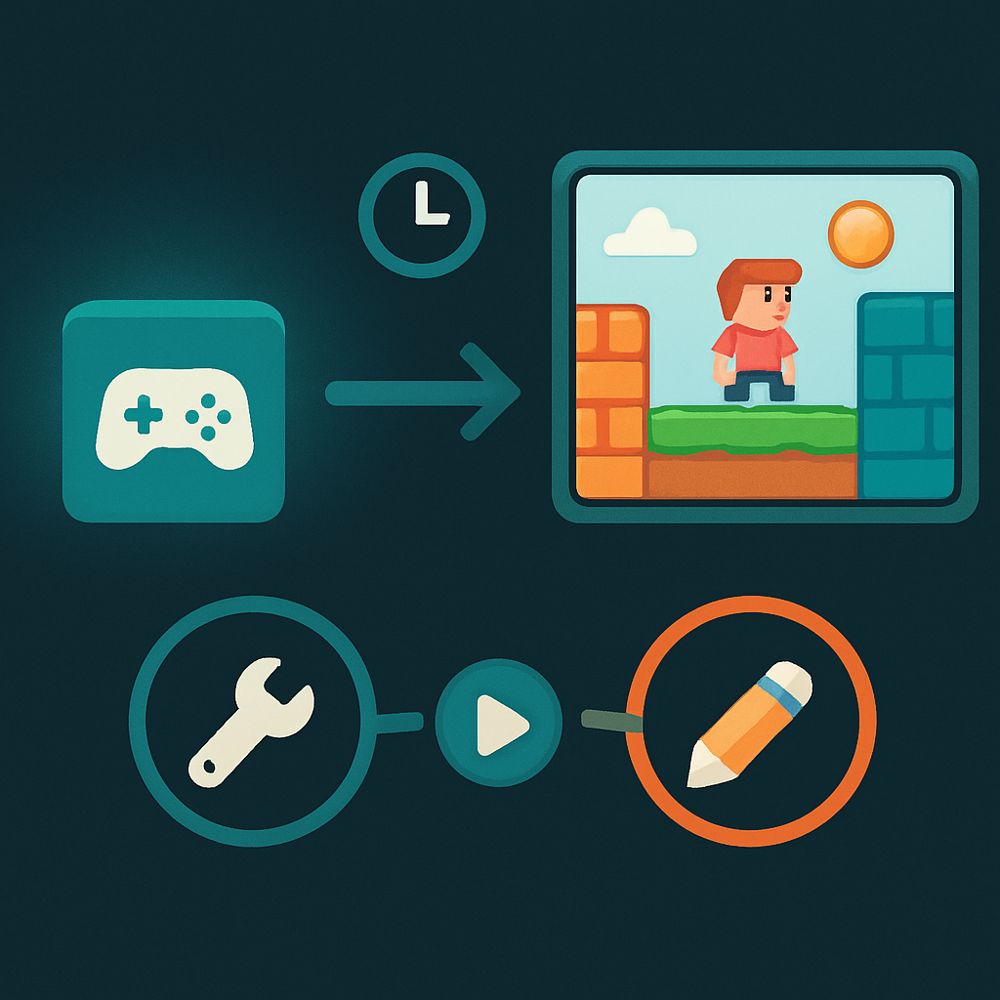

# Footprint Enxuto e Ciclos de Iteração Rápidos



O argumento construído até aqui — cena-como-árvore, GDScript sem fricção de aprendizado, licença MIT sem royalties e a camada de multiplayer nativa — seria incompleto se ignorasse uma dimensão prática que afeta especialmente quem está abrindo uma engine pela primeira vez: o custo de fricção do ambiente de desenvolvimento. Quanto tempo você gasta *esperando* em vez de *fazendo*? Quantas telas de configuração, mensagens de compilação ou minutos de carregamento existem entre a ideia e o resultado visível na tela? Para um desenvolvedor experiente em backend e mobile, acostumado a ciclos rápidos de escrita-execução-ajuste, um ambiente que introduz latência em cada loop de tentativa-erro é profundamente desmotivador — e, mais concretamente, um acelerador de abandono de projetos pessoais.

O Godot 4 tem um footprint radicalmente menor que suas concorrentes. O editor completo — com suporte a 2D e 3D, debugger, profiler, sistema de animação, editor de shaders, gerenciador de projetos e toda a documentação integrada — cabe em um único executável de aproximadamente 80 a 120 MB dependendo da versão e plataforma. Não há instalador, não há pacotes adicionais obrigatórios, não há runtime separado do editor. Você baixa o arquivo, descompacta, clica. A Unity, para comparação, exige primeiro o Unity Hub (o gerenciador de versões), depois a instalação de pelo menos uma versão do editor, que pesa entre 800 MB e vários gigabytes dependendo dos módulos selecionados; a instalação completa com suporte a plataformas móveis ultrapassa facilmente 5 GB. O Godot cabe em um pendrive. Essa diferença de escala não é curiosidade técnica — ela determina o tempo entre "quero tentar" e "estou tentando".

O tempo de startup do editor segue a mesma lógica. Godot 4 abre em 2 a 3 segundos em hardware modesto. Unity leva entre 30 e 60 segundos para inicializar um projeto existente — nesse tempo, ele resolve pacotes, importa assets modificados, recompila scripts C# e faz domain reload. Cada vez que você fecha e reabre o Unity para trocar de projeto, você paga esse custo. No Godot, abrir um projeto diferente custa o mesmo 2-3 segundos do primeiro boot. Para quem está aprendendo e vai abrir e fechar o editor dezenas de vezes por sessão de estudo, essa diferença de fricção é substancial.

O ponto mais crítico para o ciclo de iteração é o que acontece entre escrever código e ver o resultado rodando. No GDScript, não há etapa de compilação. A linguagem é interpretada — o engine lê o script diretamente, analisa a sintaxe e executa. Quando você pressiona F5 (rodar o projeto) ou F6 (rodar a cena em edição), o jogo inicia em menos de um segundo. Não há "aguardando compilação", não há domain reload, não há linking. O loop fica assim:

```
editar script no editor
  → salvar (Ctrl+S)
  → F5 para rodar
  → ver resultado no jogo (< 1 segundo)
  → fechar jogo (Esc ou fechar janela)
  → editar novamente
```

O contraste com Unity é direto: cada Play no Unity recompila os scripts C# modificados e faz domain reload — um processo que em projetos médios leva entre 3 e 15 segundos. Em projetos grandes com muitos assets e scripts, pode passar de 30 segundos. Para um projeto pessoal ainda pequeno como este RPG, a diferença é menor em magnitude absoluta, mas o padrão importa: no Godot, o loop de tentativa-erro tem custo quase zero, o que muda o comportamento de quem aprende — você testa hipóteses com mais frequência, erra mais rápido, ajusta sem hesitar.

Além da execução inicial, o Godot oferece **hot reload de scripts GDScript enquanto o jogo está rodando**. Se você salva um arquivo `.gd` com o jogo em execução e a opção "Synchronize Script Changes" está ativa (que é o comportamento padrão), o engine recarrega o script modificado sem parar o jogo. A instância do node em execução continua existindo, e o código novo passa a valer a partir do próximo frame. Isso é especialmente valioso para ajustar constantes numéricas — velocidade do personagem, delay de animação, raio de detecção de NPC — sem precisar reiniciar a cena a cada mudança:

```gdscript
# Você ajusta isso enquanto o jogo roda e vê o efeito imediatamente
const MOVE_SPEED = 80.0  # era 64.0 — aumentou, salvou, resultado visível sem reiniciar
const TILE_SIZE = 16
```

O hot reload tem limites conhecidos. Ele funciona plenamente com scripts GDScript no editor interno do Godot. Quando se usa um editor externo (como o VS Code), a sincronização automática depende da integração via Language Server Protocol e nem sempre é imediata — o caminho mais confiável é usar o editor interno para iterações rápidas e o editor externo para sessões mais longas de escrita. Cenas modificadas no disco (alterações em `.tscn`) geralmente exigem reiniciar a cena para ser refletidas, já que o formato de cena é carregado no momento do instanciamento, não em tempo real. Para C# — que o Godot também suporta como alternativa ao GDScript — não há hot reload de scripts: cada modificação exige reiniciar o projeto, o que é uma das razões pelas quais, para este livro, GDScript é a escolha natural (os conceitos anteriores já estabeleceram a ergonomia do GDScript como argumento independente).

Há ainda uma característica do ambiente de desenvolvimento do Godot que raramente aparece nas comparações formais mas importa muito para quem aprende: **o editor é o jogo, e o jogo é o editor**. Quando você roda uma cena, o Godot abre uma janela separada que é literalmente a SceneTree executando. O Remote Debugger do editor se conecta a essa instância e você pode, em tempo real, inspecionar o estado de qualquer node na árvore — ver os valores das propriedades exportadas, checar se um signal foi conectado, pausar a execução e avançar frame a frame. Para entender por que um personagem não está se movendo, você não precisa adicionar `print()` em toda parte: você abre o Remote Scene Tree enquanto o jogo roda e lê diretamente o valor de `velocity`, `position`, `animation` — tudo vivo, sem parar o jogo.

```
[ Editor Godot ]
├── Scene Tree Editor (edição)      ← o que você edita
└── Remote Scene Tree (em execução) ← o que o jogo vê ao rodar, inspecionável em tempo real
```

Essa capacidade de introspecção ao vivo reduz drasticamente o tempo gasto em debugging para quem está aprendendo. Em Unity, inspecionar o estado de um objeto durante o Play Mode é possível, mas a interface de inspeção não reflete mudanças de código em tempo real e o Remote Inspector exige configuração de conexão. No Godot, o Remote Debugger é automático — toda vez que você roda o projeto, o debugger se conecta.

Para o contexto deste projeto — um RPG 2D que você vai construir enquanto aprende gamedev do zero, em sessões de estudo de duração variável, provavelmente espalhadas ao longo de semanas — a soma dessas propriedades tem um efeito composto relevante. Editor de 100 MB que abre em 3 segundos significa que a barreira para "abrir o projeto e fazer uma mudança pequena" é zero. Loop de F5 sem compilação significa que testar se o personagem anda em grid corretamente custa literalmente um segundo de espera. Hot reload de scripts significa que ajustar a velocidade de movimento ou o delay de um diálogo de NPC não quebra o ritmo de exploração. Remote Debugger automático significa que quando algo não funciona como esperado, a investigação começa imediatamente, não depois de configurar ferramentas de análise.

A tabela abaixo consolida as diferenças práticas que afetam o dia a dia de desenvolvimento para este projeto:

| Dimensão | Godot 4 | Unity |
|---|---|---|
| Tamanho do editor | ~80–120 MB (executável único) | 800 MB – 5+ GB (Hub + módulos) |
| Tempo de startup | 2–3 segundos | 30–60 segundos |
| Tempo de Play (F5) | < 1 segundo | 3–30 segundos (compilação + domain reload) |
| Hot reload de scripts | Sim (GDScript, editor interno) | Não (exige domain reload a cada Play) |
| Introspecção ao vivo | Remote Debugger automático | Disponível no Play Mode, menos integrado |
| Instalação | Descompactar e executar | Instalador obrigatório, dependências |

O único risco real desse footprint enxuto é também uma característica do GDScript interpretado: **erros de tipo e de referência só aparecem em runtime**, não em tempo de compilação. Se você acessa uma propriedade que não existe em um node, o erro aparece no Output do editor quando aquela linha é executada, não quando você salva o arquivo. Para um desenvolvedor que vem de TypeScript, Kotlin ou Swift — onde o compilador captura uma classe enorme de erros antes de qualquer execução — essa ausência de verificação estática pode ser frustrante no início. O Godot 4 introduziu tipagem estática opcional no GDScript (com `var x: int = 0` e `func move(direction: Vector2) -> void:`) e warnings de tipo no editor, o que mitiga parcialmente o problema — mas não elimina. Adotar tipagem estática desde o começo é o hábito que o capítulo de GDScript do livro vai estabelecer.

O footprint enxuto e os ciclos rápidos não são vantagem marginal: são o que torna possível, para quem nunca abriu uma engine, construir o hábito de iterar. O próximo conceito fecha o argumento deste subcapítulo com honestidade — as limitações reais do Godot 4 no contexto multiplayer que precisarão ser navegadas nos blocos online do livro.

## Fontes utilizadas

- [Unity vs. Godot: A Game Developer's Guide — DEV Community](https://dev.to/manasajayasri/unity-vs-godot-a-game-developers-guide-2a6o)
- [Godot 4 vs Unity in 2025: An Honest Comparison — Coding Quests](https://codingquests.io/blog/godot-4-vs-unity-2025)
- [Unity vs Godot: Complete Comparison Guide 2026 — FastBuilder.AI Blog](https://fastbuilder.ai/blog/unity-vs-godot-engine)
- [Does Godot have any kind of Hot Reloading or Hot Module Refresh? — Godot Forum](https://forum.godotengine.org/t/does-godot-has-any-kind-of-hot-reloading-or-hot-module-refresh/74838)
- [Hot reload in Godot (instantly see changes without reloading a game) — Godot Forum](https://forum.godotengine.org/t/hot-reload-in-godot-instantly-see-changes-without-reloading-a-game/66089)
- [Running code in the editor — Godot Engine documentation](https://docs.godotengine.org/en/stable/tutorials/plugins/running_code_in_the_editor.html)
- [System requirements — Godot Engine documentation](https://docs.godotengine.org/en/stable/about/system_requirements.html)
- [Godot Engine binary size history](https://godot-size-history.github.io/)

**Próximo conceito →** [Limitações Honestas do Godot 4 no Contexto Multiplayer](../06-limitacoes-honestas-do-godot-4-no-contexto-multiplayer/CONTENT.md)
