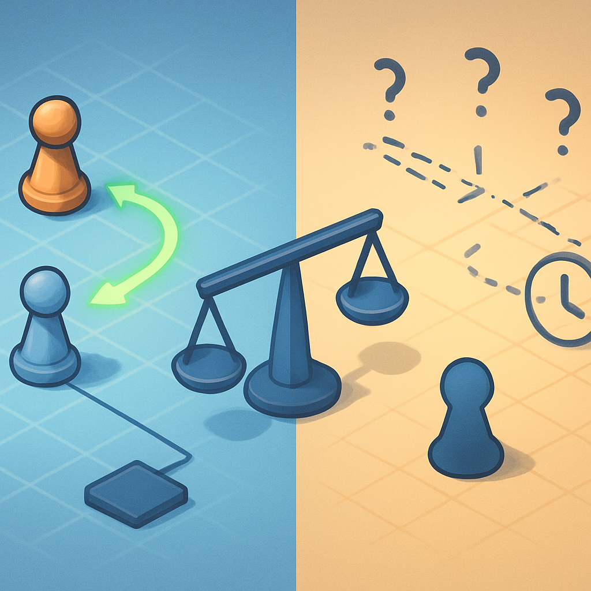

# Limitações Honestas do Godot 4 no Contexto Multiplayer

O argumento construído ao longo deste subcapítulo termina aqui, e precisa terminar com honestidade. A cena-como-árvore encaixa bem em RPG 2D, o GDScript reduz fricção de aprendizado, a licença MIT elimina risco legal, a API de multiplayer nativa entrega `MultiplayerSpawner` e `MultiplayerSynchronizer` sem dependência externa, e o footprint enxuto torna o ciclo de iteração fluido para quem nunca abriu uma engine. Tudo isso é real. Mas a API de multiplayer, como estabelecido no conceito anterior, não é completa — e é preciso nomear com precisão o que falta antes de entrar nos capítulos que vão construir a camada online deste jogo.

A limitação mais impactante do multiplayer do Godot 4 é a **ausência de client-side prediction e rollback netcode nativos**. Para entender o peso real disso, vale entender o problema que essas técnicas resolvem. Em um modelo autoritativo puro — que é o que o `MultiplayerAPI` do Godot implementa por padrão — o fluxo de uma ação do jogador é: o cliente captura o input, envia para o servidor via RPC, o servidor processa o movimento, valida contra o estado do mundo, e envia a nova posição de volta para todos os clientes. O personagem no cliente só se move quando essa resposta volta. Em uma conexão com 50ms de latência, isso cria um atraso mínimo perceptível de 100ms (ida e volta) entre pressionar a tecla e ver o personagem se mover. Em 150ms de latência, esse atraso sobe para 300ms — já é notável.

Client-side prediction é a técnica que elimina esse atraso: o cliente executa a ação localmente de forma otimista — movendo o personagem imediatamente como se o servidor já tivesse aprovado — enquanto aguarda a confirmação. Se o servidor retornar um estado diferente (porque a posição estava errada, havia uma colisão não detectada localmente, etc.), o cliente **corrige** sua posição para a autoritativa. Rollback netcode é uma versão mais sofisticada disso, usada especialmente em jogos de ação e luta: o cliente mantém um histórico de estados e, ao receber uma correção do servidor, **desfaz** os frames recentes e reexecuta a simulação a partir do ponto correto antes de continuar — eliminando a sensação de "salto" que uma correção abrupta causaria. O Unity Netcode for GameObjects tem prediction experimental desde 2023; o Fish-Net (biblioteca open-source para Unity) tem um sistema de prediction maduro e bem documentado. O Godot não tem nenhum dos dois no core da engine.

Existem soluções comunitárias. O addon de rollback netcode mantido por David Snopek — disponível na Asset Library e bem documentado em uma série de tutoriais — é uma implementação sólida de rollback para Godot 4 que funciona sobre RPCs e pode ser integrada em um projeto. Há também o Delta Rollback, uma implementação mais recente com partes reescritas em C++ para performance em cenas com muitos elementos sincronizados. Esses addons funcionam e foram usados em jogos comerciais, mas são dependências externas com curadoria comunitária, documentação fragmentada e curva de aprendizado própria. Não são parte do paradigma central da engine.

Para o RPG deste livro, a ausência de prediction **não é um problema real**. Pokémon Fire Red é um jogo de movimento em grid, turn-based combat e interações discretas — pressionar uma tecla move o personagem para o tile adjacente, não controla um personagem em física contínua de alta velocidade. Em um jogo de grid tile-a-tile, um atraso de 50–100ms entre pressionar a tecla e o personagem começar a se mover é tolerável porque o movimento em si já tem duração de 100–200ms (a interpolação visual entre tiles). O servidor valida o destino antes de confirmar; o cliente exibe a animação de movimento quando a confirmação chega. Isso funciona bem para latências razoáveis (até ~150ms). Um shooter em tempo real ou um jogo de luta precisa de prediction para ser jogável; um RPG top-down em grid não precisa.

A segunda limitação é o **teto prático de sessões simultâneas por servidor**. Os testes de stress do ENet com o `MultiplayerAPI` do Godot mostram instabilidade acima de aproximadamente 40 conexões simultâneas por servidor — não porque o ENet seja inerentemente limitado a esse número (o limite técnico da implementação ENet é 4095 peers), mas porque o modelo de replicação do `MultiplayerSynchronizer` tem custo que cresce com o número de peers: cada tick de sincronização transmite as propriedades configuradas para *todos* os peers conectados, e o overhead de gerenciar centenas de streams de replicação simultâneas coloca pressão relevante na thread de rede do servidor. O Fish-Net, em benchmarks comparativos, suporta mais de 100 conexões simultâneas antes de sentir pressão equivalente.

Para este projeto, o alvo é literalmente dois clientes. O MVP do livro — fixado no subcapítulo anterior ao panorama de engines — é um mapa navegável com dois jogadores vendo o mesmo mundo, com combate funcional. Mesmo expandindo o alvo para uma sessão de 8 a 12 jogadores (um servidor de zona de RPG), o teto de ~40 está confortavelmente acima. A limitação se tornaria relevante se o projeto crescesse para dezenas ou centenas de jogadores simultâneos no mesmo servidor — o que exigiria uma arquitetura de sharding de zonas independentemente da engine escolhida.

A terceira limitação é a ausência de **infraestrutura de lobby, matchmaking e NAT traversal nativos**. O Godot entrega o transport (ENet/WebSocket) e a camada de replicação, mas tudo acima disso — como dois jogadores se encontram, como formam uma sessão, como atravessam o NAT doméstico — é responsabilidade do desenvolvedor. NAT traversal é um problema real: o ENet usa UDP, e a maioria dos roteadores domésticos bloqueia conexões UDP de entrada por padrão. Para dois jogadores se conectarem diretamente (peer-to-peer), ambos precisariam de port forwarding configurado, o que não é realista para uma experiência de usuário normal. As soluções são: (1) servidor dedicado com IP público fixo — o cliente que não está hospedando se conecta ao servidor diretamente, sem depender de NAT traversal; (2) relay server — um intermediário retransmite os pacotes; (3) GodotSteam — o plugin que integra a Steam Network, que tem relay e NAT traversal prontos via Steam. O Godot não entrega nenhum desses mecanismos no core; o Unity também não (o Relay Service do Unity é pago e externo à engine base).

Para o MVP deste livro, o caminho mais simples é o servidor dedicado com IP público — o modelo cliente-servidor que os capítulos 12 a 14 vão construir. Um processo Godot rodando em modo headless em uma VPS de entrada (5–10 USD/mês) com um IP público resolve o NAT traversal por definição: o servidor está na internet, os clientes se conectam a ele. Não há lobby, não há matchmaking — há um servidor rodando em endereço fixo e dois clientes que conhecem esse endereço. É o modelo mais simples possível, e é suficiente para o alvo deste livro.

A quarta limitação, já mencionada de passagem no conceito sobre a API nativa, é a **restrição do `MultiplayerSynchronizer` a tipos primitivos**. Propriedades do tipo `Vector2`, `int`, `float`, `bool`, `String` e `Color` sincronizam diretamente. Um `Array` de `Resource` — como um inventário ou a party de Pokémon — não pode ser declarado como propriedade sincronizável e transmitido automaticamente. A solução é serialização manual: o lado autoritativo empacota o dado em um `PackedByteArray` e envia via RPC; o recebedor desempacota. Isso é mais trabalho, mas é trabalho localizado e previsível — você sabe exatamente onde fica e como funciona. Para as propriedades de sincronização contínua que mais importam neste RPG (posição do personagem, animação atual, estado de saúde em combate), o `MultiplayerSynchronizer` funciona diretamente. Para inventário e party — que mudam em eventos discretos, não a cada frame — a transmissão via RPC com serialização manual é o padrão correto de qualquer forma, não uma limitação que precisa ser contornada.

O quadro que emerge dessas quatro limitações mapeadas contra o alvo deste projeto é o seguinte:

| Limitação | Impacto geral | Impacto neste RPG |
|---|---|---|
| Ausência de client-side prediction/rollback | Alto para jogos de ação em tempo real | Baixo — movimento em grid tolera latência de 100–150ms |
| Teto prático de ~40 CCU por servidor | Médio para jogos com muitos jogadores simultâneos | Nulo — alvo é 2–12 jogadores por sessão |
| Sem NAT traversal nativo | Alto para P2P entre clientes domésticos | Contornado com servidor dedicado headless |
| `MultiplayerSynchronizer` só sincroniza primitivos | Médio para estados de jogo complexos | Baixo — inventário via RPC é o modelo correto |

A conclusão deste subcapítulo é, portanto, precisa: o Godot 4 não é a melhor engine para qualquer jogo multiplayer. Para um FPS competitivo, um battle royale ou um MOBA onde prediction e rollback determinam a jogabilidade, as lacunas do Godot são sérias. Para um RPG 2D top-down de até uma dúzia de jogadores simultâneos, com movimentação em grid, combate por turnos e persistência de mundo no servidor — que é exatamente o alvo deste livro — cada limitação ou não se aplica ou tem contorno direto dentro do modelo de arquitetura que os capítulos seguintes vão construir. A API de multiplayer nativa, o paradigma de cena-como-árvore, o GDScript sem compilação e o footprint enxuto empurram na direção certa. As limitações não invalidam a escolha; elas definem com precisão onde o trabalho extra vai estar.

## Fontes utilizadas

- [Godot Multiplayer in 2026: What Actually Works — Ziva](https://ziva.sh/blogs/godot-multiplayer)
- [Rollback netcode addon for Godot — Snopek Games (GitLab)](https://gitlab.com/snopek-games/godot-rollback-netcode)
- [Rollback netcode in Godot (part 1): What is rollback and prediction? — Snopek Games](https://www.snopekgames.com/tutorial/2022/rollback-netcode-godot-part-1-what-rollback-and-prediction/)
- [Godot Rollback Netcode (Godot 4) — Godot Asset Library](https://godotengine.org/asset-library/asset/2450)
- [Delta Rollback — Godot Asset Library](https://godotengine.org/asset-library/asset/3107)
- [Can Godot netcode scale for large multiplayer scenarios? — Godot Forum](https://forum.godotengine.org/t/can-godot-netcode-scale-for-large-multiplayer-scenarios/83561)
- [Multiplayer Scalability — Godot Forum](https://forum.godotengine.org/t/multiplayer-scalability/46309)
- [ENetMultiplayerPeer — Godot Engine documentation](https://docs.godotengine.org/en/stable/classes/class_enetmultiplayerpeer.html)
- [High-level multiplayer — Godot Engine documentation](https://docs.godotengine.org/en/stable/tutorials/networking/high_level_multiplayer.html)
- [Is Godot 4's Multiplayer a Worthy Alternative to Unity? — Rivet](https://rivet.dev/blog/godot-multiplayer-compared-to-unity/)
- [GD-Sync — Godot 4 Multiplayer Plugin (lobbies, sync, cloud)](https://www.gd-sync.com/)

---

Próximo: [04 — Vocabulário Mental de Gamedev](../../04-vocabulario-mental-de-gamedev/CONTENT.md)
