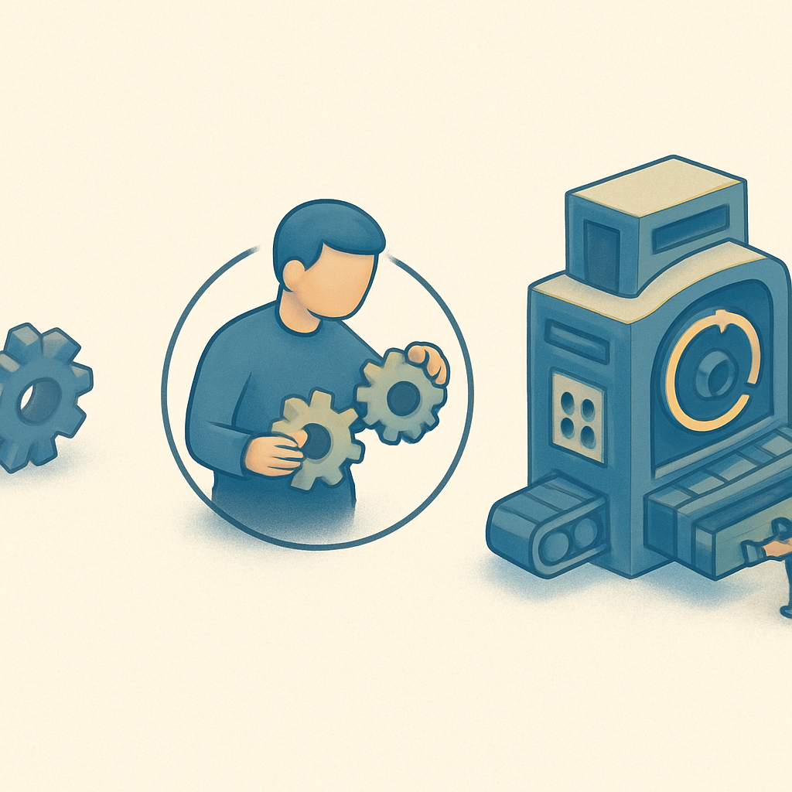

# Engine vs. Library vs. Framework



Quem chega ao gamedev vindo de engenharia de software já conhece bem a distinção entre uma biblioteca e um framework no mundo de aplicativos. Uma biblioteca é código que você chama — você escreve o `main`, você cria o event loop, você decide quando chamar `json.parse()` ou `numpy.sum()`. Um framework inverte esse fluxo: você registra código e o framework decide quando executá-lo. Spring chama seu `@Controller` quando chega uma requisição HTTP; Flutter chama seu `build()` quando o widget precisa ser repintado. A direção do controle é o critério, não a quantidade de funcionalidades — e esse princípio, que Martin Fowler chamou de "Hollywood Principle" ("don't call us, we'll call you"), é exatamente o ponto de partida para entender o que uma game engine é.

Uma engine vai um passo além do framework. Ela não apenas inverte o fluxo de controle: ela **é** o programa principal, o runtime, o ambiente integrado de desenvolvimento e a ferramenta de empacotamento do jogo — tudo ao mesmo tempo. Quando você abre o Godot, você não está abrindo um editor de texto com um framework carregado. Você está dentro de um ambiente que já sabe o que é uma cena, o que é um node, como compilar GDScript para bytecode, como empacotar texturas em formatos otimizados para GPU, como serializar o estado de uma cena em disco e como construir um executável para Windows, Linux, Android ou Web. Nenhuma dessas capacidades precisa ser conectada por você.

A distinção fica mais precisa quando comparada com as alternativas que aparecem no panorama de engines avaliado nos subcapítulos anteriores. Phaser é classificado conscientemente como "framework JavaScript", não como engine — e essa classificação é técnica, não de marketing. Com Phaser, você escreve o `index.html`, você configura o bundler (Vite, Webpack, ou nenhum), você decide onde e como servir os assets, e você mesmo constrói (ou não) qualquer ferramenta visual de composição de cenas. Phaser fornece os subsistemas — renderização via WebGL/Canvas, física Arcade ou Matter.js, gerenciamento de assets, input — mas o `main()` é seu. Você chama `new Phaser.Game(config)` e a partir daí o Phaser toma o controle do loop, mas ainda assim o ambiente que rodou esse JavaScript (Node, o browser, seu bundler) foi você quem configurou. Godot, por contraste, nem existe fora do seu próprio processo. Ele é o ambiente.

```
┌─────────────────────────────────────────────────┐
│  Biblioteca (ex: pygame, SDL)                   │
│  O SEU CÓDIGO tem o main loop.                  │
│  Você chama a biblioteca quando precisa.        │
└─────────────────────────────────────────────────┘

┌─────────────────────────────────────────────────┐
│  Framework (ex: Phaser)                         │
│  O FRAMEWORK tem o main loop.                   │
│  Você registra código, o framework o chama.    │
│  Mas o ambiente (runtime, build) é seu.         │
└─────────────────────────────────────────────────┘

┌─────────────────────────────────────────────────┐
│  Engine (ex: Godot)                             │
│  A ENGINE tem o main loop.                      │
│  A ENGINE é o ambiente e o runtime.             │
│  A ENGINE compila, empacota e executa o jogo.   │
│  Você escreve lógica que a engine invoca.       │
└─────────────────────────────────────────────────┘
```

O game loop é o núcleo que fundamenta essa diferença. Em qualquer jogo, existe um ciclo contínuo: processar entradas do jogador → atualizar o estado do mundo → renderizar o frame → repetir. Em bibliotecas como pygame ou SDL, você escreve esse ciclo explicitamente — um `while running: handle_events(); update(); draw()` literalmente dentro do seu código. Em Phaser, você não escreve o loop, mas as funções que ele vai chamar (`update()`, `preload()`, `create()`) ficam no seu código JavaScript em arquivos que você organiza, buildas e servis. Em Godot, o loop pertence ao binário do editor/runtime — o código C++ do próprio Godot — e o seu GDScript só entra em cena quando a engine decide chamar `_process(delta)` ou `_physics_process(delta)` em cada node ativo da árvore de cenas.

Isso tem uma consequência prática imediata: em uma engine, a granularidade de controle que você tem sobre o loop principal é menor, mas a quantidade de trabalho que já está feito é dramaticamente maior. Você não vai escrever o código que decide a ordem em que objetos são desenhados, a maneira como colisões físicas são resolvidas entre frames, ou o pipeline de compressão de texturas para exportação. Tudo isso existe, está testado, está documentado e responde a parâmetros de configuração expostos pelo editor. A troca clássica de IoC (Inversion of Control) — você cede controle, ganha produtividade — aqui é multiplicada porque o que a engine faz por você inclui não apenas execução mas também todo o tooling.

Esse aspecto de tooling integrado é o que mais surpreende quem vem de stacks de software convencional. No desenvolvimento mobile, por exemplo, você tem o Flutter SDK (o framework) mais o Android Studio ou VS Code (o IDE) mais o Gradle/Xcode (o build system) mais o pub.dev (o gestor de pacotes) mais o Dart DevTools (o debugger/profiler) — cinco ferramentas distintas, integradas com maior ou menor graciosidade. Em Godot, tudo isso mora na mesma janela:

| Responsabilidade | Stack mobile (Flutter) | Godot 4 |
|---|---|---|
| IDE / editor de código | VS Code / Android Studio | Editor Godot integrado |
| Compositor visual de UI/cenas | Flutter Inspector (runtime) | Scene Editor visual, nativo |
| Build system | Gradle / Xcode | Export -> Build dentro do editor |
| Gerenciador de assets | pub.dev / assets/ manual | Import system + FileSystem dock |
| Debugger | Dart DevTools | Debugger integrado com breakpoints em GDScript |
| Profiler | Dart DevTools | Profiler integrado com framegraph |
| Simulador de dispositivo | Android Emulator / iOS Simulator | Remote Debug direto no editor |

Essa unificação não é puramente conforto — ela tem implicações arquiteturais. Quando o asset manager e o editor de cenas vivem no mesmo processo que o compilador de scripts, mudanças em um recurso disparam reimportação automática, hot reload de cenas em execução, e notificações aos sistemas dependentes sem intervenção manual. Quando você altera a textura de um personagem em disco, o Godot detecta, reimporta, e o jogo que está rodando via "Play" atualiza a textura em tempo real. Nenhuma ferramenta externa precisa ser invocada.

A armadilha mais comum de quem migra de software convencional para gamedev é tratar a engine como um framework glorificado — tentar escrever código que "controla" a engine em vez de código que "responde" a ela. Isso se manifesta, por exemplo, em querer instanciar nodes manualmente fora do ciclo de vida definido pela engine, ou chamar funções de renderização diretamente em vez de deixar a árvore de cenas fazer esse trabalho nos momentos certos. O modelo mental correto é o inverso: você escreve peças de lógica específica do jogo, a engine decide quando essas peças entram em ação. Seus scripts GDScript são as "peças que se encaixam nos slots" — a engine fornece os slots (callbacks como `_ready()`, `_process()`, `_input()`) e você preenche os que fazem sentido para cada node.

Uma segunda confusão frequente é entre engine e motor gráfico. SDL, SFML e OpenGL são bibliotecas que lidam com gráficos, janelas e input — você ainda precisa construir tudo acima disso (sistema de cenas, gerenciamento de assets, serialização de estado). Unity, Unreal e Godot são engines: entregam o motor gráfico **e** todos os sistemas acima dele. Quando o subcapítulo anterior descreveu Phaser como "framework JavaScript para web", estava dizendo precisamente isso: Phaser fornece um conjunto coeso de subsistemas com inversão de controle sobre o loop, mas sem o ambiente integrado e sem a camada completa de tooling que define uma engine.

Para o projeto deste livro — um RPG 2D online com multiplayer, persistência, tilemaps, animações, combate por turnos e exportação para plataformas reais — a distinção não é acadêmica. Usar uma biblioteca como SDL significaria construir do zero sistemas que não estão no escopo do aprendizado que queremos aqui (renderer de tilemaps, serialização de cenas, sistema de signals, API de multiplayer de alto nível). Usar Phaser significaria montar o ambiente de build, lidar com a ausência de editor visual e construir manualmente integração de multiplayer — exatamente os pontos que o subcapítulo anterior identificou como gaps. Godot entrega esses sistemas como parte do contrato da engine, permitindo que o foco esteja na lógica do jogo, não na infraestrutura do tooling.

## Fontes utilizadas

- [GameDev Glossary: Library Vs Framework Vs Engine — GameFromScratch.com](https://gamefromscratch.com/gamedev-glossary-library-vs-framework-vs-engine/)
- [Game Development Frameworks vs. Engines — Keewano](https://keewano.com/blog/game-development-frameworks-engines/)
- [Difference between Framework and Engine — GameDev.net](https://www.gamedev.net/forums/topic/679325-difference-between-framework-and-engine/)
- [Inversion of Control — Martin Fowler](https://martinfowler.com/bliki/InversionOfControl.html)
- [Game Loop — Game Programming Patterns](https://gameprogrammingpatterns.com/game-loop.html)
- [Phaser vs Godot for 2D Games: Which Should You Choose? — Generalist Programmer](https://generalistprogrammer.com/tutorials/phaser-vs-godot-2d-games)
- [Game Engines vs Game Frameworks — DEV Community](https://dev.to/arsenmazmanyan1104/game-engines-vs-game-frameworks-1icc)
- [Game Asset Pipeline Explained: From DCC to Runtime — PulseGeek](https://pulsegeek.com/articles/game-asset-pipeline-explained-from-dcc-to-runtime/)

---

**Próximo conceito** → [Game Loop e Frame](../02-game-loop-e-frame/CONTENT.md)
