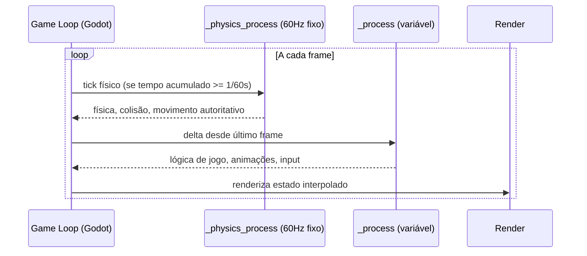

# Game Loop e Frame


O conceito anterior estabeleceu que a engine é o programa principal — ela tem o loop, não você. Agora é hora de olhar diretamente para esse loop e entender o que ele faz a cada volta, porque é nesse ritmo que todo o seu código GDScript vai viver. Quem chega do desenvolvimento mobile está acostumado a um modelo fundamentalmente diferente: o app fica em repouso e acorda quando algo acontece. Uma notificação chega — o sistema dispara um handler. O usuário toca a tela — o framework chama o método de callback. O request HTTP retorna — a Promise resolve. Entre esses eventos, o processo simplesmente espera. O sistema operacional concede a fatia de CPU apenas quando há trabalho real a fazer. Esse modelo é magnificamente eficiente para aplicativos de usuário: poupa bateria, simplifica o raciocínio sobre estado, e funciona perfeitamente quando o mundo só muda quando o usuário interage.

Jogos não funcionam assim. Um RPG com uma animação de personagem, partículas de chuva, NPCs caminhando no mapa e um timer de batalha não pode pausar e esperar o usuário apertar uma tecla para então atualizar tudo. Ele precisa continuar se movendo mesmo quando ninguém toca em nada. A chuva cai independentemente de input. O NPC completa sua rota de patrulha. O timer de batalha avança. Para isso acontecer, o programa nunca pode descansar: ele precisa de um laço contínuo e incondicional que gira o tempo todo enquanto o jogo está rodando. Esse é o game loop.

A estrutura fundamental do game loop tem três fases que se repetem ininterruptamente:

```
while o_jogo_está_rodando:
    processar_input()   # 1. ler o que o jogador fez desde a última volta
    atualizar()         # 2. avançar o estado do mundo (física, IA, timers, lógica)
    renderizar()        # 3. desenhar o estado atual na tela
```

A fase de **processar input** não bloqueia. O loop não espera o usuário fazer algo — ele simplesmente lê o estado atual dos dispositivos de entrada (teclado, gamepad, toque) e avança. Se não há input novo, passa pela fase em microsegundos e segue. A fase de **atualizar** é onde a lógica do jogo executa: posições de objetos são calculadas, colisões são detectadas e resolvidas, scripts de IA decidem o próximo movimento dos NPCs, timers decrementam, estados de combate transitam. A fase de **renderizar** pega o estado resultante e o transforma em pixels na tela. Nada mais é feito entre uma renderização e a próxima — o loop já recomeça imediatamente.

Cada volta completa desse ciclo produz o que chamamos de **frame** — literalmente um quadro, como num filme. A diferença em relação ao cinema é que aqui cada quadro é gerado em tempo real, e a lógica do jogo avança junto com a renderização. Um frame não é apenas uma imagem: é a unidade discreta de tempo na qual todo o estado do jogo avança. Quando você vê "posição do jogador = (120, 80)", essa posição existe dentro de um frame específico. No próximo frame, ela pode ser (122, 80) se o jogador está andando.

**FPS** (frames per second) é a frequência com que esse ciclo completo acontece por segundo. A 60 FPS, o loop gira 60 vezes por segundo, produzindo 60 frames — e atualizando o estado do jogo 60 vezes. A 30 FPS, o jogo atualiza 30 vezes por segundo. A diferença perceptiva é real: abaixo de 30 FPS, o olho humano começa a perceber os quadros individuais como saltos; entre 30 e 60 FPS a experiência é aceitável para a maioria dos jogos; acima de 60 FPS os movimentos parecem mais fluidos e o input parece mais responsivo porque a latência entre "apertar o botão" e "ver o resultado na tela" diminui.

Há uma distinção crítica que fica invisível em discussões de FPS: a diferença entre FPS médio e consistência de frame time. Frame time é o tempo que cada frame individual levou para completar — o inverso do FPS instantâneo. A 60 FPS perfeitos, cada frame deveria levar exatamente 16,67ms. Se um frame leva 8ms e o seguinte leva 40ms, o FPS médio ainda pode parecer alto, mas o jogador sente um "hitch" — uma travada momentânea — porque o cérebro nota a variação no intervalo entre quadros, não a média. Jogos bem otimizados perseguem frame time consistente, não apenas FPS médio alto.

No Godot 4, você nunca escreve o loop explicitamente. O que você escreve são funções que a engine chama de dentro do loop. O Godot expõe dois pontos de entrada principais no ciclo:

```gdscript
func _process(delta: float) -> void:
    # Chamada uma vez por frame, logo antes do render
    # 'delta' é o tempo em segundos desde o frame anterior
    pass

func _physics_process(delta: float) -> void:
    # Chamada em intervalos fixos (padrão: 60Hz, independente do FPS de render)
    # Usada para física, colisão e movimentos que precisam ser determinísticos
    pass
```

A existência de dois callbacks separados revela uma tensão clássica no design de game loops: física determinística vs. rendering fluido. O `_process` é chamado tão rápido quanto o hardware permite — a 120 FPS de render, ele é chamado 120 vezes por segundo, com deltas variáveis (um frame pode durar 7ms, o seguinte 12ms, dependendo de quanto trabalho houve). O `_physics_process` é chamado num ritmo fixo, por padrão 60 vezes por segundo, independentemente do FPS do rendering. Se o rendering cai para 30 FPS, o motor físico ainda processa 60 ticks físicos por segundo — só que dois ticks físicos por frame de render.

Essa separação existe porque física e colisão são matematicamente sensíveis a variações de timestep. Calcular a trajetória de um projétil com delta variável introduz imprecisões acumuladas: em hardware lento (delta grande) o projétil "salta" mais por tick e pode atravessar paredes finas que em hardware rápido (delta pequeno) ele teria colidido corretamente. Com um timestep fixo, o comportamento físico é determinístico: o mesmo jogo rodando a 30 FPS ou 120 FPS produz as mesmas colisões e a mesma física, porque o motor físico processa sempre no mesmo ritmo. A visibilidade do resultado é suavizada pela interpolação — o Godot renderiza posições intermediárias entre dois ticks físicos para que o movimento não pareça "degraus" a 60Hz mesmo quando o render corre mais rápido.



Para o RPG que este livro constrói, essa distinção vai aparecer o tempo todo. O movimento do personagem em grid — tile-a-tile — é naturalmente modelado em `_physics_process`: precisa ser determinístico, coordenado com a detecção de colisão das paredes do tilemap e, no contexto multiplayer, sincronizável com o servidor de maneira previsível. Animações de idle, fade de câmera, efeitos de partícula e atualização de UI vão em `_process`, onde a variação de delta não compromete a correção — apenas a suavidade visual, que já está coberta pelo próprio rendering interpolado do Godot.

A confusão mais comum de quem migra do mobile é tentar usar `_process` para tudo — afinal, é "o callback que sempre é chamado". O problema aparece quando se coloca física em `_process`: a 30 FPS numa máquina lenta, o personagem caminha mais devagar do que a 60 FPS numa máquina rápida, porque o delta é maior e o código calcula `velocidade * delta` — o que deveria ser correto — mas a colisão ainda pode divergir porque o motor físico e o código de movimento não estão no mesmo ritmo. A regra simples: movimento com colisão vai em `_physics_process`; todo o resto vai em `_process`, usando `delta` para calibrar qualquer quantidade que depende de tempo.

Uma segunda confusão diz respeito à relação entre frame e input. No modelo de eventos do mobile, o input é o gatilho — sem input, nada acontece. No game loop, input é apenas mais uma leitura dentro do ciclo, e o resultado dessa leitura só tem efeito no mesmo frame em que é lido (ou no `_physics_process` subsequente). Se o jogador mantém a tecla pressionada por 0,5 segundos a 60 FPS, o jogo lê esse estado 30 vezes — e em cada uma dessas leituras pode tomar uma decisão. Isso é radicalmente diferente de um evento `onKeyDown` que dispara uma única vez. Em Godot, `Input.is_action_pressed("move_left")` retorna `true` em todos os frames enquanto a tecla está pressionada; `Input.is_action_just_pressed("move_left")` retorna `true` apenas no frame em que a tecla foi apertada — útil para detectar o toque inicial sem repetição.

No contexto do RPG online que este livro constrói, o game loop tem uma terceira implicação que o próximo conceito do subcapítulo vai aprofundar: o servidor também tem um loop, chamado de **tick loop**, que processa o estado autoritativo do mundo a uma frequência definida (tick rate). A sincronização de estado entre cliente e servidor é, em essência, a negociação entre o game loop do cliente (que roda em framerate variável dependente do hardware do jogador) e o tick rate do servidor (que roda num ritmo fixo e independente de qualquer cliente). Entender que o game loop é o coração pulsante de qualquer instância do jogo — cliente ou servidor — é o pré-requisito para que esse vocabulário de sincronização faça sentido.

## Fontes utilizadas

- [Game Loop — Game Programming Patterns (Robert Nystrom)](https://gameprogrammingpatterns.com/game-loop.html)
- [Anatomy of a video game — MDN Web Docs](https://developer.mozilla.org/en-US/docs/Games/Anatomy)
- [Idle and Physics Processing — Godot Engine documentation](https://docs.godotengine.org/en/stable/tutorials/scripting/idle_and_physics_processing.html)
- [Game Loop Fundamentals: A 2025 Guide for Developers — Meshy Blog](https://www.meshy.ai/blog/game-loop)
- [Game Loop vs Events — GameDev.net](https://www.gamedev.net/forums/topic/708341-game-loop-vs-events-or-event-loop/)
- [Proper Usage of _process and _physics_process — UhiyamaLab](https://uhiyama-lab.com/en/notes/godot/godot-process-vs-physics-process-game-loop-guide/)
- [Frame Rate — Wikipedia](https://en.wikipedia.org/wiki/Frame_rate)

---

**Próximo conceito** → [Delta Time](../03-delta-time/CONTENT.md)
