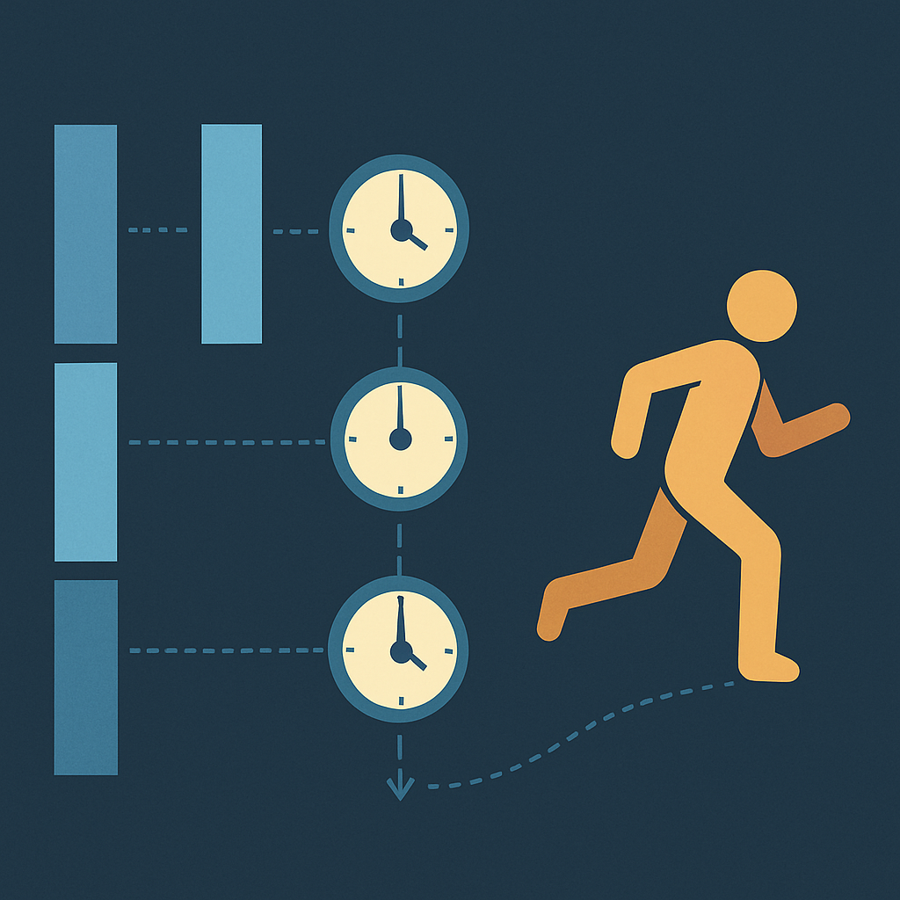

# Delta Time



O conceito anterior revelou que o game loop gira continuamente — sem pausas, sem espera por eventos externos — e que cada volta completa produz um frame. Também ficou claro que `_process(delta)` e `_physics_process(delta)` são os pontos de entrada que o Godot oferece dentro desse loop. Ambas as funções recebem um parâmetro chamado `delta`. Este conceito explica o que esse parâmetro representa, por que ele existe e por que ignorá-lo quebra o jogo em qualquer máquina que não seja exatamente a sua.

O problema começa com uma propriedade que o conceito anterior enunciou: FPS não é fixo. O tempo que um frame leva para completar — processar input, atualizar física, executar scripts, renderizar — varia a cada ciclo dependendo de quanto trabalho houve. Em hardware potente, um frame pode completar em 6 ms; no mesmo jogo rodando numa máquina mais lenta, o mesmo frame pode levar 33 ms. Se você escrever a movimentação do personagem como `posição += velocidade` sem qualquer correção temporal, o personagem se move com cada frame — e se um frame leva 6 ms e o seguinte leva 33 ms, o personagem "dá passos" de tamanhos completamente diferentes. A 30 FPS, ele percorre metade da distância que percorreria a 60 FPS na mesma quantidade de tempo real. O jogo fica mais lento em hardware ruim, mais rápido em hardware bom — a física do mundo se torna uma função do processador de quem joga, não das regras do jogo.

**Delta time** é o tempo, em segundos, decorrido desde o frame anterior. É um número de ponto flutuante, geralmente pequeno: a 60 FPS estável, `delta ≈ 0.01667`; a 30 FPS, `delta ≈ 0.03333`. Quando um frame leva mais tempo — spike de CPU, garbage collector, swap de textura — o delta aumenta proporcionalmente. Quando o hardware acelera ou o trabalho daquele frame era leve, o delta diminui. O delta é, portanto, o "largura" de cada fatia de tempo real que o frame representa.

A correção é multiplicar qualquer quantidade que depende de tempo por esse delta:

```gdscript
# Errado — velocidade em pixels por frame, não por segundo
func _process(delta: float) -> void:
    position.x += 200.0

# Correto — velocidade em pixels por segundo, calibrada por frame
func _process(delta: float) -> void:
    position.x += 200.0 * delta
```

Na primeira versão, o personagem se move 200 pixels por frame. A 60 FPS, são 12.000 pixels por segundo. A 30 FPS, 6.000 pixels por segundo. Na segunda versão, com `delta` representando a fração de segundo que aquele frame cobriu, a expressão `200.0 * delta` calcula exatamente quantos pixels o personagem deveria percorrer nesse intervalo. A 60 FPS (`delta = 0.01667`), são `200 * 0.01667 ≈ 3.33 px` por frame, somando 200 px/s. A 30 FPS (`delta = 0.03333`), são `200 * 0.03333 ≈ 6.67 px` por frame — o dobro de pixels por frame, mas ainda 200 px/s porque os frames acontecem duas vezes mais devagar. O resultado real — distância coberta em um segundo — é idêntico em qualquer framerate.

Essa propriedade tem um nome: **frame-rate independence**. Um jogo frame-rate-independent se comporta da mesma forma independente de quantos frames por segundo o hardware consegue produzir. Jogadores em máquinas diferentes veem o mesmo jogo, com as mesmas velocidades, as mesmas durações de animação e os mesmos timers. Para um RPG com multiplayer — onde dois clientes com hardwares distintos precisam ver o mesmo estado do mundo — essa consistência não é apenas conforto: é requisito.

Além de movimento, delta time calibra qualquer grandeza que avança ao longo do tempo:

| Caso de uso | Sem delta | Com delta |
|---|---|---|
| Timer de status (veneno) | `timer -= 1` por frame — dura 60 frames a 60 FPS, 30 frames a 30 FPS | `timer -= 1.0 * delta` — dura 1 segundo em qualquer FPS |
| Cooldown de habilidade | Esgota mais rápido em hardware veloz | Cooldown real, independente do hardware |
| Fade de tela (alpha) | Alpha cai mais rápido a 120 FPS | Fade de duração fixa em segundos |
| Interpolação de câmera | Lerp instável com delta variável implícito | `lerp(pos, alvo, velocidade * delta)` — interpolação previsível |
| Partícula com vida útil | Morre em frames, não em tempo | Morre em segundos |

Em GDScript, o delta já vem pré-calculado como parâmetro pelo Godot — você não precisa fazer `Time.get_ticks_msec()` manualmente. Em `_physics_process(delta)`, o valor é ainda mais previsível: como o motor físico roda em timestep fixo (padrão 60 Hz), o delta passado para `_physics_process` é quase sempre uma constante (`≈ 0.01667s`). Isso não significa que você pode ignorar o parâmetro — se o projeto mudar a frequência de física ou o processamento se atrasar, o delta vai refletir. A regra continua: use `delta` sempre.

```gdscript
# Movimento em _physics_process — físico e determinístico
func _physics_process(delta: float) -> void:
    var direction = Input.get_vector("move_left", "move_right", "move_up", "move_down")
    velocity = direction * 150.0  # pixels por segundo
    move_and_slide()              # Godot usa o delta internamente para o CharacterBody2D

# Timer em _process — lógica de jogo, não física
var cooldown: float = 0.0

func _process(delta: float) -> void:
    if cooldown > 0.0:
        cooldown -= delta
```

Note que `move_and_slide()` — o método de movimentação de `CharacterBody2D` — já usa delta internamente para converter `velocity` (pixels/segundo) em deslocamento real. Você define velocidade em unidades por segundo; o Godot calcula o deslocamento por frame. É a mesma mecânica de delta time, só encapsulada.

Um problema real que surge em produção é o **delta spike**: quando o jogo congela por décimos de segundo — garbage collection, carregamento de recurso, processo do sistema operacional tomando a CPU — o próximo frame encontra um delta absurdamente grande, como 0,5 s ou até 2 s. Se toda a movimentação é `velocidade * delta`, um personagem pode "teleportar" meio mapa em um único frame, atravessar paredes que deveriam bloqueá-lo e corromper estado de jogo. A solução padrão é clampar o delta a um valor máximo razoável:

```gdscript
func _process(delta: float) -> void:
    var safe_delta = min(delta, 0.05)  # nunca avança mais de 50ms por frame
    position.x += 200.0 * safe_delta
```

Com esse clamping, um freeze de 1 segundo resulta num único frame onde o jogo avança no máximo 50 ms — o jogo desacelera momentaneamente em vez de explodir. O Godot 4 expõe `Engine.max_fps` e configurações de física que ajudam a gerenciar esse comportamento, mas o clamping manual no nível do script é uma proteção adicional válida para lógica sensível.

Existe ainda uma armadilha conceitual frequente: aplicar delta onde ele não deveria ser aplicado. Nem tudo precisa ser calibrado por tempo. Uma força aplicada num único evento (o jogador pulou — aplique o impulso uma vez) não usa delta. Uma verificação booleana (o inventário está aberto?) não usa delta. Um valor que muda apenas em resposta a input discreto não usa delta. A regra é simples: **se a grandeza precisa "avançar" continuamente ao longo do tempo, use delta; se ela muda em eventos pontuais, não use**.

No contexto específico do RPG que estamos construindo, delta time aparecerá em praticamente toda a camada de apresentação: a interpolação visual do personagem deslizando entre tiles (mesmo que o movimento lógico seja tile-a-tile), o fade de transição ao entrar em batalha, os timers de cooldown de habilidades, a animação dos NPCs no mapa e os efeitos de partícula. A camada lógica — a posição real em grid, o estado da batalha, o inventário — avança em eventos discretos e não depende de delta. Essa separação entre apresentação contínua (delta-driven) e lógica discreta (event-driven) é um padrão que vai aparecer repetidamente ao longo do livro.

## Fontes utilizadas

- [Understanding Delta Time — DEV Community (Dsaghliani)](https://dev.to/dsaghliani/understanding-delta-time-in-games-3olf)
- [Delta timing — Wikipedia](https://en.wikipedia.org/wiki/Delta_timing)
- [Understanding delta — Godot 4 Recipes (KidsCanCode)](https://kidscancode.org/godot_recipes/4.x/basics/understanding_delta/index.html)
- [Idle and Physics Processing — Godot Engine documentation](https://docs.godotengine.org/en/stable/tutorials/scripting/idle_and_physics_processing.html)
- [Fix Your Timestep! — Gaffer on Games](https://gafferongames.com/post/fix_your_timestep/)
- [Delta Time — Construct Tutorials](https://www.construct.net/en/tutorials/delta-time-framerate-2)
- [Time and Games — InformIT (Game Programming Algorithms and Techniques)](https://www.informit.com/articles/article.aspx?p=2167437&seqNum=3)

---

**Próximo conceito** → [Node e Scene no Godot](../04-node-e-scene-no-godot/CONTENT.md)
