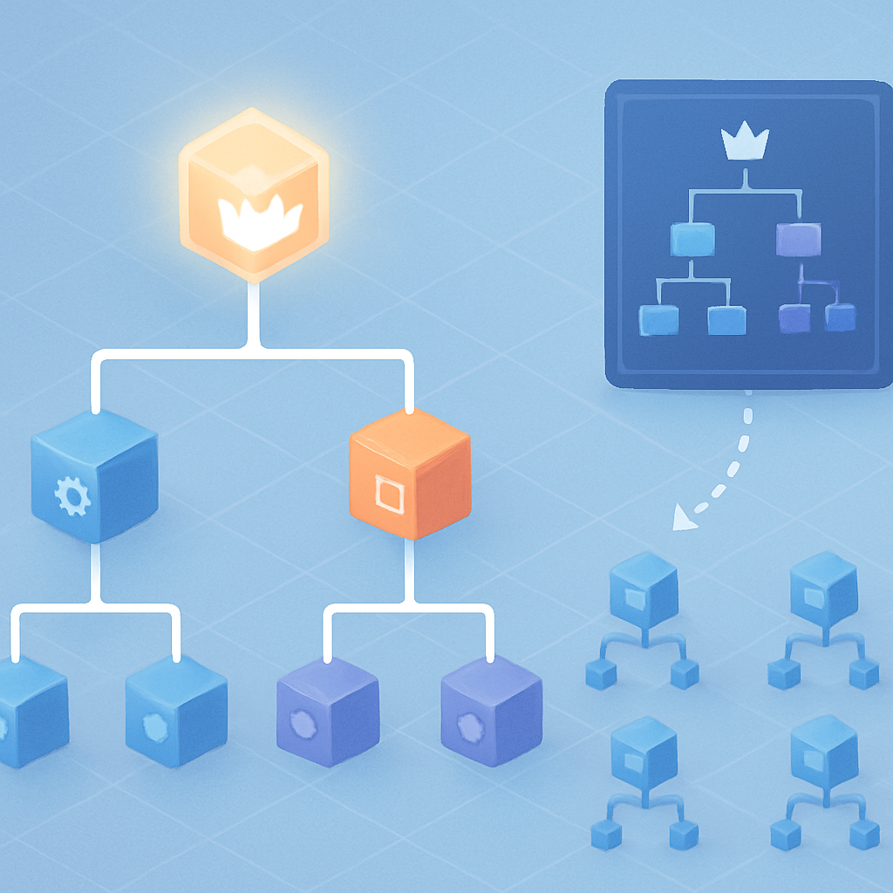
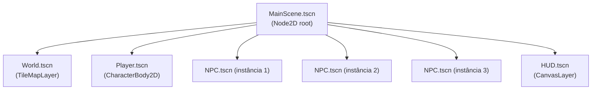

# Node e Scene no Godot



Os três conceitos anteriores construíram uma base específica: a engine controla o loop, o loop gira frame a frame, e o `delta` corrige o tempo entre cada frame. Mas em nenhum momento falamos sobre *onde* o código que você escreve vive — qual é o recipiente que organiza a lógica do jogo, os sprites, as colisões e a câmera num objeto coerente que pode ser colocado, removido e reutilizado. Esse é o passo que falta: entender o **node** como unidade atômica de comportamento e a **scene** como a estrutura que os organiza.

Um **node** no Godot é o tijolo de construção mais básico do jogo. Cada node tem uma responsabilidade bem delimitada: `Sprite2D` desenha uma textura, `CollisionShape2D` define uma área de colisão, `AudioStreamPlayer` toca um som, `Camera2D` controla o ponto de visão do jogador, `CharacterBody2D` fornece corpo físico com movimento integrado. A engine vem com mais de 80 tipos de nodes na biblioteca padrão, cada um cobrindo um aspecto distinto do jogo. Além de suas capacidades nativas, qualquer node pode receber um script GDScript anexado — e é nesse script que você implementa a lógica específica do jogo, preenchendo callbacks como `_ready()` e `_process(delta)` que a engine invoca dentro do loop descrito nos conceitos anteriores.

O que diferencia o node de um objeto arbitrário em qualquer linguagem orientada a objetos é que ele existe dentro de um **ciclo de vida gerenciado pela engine**. Quando um node entra na árvore ativa do jogo, a engine chama `_ready()` — o momento em que o node pode se conectar a filhos, registrar signals e inicializar estado que depende de outros nodes já estarem presentes. A partir daí, a cada frame do game loop, a engine chama `_process(delta)` (e `_physics_process(delta)` no tick físico) em cada node ativo que implementa essas funções. Quando o node é removido da árvore, a engine chama `_exit_tree()`. Você nunca chama essas funções diretamente — elas são os "slots" que o conceito de engine descreveu: a engine decide quando, você decide o quê.

Nodes raramente existem sozinhos. A abstração que os agrupa é a **scene** — uma árvore hierárquica de nodes com exatamente um nó raiz. Em termos estruturais:

```
CharacterBody2D          ← nó raiz da scene (o "contrato público" dela)
├── Sprite2D             ← filho: cuida da representação visual
├── AnimationPlayer      ← filho: controla animações do sprite
├── CollisionShape2D     ← filho: define a hitbox do personagem
└── Camera2D             ← filho: câmera que segue o jogador
```

A scene é salva em disco com extensão `.tscn` (text scene) e é, essencialmente, um blueprint serializado: uma descrição de quais nodes compõem a cena, em que hierarquia, com quais propriedades. Não existe instância ao salvar — o arquivo `.tscn` é o molde. A instância surge quando a scene é carregada e adicionada à árvore ativa do jogo.

A distinção entre molde e instância é onde o poder do sistema de cenas do Godot se revela. Uma `scene` pode ser **instanciada** — colocada como filho de outra scene — tantas vezes quanto necessário, e cada instância é independente: tem suas próprias propriedades, seu próprio estado interno, seu próprio script rodando. Se você tem uma scene de NPC (com `CharacterBody2D`, sprite, `CollisionShape2D` e script de IA), você pode criar 30 NPCs no mapa instanciando essa scene 30 vezes. Quando você edita a scene original do NPC — muda a hitbox, ajusta a velocidade padrão, corrige o sprite — todas as 30 instâncias refletem a mudança automaticamente, porque compartilham o mesmo `.tscn` como fonte de verdade. Isso é o que a documentação do Godot chama de "scene instancing", e é funcionalmente equivalente ao sistema de **Prefabs** do Unity — com a diferença fundamental de que, no Godot, **não existe distinção entre "prefab" e "cena de nível"**: o mesmo mecanismo que você usa para criar um NPC reutilizável é o mesmo que você usa para criar o mapa do jogo inteiro.

Esse ponto merece ênfase porque é a principal diferença conceitual em relação a Unity — e a confusão mais frequente para quem chega de lá. Em Unity, existe uma separação: Scenes são "ambientes" ou "níveis", e Prefabs são "objetos reutilizáveis". São sistemas distintos, com fluxos de trabalho distintos. No Godot, **scene é o único construto**. Um personagem jogável é uma scene. Um NPC é uma scene. Um botão de UI é uma scene. O mapa completo da cidade de Pallet Town é uma scene. E você pode instanciar qualquer uma dessas scenes dentro de qualquer outra. A word "scene" no Godot não é sinônimo de "fase" ou "nível" — é sinônimo de "qualquer agrupamento reutilizável de nodes".



No diagrama acima, `NPC.tscn` é o mesmo arquivo três vezes — três instâncias do mesmo molde, cada uma com sua posição e estado independentes. Nada impede que o `Player.tscn` instancie por sua vez um `Sword.tscn` como filho quando o jogador equipa uma arma. Isso é composição recursiva: cenas dentro de cenas dentro de cenas, até qualquer profundidade necessária.

O que conecta todas essas instâncias num jogo rodando é a **SceneTree** — a árvore global gerenciada pela engine que contém todos os nodes ativos no momento. Quando você abre um projeto no Godot e aperta Play, a engine instancia a scene designada como "principal" e a adiciona à SceneTree. A partir daí, a SceneTree é o runtime do jogo: é ela que percorre a árvore a cada frame e invoca `_process(delta)` nos nodes ativos, na ordem correta de acordo com a hierarquia. Nodes mais próximos da raiz são processados antes de seus filhos. Quando uma scene é instanciada via código — `var npc = NPC_SCENE.instantiate(); add_child(npc)` — o node entra na SceneTree, recebe `_ready()` e começa a participar do loop. Quando é removido — `npc.queue_free()` — sai da árvore, `_exit_tree()` é chamado, e o node deixa de receber qualquer callback.

Dois detalhes de ciclo de vida causam confusão real na prática. O primeiro: `_ready()` é chamado **de baixo para cima** na árvore. O filho recebe `_ready()` antes do pai. Isso garante que quando o pai tenta acessar um filho em `_ready()`, o filho já está inicializado. O segundo: acessar nodes de outros ramos da árvore em `_ready()` pode falhar porque esses ramos podem ainda não ter sido adicionados à cena. A solução é usar `@onready`:

```gdscript
# @onready resolve a referência quando _ready() é chamado no node raiz da scene,
# garantindo que todos os filhos já foram inicializados
@onready var sprite: Sprite2D = $Sprite2D
@onready var collision: CollisionShape2D = $CollisionShape2D

func _ready() -> void:
    # sprite e collision já existem aqui — seguro usar
    sprite.modulate = Color.RED
```

O segundo problema recorrente envolve referências a nodes via `get_node()` ou o atalho `$` dentro de loops ou em `_process`. Cada chamada a `get_node()` percorre a árvore para localizar o node pelo caminho — é uma busca com custo proporcional à profundidade. Fazer isso 60 vezes por segundo por frame é desperdício evitável: armazene a referência em variável com `@onready` uma única vez e reutilize.

Um terceiro gotcha é confundir **remover um node da árvore** com **destruí-lo**. `remove_child(node)` retira o node da SceneTree, para seus callbacks e o desconecta visualmente — mas o objeto ainda existe na memória. Isso é útil quando você quer guardar um node desativado e reintroduzi-lo depois (pooling de objetos, por exemplo). `queue_free()` remove o node da árvore **e** agenda sua destruição ao fim do frame atual. Para NPCs que morrem no mapa, `queue_free()` é o caminho. Para um sistema de object pooling de projéteis, `remove_child` + `add_child` é mais eficiente do que criar e destruir nodes repetidamente.

Para o RPG que este livro constrói, essa arquitetura mapeia diretamente para os sistemas que vamos implementar. O mapa de Pallet Town é uma scene (`TileMapLayer` com a geometria e as camadas de colisão). O personagem jogável é uma scene (`CharacterBody2D` + `Sprite2D` + `AnimationPlayer` + `Camera2D` + o script de movimento em grid que o capítulo 7 vai construir). Cada NPC é uma scene instanciada no mapa. O HUD de batalha é uma scene de UI que vive em um `CanvasLayer` sobreposto. O sistema de combate por turnos — com seus estados, sua fila de ações e sua UI — também é uma scene que pode ser instanciada e descartada quando a batalha começa e termina. A modularidade não é opcional no Godot: é a forma natural de organizar qualquer jogo.

O próximo conceito deste subcapítulo — Signal — introduz o mecanismo que permite que essas scenes isoladas se comuniquem sem criar dependências diretas entre elas, completando o vocabulário fundamental que o resto do livro vai usar sem precisar definir novamente.

## Fontes utilizadas

- [Nodes and Scenes — Godot Engine documentation (stable)](https://docs.godotengine.org/en/stable/getting_started/step_by_step/nodes_and_scenes.html)
- [Nodes and scene instances — Godot Engine documentation (stable)](https://docs.godotengine.org/en/stable/tutorials/scripting/nodes_and_scene_instances.html)
- [Scene organization — Godot Engine documentation (stable)](https://docs.godotengine.org/en/stable/tutorials/best_practices/scene_organization.html)
- [Overview of Godot's key concepts — Godot Engine documentation](https://docs.godotengine.org/en/stable/getting_started/introduction/key_concepts_overview.html)
- [A Thorough Guide to Scenes and Nodes — UhiyamaLab](https://uhiyama-lab.com/en/notes/godot/scene-and-node-basics/)
- [Why Godot Scenes Might Beat Unity Prefabs — Wayline](https://www.wayline.io/blog/godot-scenes-vs-unity-prefabs)
- [Node communication (the right way) — Godot 4 Recipes (KidsCanCode)](https://kidscancode.org/godot_recipes/4.x/basics/node_communication/index.html)
- [Understanding node paths — Godot 4 Recipes (KidsCanCode)](https://kidscancode.org/godot_recipes/4.x/basics/getting_nodes/index.html)
- [5 Subtle Mistakes to Avoid When Programming Games in Godot 4.3 — Medium](https://medium.com/@daneallist/5-subtle-mistakes-to-avoid-when-programming-games-in-godot-4-3-45fb821f0210)

---

**Próximo conceito** → [Signal](../05-signal/CONTENT.md)
