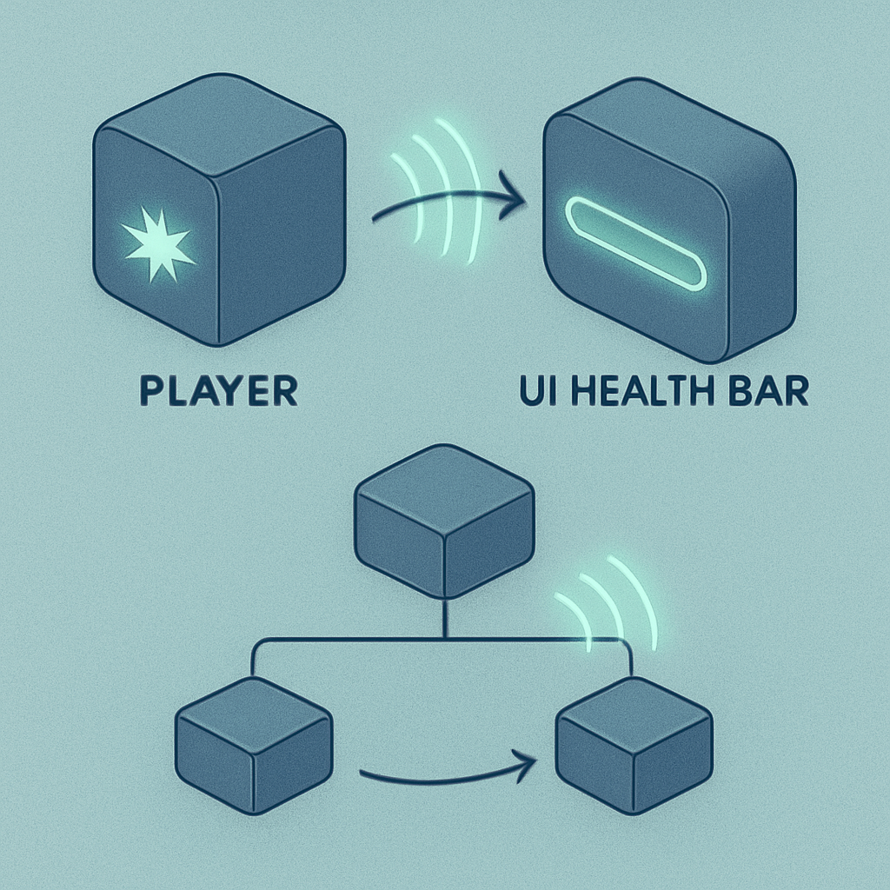
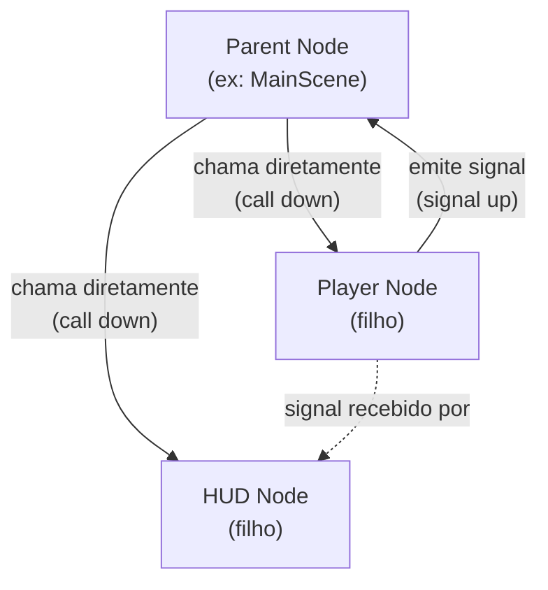

# Signal



O conceito anterior terminou com uma constatação importante: scenes isoladas que se compõem em árvore são a forma natural de organizar qualquer jogo em Godot. Um `Player.tscn`, um `HUD.tscn`, trinta instâncias de `NPC.tscn` — cada uma com seu próprio estado interno, seus próprios filhos, seu próprio script. A força dessa arquitetura está exatamente no isolamento: cada scene não precisa saber como as outras funcionam internamente. O problema que isso cria imediatamente é: **como uma scene comunica com outra sem destruir o isolamento que as torna reutilizáveis?**

A resposta direta seria referência direta — o player pega o node do HUD pela árvore e atualiza o health bar. Em GDScript seria `get_node("/root/Main/HUD/HealthBar").update(nova_vida)`. Funciona. Mas agora o `Player.tscn` depende concretamente da existência de um nó em exatamente esse caminho na SceneTree. Mude o nome do nó, reestruture a hierarquia, instancie o Player numa cena de teste sem o HUD — e o jogo quebra, com um erro de caminho inválido em runtime. O Player se tornou frágil porque ele sabe demais sobre o mundo ao redor dele.

**Signal** é o mecanismo do Godot para comunicação entre nodes sem criação de dependências diretas. Um node declara um signal — uma espécie de "evento que posso emitir" — e o emite quando algo acontece. Qualquer outro node que esteja interessado nesse evento pode se **conectar** ao signal e registrar uma função que será chamada quando a emissão ocorrer. O node que emite não sabe quem está ouvindo — pode ser ninguém, pode ser dez nodes diferentes. Ele só emite. Quem gerencia as conexões e reage é responsabilidade de quem se conecta.

Esse é exatamente o padrão Observer — ou pub/sub — que qualquer engenheiro de sistemas distribuídos já conhece bem. Um produtor publica eventos num tópico. Consumidores se inscrevem no tópico e processam os eventos. O produtor não tem referência direta aos consumidores. A diferença em relação a um broker de mensagens como Kafka ou RabbitMQ é que no Godot as conexões são síncronas e locais: quando um signal é emitido, todas as funções conectadas a ele são chamadas **imediatamente, na mesma thread, na mesma chamada de frame**. Não existe fila intermediária, não existe serialização, não existe latência de rede — é uma chamada de função indireta, com despachante gerenciado pela engine.

Em GDScript, a mecânica completa tem três partes: **declaração**, **emissão** e **conexão**.

```gdscript
# No script do Player.tscn — declaração do signal
signal health_changed(current_health: int, max_health: int)

var max_health: int = 100
var current_health: int = 100

func take_damage(amount: int) -> void:
    current_health = max(0, current_health - amount)
    health_changed.emit(current_health, max_health)  # emissão com argumentos
```

```gdscript
# No script do HUD.tscn — conexão ao signal do Player
@onready var player: CharacterBody2D = $"../Player"  # referência ao Player (chamada para baixo)
@onready var health_bar: ProgressBar = $HealthBar

func _ready() -> void:
    player.health_changed.connect(_on_player_health_changed)

func _on_player_health_changed(current: int, maximum: int) -> void:
    health_bar.max_value = maximum
    health_bar.value = current
```

O `Player` declara `health_changed` como um signal tipado, com dois parâmetros inteiros. Quando toma dano, emite o signal com os valores atuais. O `HUD` se conecta ao signal em `_ready()` registrando a função `_on_player_health_changed` como handler. A partir daí, cada vez que `health_changed.emit(...)` é chamado no Player, o GDScript invoca `_on_player_health_changed(...)` no HUD automaticamente. O Player não sabe que o HUD existe. O HUD sabe que o Player existe (tem uma referência a ele para poder chamar `.connect()`), mas não precisa conhecer a lógica interna do Player.

Godot 4 tornou signals um tipo de primeira classe na linguagem — você pode passar um signal como argumento, armazená-lo em variável, e chamar `.emit()` e `.connect()` diretamente sobre ele como métodos. Isso é diferente do Godot 3, onde a conexão era feita via string: `player.connect("health_changed", self, "_on_player_health_changed")`. A forma antiga ainda funciona por compatibilidade, mas a forma nova — com acesso direto ao signal como objeto — permite autocompletion na IDE, verificação de tipos em tempo de edição e erros mais claros em runtime quando os tipos dos argumentos não batem.

Além de signals customizados, o Godot vem com dezenas de signals predefinidos em seus tipos de nodes. `Button` tem `pressed`, emitido quando clicado. `Timer` tem `timeout`, emitido quando o timer esgota. `Area2D` tem `body_entered(body)`, emitido quando outro corpo físico entra na área de detecção. `AnimationPlayer` tem `animation_finished(anim_name)`, emitido quando uma animação termina. Esses signals já existem — você só se conecta a eles sem declarar nada. A lógica é a mesma: o node que emite não sabe quem vai reagir.

A regra arquitetural que a documentação do Godot e a comunidade definiram para guiar o uso de signals é chamada **"call down, signal up"**. A ideia é simples: a hierarquia de árvore determina qual direção de comunicação usa qual mecanismo.



Quando um node pai precisa instruir um filho — setar a posição inicial, chamar `start_battle()`, passar configurações — ele usa chamada direta: `$Player.start_battle(enemy_data)`. O pai conhece seus filhos por definição (ele os contém na hierarquia) e acessá-los por caminho relativo é seguro e explícito. Mas quando um filho precisa comunicar algo para cima — o player morreu, o botão foi clicado, a animação terminou — ele emite um signal. O pai (ou qualquer outro node que tenha se conectado) reage. O filho não sabe quem vai ouvir, e não precisa saber.

A violação mais comum desse princípio é um filho chamar diretamente o pai: `get_parent().update_ui()` ou `get_node("../../HUD/HealthBar").value = vida`. Isso funciona, mas cria acoplamento: o filho agora depende de um caminho específico na árvore e de um método específico no pai. Mova esse filho para outra cena — fora desse contexto — e o código quebra. Com signals, o filho emite e a conexão fica responsabilidade de quem integra as partes: normalmente o pai, ou um sistema de coordenação mais alto na árvore.

Uma extensão natural desse padrão é o **signal bus** — ou event bus — implementado como um Autoload (singleton) que concentra signals globais do projeto. Um Autoload é um script que o Godot inicializa antes de qualquer cena e mantém acessível globalmente pelo nome:

```gdscript
# GameEvents.gd — adicionado como Autoload no Project Settings com nome "GameEvents"
extends Node

signal battle_started(enemy_data: Dictionary)
signal battle_ended(result: String)
signal player_level_up(new_level: int)
```

```gdscript
# Em qualquer script do jogo — emitir
GameEvents.battle_started.emit({ "enemy": "Rattata", "level": 5 })

# Em qualquer script do jogo — conectar
func _ready() -> void:
    GameEvents.battle_started.connect(_on_battle_started)
```

O signal bus resolve comunicação entre nodes em ramos completamente separados da árvore — como o sistema de batalha disparando um evento que o sistema de música precisa ouvir para trocar a trilha. Sem um bus global, seria necessário criar uma cadeia de conexões subindo pela árvore até encontrar um ancestral comum. Com o bus, qualquer sistema emite e qualquer sistema ouve, sem acoplamento estrutural. A desvantagem é que signals num Autoload são mais difíceis de rastrear — um evento global pode ter dezenas de ouvintes espalhados pelo projeto, e encontrar quem reage a `battle_started` exige busca no código, não inspeção visual da hierarquia.

As armadilhas práticas com signals que surgem com frequência real merecem atenção. A primeira é **conectar o mesmo signal múltiplas vezes sem verificar**: se `_ready()` é chamado mais de uma vez para o mesmo node — o que pode acontecer se o node é removido e readicionado à árvore — e o código de conexão não verifica se a conexão já existe, o handler vai ser registrado duplicado e chamado duas vezes para cada emissão. A solução é usar a flag `CONNECT_ONE_SHOT` para conexões descartáveis, ou verificar `signal.is_connected(handler)` antes de conectar. Outra opção: conectar signals no editor via a aba "Node" do Inspector em vez de código, pois o editor garante uma conexão única.

A segunda armadilha é **não desconectar signals de nodes que vão ser destruídos**. Se um NPC se conecta ao signal global `GameEvents.battle_started` e depois é removido com `queue_free()`, a conexão persiste no Autoload apontando para um objeto destruído — o que resulta em erro ou comportamento indefinido na próxima emissão. A solução é desconectar em `_exit_tree()`, ou usar a flag `CONNECT_ONE_SHOT` quando a conexão precisa ser reagida apenas uma vez. O Godot 4 também tem `Object.connect()` com o parâmetro `flags = CONNECT_REFERENCE_COUNTED` para gerenciar esse caso automaticamente em alguns cenários, mas a regra geral é: **se o node que se conectou vai morrer antes do node que emite, desconecte**.

A terceira armadilha é **usar signals para comunicação descendente** — quando um signal é emitido pelo pai para informar os filhos. Isso inverte a convenção e raramente faz sentido: se o pai quer instruir os filhos, chame diretamente. Signals descendentes criam confusão arquitetural e devem ser revistos.

Para o RPG que estamos construindo, signals vão aparecer em praticamente toda interação entre sistemas. O `Player` emite `health_changed` quando toma dano — o HUD de batalha ouve e atualiza a barra. O sistema de combate emite `battle_ended(result)` quando a batalha termina — o sistema de música ouve e troca a trilha, o sistema de mapa ouve e reabilita o movimento. Um NPC emite `dialogue_started` quando o jogador interage — a câmera ouve e centraliza no NPC, o HUD do mapa ouve e se oculta. Cada um desses sistemas fica isolado e testável independentemente; as conexões entre eles ficam nos pontos de integração (cenas pai ou o signal bus global), não enterradas nas tripas de cada sistema.

## Fontes utilizadas

- [Using signals — Godot Engine (stable) documentation](https://docs.godotengine.org/en/stable/getting_started/step_by_step/signals.html)
- [Signal — Godot Engine class reference](https://docs.godotengine.org/en/stable/classes/class_signal.html)
- [Node communication (the right way) — Godot 4 Recipes (KidsCanCode)](https://kidscancode.org/godot_recipes/4.x/basics/node_communication/index.html)
- [Call Down Signal Up — Go, Go, Godot!](https://www.gogogodot.io/patterns/call-down-signal-up/)
- [Best practices with Godot signals — GDQuest](https://www.gdquest.com/tutorial/godot/best-practices/signals/)
- [Smarter Godot Signals with the Event Autoload pattern — GDQuest](https://www.gdquest.com/tutorial/godot/gdscript/events-signals-pattern/)
- [The Events bus singleton — GDQuest](https://www.gdquest.com/tutorial/godot/design-patterns/event-bus-singleton/)
- [Signals & the Observer Pattern in Godot — slicker.me](https://slicker.me/godot/signals-observer-pattern.html)
- [Godot Signals Architecture: Best Practices & Event Bus — blog.febucci.com](https://blog.febucci.com/2024/12/godot-signals-architecture/)
- [5 Subtle Mistakes to Avoid When Programming Games in Godot 4.3 — Medium](https://medium.com/@maxslashwang/5-subtle-mistakes-to-avoid-when-programming-games-in-godot-4-3-45fb821f0210)

---

**Próximo conceito** → [Autoridade, Tick Rate e Sincronização (primeira visão)](../06-autoridade-tick-rate-e-sincronizacao-primeira-visao/CONTENT.md)
