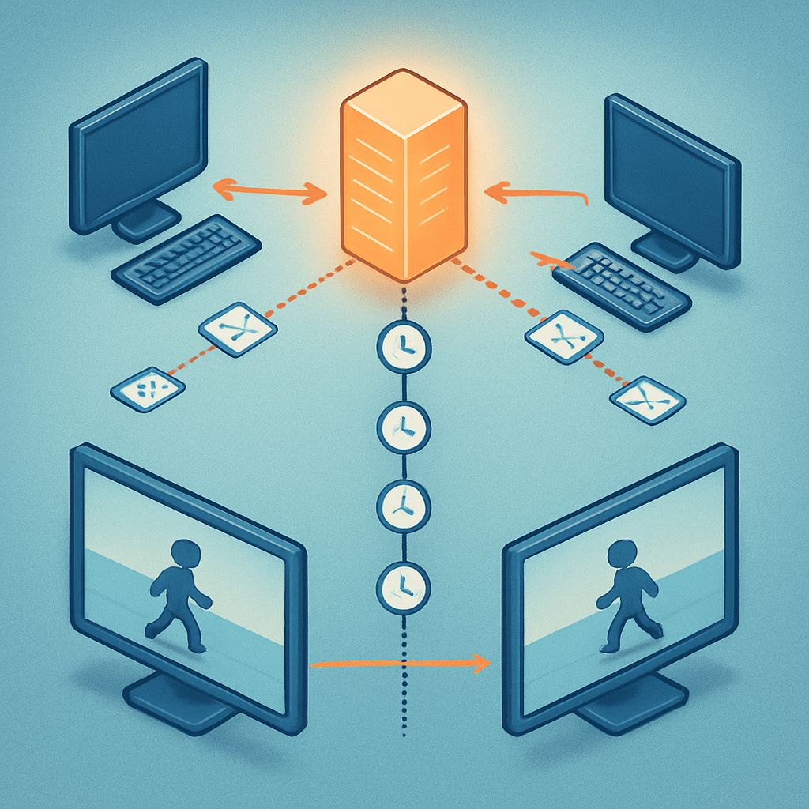
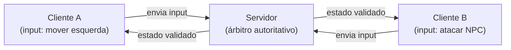

# Autoridade, Tick Rate e Sincronização (primeira visão)



O conceito de signal encerrou a discussão sobre como sistemas dentro de um único jogo se comunicam sem criar dependências rígidas — o player emite `health_changed`, o HUD ouve e reage, nenhum dos dois sabe o que o outro faz internamente. Esse modelo funciona perfeitamente enquanto o jogo roda num único processo, numa única máquina. Agora introduzimos o problema que transforma tudo isso em outra ordem de grandeza de complexidade: **o que acontece quando dois ou mais clientes precisam ver o mesmo mundo, simultaneamente, cada um na sua máquina?**

Num jogo single-player, existe uma única fonte de verdade sobre o estado do mundo — o processo que está rodando na máquina do jogador. O Player tem 80 pontos de vida. O NPC está na posição (320, 160). O item de cura está no chão da sala 3. Todos esses valores existem num único espaço de memória, e a consistência é automática: não há outro processo que possa ter uma versão diferente da realidade. Quando você introduz um segundo jogador numa rede, esse privilégio desaparece. Os dois clientes têm seus próprios processos, sua própria memória, e precisam de algum mecanismo que garanta que o que o jogador A vê corresponde ao que o jogador B vê. O mecanismo que resolve isso é a tríade **autoridade, tick rate e sincronização**.

**Autoridade** é a resposta à pergunta: quando dois processos discordam sobre o estado do mundo, qual deles está certo? Em jogos multiplayer com arquitetura cliente-servidor, a resposta é sempre o servidor. O servidor é a única instância que tem permissão de definir o que é verdade — a posição real dos jogadores, o resultado de um combate, o conteúdo do inventário, o estado do mapa. Os clientes são apenas espelhos que exibem a visão mais recente que o servidor comunicou. Quando o jogador pressiona a tecla de movimento, o cliente não atualiza a posição definitivamente — ele envia o input para o servidor, o servidor valida, calcula a nova posição, e retorna o estado atualizado para todos os clientes conectados.

Esse modelo contrasta diretamente com o **peer-to-peer**, onde não há um árbitro central. Em P2P, cada cliente tem igual poder de influenciar o estado global, o que cria oportunidades para cheating (um cliente pode simplesmente declarar que tem vida infinita ou posição diferente da real), além de inconsistências quando dois clientes chegam a resultados diferentes para a mesma ação. Para um RPG com lógica de combate e inventário compartilhado — exatamente nosso alvo — servidor autoritativo é a única escolha que faz sentido arquiteturalmente.



No modelo autoritativo, o servidor processa os inputs dos clientes, aplica as regras do jogo (colisão, física, cálculos de dano, condições de vitória), e distribui o estado resultante. Os clientes não têm acesso direto ao estado canônico — eles têm uma cópia que é periodicamente atualizada. Essa separação é o que torna a arquitetura robusta contra trapaças: se um cliente tenta declarar uma posição inválida, o servidor simplesmente ignora e retorna a posição correta que ele calculou com base no input legítimo.

A consequência imediata do modelo autoritativo é uma pergunta operacional: **com que frequência o servidor distribui o estado atualizado?** Distribuir a cada frame seria ideal para precisão, mas é proibitivo em banda e processamento — um servidor com 40 jogadores simultâneos, rodando a 60 FPS, precisaria enviar e processar 2400 pacotes de estado por segundo. A resposta prática é o **tick rate**: a frequência fixa, independente do FPS dos clientes, com que o servidor processa inputs, avança a simulação e envia atualizações de estado.

O tick é ao servidor o que o frame é ao cliente — mas sem renderização. A cada tick, o servidor: (1) coleta todos os inputs que chegaram dos clientes desde o último tick; (2) roda a simulação do mundo (física, lógica, IA); (3) empacota as mudanças de estado relevantes e envia para os clientes. O intervalo entre ticks é o recíproco do tick rate: a 20 ticks por segundo, o servidor processa e distribui estado a cada 50ms; a 64 ticks por segundo, a cada ~15,6ms; a 128 ticks por segundo, a cada ~7,8ms.

| Tick Rate | Intervalo entre ticks | Exemplos de jogos |
|---|---|---|
| 20 Hz | 50 ms | Call of Duty: Warzone, Apex Legends |
| 30 Hz | 33 ms | Fortnite, Battlefield (console) |
| 64 Hz | ~15.6 ms | CS:GO, Overwatch |
| 128 Hz | ~7.8 ms | Valorant |

Para o nosso RPG estilo Pokémon, tick rates na faixa de 20–30 Hz são mais do que suficientes. O movimento é em grid discreto — tile-a-tile — e não existe detecção de colisão de milissegundo que exija alta precisão temporal. Um tick a cada 50ms é imperceptível para sistemas de combate por turnos e movimento em grid. Tick rates altos são relevantes para jogos de tiro em primeira pessoa onde a diferença de 7ms entre dois ticks determina se um tiro acerta ou não. Para um RPG top-down, otimizar o servidor para 128 Hz seria gasto de recurso sem retorno perceptível.

No Godot 4, o `MultiplayerSynchronizer` é o node que implementa a sincronização de propriedades entre pares. Você configura quais propriedades de quais nodes devem ser sincronizadas, qual peer tem autoridade sobre elas, e em que intervalo. Por padrão, o intervalo de sincronização corresponde ao FPS do jogo — que pode ser configurado para um valor fixo desacoplado do frame rate do cliente:

```gdscript
# Configuração de tick rate fixo num MultiplayerSynchronizer
# Replication Interval: 0.05 = 20 ticks por segundo
@onready var synchronizer: MultiplayerSynchronizer = $MultiplayerSynchronizer

func _ready() -> void:
    synchronizer.replication_interval = 0.05  # 20 Hz
```

A propriedade `set_multiplayer_authority(peer_id)` define qual peer tem permissão de escrever nas propriedades sincronizadas de um node. Para o personagem do jogador A, o servidor define `set_multiplayer_authority(peer_id_do_jogador_a)` — mas isso não significa que o jogador A controla a realidade, apenas que o servidor aceita atualizações de posição vindo daquele peer para esse node específico. O servidor ainda valida se a posição é possível (sem teleporte, dentro dos limites do mapa) antes de propagar para os outros clientes.

**Sincronização** é o processo de manter as cópias dos clientes consistentes com o estado autoritativo do servidor. O desafio fundamental é que a rede introduz latência — o pacote enviado pelo servidor leva alguns milissegundos para chegar ao cliente. Nesses milissegundos, o estado do servidor já avançou. O cliente recebe uma fotografia do passado. Se ele simplesmente aplicasse cada atualização literalmente, o movimento de outros jogadores pareceria "teletransporte" — saltando entre as posições reportadas a cada tick.

As técnicas para suavizar esse problema dividem-se em duas categorias. **Interpolação** consiste em renderizar o estado de outros jogadores levemente atrasado (por exemplo, com 100ms de buffer), mas suavizando o movimento entre os dois últimos snapshots recebidos. O resultado visual é fluido porque o cliente está interpolando entre dois estados conhecidos. **Extrapolação** (ou dead reckoning) consiste em prever onde um objeto estará baseado em sua última posição e velocidade conhecidas, sem aguardar o próximo pacote. Funciona bem para movimento linear constante, mas diverge rapidamente quando o objeto muda de direção abruptamente.

Para o nosso RPG em grid discreto, o problema é consideravelmente mais simples. O movimento acontece tile-a-tile — o personagem ou está numa tile ou está em trânsito para a próxima. Sincronizar "personagem na tile (5, 3), andando para (5, 4)" é um pacote pequeno e o resultado visual pode ser uma animação de deslocamento simples, sem precisar de interpolação complexa. A latência de 50ms de um tick a 20 Hz é perfeitamente adequada para esse ritmo de movimento.

Uma confusão comum para quem chega de sistemas distribuídos é equiparar **autoridade** a **ownership** no sentido de ownership de dados em bancos ou caches. No contexto multiplayer, autoridade não é sobre quem criou o objeto ou quem tem permissão administrativa — é sobre qual processo calcula o estado canônico a cada tick. O servidor pode delegar autoridade de input para um cliente (o cliente A envia os inputs do personagem A sem passar pelo servidor) enquanto ainda mantém autoridade sobre as consequências desses inputs (o servidor valida e distribui o resultado). Essa distinção — entre input authority e state authority — é onde ficam os erros arquiteturais mais comuns em sistemas multiplayer: dar ao cliente autoridade sobre o estado (e não só sobre o input) é a porta de entrada para cheating.

É também relevante não confundir tick rate com a frequência de envio de inputs do cliente. O cliente envia inputs a cada frame (que pode ser 60 ou 144 por segundo). O servidor coleta esses inputs e os processa uma vez por tick. Se o tick rate é 20 Hz e o cliente envia inputs a 60 FPS, o servidor vai acumular cerca de três inputs por tick antes de processar. Isso é esperado e tratado pela lógica de input buffering do servidor.

Esse vocabulário — autoridade, tick, sincronização, interpolação — vai reaparecer com muito mais detalhe nos capítulos 12 e 13, quando implementarmos a camada multiplayer com `MultiplayerSpawner`, `MultiplayerSynchronizer` e o modelo de servidor headless no Godot 4. Por ora, o que importa é o modelo mental: servidor define a verdade, ticks ditam o ritmo, sincronização mantém os clientes alinhados. Com isso, o mapa do vocabulário mental de gamedev está completo — engine, game loop, frame, delta time, node, scene, signal, autoridade e tick são os termos que o restante do livro usa sem cerimônia.

## Fontes utilizadas

- [Client-Server Game Architecture — Gabriel Gambetta](https://www.gabrielgambetta.com/client-server-game-architecture.html)
- [What is an Authoritative Dedicated Server in Game Development? — AccelByte](https://accelbyte.io/blog/the-role-of-authoritative-dedicated-servers-in-live-game-development)
- [What are Server-authoritative Realtime Games? — Medium (Mighty Bear Games)](https://medium.com/mighty-bear-games/what-are-server-authoritative-realtime-games-e2463db534d1)
- [Tick rate — Gameye Glossary](https://gameye.com/glossary/tick-rate/)
- [How Game Server Tick Rate Impacts Player Experience — UltaHost](https://ultahost.com/blog/how-game-server-tick-rate-impacts-player-experience/)
- [Game Networking (1) — Interval and ticks — Medium (Daposto)](https://daposto.medium.com/game-networking-1-interval-and-ticks-b39bb51ccca9)
- [Authoritative Servers, Relays & Peer-To-Peer — EdgeGap](https://edgegap.com/blog/explainer-series-authoritative-servers-relays-peer-to-peer-understanding-networking-types-and-their-benefits-for-each-game-types)
- [MultiplayerSynchronizer — Godot Engine documentation (stable)](https://docs.godotengine.org/en/stable/classes/class_multiplayersynchronizer.html)
- [Multiplayer in Godot 4.0: Scene Replication — Godot Engine Blog](https://godotengine.org/article/multiplayer-in-godot-4-0-scene-replication/)
- [How do multiplayer games sync their state? Part 1 — Medium (Qing Wei Lim)](https://medium.com/@qingweilim/how-do-multiplayer-games-sync-their-state-part-1-ab72d6a54043)
- [Peer-to-peer vs client-server architecture for multiplayer games — Hathora Blog](https://blog.hathora.dev/peer-to-peer-vs-client-server-architecture/)

---

**Próximo subcapítulo** → [O Mapa do Livro](../../05-o-mapa-do-livro/CONTENT.md)
