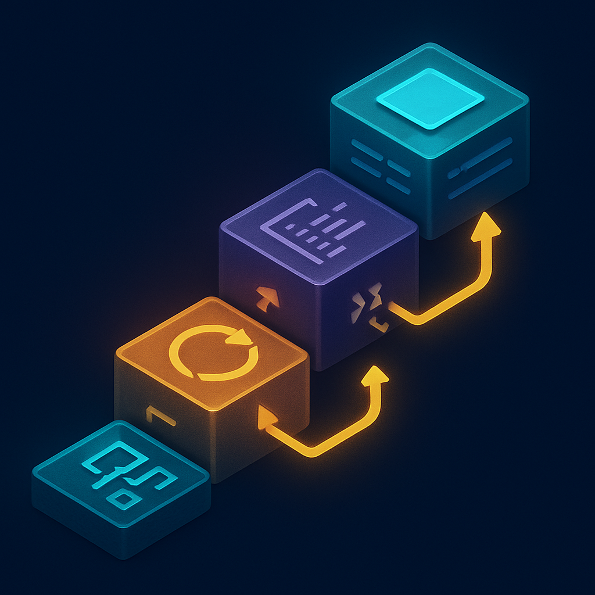

# Bloco 1 — Fundamentos da Engine (capítulos 2 a 5)



Antes de qualquer mecânica de RPG — movimento em grid, combate por turnos, sincronização de rede — existe uma camada que a engine sempre pressupõe que você domina: como ela organiza e executa tudo. Pular essa camada e ir direto para "como faço o player se mover?" é o caminho mais rápido para acumular código frágil que você não entende por que funciona quando funciona, e por que quebra quando quebra. O Bloco 1 existe exatamente para fechar esse buraco antes que ele vire dívida técnica irrecuperável.

Os quatro capítulos deste bloco formam uma sequência de dependências rígidas, não um catálogo de tópicos intercambiáveis:

```
Capítulo 2 — Nodes, Scenes e a Árvore de Cena
      ↓
Capítulo 3 — Game Loop, Delta Time e o Editor em Prática
      ↓
Capítulo 4 — GDScript e Sinais
      ↓
Capítulo 5 — Sprites, AnimatedSprite2D e Resources
```

**Capítulo 2** estabelece o paradigma central do Godot: o jogo inteiro é uma árvore de nodes, e cada subtárvore pode ser empacotada em uma scene — um arquivo `.tscn` — que pode ser instanciada quantas vezes você quiser. Um node não é um objeto genérico; é uma entidade com comportamento pré-definido pela sua classe (`Sprite2D`, `CollisionShape2D`, `CharacterBody2D`, `Label`, `AudioStreamPlayer`) que você compõe hierarquicamente para montar comportamentos mais complexos. A SceneTree é o singleton que gerencia toda essa hierarquia em runtime: quando um node é adicionado à árvore, ele ganha acesso ao loop de processamento, ao sistema de input, ao motor de física e às notificações do ciclo de vida (`_ready`, `_process`, `_exit_tree`). Sem entender a SceneTree — como os nodes entram e saem dela, como a ordem de `_ready` respeita as folhas antes da raiz, como instanciar uma cena via código — qualquer tentativa de escrever sistemas não-triviais vira tentativa e erro.

**Capítulo 3** desmonta o modelo mental que o leitor traz de aplicativos mobile: lá, código roda em resposta a eventos discretos (o usuário tocou, uma requisição chegou). No Godot, código roda continuamente a cada frame — o game loop. Dois hooks principais existem: `_process(delta)` para lógica visual e de UI, `_physics_process(delta)` para lógica física com passo fixo. O parâmetro `delta` é o tempo decorrido desde o último frame em segundos, e ele é o que torna o movimento frame-rate-independent: `position.x += velocidade * delta` garante que o player ande 100 pixels por segundo independente de o jogo estar rodando a 30 FPS ou 120 FPS. Entender a distinção entre os dois hooks — e o que acontece quando lógica de física vai para `_process` — é o que separa jogos que travam em hardware lento de jogos que degradam graciosamente.

**Capítulo 4** cobre GDScript, a linguagem de scripting nativa do Godot, e o sistema de sinais. GDScript tem sintaxe Python-like mas integra profundamente com a engine: tipagem estática opcional com inferência, acesso direto a nodes via `$NodePath`, hot reload sem reiniciar o projeto, e a garantia de que a API da engine inteira está disponível sem imports. O ponto crítico do capítulo é o sistema de sinais — o mecanismo pelo qual nodes se comunicam sem referências diretas uns aos outros. Um signal é emitido pelo node-fonte e capturado por qualquer node que tenha conectado um listener a ele; o emitente não sabe quem (ou se alguém) está ouvindo. Isso implementa o padrão Observer de forma nativa, e a regra de ouro que o capítulo grava é: **"call down, signal up"** — um node pai pode chamar métodos diretamente em seus filhos (relação de dependência explícita e aceitável para baixo), mas um node filho que precisa notificar o pai emite um signal (relação desacoplada para cima). Violar essa regra é a origem clássica de cenas que não conseguem ser reaproveitadas.

**Capítulo 5** fecha o bloco com o pipeline visual 2D: `Sprite2D` para imagens estáticas, `AnimatedSprite2D` para animações por spritesheet, e o conceito de `Resource` — a base de dados do Godot. Um `Resource` é um objeto serializado em disco que pode ser compartilhado entre múltiplas instâncias: uma `SpriteFrames` (os frames de uma animação) pode ser referenciada por todos os inimigos do mesmo tipo sem duplicar dados na memória. Isso antecipa diretamente como o Bloco 2 vai modelar fichas de Pokémon, configurações de mapa e dados de item — tudo como `Resource` customizados. Sem entender o que é um `Resource` e como ele difere de um node, a distinção entre "dado" e "comportamento" no Godot fica nebulosa.

A dependência entre os quatro capítulos é sequencial e não reversível: você precisa saber o que é um node antes de entender o game loop que o processa; precisa entender o game loop antes de escrever scripts que reagem a ele; precisa entender scripts e sinais antes de conectar animações e resources a comportamentos. Quem tenta pular diretamente para tilemaps ou movimento (Bloco 2) sem ter percorrido esse caminho chega lá sem vocabulário para depurar colisões, sem saber por que sua animação não troca de estado, sem entender por que seu código de movimento é frame-rate-dependent. O Bloco 1 não é introdutório no sentido de "fácil e descartável" — é o investimento conceitual que determina a qualidade de tudo que vem depois.

## Fontes utilizadas

- [Nodes and Scenes — Godot Engine (stable) documentation in English](https://docs.godotengine.org/en/stable/getting_started/step_by_step/nodes_and_scenes.html)
- [Using SceneTree — Godot Engine (stable) documentation in English](https://docs.godotengine.org/en/stable/tutorials/scripting/scene_tree.html)
- [Scene organization — Godot Engine (stable) documentation in English](https://docs.godotengine.org/en/stable/tutorials/best_practices/scene_organization.html)
- [Node communication (the right way) :: Godot 4 Recipes](https://kidscancode.org/godot_recipes/4.x/basics/node_communication/index.html)
- [Best practices with Godot signals · GDQuest](https://www.gdquest.com/tutorial/godot/best-practices/signals/)
- [Scenes, nodes, scripts, and signals — GDQuest](https://school.gdquest.com/courses/learn_2d_gamedev_godot_4/to_space_and_beyond/scenes_nodes_scripts_and_signals)
- [SceneTree — Godot Engine (stable) documentation](https://docs.godotengine.org/en/stable/classes/class_scenetree.html)

---

**Próximo conceito** → [Bloco 2 — Sistemas Pokémon-like Single-Player (capítulos 6 a 11)](../02-bloco-2-sistemas-pokemon-like-single-player/CONTENT.md)
