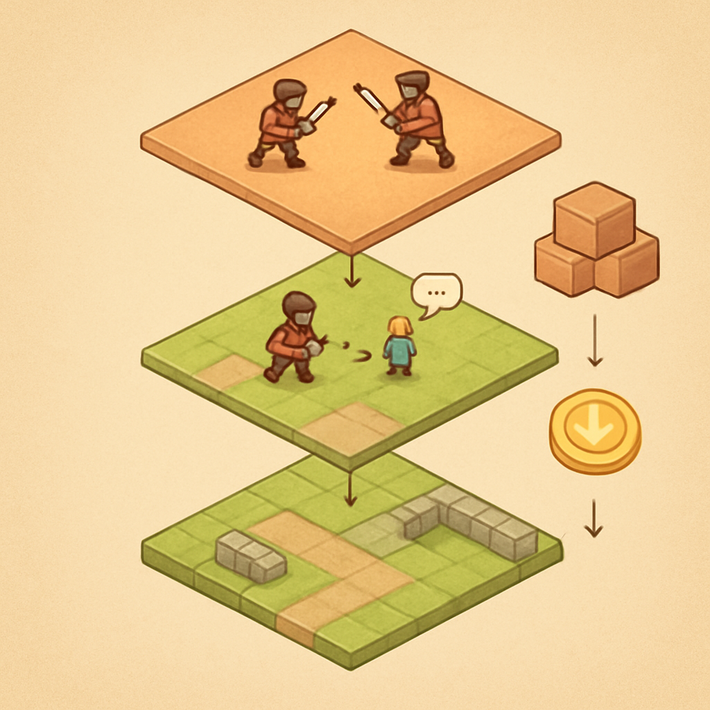

# Bloco 2 — Sistemas Pokémon-like Single-Player (capítulos 6 a 11)



O Bloco 1 entregou o chão firme: você sabe o que é um node, entende o game loop, escreve GDScript fluentemente, conecta sinais e usa Resources como unidade de dado. Agora esse vocabulário precisa se converter em um jogo — e não um jogo qualquer, mas o jogo-alvo deste livro: um RPG 2D top-down no molde de Pokémon Fire Red, jogável do início ao fim em modo single-player. O Bloco 2 constrói exatamente isso, em seis capítulos encadeados que produzem sistemas funcionais empilhados uns sobre os outros.

O ponto de partida é o mapa do mundo. O capítulo 6 trata de tilemaps e tilesets — a estrutura que permite descrever um cenário de RPG como uma grade discreta de tiles em vez de uma imagem flat. No Godot 4 a unidade de trabalho é o `TileMapLayer`: cada layer representa uma grade 2D onde cada célula guarda um tile do tileset, e você empilha layers para separar o chão navegável das paredes, das decorações e das colisões. O tileset associado define quais tiles existem, quais têm formas de colisão e quais dispararam comportamentos especiais (zonas de batalha, portais). Autotiles — ou, no Godot 4, os "terrains" — permitem que o mapa se auto-conecte: pintar uma área de grama faz as bordas aparecerem automaticamente sem trabalho manual célula a célula. A importância crítica desse capítulo é que o grid do tilemap estabelece a métrica do mundo inteiro: o tamanho do tile (tipicamente 16×16 ou 32×32 pixels) determina a granularidade de colisão, a velocidade de movimento, o tamanho da câmera e o sistema de coordenadas que todos os sistemas seguintes usarão.

O movimento em grid, coberto no capítulo 7, parte diretamente dessa métrica. Diferente de jogos de ação onde `position += velocity * delta` produz movimento contínuo suave, o movimento estilo Pokémon é discreto: o personagem salta de célula em célula, sempre ocupando exatamente uma posição de grid por vez. A implementação canônica em Godot usa um `CharacterBody2D` com a posição lógica armazenada em coordenadas de tile e a posição visual interpolada via `lerp` ou `tween` para suavizar visualmente o salto entre células. A verificação de colisão não depende do motor de física contínuo — ela consulta a camada de colisão do tilemap diretamente (`TileMapLayer.get_cell_tile_data()`) para saber se a célula de destino é navegável antes de autorizar o movimento. O input handling neste contexto também é discreto: o player pressiona uma direção, um único passo é dado, e enquanto o visual está em transição nenhum novo input é aceito. Esse padrão de "movimento bloqueado durante animação" é o que cria o ritmo característico dos jogos de grid — e é a razão pela qual implementar esse capítulo antes de qualquer sistema que dependa de posição é obrigatório.

O capítulo 8 lida com câmeras e transições entre mapas. A `Camera2D` do Godot segue o player automaticamente mas precisa de limites para não mostrar o vazio além das bordas do tilemap. Mais interessante é o sistema de salas: em Pokémon, você transita de cidade em cidade, de prédio em campo, e cada transição descarrega a cena anterior e carrega a nova — mas o player persiste, com sua posição inicial pré-definida pelo portal de entrada. No Godot isso é implementado com troca de cena via `SceneTree.change_scene_to_file()` combinada com um objeto de dados persistente (frequentemente um autoload singleton) que carrega as informações do player de uma cena para outra. A gestão de limites da câmera usa `Camera2D.limit_*` para clampar a visão dentro das dimensões do tilemap ativo.

A população do mundo vem no capítulo 9: NPCs, diálogos e eventos de mundo. Um NPC em um RPG top-down é um `CharacterBody2D` com uma state machine simples — idle, walking, talking — e colisão para bloquear o caminho do player. O sistema de diálogo, em sua forma mais básica, é uma fila de strings que avança na pressão de um botão; na prática, projetos mais ricos usam resources customizados (`DialogueResource`) que contêm árvores de decisão com condições e ramificações. A regra "call down, signal up" estabelecida no Bloco 1 aparece aqui de forma concreta: o NPC emite um signal `dialogue_started` que o sistema global de UI captura para exibir a caixa de diálogo — o NPC não conhece a UI, a UI não conhece o NPC, e o acoplamento é zero. Eventos de mundo (baús, interruptores, portais, patches de grama que disparam batalha) seguem o mesmo padrão: o player toca a área, um signal é emitido, um handler global reage.

O capítulo 10 é o mais estruturalmente complexo do bloco: o combate por turnos. Em Pokémon, o combate acontece em uma cena completamente separada — a câmera corta do mapa para a tela de batalha, a lógica do jogo muda de domínio completamente. Isso é implementado com uma troca de cena ou overlay de cena, e um estado global que describe quais criaturas entraram na batalha. O loop de batalha é uma state machine explícita com estados bem definidos:

```
PlayerTurn → SelectAction → ExecuteAction → EnemyTurn → ExecuteAction → CheckBattleEnd → (loop ou fim)
```

Cada estado sabe apenas o que fazer na sua transição; a machine não acumula condicionais gigantes. O cálculo de dano envolve atributos de ataque e defesa das criaturas (armazenados em Resources), tipos e multiplicadores (uma tabela de lookup), e chance de acerto. A UI de batalha — menu de ações, barras de HP, caixa de texto de eventos — é uma cena de UI separada que consome os eventos da state machine via signals. O resultado ao fim do capítulo é um loop completo: o player encontra um inimigo no mapa, a cena de batalha abre, o combate se resolve, a cena do mapa retorna.

O capítulo 11 fecha o bloco com party, inventário e persistência local. A party — o grupo de criaturas do player — é uma `Array[Resource]` onde cada element é um resource customizado com os atributos da criatura (nome, HP atual, HP máximo, nível, movimentos aprendidos). O inventário segue a mesma lógica: uma `Array[ItemResource]` com quantidade e efeito. O pattern não é arbitrário — usar Resources para dados permite salvar com `ResourceSaver.save()` e carregar com `ResourceLoader.load()` diretamente em disco sem serialização manual. No Godot 4, arrays de resources são serializadas automaticamente pelo engine, o que significa que um `SaveData` resource contendo a party inteira, o inventário e a posição do player no mapa pode ser persistido em `user://save.tres` com poucas linhas de código:

```gdscript
# Salvando
var save = SaveData.new()
save.party = GameState.party
save.inventory = GameState.inventory
save.current_map = GameState.current_map
save.player_position = GameState.player_position
ResourceSaver.save(save, "user://save.tres")

# Carregando
var save = ResourceLoader.load("user://save.tres") as SaveData
GameState.party = save.party
GameState.inventory = save.inventory
```

Esse modelo de persistência é deliberadamente simples — local, sem autenticação, sem servidor — porque o Bloco 2 precisa ser funcional como jogo antes de qualquer complexidade de rede. Um princípio crítico aparece aqui: o single-player completo é o pré-requisito honesto do multiplayer, não um atalho ou etapa descartável. Os sistemas que o Bloco 2 constrói — estado do player, estado do mundo, estado da batalha — são exatamente os mesmos sistemas que o Bloco 3 vai ter que sincronizar entre cliente e servidor. Quem pula o Bloco 2 e vai diretamente para o multiplayer chega ao Bloco 3 sem saber o que sincronizar, sem ter um modelo de estado limpo e sem a intuição de quais eventos mudam o estado e precisam de propagação autoritativa. O single-player não é uma versão simplificada do online — é a fundação estrutural sobre a qual a camada de rede é adicionada.

| Capítulo | Sistema | Pré-requisito direto no Bloco 3 |
|---|---|---|
| 6 — Tilemaps | Grade do mundo, colisões de terrain | Replicar qual tile o player ocupa |
| 7 — Movimento em grid | Posição discreta, input, animação | Sincronizar posição autoritativa no servidor |
| 8 — Câmeras e salas | Troca de cena, persistência de player | Carregar mapa correto por sala no servidor |
| 9 — NPCs e eventos | Estado de mundo scriptado | Quais eventos já foram disparados (persistência remota) |
| 10 — Combate por turnos | State machine, cálculo de dano, UI | Loop de batalha autoritativo no servidor |
| 11 — Party e persistência | Modelo de dados, save/load | Migrar `user://save.tres` para persistência server-side |

A tabela deixa explícita a razão pela qual o Bloco 2 não pode ser abreviado: cada capítulo produz um sistema que o Bloco 3 reutiliza e estende, não substitui. Quem constrói o Bloco 2 com qualidade — state machines limpas, Resources bem definidos, signals como barramento de eventos — entra no Bloco 3 com código que aceita a adição de rede sem reescrita. Quem o pula entra no Bloco 3 e descobre que precisa construir os dois blocos ao mesmo tempo.

## Fontes utilizadas

- [Grid-based movement — Godot 4 Recipes (KidsCanCode)](https://kidscancode.org/godot_recipes/4.x/2d/grid_movement/index.html)
- [Using TileMaps — Godot Engine (stable) documentation](https://docs.godotengine.org/en/stable/tutorials/2d/using_tilemaps.html)
- [Using TileSets — Godot Engine (stable) documentation](https://docs.godotengine.org/en/stable/tutorials/2d/using_tilesets.html)
- [Saving games — Godot Engine (stable) documentation](https://docs.godotengine.org/en/stable/tutorials/io/saving_games.html)
- [Saving and Loading Games in Godot 4 (with resources) — GDQuest Library](https://www.gdquest.com/library/save_game_godot4/)
- [godot-open-rpg: Open Source RPG demo with turn-based combat — GDQuest](https://github.com/gdquest-demos/godot-open-rpg)
- [Let's Learn Godot 4 by Making an RPG — Part 4: Game TileMap & Camera Setup (DEV Community)](https://dev.to/christinec_dev/lets-learn-godot-4-by-making-an-rpg-part-4-game-tilemap-camera-setup-1mle)
- [Let's Learn Godot 4 by Making an RPG — Part 20: Persistent Saving & Loading (DEV Community)](https://dev.to/christinec_dev/lets-learn-godot-4-by-making-an-rpg-part-20-saving-loading-autosaving-4bl3)
- [Beginner's Guide to Making a Multiplayer Game — Ruoyu Sun](https://ruoyusun.com/2020/04/01/multiplayer-beginners-guide.html)

---

**Próximo conceito** → [Bloco 3 — A Camada Online (capítulos 12 a 14)](../03-bloco-3-a-camada-online/CONTENT.md)
