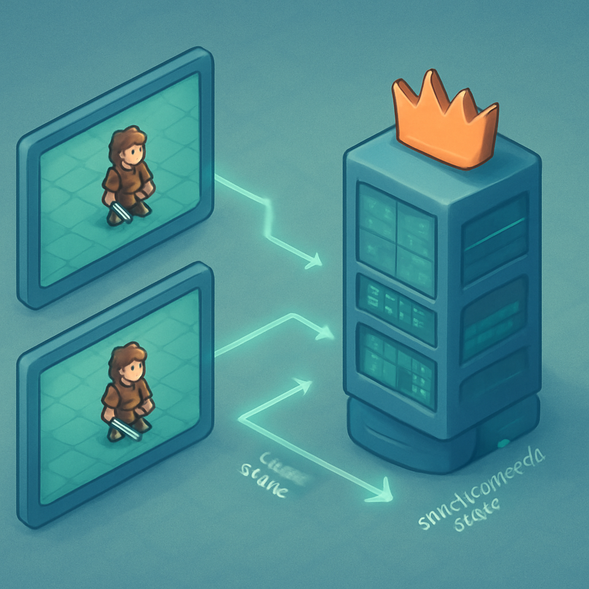

# Bloco 3 — A Camada Online (capítulos 12 a 14)



O Bloco 2 termina com algo concreto e jogável: um RPG top-down em grid, com mapa navegável, NPCs, combate por turnos e save/load local funcionando em modo single-player. Esse é o ponto de chegada de onze capítulos e o ponto de partida do Bloco 3 — que não é "a parte difícil separada do jogo real", mas o momento em que você eleva o jogo que já existe a um nível de complexidade qualitativamente diferente. O Bloco 3 cobre os capítulos 12, 13 e 14, e cada um deles toca uma camada da mesma transformação: o estado que antes era local e pertencia a um único processo agora precisa existir de forma compartilhada, autoritativa e persistente em rede.

A mudança central que o Bloco 3 introduz não é técnica no sentido de "aprender uma nova API" — é conceitual. Em modo single-player, o programa que roda o jogo é a única fonte da verdade sobre o estado do mundo. O player se move: a posição é atualizada localmente, imediatamente, sem negociação. O combate processa dano: a variável de HP muda no mesmo processo que rodou o cálculo. Não existe a questão "qual versão do estado é a correta?" porque existe exatamente um estado. No momento em que um segundo cliente entra em cena, essa premissa colapsa. Dois processos independentes, rodando em máquinas diferentes, têm cada um sua cópia local do mundo — e essas cópias divergem a cada frame se ninguém as arbitrar.

A resposta padrão da indústria para esse problema é a **arquitetura cliente-servidor com servidor autoritativo**, que é o tema do capítulo 12. Nesse modelo, nenhum cliente tem autoridade sobre o estado do jogo — o servidor sim. Os clientes enviam **inputs** (o jogador pressionou "cima", o jogador selecionou "Ataque") para o servidor, e o servidor processa esses inputs, atualiza o estado canônico do mundo, e envia o resultado de volta para todos os clientes. Um cliente nunca atualiza a posição do player na sua cópia local com base em lógica própria sem confirmação do servidor — ele atualiza porque o servidor disse "a posição é esta". A distinção é crítica para um engenheiro acostumado com sistemas distribuídos: o cliente é um **terminal de renderização e captura de input**, não um participante igual na decisão do estado.

No Godot 4, essa arquitetura se materializa de forma concreta. O servidor é uma instância da mesma aplicação Godot rodando em **modo headless** — sem janela, sem renderização, sem DisplayServer — o que você verifica com `DisplayServer.get_name() == "headless"` no `_ready()` do nó raiz para bifurcar o comportamento entre servidor e cliente. O transport padrão é **ENet** (`ENetMultiplayerPeer`), uma biblioteca sobre UDP que implementa canais confiáveis e não confiáveis, sequenciamento e gerenciamento de bandwidth — é o transporte correto para jogos onde você quer controle fino sobre latência e confiabilidade. Para exportação HTML5, onde UDP não está disponível no browser, a alternativa é **WebSocketMultiplayerPeer** sobre TCP, com o custo esperado de latência mais alta por causa da entrega garantida do protocolo.

```gdscript
# Raiz da cena — bifurcação servidor/cliente
func _ready() -> void:
    if DisplayServer.get_name() == "headless":
        _start_server()
    else:
        _start_client()

func _start_server() -> void:
    var peer = ENetMultiplayerPeer.new()
    peer.create_server(PORT, MAX_CLIENTS)
    multiplayer.multiplayer_peer = peer
    multiplayer.peer_connected.connect(_on_peer_connected)
    multiplayer.peer_disconnected.connect(_on_peer_disconnected)

func _start_client() -> void:
    var peer = ENetMultiplayerPeer.new()
    peer.create_client(SERVER_IP, PORT)
    multiplayer.multiplayer_peer = peer
```

Essa bifurcação é a linha que separa as duas responsabilidades. O servidor não renderiza — ele processa. O cliente não decide sobre estado — ele apresenta. Cada peer recebe um `peer_id` único atribuído pela engine; o servidor tem sempre o ID `1`. Essa convenção permeia a API inteira do Godot: quando você chama um RPC, você especifica para qual peer (ou para todos, ou para todos exceto o remetente), e o ID `1` identifica o servidor de forma inequívoca.

O capítulo 13 aprofunda a mecânica da **sincronização de estado e autoridade**. No Godot 4, a API de alto nível expõe duas ferramentas principais para replicação: `MultiplayerSpawner` e `MultiplayerSynchronizer`. O `MultiplayerSpawner` automatiza a instanciação remota de nós — quando o servidor instancia o personagem de um player que acabou de conectar, o spawner garante que todos os clientes instanciem a mesma cena na mesma posição sem que você precise escrever RPCs manuais de spawn. O `MultiplayerSynchronizer` cuida da sincronização contínua de propriedades: você configura quais propriedades de quais nós devem ser replicadas, para quais peers, com qual frequência (o **tick rate** de sincronização), e a engine envia os deltas automaticamente.

O tick rate é um parâmetro crítico de trade-off: mais alto significa estado mais fresco nos clientes mas mais largura de banda e processamento no servidor; mais baixo significa maior latência de sincronização mas infraestrutura mais leve. Para um RPG Pokémon-like com movimento discreto em grid, o tick rate pode ser relativamente baixo — um passo de grid por frame já é ~30ms de resolução, e a sincronização de posição em tiles não exige a mesma frequência de um shooter em primeira pessoa. O `MultiplayerSynchronizer` respeita a autoridade: apenas o peer com autoridade sobre um nó (`set_multiplayer_authority()`) pode replicar as propriedades desse nó — o que impede clientes de injetar estado falso mesmo que o código do cliente esteja modificado.

```gdscript
# No servidor — ao spawnar o player de um peer
func spawn_player(peer_id: int) -> void:
    var player = PLAYER_SCENE.instantiate()
    player.name = str(peer_id)  # Nome = peer_id garante identificação única
    player.set_multiplayer_authority(peer_id)  # Esse peer tem autoridade sobre o nó
    $Players.add_child(player, true)  # true = forçar nome legível para replicação

# MultiplayerSynchronizer configurado no editor para replicar:
# - position (cada frame ou a cada N ticks)
# - animation_state (quando muda)
# - hp_current (quando muda)
```

O Bloco 2 estabeleceu que o estado do player vive em Resources — `party`, `inventory`, `current_map`, `player_position` — e que esses Resources são salvos localmente via `ResourceSaver`. No Bloco 3, o capítulo 14 trata da **migração desse modelo para persistência server-side**: o save já não é `user://save.tres` em disco local do cliente, mas um registro em banco de dados acessível ao servidor. Isso muda a semântica fundamental: o estado canônico do mundo existe independentemente de qualquer cliente estar conectado. Se dois jogadores exploram o mesmo mapa, alterações que um faz (um baú aberto, um NPC derrotado, um portal liberado) persistem para o outro — porque ambos os estados são reconciliados pelo servidor, que consulta o banco antes de servir o estado inicial para um cliente que conecta.

A implementação concreta varia — SQLite embutido no processo Godot para prototipagem, PostgreSQL ou Redis em produção via HTTP REST para um servidor separado — mas a arquitetura lógica é a mesma: ao conectar, o cliente recebe do servidor o estado inicial do mundo relevante para ele (mapa atual, posição dos outros jogadores, estado dos eventos); ao se desconectar, o servidor persiste o estado corrente antes de liberar os recursos.

```
Cliente conecta
      ↓
Servidor autentica (peer_id ou token)
      ↓
Servidor lê estado do banco → envia ao cliente via RPC
      ↓
Cliente renderiza o estado recebido
      ↓
[loop de jogo]
      ↓
Cliente desconecta → servidor persiste estado no banco
```

O que o Bloco 2 construiu como `GameState` autoload com save local torna-se, no Bloco 3, um `GameState` que só existe com autoridade no servidor — os clientes têm uma **cópia de leitura** do estado que o servidor enviou, e qualquer mutação precisa passar pelo servidor primeiro. Essa é a inversão central que o Bloco 3 executa sobre o Bloco 2: os mesmos sistemas (estado do player, estado do mundo, state machine de combate), com a mesma estrutura de dados (Resources), mas com a autoridade movida para o servidor e o meio de persistência movido para rede + banco.

A limitação honesta que o capítulo 14 documenta — e que o capítulo anterior sobre Godot já introduziu — é que o Godot 4 não entrega client-side prediction ou rollback nativamente. No modelo autoritativo puro, o input do cliente viaja até o servidor, o servidor processa, e o resultado volta — o que significa que a latência de ida e volta (RTT) é visível no movimento antes que o personagem responda. Para um RPG de grid com movimento discreto, isso é aceitável: o passo de movimento já tem uma duração intencional (a animação do salto de tile), e um RTT de 50-100ms é absorvido dentro dessa janela sem que o jogo pareça quebrado. Seria intratável em um shooter; em um jogo no molde de Pokémon Fire Red, é uma limitação que o design naturalmente acomoda.

O resultado do Bloco 3, ao fim do capítulo 14, é o protótipo que o livro inteiro prometeu desde o subcapítulo 01: dois ou mais clientes conectados ao mesmo servidor, navegando o mesmo mapa, vendo as posições uns dos outros sincronizadas em tempo real, com estado persistido entre sessões. Não é um MMO — o teto prático do Godot para servidores de jogo é em torno de 40 jogadores simultâneos por instância, como estabelecido nos fundamentos da escolha da engine. Mas é o MVP completo do jogo-alvo, e é exatamente o ponto de chegada que o recorte do livro definiu.

## Fontes utilizadas

- [High-level multiplayer — Godot Engine (stable) documentation](https://docs.godotengine.org/en/stable/tutorials/networking/high_level_multiplayer.html)
- [Multiplayer in Godot 4.0: Scene Replication — Godot Engine](https://godotengine.org/article/multiplayer-in-godot-4-0-scene-replication/)
- [MultiplayerSynchronizer — Godot Engine (stable) documentation](https://docs.godotengine.org/en/stable/classes/class_multiplayersynchronizer.html)
- [ENetMultiplayerPeer — Godot Engine (stable) documentation](https://docs.godotengine.org/en/stable/classes/class_enetmultiplayerpeer.html)
- [Client-Server Game Architecture — Gabriel Gambetta](https://www.gabrielgambetta.com/client-server-game-architecture.html)
- [Game Networking Demystified, Part I: State vs. Input — Ruoyu Sun](https://ruoyusun.com/2019/03/28/game-networking-1.html)
- [Godot Multiplayer in 2026: What Actually Works — Ziva](https://ziva.sh/blogs/godot-multiplayer)
- [Using headless Godot as a server game instance for a multiplayer setup — Godot Forum](https://forum.godotengine.org/t/using-headless-godot-as-a-server-game-instance-for-a-multiplayer-setup/37142)
- [GitHub — godot-server-multiplayer: Godot Multiplayer Demo using the Client Server Architecture](https://github.com/grazianobolla/godot-server-multiplayer)

---

**Próximo conceito** → [Bloco 4 — Pipeline de Assets com AI (capítulo 15)](../04-bloco-4-pipeline-de-assets-com-ai/CONTENT.md)
