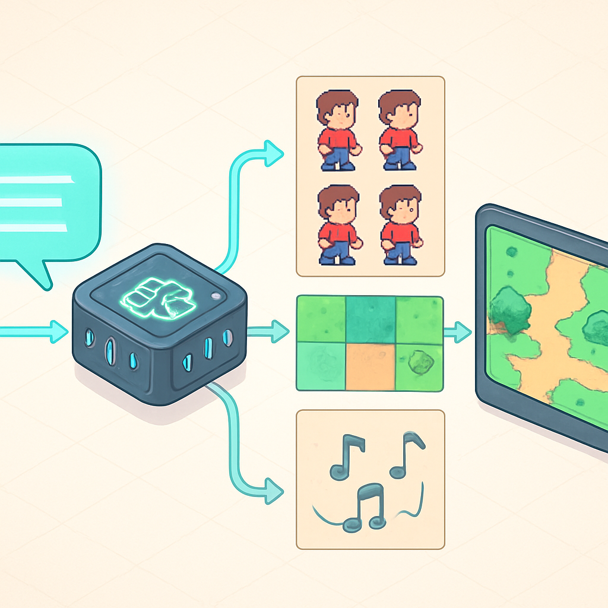

# Bloco 4 — Pipeline de Assets com AI (capítulo 15)



O Bloco 3 entrega o protótipo que o livro prometeu desde o primeiro subcapítulo: dois clientes conectados ao mesmo servidor, navegando um mapa compartilhado, com posições sincronizadas e estado persistido entre sessões. O jogo está funcionando. O que ele não tem ainda é identidade visual — os sprites são retângulos coloridos, os tilesets são grades monocromáticas, não há trilha sonora, e o world design é funcional mas inerte. É aqui que o Bloco 4 entra, e ele entra de uma forma que não seria possível sem o background específico que o leitor deste livro já possui: experiência real com APIs de modelos generativos.

A premissa do capítulo 15 não é "aprenda a desenhar" nem "contrate um artista". É tratar a geração de assets como um pipeline de engenharia — com entradas definidas (prompts, referências de estilo, parâmetros de resolução), processamento intermediário (modelos generativos, limpeza, fatiamento) e saídas consumíveis pelo Godot (PNGs com transparência, spritesheets formatados, arquivos de áudio .ogg). Quem já trabalhou com a API da OpenAI sabe o que é iterar sobre um prompt até a saída ser consistente; quem já usou Midjourney sabe o que é calibrar um estilo ao longo de dezenas de gerações. Esses hábitos — seed control, negative prompts, style locking, iteração estruturada — são exatamente o que o pipeline de assets exige.

O ponto de partida prático é a geração de sprites de personagem. Um RPG top-down como Pokémon Fire Red precisa de pelo menos quatro direções de caminhada para o personagem principal, com quatro frames por direção — 16 frames no total para o ciclo completo de movimento. A consistência entre frames é o desafio central: o modelo precisa gerar o mesmo personagem, com as mesmas cores, o mesmo tamanho e o mesmo estilo visual, variando apenas a pose. Ferramentas como **PixelLab** e **Scenario** oferecem modelos treinados especificamente para pixel art com controle de paleta, resolução e câmera ortogonal — reduzindo drasticamente a variância entre frames que modelos de propósito geral produzem. A estratégia recomendada é gerar um "frame base" (o personagem de frente, parado) com o modelo generativo, usar esse frame como referência de estilo e cor para os demais, e finalizar a animação de cada direção num editor como **Aseprite** — que já integra plugins de AI como Retro Diffusion para manter o laço gerativo dentro do próprio editor. O AI entrega ~80% do trabalho; os 20% restantes de limpeza de pixels soltos, correção de borda e alinhamento ao grid são feitos manualmente e custam minutos, não horas.

O mesmo princípio se aplica a tilesets. Um tileset de RPG top-down precisa de coerência interna: as bordas de grama precisam encaixar com o interior de grama, as paredes precisam ter altura visual consistente, o tamanho do tile (16×16 ou 32×32 pixels, dependendo da métrica definida no Bloco 2) precisa ser respeitado em todos os elementos. Plataformas como PixelLab têm geradores de tileset que produzem grades de tiles prontos para uso no Godot, com tiles que encaixam nas bordas — o equivalente de autotiles gerado por AI. O workflow de importação no Godot 4 é direto: o PNG do tileset entra no projeto, a configuração de import define `Filter Mode: Nearest` e `Compression: Lossless` para preservar os pixels nítidos sem artefatos de interpolação, e o tileset é configurado manualmente no editor para definir quais tiles têm colisão, quais disparam eventos e quais participam dos terrains de auto-conexão.

```
Prompt (texto + referência de estilo)
        ↓
Modelo generativo (PixelLab / Midjourney / Scenario)
        ↓
Saída PNG raw (~80% do resultado)
        ↓
Limpeza em Aseprite (pixels soltos, bordas, paleta)
        ↓
Fatiamento em spritesheet (SpriteFrames do Godot)
        ↓
Import no Godot 4 (Nearest filter, Lossless)
        ↓
Configuração de AnimatedSprite2D ou TileSet
```

A trilha sonora segue uma lógica diferente, porque jogos de RPG exigem música que loopeja suavemente e muda de tom conforme o contexto — a música de overworld não é a música de batalha, e a música de batalha de chefe não é a de batalha comum. Ferramentas como **Suno** (forte em músicas com estrutura completa e expressão emocional) e **Udio** (forte em instrumentais rápidos para background e repetição) permitem gerar faixas descrevendo o mood desejado em texto: "8-bit RPG overworld music, cheerful, looping, Pokémon-inspired, no percussion heavy" ou "tense battle theme, chiptune style, fast tempo, dramatic, seamlessly loopable". A saída é um arquivo de áudio que, após export como `.ogg` (o formato de áudio preferido do Godot por compressão e eficiência), entra no projeto como `AudioStream` e é reproduzido via `AudioStreamPlayer`. A legalidade do uso comercial de áudio gerado por AI evoluiu em 2025 — Suno e Udio formalizaram acordos com grandes gravadoras, o que removeu a principal incerteza para projetos pessoais e indie.

A integração ao projeto Godot segue o mesmo padrão de todos os assets: o arquivo entra na pasta do projeto (`res://assets/audio/`), o Godot detecta automaticamente na reimportação, e um nó `AudioStreamPlayer` é configurado com a faixa correspondente e `autoplay: true` para música de ambiente. O controle programático é simples — `$MusicPlayer.play()` e `$MusicPlayer.stop()` nos pontos de transição de mapa ou início de batalha.

| Categoria de asset | Ferramentas gerativas | Pós-processamento | Formato final no Godot |
|---|---|---|---|
| Sprites de personagem | PixelLab, Scenario, Midjourney | Aseprite (limpeza, animação) | PNG em SpriteFrames |
| Tilesets | PixelLab, Recraft | Aseprite (alinhamento de grid) | PNG em TileSet |
| UI e ícones | Midjourney, Recraft | GIMP / Aseprite | PNG individual |
| Trilha sonora | Suno, Udio | Edição de loop (Audacity) | OGG em AudioStream |
| Efeitos sonoros | ElevenLabs SFX, Soundverse | Trim e normalização | WAV / OGG |

O que torna o Bloco 4 estruturalmente diferente dos três blocos anteriores é que ele não adiciona código ao projeto — ele adiciona **conteúdo**. Os sistemas que o Bloco 2 construiu (AnimatedSprite2D configurado para o personagem, TileMapLayer aguardando um tileset real, AudioStreamPlayer esperando uma faixa) estão prontos para consumir os assets que o Bloco 4 produz. A integração é quase mecânica: trocar o sprite placeholder por um PNG gerado via AI não exige nenhuma mudança de código, desde que as dimensões do tile e a estrutura do spritesheet estejam corretas. Esse é exatamente o valor de ter construído os sistemas com dados externos em mente — Resources referenciando arquivos de disco, não hardcoded.

O capítulo 15 também fecha a ponte com os outros livros do método. O leitor que chegou até aqui com um protótipo funcional e um pipeline de assets operando está pronto para entrar num livro dedicado a arquitetura de MMOs (onde a camada de rede do Bloco 3 é aprofundada para escala), num livro de mecânicas de RPG (onde o sistema de combate do Bloco 2 é expandido com tipos, habilidades e progressão completa) ou num livro de pipeline de arte com AI (onde o que o capítulo 15 introduz em poucas páginas se torna um curso completo de prompt engineering para pixel art, geração de tilesets coerentes e produção de trilhas procedurais). O Bloco 4 não é o fim do assunto — é o ponto de handoff para esses livros especializados, com o contexto mínimo necessário para que a transição não seja um salto no vazio.

## Fontes utilizadas

- [PixelLab — AI Generator for Pixel Art Game Assets](https://www.pixellab.ai/)
- [Scenario — The Creative AI Infrastructure](https://www.scenario.com/)
- [Free AI Game Asset Generator — Sprites, Tilesets & Pixel Art (Rosebud AI)](https://lab.rosebud.ai/ai-game-assets)
- [AI-Generated Pixel Art for Game Developers (ReelMind)](https://reelmind.ai/blog/ai-generated-pixel-art-for-game-developers)
- [Retro Diffusion Extension for Aseprite (Astropulse)](https://astropulse.itch.io/retrodiffusion)
- [Using Midjourney for creating 2D game assets (DEV Community)](https://dev.to/dasheck0/using-midjourney-for-creating-2d-game-assets-2j6d)
- [AI Pixel Art Is Broken (And How to Fix It) (QWE AI Academy)](https://www.qwe.edu.pl/tutorial/create-pixel-art-with-ai-tools/)
- [Godot 4 sprites: pixel-perfect 2D setup guide (Sprite-AI)](https://www.sprite-ai.art/guides/godot-sprites)
- [Best AI Music Generators in 2026: Suno vs Udio vs AIVA Compared (Superprompt)](https://superprompt.com/blog/best-ai-music-generators)
- [Suno AI Music Generator](https://suno.com/)
- [Pixel Art for Games: A Practical Guide for Developers Who Cannot Draw (Ziva)](https://ziva.sh/blogs/pixel-art-tutorial)
- [Best AI for Game Asset Creation: Tools & Workflow for Indie Developers (Wayline)](https://www.wayline.io/blog/best-ai-game-asset-creation-tools-workflow-indie-devs)

---

**Próximo conceito** → [A Lógica das Dependências entre Blocos](../05-a-logica-das-dependencias-entre-blocos/CONTENT.md)
