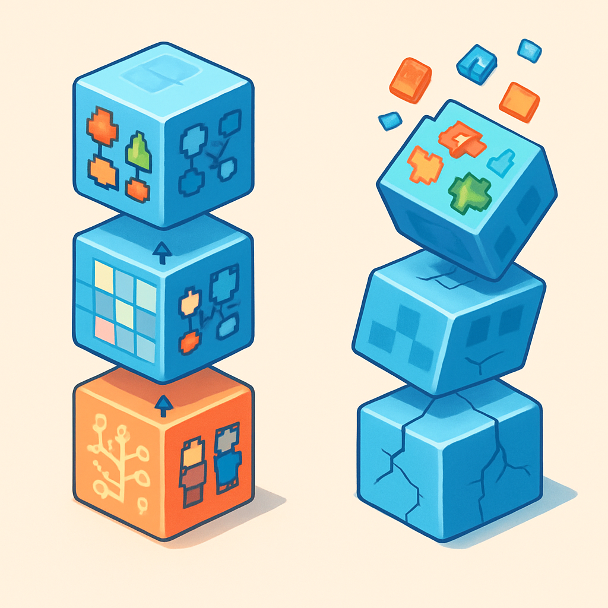
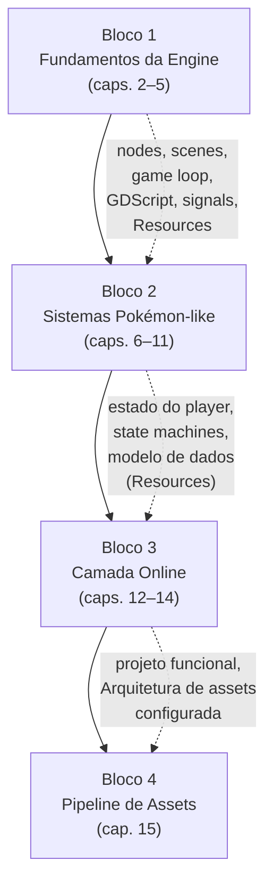

# A Lógica das Dependências entre Blocos



Os quatro blocos apresentados nos conceitos anteriores — fundamentos da engine, sistemas Pokémon-like single-player, camada online e pipeline de assets com AI — não são módulos intercambiáveis que você pode consumir em qualquer ordem de acordo com curiosidade ou prioridade pessoal. Eles formam um grafo acíclico dirigido onde cada nó depende estritamente dos anteriores: a ordem não é sugestão editorial, é a ordem topológica do grafo de dependências do projeto.

Em engenharia de software, grafos de dependência aparecem em toda parte — gerenciadores de pacotes (npm, pip, Maven), sistemas de build (Make, Gradle), pipelines de dados (Airflow, dbt). A regra é a mesma em todos os contextos: não existe ordenação válida que coloque um nó antes dos nós dos quais ele depende. Tentar instalar um pacote antes de suas dependências não é "uma abordagem diferente" — é uma operação inválida que termina em erro. A estrutura em blocos deste livro segue a mesma lógica. A diferença é que em gamedev o "erro" não é uma exceção no terminal — é um projeto que trava silenciosamente semanas depois de você ter escrito código que funciona mas que você não entende.

```
Bloco 1: Fundamentos da Engine
         ↓
Bloco 2: Sistemas Pokémon-like Single-Player
         ↓
Bloco 3: Camada Online
         ↓
Bloco 4: Pipeline de Assets com AI
```

A seta indica dependência obrigatória: cada bloco pressupõe o vocabulário, os sistemas e a intuição produzidos pelo bloco imediatamente anterior.

**Por que o Bloco 1 vem antes de tudo.** Nodes, scenes, o game loop, GDScript, sinais, Resources — esses não são detalhes de implementação que se aprende "quando precisar". São o substrato sobre o qual todo o resto é construído. Um `TileMapLayer` (Bloco 2) é um node; se você não sabe o que é um node, não sabe por que o tilemap tem métodos de ciclo de vida, por que ele precisa ser filho de uma scene específica, ou por que ele responde a `_ready()` mas não a um método qualquer que você chamar antes de ele entrar na SceneTree. O `CharacterBody2D` que implementa o movimento em grid (Bloco 2) emite sinais e é processado no game loop (Bloco 1); sem entender delta time, seu movimento em grid vai ser frame-rate-dependent e vai se comportar diferente em hardware mais lento sem que você consiga explicar por quê. O `MultiplayerSynchronizer` (Bloco 3) é um node que você configura, e sua lógica de autoridade (`set_multiplayer_authority()`) faz sentido apenas se você entende como nodes são identificados na SceneTree e como RPCs se propagam entre peers. Pular o Bloco 1 não é economizar tempo — é acumular confusão que vai explodir na forma de bugs inexplicáveis nos blocos seguintes.

**Por que o Bloco 2 vem antes do online.** Esta é a inversão mais tentadora para engenheiros experientes. A intuição é: "o multiplayer é a parte interessante, o single-player é só um subconjunto — vou construir os dois ao mesmo tempo". Essa intuição está errada por uma razão estrutural: você não pode sincronizar em rede um estado que não existe. O Bloco 3 recebe o sistema de estado do player (party, inventário, posição no mapa), o modelo de dados (Resources customizados), a state machine de combate e o sistema de eventos de mundo — e migra esses sistemas para um modelo autoritativo server-side. Se esses sistemas não existem como código limpo e bem definido, o Bloco 3 não tem nada para sincronizar; você vai precisar construir os dois blocos ao mesmo tempo, com a complexidade de rede obscurecendo todos os bugs dos sistemas de jogo. Como estabelecido no Bloco 2: um `SaveData` resource bem definido com party e posição local é exatamente o que o Bloco 3 vai migrar de `user://save.tres` para o banco do servidor — as entidades são as mesmas, o meio muda.

| Se você pular... | O que acontece no bloco seguinte |
|---|---|
| Bloco 1 | Bugs de SceneTree, signals sem resposta, movimento frame-rate-dependent sem causa óbvia |
| Bloco 2 | Nenhum estado limpo para sincronizar; constrói sistemas de jogo e de rede simultaneamente — os bugs se misturam |
| Bloco 3 | Pipeline de assets sem projeto funcional; sprites e tilesets gerados por AI sem sistema configurado para consumi-los |

A coluna da direita é o custo real de inverter a ordem. Não é apenas "ficará mais difícil" — é "você vai reescrever código porque o que escreveu sem a fundação correta não aceita a adição da próxima camada sem refatoração". Isso tem nome na engenharia de software: dívida técnica arquitetural. E em projetos de gamedev, onde a maioria das pessoas trabalha sozinha sem revisão de código, essa dívida se acumula até tornar o projeto inviável.

**Por que o Bloco 4 vem por último.** O pipeline de assets com AI não adiciona código — adiciona conteúdo a sistemas que já precisam existir. Um `AnimatedSprite2D` precisa estar configurado com os parâmetros corretos antes de receber um spritesheet gerado por PixelLab; um `TileMapLayer` precisa ter seu tileset configurado com as camadas de colisão e terrain antes de receber tiles gerados generativamente; um `AudioStreamPlayer` precisa estar posicionado na cena e conectado à lógica de transição antes de receber uma faixa `.ogg` gerada pelo Suno. O Bloco 4 pressupõe que a arquitetura de assets (SpriteFrames, TileSet, AudioStream) está configurada e funcional — o que só acontece depois dos Blocos 1 e 2. Ele também pressupõe que o projeto existe como algo que merece receber arte real, o que só é verdade depois do Bloco 3 entregar o protótipo com dois clientes rodando.

Existe uma segunda razão, menos óbvia: aprender a calibrar prompts de pixel art para um tileset com dimensões específicas (32×32, bordas que encaixam nos terrains do Godot) requer que você já saiba qual é a dimensão correta — e essa dimensão é definida no capítulo 6 (Bloco 2), quando você constrói o tilemap e escolhe a métrica do mundo. Gerar assets sem saber a métrica é gerar assets que não vão encaixar, o que significa retrabalho no momento em que você tiver o sistema pronto para consumi-los.

A estrutura de dependências também tem uma propriedade importante para projetos de longa duração: ela define **pontos de checkpoint naturais**. Ao terminar o Bloco 1, você tem um projeto Godot com cenas compostas, scripts funcionais e sinais conectados — algo concreto e testável. Ao terminar o Bloco 2, você tem um jogo single-player jogável do início ao fim — o checkpoint mais importante, porque é o momento em que você sabe que os sistemas de jogo funcionam e que o projeto tem substância. Ao terminar o Bloco 3, você tem o MVP completo prometido desde o primeiro subcapítulo. Ao terminar o Bloco 4, você tem um protótipo com identidade visual. Esses checkpoints são o que permite pausar e retomar um projeto pessoal de longa duração sem perder o fio: você sempre sabe em qual bloco está e o que falta para o próximo checkpoint.



O diagrama acima coloca em evidência o que cada bloco transfere para o seguinte — não apenas a ordem, mas o conteúdo concreto que flui de um bloco para o próximo como pré-requisito. As setas pontilhadas são o contrato: o Bloco 2 não usa o Bloco 1 como inspiração ou referência — ele consome diretamente o vocabulário (nodes, scenes, signals, Resources) e a intuição (game loop, delta time, SceneTree) que o Bloco 1 produziu. O Bloco 3 não "aproveita" o Bloco 2 — ele recebe o estado do player modelado em Resources, as state machines de combate e o sistema de eventos de mundo como entrada, e os migra para rede. Sem essa entrada, não há migração — há criação do zero com complexidade de rede ao mesmo tempo, que é exatamente a condição que transforma um projeto pessoal em projeto abandonado.

## Fontes utilizadas

- [Dependency Graphs In Games — Game Developer](https://www.gamedeveloper.com/programming/dependency-graphs-in-games)
- [Using the Dependency Stack to Manage Uncertainty in Game Development — Medium](https://medium.com/@pedrodacruzmachado/using-the-dependency-stack-to-manage-uncertainty-in-game-development-a4be45804dba)
- [Topological sorting — Wikipedia](https://en.wikipedia.org/wiki/Topological_sorting)
- [Read this before creating your first Online Multiplayer game — Unity Discussions](https://discussions.unity.com/t/read-this-before-creating-your-first-online-multiplayer-game/1558507)
- [Living With Technical Debt — A Perspective From the Video Game Industry (IEEE Xplore)](https://ieeexplore.ieee.org/document/9508260/)
- [A Taxonomy of Tech Debt — Riot Games Technology](https://technology.riotgames.com/news/taxonomy-tech-debt)
- [Godot learning paths — GDQuest](https://www.gdquest.com/tutorial/godot/learning-paths/)
- [Learning new features — Godot Engine documentation](https://docs.godotengine.org/en/stable/getting_started/introduction/learning_new_features.html)

---

**Próximo subcapítulo** → [Setup Mínimo — Instalando o Godot 4 e Abrindo o Primeiro Projeto](../../06-setup-minimo-instalando-o-godot-4/CONTENT.md)
