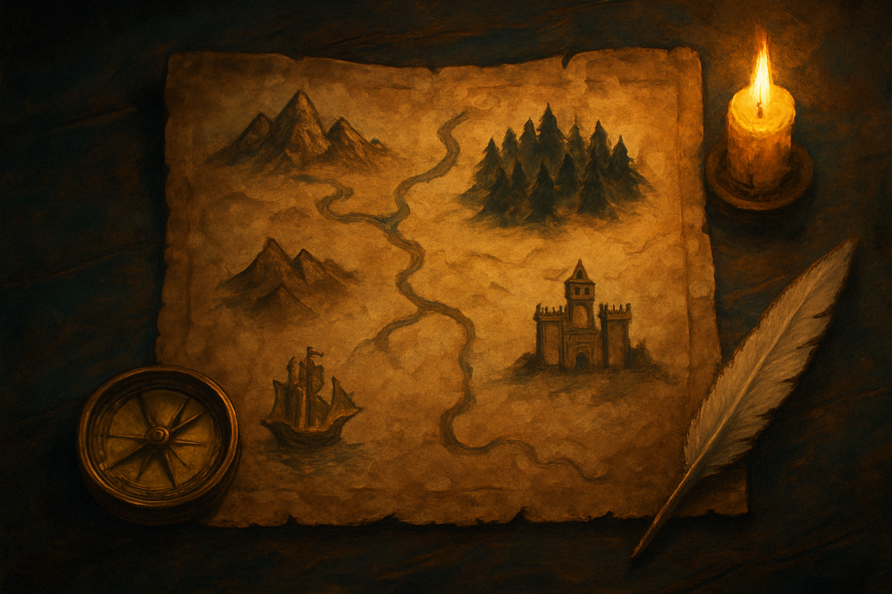

# O Mapa do Livro

## Sobre este subcapítulo

Este subcapítulo entrega ao leitor o mapa mental do que vem pela frente: como os 14 capítulos restantes se organizam em 4 blocos coerentes, qual a função de cada bloco, e por que essa ordem específica é a que minimiza retrabalho conceitual. A ideia é que, ao terminar, o leitor saiba localizar qualquer tópico futuro ("onde mesmo eu vou aprender NPCs?", "em que ponto entra o servidor?") sem precisar consultar o índice — e, mais importante, entenda por que o livro insiste em começar pelos fundamentos da engine antes de falar de sistemas Pokémon-like, e por que o online vem depois do single-player completo.

Ele aparece após o vocabulário porque agora os termos do mapa (scene, node, multiplayer, pipeline) têm significado para o leitor; antes do setup mínimo porque o setup faz mais sentido quando o leitor já sabe para onde vai. É o subcapítulo "porta de entrada" — o leitor pode voltar a ele ao longo do livro para se reposicionar.

## Estrutura

Os blocos deste subcapítulo são: (1) **bloco 1 — fundamentos da engine (capítulos 2 a 5)** — nodes, scenes, scripts, sinais, sprites, resources; o investimento conceitual sem o qual nada do resto faz sentido, e por que ele vem antes de qualquer mecânica de jogo; (2) **bloco 2 — sistemas Pokémon-like single-player (capítulos 6 a 11)** — tilemaps, movimento em grid, câmeras e salas, NPCs e diálogos, combate por turnos, party e inventário, persistência local; o jogo single-player completo, que é o pré-requisito honesto do online; (3) **bloco 3 — a camada online (capítulos 12 a 14)** — arquitetura cliente-servidor, ENet/WebSocket, sincronização autoritativa, persistência server-side e mundo compartilhado; (4) **bloco 4 — pipeline de assets com AI (capítulo 15)** — integração do fluxo generativo (sprites, tilesets, trilha sonora) ao projeto Godot, fechando a ponte com os outros livros do método; (5) **a lógica das dependências** — por que cada bloco precisa do anterior, e por que tentar invertê-los (começar por multiplayer, por exemplo) é a forma clássica de o projeto travar.

## Objetivo

Ao terminar, o leitor terá um mapa mental dos 14 capítulos restantes organizado em 4 blocos com função clara, saberá em que capítulo cada peça do jogo-alvo é construída, e entenderá por que essa ordem específica reduz retrabalho. Ficará apto a entrar no subcapítulo final — o setup do Godot — com a consciência exata de qual é o próximo passo concreto na trilha.

## Fontes utilizadas

- [Game Development Roadmap 2026 (Codelivly)](https://codelivly.com/game-development-roadmap/)
- [Roadmaps for Game Dev SUCCESS in 2026 (Game Dev Report)](https://gamedevreport.beehiiv.com/p/roadmaps-for-game-dev-success-in-2026-beginner-intermediate-marketing)
- [Top Game Development Trends of 2026 (Relish Games)](https://relishgames.com/journal/top-game-development-trends-of-2026/)
- [Godot Engine — Your first 2D game (documentação oficial)](https://docs.godotengine.org/en/stable/getting_started/first_2d_game/index.html)
- [Home — Godot 4 Recipes (KidsCanCode)](https://kidscancode.org/godot_recipes/4.x/)
