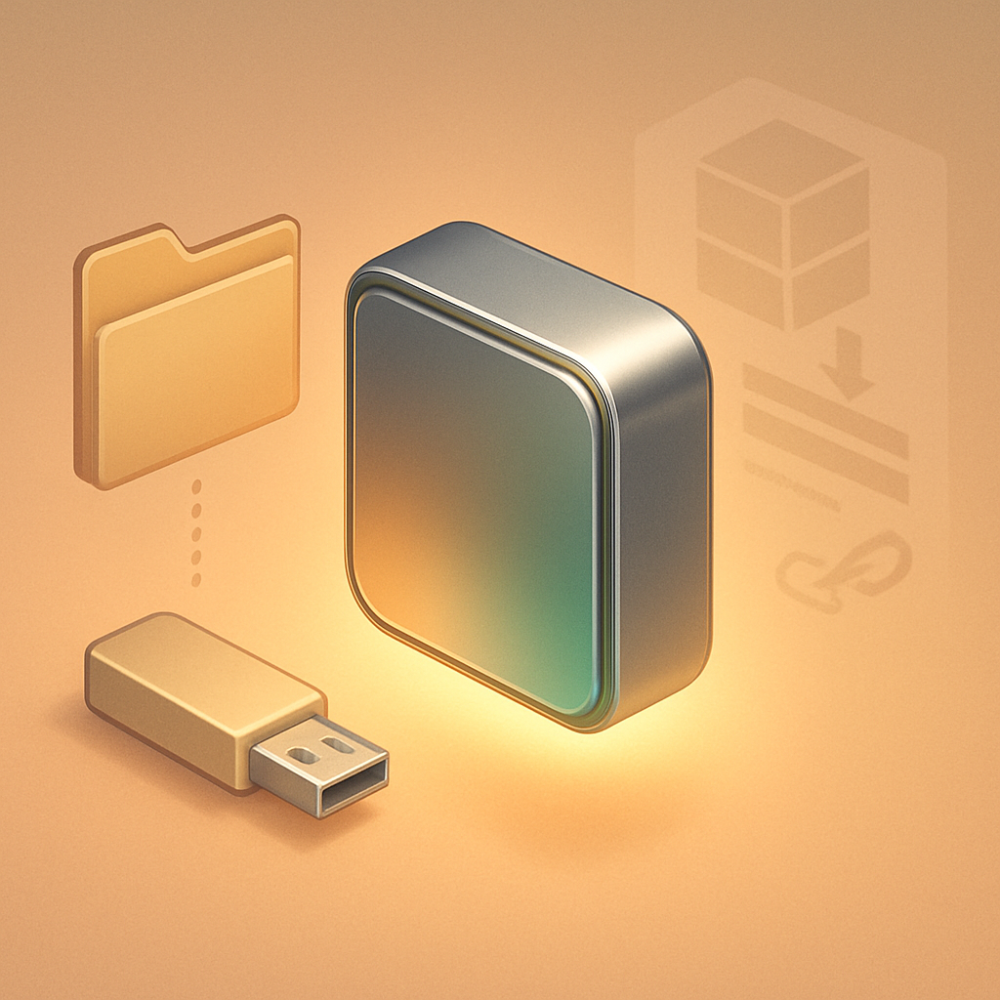

# Download e Portabilidade do Binário Godot 4



A primeira estranheza de quem vem de um mundo onde "instalar um IDE" significa rodar um wizard de vários passos, aceitar termos de serviço, escolher componentes, aguardar a atualização do runtime e rezar para que não haja conflito com alguma versão anterior do .NET é descobrir que o Godot simplesmente não funciona assim. Não existe instalador. Não existe setup.exe. Você entra em [godotengine.org/download](https://godotengine.org/download/windows/), baixa um arquivo ZIP de ~80–120 MB, extrai, e clica duas vezes no executável. O editor abre. Isso é tudo.

Esse comportamento é uma escolha arquitetural deliberada, não uma omissão. O Godot 4 é distribuído como um **binário autocontido** — o executável carrega consigo a engine, o compilador de GDScript, o visualizador de cenas, o gerenciador de importação de assets e o servidor de linguagem. Nada está espalhado em `C:\Program Files`, no registro do Windows ou em pastas de sistema. A consequência prática é direta: se o binário está no disco, o editor funciona. Se você apagar o executável, o Godot some sem deixar rastro. Mover o executável para outra pasta não quebra nada. Copiar para um pendrive e rodar em outro computador funciona sem surpresas.

Por padrão, quando você executa o Godot pela primeira vez sem nenhuma configuração especial, ele armazena as preferências do editor e os logs em um diretório de dados do usuário — `AppData\Roaming\Godot\` no Windows, `~/.local/share/godot/` no Linux, `~/Library/Application Support/Godot/` no macOS. Isso é o comportamento padrão, e funciona bem para a maioria das situações: configurações persistem entre sessões, projetos recentes aparecem no Project Manager, atalhos de teclado customizados são lembrados.

Existe, porém, um modo alternativo chamado **self-contained mode** que leva a portabilidade um passo adiante. Basta criar um arquivo vazio chamado `._sc_` (no Linux/macOS) ou `_sc_` (no Windows, pois o Explorer tem dificuldade em criar arquivos que começam com ponto) no mesmo diretório do executável. Quando o Godot detecta esse arquivo-marcador na inicialização, muda completamente onde escreve suas configurações: em vez de usar o diretório global do usuário, passa a usar um subdiretório `editor_data/` ao lado do próprio executável. O resultado é um Godot completamente isolado — você pode ter três versões diferentes do Godot na mesma máquina, cada uma com suas próprias configurações e lista de projetos, sem que uma interfira na outra.

```
godot-4.4/
├── Godot_v4.4_stable_win64.exe   ← o binário
├── _sc_                           ← arquivo vazio; ativa o self-contained mode
└── editor_data/                   ← criado automaticamente pelo Godot ao abrir
    ├── config/
    ├── logs/
    └── projects/
```

A página de download oficial oferece duas variantes do binário e é importante entender qual baixar:

| Variante | Nome no download | Linguagens suportadas | Tamanho aproximado (zip) |
|---|---|---|---|
| **Standard** | `Godot_vX.Y_stable_win64.exe.zip` | GDScript, VisualScript | ~80 MB |
| **.NET (ex-Mono)** | `Godot_vX.Y_stable_mono_win64.zip` | GDScript + C# | ~120–150 MB |

Para este projeto — um RPG 2D em GDScript — a versão **Standard** é a escolha correta. A variante .NET embute o runtime do .NET e as bibliotecas do Mono, o que praticamente dobra o tamanho do download e adiciona uma dependência do .NET SDK externo se você quiser compilar C#. Se você não vai escrever C#, esse overhead não tem nenhum benefício.

O site principal em `godotengine.org/download` sempre aponta para a versão estável mais recente da linha 4.x. Se houver necessidade de uma versão específica — por exemplo, reproduzir um tutorial que usa Godot 4.2 — o arquivo histórico em `godotengine.org/download/archive/` lista todas as versões publicadas com os mesmos arquivos ZIP, permitindo instalar múltiplas versões lado a lado sem conflito justamente por causa da portabilidade que o binário autocontido oferece.

Versões de preview (alpha, beta, release candidate) aparecem também no site e são úteis para testar features futuras, mas não devem ser usadas como base de um projeto de longa duração — a API pode mudar entre releases de preview e a versão final. Para o RPG que este livro constrói, sempre use a versão `stable` mais recente da linha 4.x.

Um detalhe operacional que confunde quem vem de ferramentas com ciclos de atualização mais burocráticos: o Godot **não tem um mecanismo de auto-update**. Não existe um daemon rodando em background verificando novas versões, não existe um gerenciador de atualizações. Quando sai uma nova versão estável, você baixa o ZIP novo, extrai o novo executável, e continua. Os projetos abrem normalmente — o formato de projeto do Godot é compatível entre versões da mesma linha major, com migrações automáticas quando necessário. Manter a versão antiga do binário ao lado da nova durante a transição é prática comum e sem custo: ocupam espaço de disco em pastas separadas e não se interferem.

## Fontes utilizadas

- [Download Godot 4 for Windows — godotengine.org](https://godotengine.org/download/windows/)
- [Godot download archive — godotengine.org](https://godotengine.org/download/archive/)
- [Build Variants: Standard vs Mono — DeepWiki / godot-builds](https://deepwiki.com/godotengine/godot-builds/2.3-build-variants:-standard-vs-mono)
- [What's the difference between mono and standard version? — Godot Forum](https://forum.godotengine.org/t/whats-the-difference-between-mono-and-standard-version/21415)
- [The ._sc_ feature to make Godot portable/self-contained — GitHub godotengine/godot #7762](https://github.com/godotengine/godot/issues/7762)
- [Improve the self-contained mode — GitHub godotengine/godot-proposals #2474](https://github.com/godotengine/godot-proposals/issues/2474)
- [Portable Godot (SourceForge)](https://sourceforge.net/projects/portable-godot/)

---

**Próximo conceito** → [Project Manager: Criando e Organizando Projetos](../02-project-manager-criando-e-organizando-projetos/CONTENT.md)
