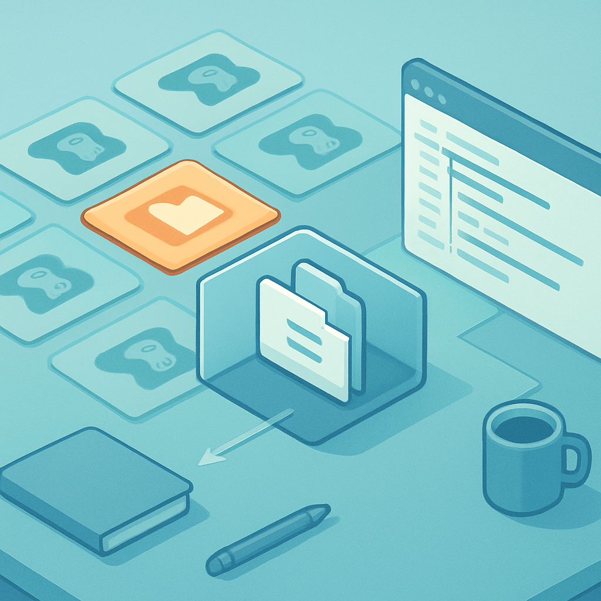

# Project Manager: Criando e Organizando Projetos



Com o binário extraído e rodando, o que você encontra na tela não é o editor — é o **Project Manager**. Entender essa distinção é importante: o Project Manager é a camada de gerenciamento que existe *antes* do editor propriamente dito, e ele nunca desaparece entre sessões de trabalho. Toda vez que você fechar um projeto e voltar ao início, é nessa tela que você cai. Ela é a porta de entrada para qualquer projeto Godot na máquina.

A tela do Project Manager divide-se em duas ações principais: a lista de projetos à esquerda e o painel de ações à direita. A lista exibe todos os projetos que o Godot já conhece — seja porque foram criados nele, seja porque foram importados manualmente. Cada entrada na lista mostra o nome do projeto, o caminho no disco e a versão do Godot com a qual ele foi criado pela última vez. Projetos criados com versões incompatíveis aparecem com um aviso, e o Godot se recusa a abri-los sem uma migração explícita — proteção contra corrupção silenciosa de dados de projeto.

Para criar o projeto que vai abrigar o RPG, clique em **New Project**. O diálogo que abre pede três coisas: um nome, um diretório no disco e um renderer. O nome que você coloca aqui é puramente uma etiqueta interna do Project Manager — ele vai preencher o campo `application/config/name` no `project.godot` e aparecer como título da janela quando o jogo rodar, mas não afeta nenhum nome de arquivo ou diretório. Para o nosso RPG, algo como `pokemon-rpg-godot` funciona bem. O diretório deve ser uma pasta **vazia e dedicada**: o Godot vai depositar vários arquivos ali, e misturar com outros projetos ou com arquivos pré-existentes gera confusão. Use **Browse** para criar a pasta no momento, se ela ainda não existir.

```
pokemon-rpg-godot/
├── project.godot        ← gerado automaticamente; raiz do filesystem virtual
├── .godot/              ← cache de importação, UIDs, shaders compilados
│   ├── imported/
│   └── uid_cache.bin
└── icon.svg             ← ícone padrão do projeto, substituível
```

O arquivo `project.godot` é a peça central. É um arquivo de texto em formato INI — seções, chaves e valores — e funciona como a âncora de tudo: define onde está a raiz do **filesystem virtual** `res://`. Quando você escrever `res://scenes/player.tscn` em qualquer script ou cena do Godot, a engine procura esse arquivo a partir do diretório onde o `project.godot` vive. Mover a pasta do projeto inteira para outro lugar na máquina, ou para outro computador, não quebra nada — desde que o `project.godot` continue na raiz da pasta. Isso é o que torna um projeto Godot intrinsecamente portátil para controle de versão: o repositório Git contém a pasta, o `project.godot` fica no root, e qualquer clone reproduz o projeto exatamente.

Um `project.godot` gerado pelo próprio Project Manager ao criar um projeto novo tem uma estrutura mínima assim:

```ini
; Engine configuration file.
; It's best to edit using the editor UI and not directly,
; to avoid parse errors.

config_version=5

[application]

config/name="pokemon-rpg-godot"
config/features=PackedStringArray("4.4", "Forward Plus")
config/icon="res://icon.svg"

[rendering]

renderer/rendering_method="forward_plus"
```

A seção `[application]` guarda o nome e a lista de features, que inclui tanto a versão do Godot (`"4.4"`) quanto o renderer escolhido. A seção `[rendering]` registra `renderer/rendering_method` — o valor aqui é fixado no momento da criação e não muda sem intervenção manual ou via Project Settings. Isso conecta diretamente ao próximo conceito, que detalha as três opções de renderer: `forward_plus`, `mobile` e `gl_compatibility`. Por ora, o diálogo de criação apresenta essa escolha em forma de radio buttons; para o RPG 2D que estamos construindo, `forward_plus` (chamado de **Forward+** na interface) é a seleção correta e o padrão.

O subdiretório `.godot/` merece atenção separada. Ele é gerado e gerenciado automaticamente pela engine, e seu conteúdo é um cache: UIDs de recursos, texturas importadas em formato interno, shaders compilados para a GPU. **Nunca edite manualmente** o conteúdo de `.godot/` — se algo ficar corrompido, basta apagar o diretório inteiro e reabrir o projeto; o Godot o reconstrói. Em projetos com controle de versão, existe debate sobre incluir ou não o `.godot/` no repositório. A recomendação prática: inclua-o. Excluir o `.godot/` do Git e colocá-lo no `.gitignore` parece limpo, mas causa problemas reais quando um novo clone tenta abrir o projeto — os UIDs embutidos nos arquivos `.tscn` ficam sem referência, gerando erros silenciosos de importação. O custo de incluir o cache no repositório (arquivos binários, commits mais pesados) é menor que o custo de depurar inconsistências de UID.

Depois de preencher nome e diretório, clicar em **Create & Edit** faz duas coisas: cria os arquivos no disco e abre o projeto diretamente no editor. O Project Manager some. Se você quiser voltar a ele — para abrir outro projeto, criar um segundo, ou ver a lista de todos os projetos — basta fechar o editor, e o Project Manager reaparece. Esse comportamento reflete a arquitetura: editor e Project Manager são a mesma aplicação em estados diferentes, não processos separados.

A funcionalidade de **Import** no Project Manager é o caminho para abrir projetos recebidos de fora: um clone de repositório Git, uma pasta baixada de tutorial, um projeto de exemplo da asset library. Clicando em Import e apontando para a pasta que contém o `project.godot`, o Godot registra o projeto na lista e o abre. Esse fluxo é exatamente o que o seu par de trabalho vai fazer quando clonar o repositório do RPG — baixa, aponta o Project Manager para a pasta, abre.

Para organizar múltiplos projetos na lista, o Godot 4.x introduziu **tags**: cada projeto na lista pode receber etiquetas arbitrárias (por exemplo, `rpg`, `2d`, `multiplayer`, `wip`) e a barra de busca do Project Manager filtra por nome e por tag simultaneamente. Isso não é crítico quando se tem dois ou três projetos, mas projetos de aprendizagem tendem a se acumular — ter o projeto principal do RPG tagueado como `main` desde o início torna a lista usável meses depois, quando conviverem com ele outros projetos de experimento.

Um comportamento que surpreende quem vem de IDEs convencionais: **o Project Manager não tem um conceito de "workspace" ou "solution" que agrupe projetos relacionados**. Cada projeto Godot é autônomo — tem seu próprio `project.godot`, seu próprio `res://`, suas próprias configurações. Se um dia o RPG crescer ao ponto de justificar um servidor separado em Godot headless, esse servidor será um projeto separado na lista. A comunicação entre eles ocorre via rede, não via filesystem compartilhado.

## Fontes utilizadas

- [Using the Project Manager — Godot Engine (stable) documentation](https://docs.godotengine.org/en/stable/tutorials/editor/project_manager.html)
- [Project organization — Godot Engine (stable) documentation](https://docs.godotengine.org/en/stable/tutorials/best_practices/project_organization.html)
- [File system — Godot Engine (stable) documentation](https://docs.godotengine.org/en/stable/tutorials/scripting/filesystem.html)
- [Project Settings — Godot Engine (stable) documentation](https://docs.godotengine.org/en/stable/tutorials/editor/project_settings.html)
- [Are .import and .godot files+dirs required in v4? — Godot Forums](https://godotforums.org/d/32949-are-import-and-godot-filesdirs-now-required-in-v4)

---

**Próximo conceito** → [Escolha do Renderer: Forward+, Mobile ou Compatibility](../03-escolha-do-renderer-forward-mobile-ou-compatibility/CONTENT.md)
