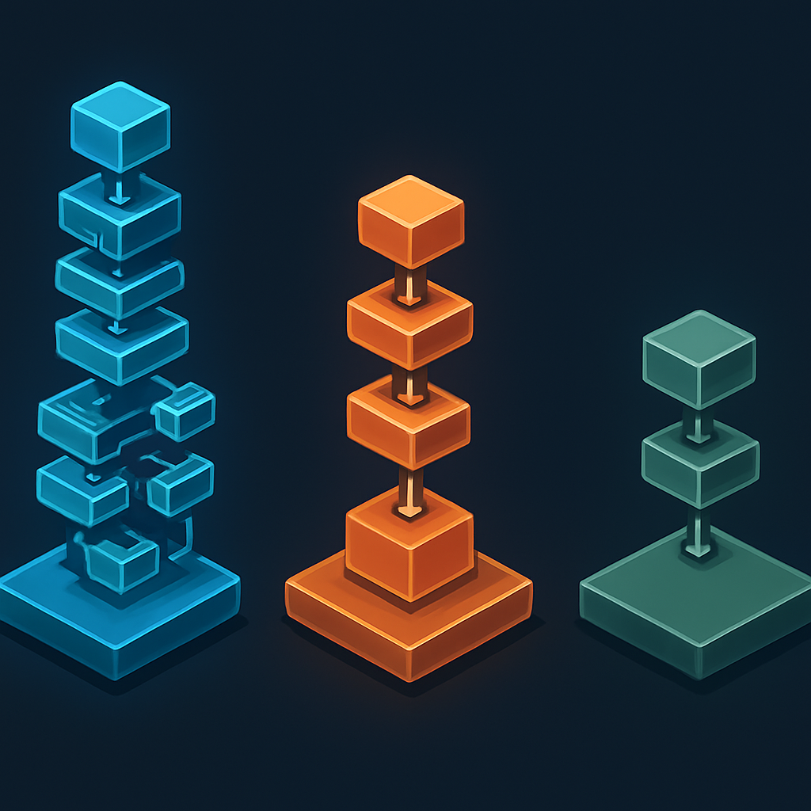

# Escolha do Renderer: Forward+, Mobile ou Compatibility



No momento em que você clica em **New Project** no Project Manager e preenche nome e diretório, há um terceiro campo que costuma causar paralisia: o seletor de renderer. Três opções aparecem — **Forward+**, **Mobile** e **Compatibility** — e a decisão é permanente no sentido de que mudar de renderer depois é possível, mas exige revisitar shaders e configurações de iluminação. Entender o que cada uma representa mecanicamente elimina o mistério e torna a escolha trivial.

O renderer não é um "modo de qualidade gráfica" no sentido de alto/médio/baixo. Ele define qual **pipeline de renderização** a engine usa para transformar sua cena em pixels na tela — e, mais fundamentalmente, qual **API gráfica** a engine usa para enviar comandos à GPU. Forward+ e Mobile usam APIs modernas de baixo nível: Vulkan, Direct3D 12 (Windows) ou Metal (macOS/iOS), mediados por uma camada interna do Godot chamada `RenderingDevice`. Compatibility usa OpenGL, que é uma API muito mais antiga, mais alta em abstração e com suporte em praticamente qualquer hardware da última década, incluindo navegadores web via WebGL.

Essa diferença de API tem consequências em cascata. Vulkan e Direct3D 12 são APIs explícitas: o driver assume muito pouco e deixa a responsabilidade de sincronização de recursos, alocação de memória de GPU e agendamento de comandos para a camada acima — que no caso do Godot é o próprio código da engine. Isso permite ao Godot extrair o máximo da GPU paralela moderna, mas requer hardware suficientemente recente para suportar esses drivers. OpenGL, por outro lado, é uma API implícita: o driver esconde a complexidade, toma decisões por conta própria e oferece uma superfície de programação mais simples. A troca é menor throughput e menos controle sobre comportamentos internos da GPU, mas compatibilidade quase universal.

```
                ┌─────────────────────────────────────────────┐
                │             Godot 4 — seu projeto            │
                └──────────────┬────────────────┬─────────────┘
                               │                │
                ┌──────────────▼──┐     ┌───────▼──────────────┐
                │  RenderingDevice │     │     OpenGL driver     │
                │  (abstração do  │     │  (sem RenderingDevice)│
                │   Godot sobre   │     └───────┬──────────────┘
                │  Vulkan/DX12/   │             │
                │    Metal)       │             │
                └──┬──────────┬──┘             │
                   │          │                │
          ┌────────▼──┐  ┌────▼──────┐  ┌─────▼──────┐
          │ Forward+  │  │  Mobile   │  │Compatibility│
          │ (desktop) │  │(mobile+PC)│  │(universal) │
          └───────────┘  └───────────┘  └────────────┘
```

**Forward+** é o renderer mais completo. Implementa um pipeline de renderização deferred (com prepass de profundidade separado) que resolve iluminação em uma etapa dedicada depois que toda a geometria da cena já foi processada. Isso permite um número arbitrariamente grande de luzes dinâmicas por cena — cada `OmniLight3D` ou `SpotLight3D` adicional não tem custo fixo sobre os outros. As features mais avançadas do Godot — SDFGI (iluminação global baseada em distância), volumetric fog, screen-space reflections, compute shaders, variable rate shading — vivem exclusivamente no Forward+. Todo novo recurso de renderização introduzido no Godot aterra primeiro aqui.

**Mobile** usa o mesmo trio de drivers modernos (Vulkan/DX12/Metal) e o mesmo `RenderingDevice`, mas implementa um pipeline diferente internamente: forward rendering em single pass, com um limite explícito de oito `OmniLight3D` e oito `SpotLight3D` afetando cada mesh. O objetivo é atingir bom desempenho em GPUs de celular, onde o custo de banda de memória domina e pipelines multi-pass são proibitivos. Na prática, para jogos 2D, a diferença visual entre Mobile e Forward+ é inexistente — nenhuma das features 3D avançadas que Forward+ oferece a mais é relevante para sprites e tilemaps.

**Compatibility** é o renderer baseado em OpenGL. É menos capaz em termos de features 3D (sem SDFGI, sem compute shaders, sem screen-space effects avançados), mas roda em qualquer hardware que suporte OpenGL 3.3 ou superior — o que inclui laptops antigos, máquinas virtuais, e navegadores web via WebGL 2. É o único renderer que permite exportar para a web.

| | Forward+ | Mobile | Compatibility |
|---|---|---|---|
| **API gráfica** | Vulkan / DX12 / Metal | Vulkan / DX12 / Metal | OpenGL 3.3 / WebGL 2 |
| **Backend interno** | RenderingDevice | RenderingDevice | — (driver direto) |
| **Plataformas-alvo** | Desktop | Desktop + Mobile | Desktop + Mobile + Web |
| **Pipeline** | Deferred (multi-pass) | Forward single-pass | Forward |
| **Luzes dinâmicas** | Ilimitadas | Até 8 por mesh | Limitadas |
| **SDFGI / volumetric fog** | Sim | Não | Não |
| **Compute shaders** | Sim | Sim (parcial) | Não |
| **Exportação web** | Não | Não | Sim |
| **Adequado para 2D puro** | Sim | Sim | Sim |

Para o RPG 2D que este livro constrói, a escolha é **Forward+**, e o motivo não é a riqueza de features 3D — que não serão usadas — mas sim a posição de Forward+ como o renderer principal do Godot, aquele que recebe correções, melhorias e novos recursos primeiro. Como o leitor nunca abriu uma engine antes, é razoável antecipar que, ao longo da travessia, algum tutorial avançado ou plugin da asset library vai assumir Forward+. Usar Compatibility como base cria uma superfície de atrito desnecessária.

O argumento mais comum para usar Compatibility em 2D é "mais performance". Ele merece exame cuidadoso. A documentação oficial afirma que "Compatibility é geralmente suficiente para 2D", mas isso não quer dizer que Forward+ seja mais lento para 2D. Para sprites simples, tilemaps e UI — que são 99% de um RPG top-down — o custo de renderização é dominado pelo número de draw calls, não pelo pipeline escolhido. Forward+ tem overhead marginalmente maior na inicialização (o Vulkan driver faz compilação de pipeline na primeira execução), mas em steady state de um jogo 2D rodando a 60fps, a diferença de CPU e GPU entre Forward+ e Compatibility é imperceptível em qualquer desktop ou laptop fabricado nos últimos cinco anos.

O único cenário onde Compatibility é a escolha correta para este projeto é se o destino de publicação incluir a **web**. Exportar via WebGL 2 exige obrigatoriamente o renderer Compatibility — Forward+ e Mobile simplesmente não têm suporte a exportação web. Se você planeja, no futuro, publicar o RPG em itch.io com acesso via navegador, esse é o momento de tomar a decisão. Mudar o renderer depois é possível: edite `project.godot`, altere `renderer/rendering_method` de `"forward_plus"` para `"gl_compatibility"`, e inspecione cada shader e material que você criou — a maioria funciona, mas qualquer efeito que dependia de uma feature exclusiva do Forward+ vai precisar de um fallback manual. Para um projeto de aprendizado que ainda não tem nenhum shader escrito, essa migração não tem custo. Para um projeto com meses de trabalho, é um exercício de arqueologia.

Um detalhe que o Project Manager não torna óbvio: ao criar o projeto, ele registra o renderer escolhido na chave `config/features` do `project.godot`, como visto no conceito anterior. O valor `"Forward Plus"` (com espaço, sem o símbolo +) aparece no array `PackedStringArray`. Isso não é apenas metadado — é o mecanismo pelo qual o Godot detecta incompatibilidade quando alguém abre seu projeto em uma versão diferente do editor ou em uma plataforma sem suporte ao renderer configurado. Se você comitar o `project.godot` no Git (o que deve fazer, como discutido no conceito do Project Manager), qualquer colaborador que clonar o repositório abrirá o projeto com o mesmo renderer que você configurou, sem surpresas.

## Fontes utilizadas

- [Overview of renderers — Godot Engine (stable) documentation](https://docs.godotengine.org/en/stable/tutorials/rendering/renderers.html)
- [Renderers — Godot Engine 4.4 documentation](https://docs.godotengine.org/en/4.4/tutorials/rendering/renderers.html)
- [Internal rendering architecture — Godot Engine (4.4) documentation](https://docs.godotengine.org/en/4.4/contributing/development/core_and_modules/internal_rendering_architecture.html)
- [Difference between Forward+ and Compatibility renderer for 2D games — Godot Forum](https://forum.godotengine.org/t/difference-between-forward-and-compability-renderer-for-2d-games/52280)
- [Godot renderer options — Android Developers](https://developer.android.com/games/engines/godot/godot-renderers)
- [About Godot 4, Vulkan, GLES3 and GLES2 — Godot Engine Blog](https://godotengine.org/article/about-godot4-vulkan-gles3-and-gles2/)
- [Whats mobile and forward+ and compatibility? — Godot Forum](https://forum.godotengine.org/t/whats-mobile-and-foward-and-compatibility/124108)

---

**Próximo conceito** → [Anatomia do Editor Godot 4](../04-anatomia-do-editor-godot-4/CONTENT.md)
