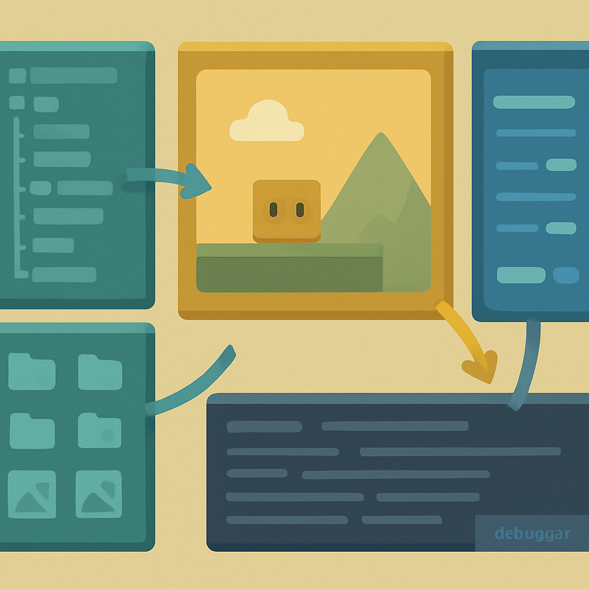

# Anatomia do Editor Godot 4



Você clicou em **Create & Edit** no Project Manager, o projeto `pokemon-rpg-godot` foi criado em disco com o renderer Forward+ configurado no `project.godot` — e agora o editor abre pela primeira vez. A tela que aparece não é uma janela em branco: ela já está dividida em regiões com propósitos específicos, e navegar nelas sem entender o que cada uma faz gera a sensação equivocada de que o Godot é complexo. Não é. O layout segue uma lógica precisa que fica óbvia em minutos quando você tem o mapa.

O editor inteiro vive em uma janela única por padrão. Desde o Godot 4.0 é possível desancorar painéis para monitores secundários — útil em setups multi-monitor, mas irrelevante aqui. O que importa para o RPG é a estrutura default, que divide o espaço em quatro regiões funcionais: **esquerda** (Scene dock e FileSystem dock), **centro** (viewport + workspaces), **direita** (Inspector + Node dock) e **base** (Output, Debugger e editores contextuais).

```
┌──────────────────────────────────────────────────────────────────┐
│  Scene   FileSystem        2D  3D  Script  AssetLib    ▶ ⏸ ⏹    │  ← menu + workspaces + play
├───────────┬──────────────────────────────────┬───────────────────┤
│           │                                  │                   │
│  Scene    │                                  │    Inspector      │
│  Dock     │         Viewport / Editor        │                   │
│           │         (muda conforme workspace) │    Node Dock      │
│           │                                  │   (tabs: Node,    │
│ FileSystem│                                  │    History)       │
│  Dock     │                                  │                   │
├───────────┴──────────────────────────────────┴───────────────────┤
│  Output   Debugger   Search Results   Audio   Animation   Shader  │  ← bottom panel
└──────────────────────────────────────────────────────────────────┘
```

**Scene dock** (coluna esquerda, metade superior) é onde vive a árvore da cena que está sendo editada. Cada node aparece como um item na árvore, com ícone que identifica seu tipo e indentação que representa hierarquia. Clicando em qualquer node na árvore, você o seleciona — e o Inspector à direita imediatamente atualiza para mostrar as propriedades daquele node específico. Botão direito num node da árvore abre um menu de contexto com opções como duplicar, mover para cima/baixo na hierarquia, ou adicionar um node filho. O botão `+` no topo do dock adiciona um node novo como filho do node selecionado — é a ação mais frequente no começo. Por enquanto o dock aparece vazio ou com uma mensagem para criar uma cena: isso é esperado, porque o projeto está vazio.

**FileSystem dock** (coluna esquerda, metade inferior) é o navegador de assets do projeto. Exibe o conteúdo de `res://` — a raiz do filesystem virtual que o `project.godot` ancora. Cada pasta, cena `.tscn`, script `.gd`, sprite `.png`, tileset, fonte, JSON de dados aparece aqui. Double-click em uma cena abre ela para edição no viewport; double-click em um script abre o editor de código; double-click em uma textura mostra preview no Inspector. O FileSystem dock é permanente e atualiza automaticamente quando você adiciona arquivos via filesystem do sistema operacional — o Godot detecta mudanças em disco e reimporta resources conforme necessário.

Existe uma confusão comum logo de início: o FileSystem dock mostra **recursos do projeto** (tudo dentro de `res://`), não os scripts em si como entidades de código. Um script `.gd` aparece no FileSystem como um arquivo; para ver o código dele, você abre via double-click e o workspace muda para **Script**. Para ver o node ao qual o script está anexado, você usa o Scene dock. São perspectivas diferentes sobre o mesmo projeto.

A **barra superior** contém três grupos. À esquerda, os menus de sistema: **Scene** (salvar, abrir, fechar cena), **Project** (Project Settings, Export), **Debug** (opções de debugging), **Editor** (Editor Settings, temas) e **Help** (documentação, changelogs). Ao centro, os botões de workspace: **2D**, **3D**, **Script** e **AssetLib** — cada um muda o conteúdo do viewport e o toolbar imediatamente abaixo dos workspaces. À direita, os três botões de execução: ▶ roda o projeto inteiro (equivalente a `F5`), o botão de cena roda só a cena atual (`F6`), e ⏹ para a execução.

Esses workspaces merecem atenção porque não são abas de arquivo — são modos globais do editor inteiro:

| Workspace | Quando usar | O que aparece no centro |
|---|---|---|
| **2D** | Editar posição, escala, hierarquia visual de nodes 2D | Canvas editável com gizmos de transformação |
| **3D** | Editar cenas 3D (irrelevante para o RPG por ora) | Viewport 3D com gizmo de câmera |
| **Script** | Escrever e ler código GDScript | Editor de código com syntax highlighting e autocompletion |
| **AssetLib** | Navegar e instalar plugins e assets da biblioteca oficial | Browser de assets online |

Para o RPG 2D, você vai passar 90% do tempo alternando entre **2D** e **Script**. O workflow básico é: seleciona um node no Scene dock → volta ao 2D workspace para ajustar posição/tamanho → vai ao Script workspace para escrever o comportamento. O editor lembra qual script estava aberto ao voltar para Script, então essa alternância é fluída.

O **viewport central** no workspace 2D exibe o canvas editável onde a cena é composta visualmente. A câmera azul pontilhada que aparece representa os limites da janela do jogo — tudo dentro da área azul é o que o jogador vai ver. Scroll do mouse dá zoom; botão do meio arrasta a câmera do editor (não a câmera do jogo). Quando você seleciona um node 2D no Scene dock, o viewport exibe gizmos: um círculo para mover, quadrados nas bordas para escalar, e um ponto de âncora para rotacionar. Nenhuma dessas ações no editor afeta o código — são apenas ajustes de transform que ficam gravados no `.tscn`.

O toolbar que aparece logo abaixo dos botões de workspace muda conforme o workspace ativo. No 2D, mostra as ferramentas de seleção, mover, rotacionar, escalar — mapeados nas teclas `Q`, `W`, `E`, `R` como em muitos softwares de composição. No Script, o toolbar mostra opções de debugging inline (breakpoints, execução passo a passo). Esse contexto adaptativo do toolbar é o que dá ao editor a sensação de que "sabe o que você está fazendo" ao mudar de modo.

O **Inspector** (coluna direita, maior área) é a peça mais densa do editor e a que mais tempo você vai usar para configurar nodes. Quando um node está selecionado no Scene dock, o Inspector mostra todas as suas propriedades organizadas em seções expansíveis, cada seção correspondendo a uma classe na hierarquia de herança do node. Um `Sprite2D`, por exemplo, exibe seções para suas propriedades próprias (Texture, Hframes, Vframes, Region) e para as propriedades herdadas de `Node2D` (Position, Rotation, Scale), e acima ainda as de `CanvasItem` (Visibility, Modulate) e de `Node` (Name, ProcessMode). A barra de busca no topo do Inspector filtra propriedades por nome — quando você sabe o nome do campo que quer editar mas não quer scrollar pela lista toda, digitar três letras já filtra.

Uma propriedade editada no Inspector escreve imediatamente no arquivo `.tscn` da cena — não existe "modo edição" separado de "modo salvar". O que você muda no Inspector é o estado real da cena. O atalho `Ctrl+Z` desfaz a última mudança de propriedade normalmente.

Abaixo do Inspector, no mesmo painel direito, há o **Node dock** com duas abas: **Signals** e **Groups**. A aba Signals lista todos os signals que o node selecionado pode emitir — `pressed` para um Button, `body_entered` para uma Area2D, `animation_finished` para um AnimatedSprite2D. Double-click em um signal abre a janela de conexão, onde você aponta para qual outro node quer conectar e qual função vai receber o evento. Essa é a forma visual de criar conexões de signal sem escrever código de `connect()` manualmente — útil nas primeiras semanas, mas eventualmente você vai preferir `connect()` diretamente no script por clareza. A aba Groups é usada para agrupar nodes por tag (por exemplo, adicionar todos os inimigos ao grupo `"enemies"` e então chamar `get_tree().call_group("enemies", "die")` no script).

A **base do editor** (bottom panel) é um painel retrátil com múltiplas abas. Ele começa minimizado — uma barra estreita com os nomes das abas — e expande quando você clica em uma delas. As abas principais que você vai usar:

- **Output**: log de execução em tempo real. Todo `print()` no GDScript aparece aqui durante o `F5`. Erros e warnings também aparecem aqui com link para a linha do script que gerou o problema.
- **Debugger**: aparece automaticamente quando o projeto está rodando e um breakpoint é atingido, ou quando ocorre um erro de execução. Exibe a call stack, permite inspecionar variáveis locais, e tem o **Profiler** embutido para medir tempo de frame e identificar gargalos de performance.
- **Search Results**: resultados de busca de texto em scripts (via `Ctrl+Shift+F` no workspace Script).
- **Audio**: mixer de barramentos de áudio — irrelevante até você adicionar sons ao projeto.
- **Animation**: editor de keyframes para `AnimationPlayer` — aparece contextualmente quando você seleciona um node com AnimationPlayer.
- **Shader**: editor visual de shaders — aparece quando você seleciona um `ShaderMaterial`.

A natureza contextual das abas do bottom panel gera uma confusão prática conhecida: se você está editando uma animação no **Animation** e clica em outro node que tem shader, o bottom panel pula automaticamente para **Shader** e "esconde" a animação. A animação não desapareceu — basta clicar na aba Animation novamente. Isso é um comportamento do editor, não perda de dados.

Para o RPG que este livro constrói, o mapa de uso das regiões do editor ao longo dos próximos capítulos é direto:

- **Scene dock** → construir a hierarquia de nodes do mapa, do jogador, dos NPCs, da UI de batalha.
- **FileSystem dock** → organizar pastas `scenes/`, `scripts/`, `assets/sprites/`, importar tilesets, localizar cenas para abrir.
- **Viewport 2D** → posicionar tiles, ajustar câmera, organizar layers visuais.
- **Script workspace** → escrever GDScript em todos os nodes que têm comportamento.
- **Inspector** → configurar propriedades dos nodes sem escrever código: textura do Sprite2D, velocidade do CharacterBody2D, tamanho da CollisionShape2D.
- **Node dock / Signals** → conectar o signal `body_entered` de uma Area2D ao script do jogador para detectar encontros de batalha.
- **Output / Debugger** → depurar o movimento em grid, verificar que os dados de combate estão chegando pelo MultiplayerAPI, medir tick rate.

O editor do Godot não tem "modos" escondidos nem configuração inicial necessária. O que você viu na primeira abertura é o que vai usar. O único ajuste cosmético que vale considerar desde já é ir em **Editor → Editor Settings → Interface → Theme** e escolher entre os temas Dark e Light — não afeta funcionalidade, mas 8 horas de editor com tema claro em monitor brilhante cansam mais que o escuro.

## Fontes utilizadas

- [First look at Godot's interface — Godot Engine (stable) documentation](https://docs.godotengine.org/en/stable/getting_started/introduction/first_look_at_the_editor.html)
- [Inspector Dock — Godot Engine (stable) documentation](https://docs.godotengine.org/en/stable/tutorials/editor/inspector_dock.html)
- [Debugger panel — Godot Engine (stable) documentation](https://docs.godotengine.org/en/stable/tutorials/scripting/debug/debugger_panel.html)
- [Customizing the interface — Godot Engine (stable) documentation](https://docs.godotengine.org/en/stable/tutorials/editor/customizing_editor.html)
- [FileSystemDock — Godot Engine (stable) documentation](https://docs.godotengine.org/en/stable/classes/class_filesystemdock.html)
- [Learn Godot 4 by Making a 2D Platformer — Part 1: Project Editor & Overview (Medium)](https://christinec-dev.medium.com/learn-godot-4-by-making-a-2d-platformer-part-1-project-editor-overview-4886c611359b)
- [Editor improvements for Godot 4.0 — Godot Engine Blog](https://godotengine.org/article/editor-improvements-godot-40/)

---

**Próximo conceito** → [O Primeiro Ciclo: Cena, Save e Run](../05-o-primeiro-ciclo-cena-save-e-run/CONTENT.md)
