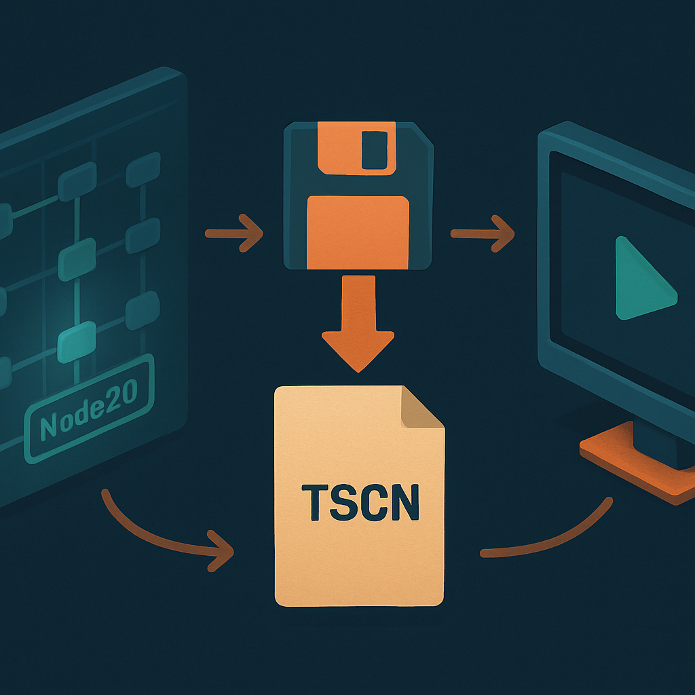

# O Primeiro Ciclo: Cena, Save e Run



Com o layout do editor mapeado — Scene dock, FileSystem dock, viewport, Inspector, bottom panel — e o projeto `pokemon-rpg-godot` recém-criado em disco, o editor está aberto mas o projeto está genuinamente vazio: nenhuma cena, nenhum script, nenhum asset. Essa condição de vazio é a base sobre a qual todo o RPG vai ser construído, e o próximo passo não é estudar mais teoria — é executar o ciclo **cena → save → run** pela primeira vez, fechando o loop entre o que o editor oferece e o que ele produz em disco e em tela.

Esse ciclo é o gesto fundamental de trabalho no Godot. Cada vez que você avança no projeto — adiciona um node, ajusta uma propriedade no Inspector, escreve algumas linhas de GDScript — você repete essa sequência. Entender o que acontece mecanicamente em cada etapa elimina a sensação de que algo é frágil ou misterioso na primeira vez.

**Criando a cena.** O ponto de entrada é o Scene dock, à esquerda. Como o projeto está vazio, o dock exibe um painel com quatro atalhos de criação: "2D Scene", "3D Scene", "User Interface" e "Other Node". Cada atalho é apenas uma conveniência que cria um nó-raiz com um tipo pré-definido: "2D Scene" cria um `Node2D`, "3D Scene" cria um `Node3D`, "User Interface" cria um `Control`, e "Other Node" abre a lista completa de tipos de node para você escolher. Para o RPG top-down que este livro constrói, a cena raiz vai ser quase sempre um `Node2D` — mas neste primeiro ciclo o objetivo é apenas tocar o fluxo, não projetar arquitetura. Clique em **2D Scene**. O Scene dock imediatamente exibe um nó chamado `Node2D` como raiz da árvore, com um ícone característico e o nome editável ao lado. O editor muda automaticamente para o workspace 2D, e o viewport exibe o canvas vazio com a câmera azul pontilhada nos limites da janela do jogo.

**Salvando a cena.** O que existe agora vive exclusivamente na memória do editor — nenhum arquivo foi criado no disco. O `Ctrl+S` é o gesto de save. Ao pressionar, o editor abre o diálogo de salvamento com o filesystem virtual `res://` como ponto de partida. O FileSystem dock à esquerda do diálogo espelha exatamente o que você veria na aba FileSystem do editor: a pasta raiz do projeto com o `project.godot` e o `icon.svg` visíveis. Navegue para onde quiser — a convenção mais comum é criar uma pasta `scenes/` para organizar arquivos de cena — e salve o arquivo com o nome `main.tscn`. A extensão `.tscn` é obrigatória e significa "text scene", o formato de serialização de cenas do Godot.

O que esse arquivo é em disco merece atenção porque desmistifica muito do que parece mágico mais tarde. Um `.tscn` é texto puro, legível por humanos — experimente abri-lo em qualquer editor de texto após salvar. Para a cena mínima com apenas um `Node2D` vazio como raiz, o conteúdo é algo como:

```
[gd_scene format=3 uid="uid://abc123xyz"]

[node name="Node2D" type="Node2D"]
```

O cabeçalho `[gd_scene format=3 uid="..."]` identifica o arquivo como uma cena Godot 4 (format=3 distingue do Godot 3, que usava format=2). O `uid` é um identificador único gerado pelo editor e usado internamente para rastrear o arquivo mesmo que você o mova de pasta — é por isso que mover um `.tscn` pelo FileSystem dock do editor atualiza as referências automaticamente, enquanto mover pelo explorador de arquivos do sistema operacional sem passar pelo editor pode quebrar links. Cada `[node ...]` subsequente representa um nó na árvore, com seu tipo, nome, pai e propriedades que diferem do valor padrão. Propriedades com valor padrão simplesmente não aparecem no arquivo — o Godot não serializa o que é desnecessário.

Após salvar, o FileSystem dock do editor mostra `main.tscn` aparecendo em `res://scenes/` (ou onde você escolheu), e o título da aba do Scene dock agora exibe o nome do arquivo em vez do asterisco `*main` que indica mudança não salva. Um asterisco prefixando o nome de arquivo em qualquer aba do editor é o sinal universal de que há mudanças não salvas.

**Configurando a Main Scene.** Antes de rodar com `F5`, há um detalhe necessário: o Godot precisa saber qual cena carregar quando o projeto inteiro é executado. Esse dado fica na chave `application/run/main_scene` do `project.godot`. A forma mais rápida de configurá-la é pelo diálogo que o próprio editor exibe quando você pressiona `F5` pela primeira vez sem main scene definida — ele pergunta: "No main scene has been defined. Select one?" e abre um seletor de arquivo. Escolha `main.tscn`. O editor atualiza o `project.godot` automaticamente e o projeto começa a rodar.

Alternativamente, você pode configurar manualmente via **Project → Project Settings → Application → Run → Main Scene**, onde o campo aceita um path `res://` para qualquer arquivo `.tscn` do projeto. A partir do Godot 4.2, uma terceira opção ainda mais direta: clique com o botão direito em qualquer `.tscn` no FileSystem dock e escolha **Set as Main Scene**.

| Ação | Resultado | Atalho |
|---|---|---|
| Salvar a cena atual | Escreve/atualiza o `.tscn` no disco | `Ctrl+S` |
| Rodar o projeto inteiro | Carrega a main scene configurada | `F5` |
| Rodar a cena atual | Executa a cena aberta no editor, independente de main scene | `F6` |
| Parar a execução | Encerra o processo do jogo, retorna ao editor | `F8` ou botão ⏹ |

A diferença entre `F5` e `F6` é importante e aparece desde já. O `F5` lança o projeto completo a partir da main scene — é o que o jogador final vai experimentar, pois percorre o fluxo real de inicialização. O `F6` lança apenas a cena que está aberta no editor no momento, ignorando a main scene configurada. Para o ciclo de desenvolvimento, `F6` é o atalho mais usado: você está editando a cena de combate, pressiona `F6`, e aquela cena específica roda em isolamento. Isso elimina o custo de percorrer o menu principal e o mapa do mundo toda vez que quer testar uma mudança pontual. O Godot inicia um processo separado para executar o projeto — o editor continua rodando, e você pode editar enquanto o jogo está aberto, embora mudanças no GDScript só reflitam após um hot reload.

**A janela preta como vitória.** Quando a cena `main.tscn` com apenas um `Node2D` vazio roda, o Godot abre uma segunda janela — o jogo em execução — que exibe exatamente uma janela preta. Sem sprites, sem UI, sem câmera explícita, há literalmente nada a renderizar. O Output no bottom panel vai mostrar algumas linhas de log de inicialização do renderer, e nada mais. Isso é o comportamento correto e esperado. A janela preta é a confirmação de que o ciclo inteiro funcionou: o binário autocontido que você baixou, o projeto criado pelo Project Manager com Forward+ configurado no `project.godot`, a cena salva como `.tscn` no filesystem virtual — tudo se conectou e a engine conseguiu inicializar, carregar a cena e renderizá-la (que resulta em preto, porque a cena não tem nada). Projetos reais começam exatamente aqui.

Um detalhe comportamental que surpreende na primeira vez: ao pressionar `F8` ou clicar em ⏹ para parar a execução, a janela do jogo some e o editor recupera o foco. As mudanças que você fez no Inspector enquanto o jogo rodava — o chamado **in-editor live edit** — são descartadas; o estado da cena volta ao que estava salvo em disco no momento em que o `F5` foi pressionado. Isso é intencional: o Godot não persiste automaticamente mudanças feitas durante a execução de volta para o arquivo. A consequência prática é simples: se você ajustou a posição de um sprite durante o playtesting e quer manter o ajuste, precisa parar, fazer o ajuste no editor parado, e salvar com `Ctrl+S` antes de rodar novamente.

O ciclo que você acabou de executar — criar uma cena, salvar como `.tscn`, configurar como main scene, rodar com `F5`, verificar a janela preta, parar — vai se repetir centenas de vezes ao longo do RPG. Cada adição ao projeto segue essa mesma sequência, com complexidade crescente no conteúdo da cena. Nos próximos capítulos, onde o vocabulário de nodes, scenes e scripts entra de fato, a mecânica do ciclo já estará sedimentada. O que muda é o que está dentro do `[node ...]` no `.tscn` — não o ritual de save e run que governa o fluxo de trabalho.

## Fontes utilizadas

- [TSCN file format — Godot Engine (stable) documentation](https://docs.godotengine.org/en/stable/engine_details/file_formats/tscn.html)
- [Scenes and nodes — Godot Engine documentation](https://docs.huihoo.com/godotengine/godot-docs/godot/tutorials/step_by_step/scenes_and_nodes.html)
- [The main game scene — Godot Engine (stable) documentation](https://docs.godotengine.org/en/stable/getting_started/first_2d_game/05.the_main_game_scene.html)
- [How do I change the default scene? — Godot Forums](https://godotforums.org/d/33505-how-do-i-change-the-default-scene)
- [How to know if the scene is running with F6 or F5? — Godot Forum](https://forum.godotengine.org/t/how-to-know-if-the-scene-is-running-with-f6-or-f5/23943)
- [Scenes, nodes, and scripts — GDQuest courses](https://school.gdquest.com/courses/learn_2d_gamedev_godot_4/to_space_and_beyond/scenes_nodes_scripts_and_signals)
- [Scenes, Nodes and Scripts in Godot 4 — GoTut](https://www.gotut.net/scenes-nodes-and-scripts-in-godot-4/)

---

**Próximo conceito** → [Atalhos e Rituais de Produtividade do Editor](../06-atalhos-e-rituais-de-produtividade-do-editor/CONTENT.md)
