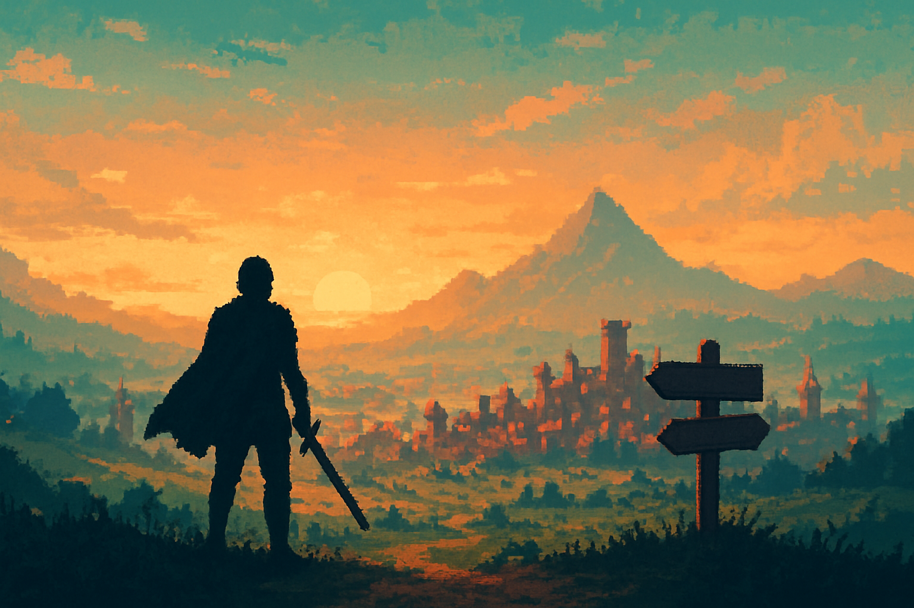

# Introdução — Por que Godot 4 para um RPG 2D online no estilo Pokémon

## Sobre este capítulo

Este capítulo abre o livro enfrentando de frente a pergunta estratégica que precede qualquer linha de código: dado um engenheiro de software sênior experiente em mobile e dados, que nunca abriu uma engine, faz sentido investir em Godot 4 para construir um RPG 2D top-down online no molde de Pokémon Fire Red? O capítulo não é tutorial — é o *briefing* técnico-estratégico que justifica todo o restante do livro. Apresentamos o recorte do jogo-alvo (top-down, grid, combate por turnos, persistência, dois ou mais clientes em rede), mapeamos as alternativas viáveis (Unity, Phaser, Unreal, engines de nicho) e explicitamos os trade-offs que selam a escolha por Godot.

Em paralelo, o capítulo estabelece o **vocabulário mental** que o leitor usará ao longo de todo o livro: o que é uma engine, o que é um game loop, o que significa "scene" dentro do paradigma do Godot, e por que esses conceitos divergem das abstrações familiares a quem vem de sistemas distribuídos, pipelines de dados e aplicativos mobile. O resultado esperado é que, ao virar a página, o leitor saiba exatamente por que Godot 4 é a resposta certa para este projeto específico e tenha um mapa mental dos próximos capítulos.

## Estrutura

Os blocos deste capítulo são: (1) **o recorte do jogo-alvo** — definição explícita do protótipo Pokémon Fire Red-like em rede, escopo mínimo jogável (MVP), trilha de chegada até o fim do livro; (2) **o panorama de engines 2D em 2026** — Godot vs. Unity vs. Phaser vs. alternativas de nicho, com foco em maturidade 2D, multiplayer nativo e custo de aprendizado; (3) **por que Godot 4 vence para este caso** — cena-como-árvore, GDScript ergonômico, licença MIT, API de multiplayer de alto nível nativa, footprint da engine; (4) **o mapa do livro** — como os quatro blocos estruturais (fundamentos, sistemas Pokémon-like, online, pipeline com AI) se encadeiam; (5) **setup mínimo** — instalação do Godot 4, criação do primeiro projeto e o ritual de "abri o editor pela primeira vez".

## Objetivo

Ao terminar este capítulo, o leitor terá uma decisão técnica fundamentada sobre usar Godot 4 para este projeto, conhecerá o ecossistema de engines concorrentes o suficiente para defender essa escolha, terá o Godot 4 instalado e um projeto vazio aberto no editor, e terá um mapa mental claro de onde cada capítulo futuro se encaixa na travessia rumo ao protótipo online. A partir daqui, o capítulo seguinte pode entrar no modelo mental de Godot sem mais precisar justificar a engine.

## Subcapítulos

1. [O Recorte do Jogo-Alvo](01-o-recorte-do-jogo-alvo/CONTENT.md) — MVP Pokémon Fire Red-like, top-down em grid, combate por turnos, dois clientes em rede e a trilha até o protótipo final.
2. [Panorama de Engines 2D em 2026](02-panorama-de-engines-2d-em-2026/CONTENT.md) — Unity, Phaser, Defold e nicho avaliados sob a ótica específica de um RPG 2D online.
3. [Por que Godot 4 Vence Para Este Projeto](03-por-que-godot-4-vence-para-este-projeto/CONTENT.md) — cena-como-árvore, GDScript ergonômico, licença MIT, multiplayer de alto nível nativo e footprint enxuto.
4. [Vocabulário Mental de Gamedev](04-vocabulario-mental-de-gamedev/CONTENT.md) — engine, game loop, scene, node, signal e como se conectam ao mundo de sistemas distribuídos do leitor.
5. [O Mapa do Livro](05-o-mapa-do-livro/CONTENT.md) — como os quatro blocos (fundamentos, sistemas Pokémon-like, online, pipeline com AI) se encadeiam até o entregável final.
6. [Setup Mínimo — Instalando o Godot 4 e Abrindo o Primeiro Projeto](06-setup-minimo-instalando-o-godot-4/CONTENT.md) — instalação, criação do primeiro projeto vazio e o ritual de abrir o editor pela primeira vez.

## Fontes utilizadas

- [Godot Engine — site oficial](https://godotengine.org/)
- [Phaser vs Godot for 2D Games: Complete Comparison](https://generalistprogrammer.com/tutorials/phaser-vs-godot-2d-games)
- [Game Development Roadmap 2026 (Codelivly)](https://codelivly.com/game-development-roadmap/)
- [Godot Beginner Guide 2026: What I Wish I Knew Before Starting (YouTube)](https://www.youtube.com/watch?v=VwbD5_c7Bq0)
- [How to Start Learning Godot in 2026: A Beginner's Guide](https://eathealthy365.com/a-step-by-step-guide-to-learning-the-godot-engine/)
- [I attempted to make the same 2D game prototype in different game engines (freeCodeCamp)](https://www.freecodecamp.org/news/how-i-made-a-2d-prototype-in-different-game-engines/)
