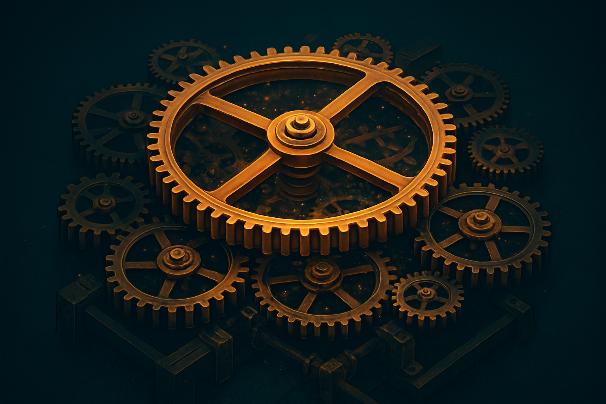

# Game Loop, Delta Time e o Editor em Prática

## Sobre este capítulo

Depois de entender que o jogo é uma árvore de nós, é hora de entender **como essa árvore é executada**. Este capítulo introduz o conceito central que diferencia gamedev de qualquer outro tipo de software que o leitor já escreveu: o *game loop* — o ciclo fechado em que, a cada frame, a engine lê input, atualiza estado, avalia física e redesenha tudo na tela, dezenas de vezes por segundo. Aqui entra o `delta time`, o conceito que desacopla a lógica de jogo da taxa de frames do hardware, e os dois ganchos que dominam o cotidiano do dev em Godot: `_process(delta)` e `_physics_process(delta)`.

O capítulo também consolida o trânsito pelo **editor do Godot**: docks, inspector, file system, remote scene tree do debugger, como mover nós entre cenas, `@onready`, `@export`, hot-reload. Sem essa fluência de editor, qualquer capítulo seguinte fica mais lento do que precisa, porque cada tarefa vira uma caça ao tesouro pela interface.

## Estrutura

Os blocos são: (1) **o game loop como modelo mental** — o ciclo input→update→physics→render, por que ele é fechado e síncrono, comparação com event loops e request/response de backend; (2) **delta time e frame rate independence** — por que multiplicar movimentação por `delta`, quando usar `_process` vs. `_physics_process`, fixed timestep; (3) **o editor como IDE de jogo** — dock de cena, inspector, file system, remote tree, output console, debugger; (4) **anotações essenciais de GDScript no contexto do editor** — `@onready`, `@export`, `@export_range`, `@tool`; (5) **hands-on** — adicionar um script a um nó, fazer um sprite se mover horizontalmente a uma velocidade constante usando `delta`, observar o comportamento variando o FPS.

## Objetivo

Ao fim deste capítulo, o leitor terá um modelo mental preciso do que acontece a cada frame em um jogo Godot, saberá quando e por que usar `_process` vs. `_physics_process`, estará confortável com as principais janelas do editor, e terá escrito seu primeiro script com movimentação dependente de delta time. A partir daqui, entramos em GDScript e sinais com as fundações do ciclo de execução já firmes.

## Fontes utilizadas

- [Godot Engine — Idle and Physics Processing (docs)](https://docs.godotengine.org/en/stable/tutorials/scripting/idle_and_physics_processing.html)
- [Godot Engine — Your first script (docs)](https://docs.godotengine.org/en/stable/getting_started/step_by_step/scripting_first_script.html)
- [Godot Engine — Step by step (docs)](https://docs.godotengine.org/en/stable/getting_started/step_by_step/index.html)
- [Learn Godot [2026] Most Recommended Tutorials (hackr.io)](https://hackr.io/tutorials/learn-godot)
- [Godot learning paths (GDQuest)](https://www.gdquest.com/tutorial/godot/learning-paths/)
