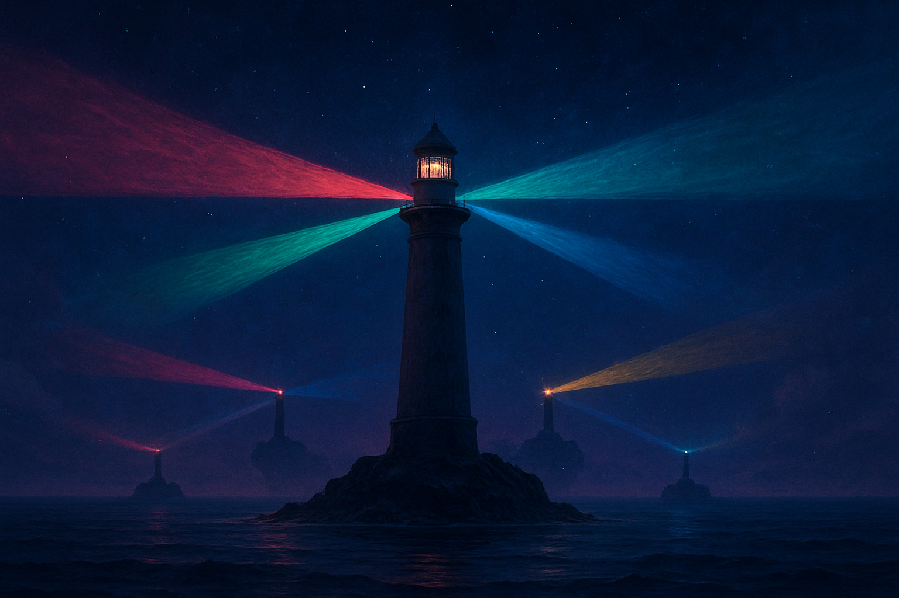

# GDScript e Sinais: Scripts em Nós e Comunicação Desacoplada

## Sobre este capítulo

Com o modelo de cena e o game loop já firmes, chegou o momento de escrever lógica de verdade. Este capítulo apresenta o GDScript — a linguagem nativa e primária do Godot — a partir da perspectiva de quem já escreve software há anos: o foco não é "como declarar uma variável", mas como GDScript difere das linguagens que o leitor já domina (tipagem opcional/estática, chamada de métodos do nó pai, `await`, `match`, anotações), e onde ele se encaixa na arquitetura do motor. Em paralelo, o capítulo introduz o conceito central de **signals** como o mecanismo primário de comunicação desacoplada entre nós — uma forma de Observer embutida no runtime que substitui callbacks e event buses ad hoc.

Este capítulo aparece nesta posição porque sem GDScript não há jogo, e sem sinais o leitor tende a construir acoplamentos rígidos que vão cobrar caro lá na frente, quando o jogo crescer e a camada de rede entrar em cena.

## Estrutura

Os blocos são: (1) **GDScript essencial para seniores** — sintaxe, tipagem opcional, `class_name`, `extends`, anotações (`@export`, `@onready`, `@tool`), coroutines com `await`; (2) **o ciclo de vida de um script** — `_init`, `_ready`, `_process`, `_physics_process`, `_input`; (3) **signals do zero** — como declarar, emitir, conectar via código e via editor, disconnect, payloads tipados; (4) **padrões de uso de sinais em RPGs** — player emitindo `moved`, NPC escutando `interacted`, HUD escutando `hp_changed`; (5) **GDScript vs. C#** — quando considerar C# (Mono), trade-offs para projetos online; (6) **hands-on** — criar um sinal no player que avisa a HUD quando o HP muda, conectá-lo via editor e via código.

## Objetivo

Ao terminar o capítulo, o leitor terá confiança para ler e escrever GDScript idiomático, usará sinais como primeira ferramenta de comunicação entre nós, e entenderá por que essa escolha de design evita acoplamentos que quebrariam em jogo crescente. Com isso, está pronto para subir ao nível visual: sprites, animação e resources.

## Fontes utilizadas

- [Godot Engine — GDScript basics (docs)](https://docs.godotengine.org/en/stable/tutorials/scripting/gdscript/gdscript_basics.html)
- [Godot Engine — Signals (docs)](https://docs.godotengine.org/en/stable/getting_started/step_by_step/signals.html)
- [Godot Engine — GDScript reference](https://docs.godotengine.org/en/stable/tutorials/scripting/gdscript/gdscript_basics.html)
- [GDQuest — Godot learning paths](https://www.gdquest.com/tutorial/godot/learning-paths/)
- [Let's Learn Godot 4 by Making an RPG — Part 1: Project Overview & Setup (DEV)](https://dev.to/christinec_dev/lets-learn-godot-4-by-making-an-rpg-part-1-project-overview-setup-bgc)
