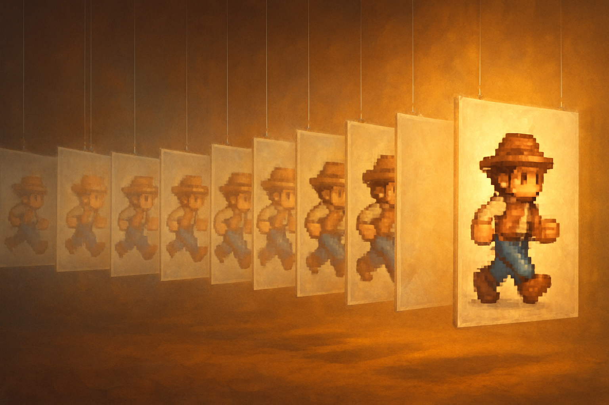

# Sprites, AnimatedSprite2D e Resources

## Sobre este capítulo

A partir deste capítulo, o jogo começa a ter aparência. Entra em cena o pipeline visual 2D do Godot: como uma imagem vira um `Sprite2D`, como uma sequência de imagens vira um `AnimatedSprite2D` com `SpriteFrames`, e como tudo isso é organizado por um dos conceitos mais poderosos (e mal compreendidos) da engine — o `Resource`. Resources são dados tipados, serializáveis em disco como arquivos `.tres`/`.res`, e são o que permite a uma engine como Godot reutilizar sem acoplar: o mesmo `SpriteFrames` alimenta o jogador e o rival; a mesma `Theme` estiliza todas as telas. Para um engenheiro, a analogia é com entidades puras de domínio serializáveis — só que operadas diretamente pelo editor.

Este capítulo aparece aqui porque sem entender Resources direito, o leitor acabará reinventando mecanismos já resolvidos pela engine (save/load, configuração, herança de dados), e porque animação de sprite é pré-requisito do próximo capítulo, onde o mundo começa a ser construído em Tilemaps.

## Estrutura

Os blocos são: (1) **Sprite2D** — importação de imagens, filtros de pixel-art (`filter_nearest`), `Texture2D`, ordenação por `z_index`; (2) **AnimatedSprite2D e SpriteFrames** — criar animações a partir de spritesheets, loops, callbacks `animation_finished`; (3) **o conceito de Resource** — `.tres` vs. `.res`, quando criar um Resource customizado via `class_name` + `extends Resource`; (4) **aplicação no jogo-alvo** — definir um `ResourceCharacter` com nome, HP base, sprites de walk/idle; (5) **organização de pastas** — `assets/sprites`, `resources/characters`, boas práticas de nomeação; (6) **hands-on** — criar o sprite animado do jogador com 4 direções de walk, amarrado a um `ResourceCharacter`.

## Objetivo

Ao fim do capítulo, o leitor terá um jogador 2D animado em quatro direções, saberá criar Resources próprios para modelar dados de personagens, e estará apto a escalar esse pipeline para dezenas de NPCs sem duplicar código. Assim, o próximo capítulo pode entrar em Tilemaps sabendo que o protagonista já tem corpo.

## Fontes utilizadas

- [Godot Engine — 2D sprite animation (docs)](https://docs.godotengine.org/en/stable/tutorials/2d/2d_sprite_animation.html)
- [Godot Engine — Resources (docs)](https://docs.godotengine.org/en/stable/tutorials/scripting/resources.html)
- [Godot Engine — AnimatedSprite2D (class reference)](https://docs.godotengine.org/en/stable/classes/class_animatedsprite2d.html)
- [How To Create An RPG In Godot - Part 1 (GameDev Academy)](https://gamedevacademy.org/rpg-godot-tutorial/)
- [Let's Learn Godot 4 by Making an RPG — Part 4: Game TileMap & Camera Setup (DEV)](https://dev.to/christinec_dev/lets-learn-godot-4-by-making-an-rpg-part-4-game-tilemap-camera-setup-1mle)
